<div align="center">


## Universidad Peruana de Ciencias Aplicadas

**Facultad:** Ingeniería

**Carrera:** Ingeniería de Software 

**Ciclo:** 2026-20

**Curso:** 1ASI0729 - Desarrollo de Aplicaciones Open Source

**NRC:** 16692

**Profesor:** Ángel Augusto Velásquez Núñez

**"Informe de Trabajo Final"**

**Startup:** TechMakers

**Producto:** FixCore

**Relación de integrantes:**

| Integrante                              | Código      |
|-----------------------------------------|-------------|
|Alvar Lucas Córdova                      |u202324461   |
|Sunio Danilo Landa Sánchez               |u202423973   |
|Giuseppe Adrián Villanueva Rodríguez     |u20221c554   |
|Diego Rances Rojas Huaranga              |u20241E096   |
|Pierre Alessandro Mendoza Boluarte       |u202320973   |

**Setiembre, 2026**
</div>

# Registro de Versiones del Informe 

<table class="c0" style="border-collapse: collapse; width: 100%;">
<tr class="c7">
<td class="c5" style="border: 1px solid black;">Versión</td>
<td class="c5" style="border: 1px solid black;">Fecha</td>
<td class="c5" style="border: 1px solid black;">Autor</td>
<td class="c5" style="border: 1px solid black;">Descripción de modificación</td>
</tr>

<tr class="c7">
<td class="c5" style="border: 1px solid black;">TB1</td>
<td class="c5" style="border: 1px solid black;">29/08/2026</td>
<td class="c5" style="border: 1px solid black;">
Alvar Lucas Córdova  <br><br>
Sunio Danilo Landa Sánchez<br><br>
Giuseppe Adrián Villanueva Rodríguez <br><br>
Pierre Alessandro Mendoza Boluarte<br><br>
Diego Rances Rojas Huaranga 
</td>
<td class="c5" style="border: 1px solid black;">Se han incluído los siguientes capítulos:

- Capítulo I: Introducción
- Capítulo II: Requirements Elicitation & Analysis
- Capítulo III: Requirements Specification
- Capítulo IV: Product Design
- Avance del Capítulo V: Product Implementation, - Validation & Deployment hasta el punto 5.2.1.8
- Avance de Conclusiones, Bibliografía y Anexos</td>
</tr>
</table>

# Project Report Collaboration Insights 

# Contenido 

## Tabla de contenidos 
- [Registro de Versiones del Informe](#registro-de-versiones-del-informe)
- [Project Report Collaboration Insights](#project-report-collaboration-insights)
- [Contenido](#contenido)
  - [Tabla de contenidos](#tabla-de-contenidos)
- [Student Outcome](#student-outcome)
- [Capítulo I: Introduction](#capítulo-i-introduction)
  - [1.1. Startup Profile](#11-startup-profile)
    - [1.1.1. Descripción de la Startup](#111-descripción-de-la-startup)
    - [1.1.2. Perfiles de integrantes del equipo](#112-perfiles-de-integrantes-del-equipo)
  - [1.2. Solution Profile](#12-solution-profile)
    - [1.2.1 Antecedentes y problemática](#121-antecedentes-y-problemática)
    - [1.2.2 Lean UX Process.](#122-lean-ux-process)
      - [1.2.2.1. Lean UX Problem Statements.](#1221-lean-ux-problem-statements)
      - [1.2.2.2. Lean UX Assumptions.](#1222-lean-ux-assumptions)
      - [1.2.2.3. Lean UX Hypothesis Statements.](#1223-lean-ux-hypothesis-statements)
      - [1.2.2.4. Lean UX Canvas.](#1224-lean-ux-canvas)
  - [1.3. Segmentos objetivo.](#13-segmentos-objetivo)
- [Capítulo II: Requirements Elicitation \& Analysis](#capítulo-ii-requirements-elicitation--analysis)
  - [2.1. Competidores.](#21-competidores)
    - [2.1.1. Análisis competitivo.](#211-análisis-competitivo)
    - [2.1.2. Estrategias y tácticas frente a competidores.](#212-estrategias-y-tácticas-frente-a-competidores)
  - [2.2. Entrevistas.](#22-entrevistas)
    - [2.2.1. Diseño de entrevistas.](#221-diseño-de-entrevistas)
    - [2.2.2. Registro de entrevistas.](#222-registro-de-entrevistas)
    - [2.2.3. Análisis de entrevistas.](#223-análisis-de-entrevistas)
  - [2.3. Needfinding.](#23-needfinding)
    - [2.3.1. User Personas.](#231-user-personas)
    - [2.3.2. User Task Matrix.](#232-user-task-matrix)
    - [2.3.3. User Journey Mapping.](#233-user-journey-mapping)
    - [2.3.4. Empathy Mapping.](#234-empathy-mapping)
  - [2.4. Big Picture EventStorming.](#24-big-picture-eventstorming)
  - [2.5. Ubiquitous Language.](#25-ubiquitous-language)
- [Capítulo III: Requirements Specification](#capítulo-iii-requirements-specification)
  - [3.1. User Stories.](#31-user-stories)
  - [3.2. Impact Mapping.](#32-impact-mapping)
  - [3.3. Product Backlog.](#33-product-backlog)
- [Capítulo IV: Product Design](#capítulo-iv-product-design)
  - [4.1. Style Guidelines.](#41-style-guidelines)
    - [4.1.1. General Style Guidelines.](#411-general-style-guidelines)
      - [4.1.1.1 Branding](#4111-branding)
      - [4.1.1.2. Typography](#4112-typography)
      - [4.1.1.3. Color Palette](#4113-color-palette)
      - [4.1.1.4. Spacing System](#4114-spacing-system)
    - [4.1.2. Web Style Guidelines.](#412-web-style-guidelines)
      - [4.1.2.1. Responsive Design Principles](#4121-responsive-design-principles)
      - [4.1.2.2. Web Component States](#4122-web-component-states)
      - [4.1.2.3. Form Elements](#4123-form-elements)
      - [4.1.2.4. Navigation Patterns](#4124-navigation-patterns)
      - [4.1.2.5. Accessibility Guidelines](#4125-accessibility-guidelines)
      - [4.1.2.6. Animation Guidelines](#4126-animation-guidelines)
  - [4.2. Information Architecture.](#42-information-architecture)
    - [4.2.1. Organization Systems.](#421-organization-systems)
      - [4.2.1.1. Organización del Landing Page](#4211-organización-del-landing-page)
      - [4.2.1.2. Organización de la Aplicación Web (Dashboard y Área Principal)](#4212-organización-de-la-aplicación-web-dashboard-y-área-principal)
      - [4.2.1.3. Estrategia de Organización para Búsqueda y Acceso Rápido](#4213-estrategia-de-organización-para-búsqueda-y-acceso-rápido)
    - [4.2.2. Labeling Systems.](#422-labeling-systems)
      - [4.2.2.1. Principios de Etiquetado](#4221-principios-de-etiquetado)
      - [4.2.2.2. Etiquetas de Navegación Principal](#4222-etiquetas-de-navegación-principal)
      - [4.2.2.3. Etiquetas de Mantenimiento y Activos](#4223-etiquetas-de-mantenimiento-y-activos)
      - [4.2.2.4. Etiquetas de Inventario](#4224-etiquetas-de-inventario)
      - [4.2.2.5. Etiquetas de Acciones de Usuario](#4225-etiquetas-de-acciones-de-usuario)
      - [4.2.2.6. Reglas de Asociación entre Etiquetas](#4226-reglas-de-asociación-entre-etiquetas)
    - [4.2.3. SEO Tags and Meta Tags](#423-seo-tags-and-meta-tags)
    - [4.2.4. Searching Systems.](#424-searching-systems)
    - [4.2.5. Navigation Systems.](#425-navigation-systems)
  - [4.3. Landing Page UI Design.](#43-landing-page-ui-design)
    - [4.3.1. Landing Page Wireframe.](#431-landing-page-wireframe)
    - [4.3.2. Landing Page Mock-up.](#432-landing-page-mock-up)
  - [4.4. Web Applications UX/UI Design.](#44-web-applications-uxui-design)
    - [4.4.1. Web Applications Wireframes.](#441-web-applications-wireframes)
    - [4.4.2. Web Applications Wireflow Diagrams.](#442-web-applications-wireflow-diagrams)
    - [4.4.2. Web Applications Mock-ups.](#442-web-applications-mock-ups)
    - [4.4.3. Web Applications User Flow Diagrams.](#443-web-applications-user-flow-diagrams)
  - [4.5. Web Applications Prototyping.](#45-web-applications-prototyping)
  - [4.6. Domain-Driven Software Architecture.](#46-domain-driven-software-architecture)
    - [4.6.1. Design-Level EventStorming.](#461-design-level-eventstorming)
    - [4.6.2. Software Architecture Context Diagram.](#462-software-architecture-context-diagram)
    - [4.6.3. Software Architecture Container Diagrams.](#463-software-architecture-container-diagrams)
    - [4.6.4. Software Architecture Components Diagrams.](#464-software-architecture-components-diagrams)
  - [4.7. Software Object-Oriented Design.](#47-software-object-oriented-design)
    - [4.7.1. Class Diagrams.](#471-class-diagrams)
  - [4.8. Database Design.](#48-database-design)
    - [4.8.1. Database Diagrams.](#481-database-diagrams)
- [Capítulo V: Product Implementation, Validation \& Deployment](#capítulo-v-product-implementation-validation--deployment)
  - [5.1. Software Configuration Management.](#51-software-configuration-management)
    - [5.1.1. Software Development Environment Configuration.](#511-software-development-environment-configuration)
    - [5.1.2. Source Code Management.](#512-source-code-management)
    - [5.1.3. Source Code Style Guide \& Conventions.](#513-source-code-style-guide--conventions)
    - [5.1.4. Software Deployment Configuration.](#514-software-deployment-configuration)
  - [5.2. Landing Page, Services \& Applications Implementation.](#52-landing-page-services--applications-implementation)
    - [5.2.1. Sprint 1](#521-sprint-1)
      - [5.2.1.1. Sprint Planning 1.](#5211-sprint-planning-1)
      - [5.2.1.2. Aspect Leaders and Collaborators.](#5212-aspect-leaders-and-collaborators)
      - [5.2.1.3. Sprint Backlog 1.](#5213-sprint-backlog-1)
      - [5.2.1.4. Development Evidence for Sprint Review.](#5214-development-evidence-for-sprint-review)
      - [5.2.1.5. Execution Evidence for Sprint Review.](#5215-execution-evidence-for-sprint-review)
      - [5.2.1.6. Services Documentation Evidence for Sprint Review.](#5216-services-documentation-evidence-for-sprint-review)
      - [5.2.1.7. Software Deployment Evidence for Sprint Review.](#5217-software-deployment-evidence-for-sprint-review)
      - [5.2.1.8. Team Collaboration Insights during Sprint.](#5218-team-collaboration-insights-during-sprint)
- [Conclusiones](#conclusiones)
- [Bibliografía](#bibliografía)
- [Anexos](#anexos)


# Student Outcome 

<div align="center">
<table border="1">
  <tr>
  <th>Criterio Especifico</th>
  <th>Acciones Realizadas</th>
  <th>Conclusiones</th>
  </tr>

  <tr>
  <th>Comunica oralmente con efectividad a diferentes rangos de audiencia</th>

  <td>
  Alvar Lucas Córdova	<br> AV1: <br>

  <br> Sunio Danilo Landa Sánchez <br> AV1: <br>

  <br> Giuseppe Adrián Villanueva Rodríguez <br> AV1: <br>

  <br> Diego Rances Rojas Huaranga <br> AV1: <br>

  <br> Pierre Alessandro Mendoza Boluarte <br> AV1: <br>
  </td>

  <td>
  AV1: <br>

  </td>
  </tr>

  <tr>
  <th>Comunica por escrito con efectividad a diferentes rangos de audiencia </th>

  <td>
  Alvar Lucas Córdova	<br> AV1: <br>

  <br> Sunio Danilo Landa Sánchez <br> AV1: <br>

  <br> Giuseppe Adrián Villanueva Rodríguez <br> AV1: <br>

  <br> Diego Rances Rojas Huaranga <br> AV1: <br>

  <br> Pierre Alessandro Mendoza Boluarte <br> AV1: <br>
  </td>

  <td>
  AV1: <br>
  
  </td>
  </tr>
</table>
</div>

# Capítulo I: Introduction 

<div align="center">
  
</div>

<br>
<br>

## 1.1. Startup Profile

### 1.1.1. Descripción de la Startup

TechMakers es una startup conformada por estudiantes de Ingeniería de Software que busca desarrollar soluciones tecnológicas orientadas a mejorar y digitalizar procesos presentes en distintos sectores empresariales.

Actualmente, TechMakers se enfoca en una problemática presente en empresas del sector industrial: la gestión del mantenimiento de maquinaria y equipos. En muchas organizaciones, actividades como la programación de mantenimientos, el registro de fallas y el control de repuestos todavía se gestionan mediante cuadernos, pizarras, archivos de Excel o canales de comunicación separados.

Esta forma de trabajo dificulta el acceso y seguimiento de la información y puede provocar que ciertos mantenimientos no se realicen en las fechas previstas, que no exista suficiente disponibilidad de repuestos o que una falla no sea atendida oportunamente. Estas situaciones pueden ocasionar tiempos muertos, interrupciones en la producción y mayores costos para las empresas.

Frente a esta problemática surge **FixCore**, una plataforma orientada a centralizar la información y las actividades relacionadas con el mantenimiento industrial. FixCore permitirá gestionar los activos de una empresa mediante fichas digitales que contienen información como marca, modelo, manuales e historial de mantenimiento. Asimismo, busca facilitar la programación de mantenimientos, el registro de fallas, la gestión de órdenes de trabajo y el control de repuestos.

De esta manera, TechMakers busca ofrecer una solución accesible y fácil de utilizar que permita a las empresas mejorar la organización de sus actividades de mantenimiento y reducir los problemas generados por procesos manuales o información dispersa.

### Misión

La misión de TechMakers es ofrecer a empresas manufactureras y contratistas de mantenimiento industrial una solución tecnológica que facilite la organización y gestión de sus actividades de mantenimiento. Mediante FixCore buscamos centralizar la información de las máquinas, mejorar la programación de los mantenimientos y facilitar el control de los repuestos, contribuyendo a reducir las interrupciones ocasionadas por fallas o una planificación inadecuada.

### Visión

La visión de TechMakers es lograr que FixCore se convierta progresivamente en una alternativa reconocida en el Perú para la gestión del mantenimiento industrial. Buscamos desarrollar una plataforma que pueda adaptarse al crecimiento de las empresas y contribuir a la digitalización de procesos que actualmente se realizan de manera manual o mediante herramientas desconectadas.

### 1.1.2. Perfiles de integrantes del equipo

A continuación, se presentan los integrantes de TechMakers y las principales capacidades que cada uno aporta al desarrollo del proyecto.

<div align="center">

<table border="1">
  <tr>
    <th>Integrante</th>
    <th colspan="2">Descripción</th>
  </tr>

  <tr>
    <th rowspan="2">Alvar Lucas Córdova</th>
    <td colspan="2">(img)</td>
  </tr>
  <tr>
    <td colspan="2">
    <b>Codigo:</b> u202324461 <br>
    <b>Carrera:</b> <br>
    <b>Conocimientos técnicos y habilidades:</b>
    </td>
  </tr>

  <tr>
    <th rowspan="2">Sunio Danilo Landa Sánchez</th>
    <td colspan="2">(img)</td>
  </tr>
  <tr>
    <td colspan="2">
    <b>Codigo:</b> u202423973 <br>
    <b>Carrera:</b> <br>
    <b>Conocimientos técnicos y habilidades:</b>
    </td>
  </tr>

  <tr>
    <th rowspan="2">Giuseppe Adrián Villanueva Rodríguez</th>
    <td colspan="2">(img)</td>
  </tr>
  <tr>
    <td colspan="2">
    <b>Codigo:</b> u20221c554 <br>
    <b>Carrera:</b> <br>
    <b>Conocimientos técnicos y habilidades:</b>
    </td>
  </tr>

  <tr>
    <th rowspan="2">Diego Rances Rojas Huaranga</th>
    <td colspan="2">(img)</td>
  </tr>
  <tr>
    <td colspan="2">
    <b>Codigo:</b> u20241E096 <br>
    <b>Carrera:</b> <br>
    <b>Conocimientos técnicos y habilidades:</b>
    </td>
  </tr>

  <tr>
    <th rowspan="2">Pierre Alessandro Mendoza Boluarte</th>
    <td colspan="2">(img)</td>
  </tr>
  <tr>
    <td colspan="2">
    <b>Codigo:</b> u202320973 <br>
    <b>Carrera:</b> <br>
    <b>Conocimientos técnicos y habilidades:</b>
    </td>
  </tr>
</table>

</div>

## 1.2. Solution Profile 

### 1.2.1 Antecedentes y problemática

Para entender el contexto de FixCore, analizamos la situación del sector manufacturero en el Perú, el cual representa una parte importante de la economía nacional y requiere una mejora constante de sus procesos. Según datos del Instituto Nacional de Estadística e Informática (INEI), en 2023 el sector manufactura contribuyó con un 12,2 % al Producto Bruto Interno (PBI) nacional. Sin embargo, durante ese mismo año presentó una disminución del 6,6 % en su producción, lo que genera la necesidad de buscar una mayor eficiencia y reducir los sobrecostos operativos.

Una de las formas de lograrlo es mediante una mejor gestión de los activos y del mantenimiento de la maquinaria. Investigaciones de McKinsey & Company señalan que pasar de un modelo de mantenimiento reactivo a enfoques preventivos y predictivos puede reducir los costos generales de mantenimiento entre un 18 % y un 25 %. Además, este tipo de mejoras puede contribuir a disminuir el tiempo de inactividad no planificado.

A pesar de los beneficios de la digitalización, los contratistas de servicios técnicos y los administradores de pymes industriales todavía presentan dificultades en sus actividades diarias. Uno de los principales problemas es la gestión de las fechas de mantenimiento y el control del inventario de repuestos. Muchas empresas continúan utilizando cuadernos, pizarras y hojas de Excel para registrar esta información, lo que dificulta mantenerla organizada y actualizada.

Como consecuencia, algunos mantenimientos pueden realizarse fuera de la fecha prevista, pueden faltar repuestos necesarios para una reparación o una falla puede tardar más tiempo en ser atendida. Estas situaciones pueden generar paradas no planificadas en las líneas de producción, mayores costos de reparación y pérdidas para las empresas involucradas.


### Técnica de The 5 'W's y 2 'H's

| Pregunta      | Formulación                 | Respuesta |
| :------------ | :-------------------------- | :-------- |
| **Who?**      | ¿Quiénes son los afectados? | Firmas contratistas de servicio técnico industrial, dueños o administradores de pymes del sector manufacturero, y técnicos u operarios encargados de ejecutar actividades de mantenimiento. |
| **What?**     | ¿Cuál es el problema?       | Dificultades para planificar los mantenimientos, reportar y atender fallas, controlar el inventario de repuestos y mantener centralizada la información debido al uso de registros manuales y sistemas desconectados. |
| **Where?**    | ¿Dónde ocurre?              | En plantas de producción, fábricas, talleres industriales y empresas contratistas que realizan actividades de mantenimiento en el Perú. |
| **When?**     | ¿Cuándo ocurre el problema? | Durante la operación diaria, especialmente cuando se aproxima o vence una fecha de mantenimiento, ocurre una falla imprevista, se asigna una orden de trabajo o se necesita un repuesto que no se encuentra disponible. |
| **Why?**      | ¿Por qué ocurre?            | Porque muchas empresas todavía dependen de cuadernos, pizarras, hojas de Excel, llamadas y mensajes de WhatsApp, lo que dificulta generar alertas, coordinar a los técnicos, consultar el historial técnico y mantener actualizado el inventario. |
| **How?**      | ¿Cómo se manifiesta?        | Mediante paradas no planificadas, fallas atendidas con demora, información dispersa, falta de repuestos, dificultades para coordinar técnicos y poca trazabilidad de las actividades de mantenimiento. |
| **How Much?** | ¿Cuál es la magnitud?       | El problema puede generar tiempos muertos, reparaciones de emergencia, retrasos en la atención y sobrecostos que afectan directamente la productividad y rentabilidad de las empresas. |


---

### 1.2.2 Lean UX Process. 

#### 1.2.2.1. Lean UX Problem Statements.

El estado actual del mantenimiento industrial presenta dificultades principalmente en pymes manufactureras, firmas contratistas de mantenimiento y técnicos u operarios que todavía dependen de cuadernos, pizarras, hojas de Excel, llamadas telefónicas o mensajes de WhatsApp para programar mantenimientos, reportar fallas, coordinar órdenes de trabajo y controlar los repuestos utilizados. Esta forma de trabajo provoca que la información se encuentre dispersa, dificulta el seguimiento de las actividades y aumenta el riesgo de retrasos, errores y paradas no planificadas.

Los productos y servicios actuales no siempre logran resolver estas necesidades de manera accesible para pequeñas y medianas empresas, debido a que muchas soluciones existentes pueden resultar costosas, complejas de implementar o poco prácticas para los técnicos que trabajan directamente en planta.

Nuestro producto abordará esta brecha mediante FixCore, una aplicación web SaaS intuitiva y adaptable que permitirá centralizar la información de las máquinas, programar mantenimientos preventivos, registrar fallas, gestionar Órdenes de Trabajo, controlar el inventario de repuestos y consultar información relevante desde computadoras, tablets o smartphones.

Nuestro enfoque inicial estará dirigido a pymes de manufactura y producción, firmas consultoras y contratistas de ingeniería industrial, y técnicos u operarios de mantenimiento que participan directamente en las actividades operativas. Sabremos que estamos teniendo éxito cuando al menos el 75 % de los operarios utilice la aplicación web durante su turno, los clientes reduzcan las paradas de máquina no planificadas en al menos un 30 % y los quiebres de stock de repuestos críticos disminuyan en un 25 %.


#### 1.2.2.2. Lean UX Assumptions. 

**Business Assumptions**
* Creemos que nuestros clientes necesitan dejar de usar cuadernos y hojas de cálculo porque la información se pierde o desactualiza, y requieren un historial centralizado de sus máquinas.
* Estas necesidades se pueden resolver con una aplicación web moderna donde cada máquina tenga su propia ficha técnica digital accesible de forma rápida.
* Nuestros clientes iniciales son los jefes de mantenimiento de fábricas y los dueños de empresas que prestan servicios técnicos.
* El valor principal que un cliente busca es evitar paradas imprevistas en la línea de producción y tener control total sobre sus activos físicos.
* El cliente también se beneficiará al poder ver de forma ágil el rendimiento de sus técnicos y los costos de reparación asociados.
* Conseguiremos clientes ofreciendo pruebas piloto directas en una línea de producción de sus instalaciones para demostrar el valor de la plataforma.
* Ganaremos dinero cobrando una suscripción mensual (SaaS) escalonada según la cantidad de equipos o sucursales registradas en el sistema.
* Nuestra competencia principal son los programas tipo ERP (que son muy costosos y complejos de implementar) y los registros manuales tradicionales en papel o Excel. 
* Los venceremos ofreciendo una interfaz web especializada en flujos de servicio técnico, rápida de desplegar y muy fácil de usar en el día a día.
* Nuestro mayor riesgo de producto es que los técnicos tengan pantallas de celular pequeñas y la plataforma web se vuelva incómoda de leer o usar en la planta. 
* Resolveremos esto aplicando un diseño web adaptable usando botones grandes y contrastes claros para que cargue perfecto en cualquier navegador móvil o de escritorio.

**Business Outcome Assumptions**
* Creemos que el gasto en repuestos de emergencia bajará un 15% porque el sistema web avisará con tiempo qué piezas se están agotando.
* Creemos que los técnicos completarán sus reportes un 20% más rápido al no tener que transcribir documentos de papel al final del día.
* Creemos que el 85% de los clientes renovará su suscripción mensual tras ver el orden operativo en sus talleres.

**User Assumptions**

* Creemos que nuestros principales usuarios serán los supervisores o jefes de mantenimiento que organizan las actividades y los técnicos operarios que ejecutan tareas y reportan desde la planta.
* Creemos que FixCore será utilizado como una herramienta central para organizar las actividades diarias de mantenimiento dentro de talleres y plantas de producción.
* Creemos que los usuarios tienen dificultades debido a la falta de alertas de mantenimiento y al desconocimiento del stock disponible de repuestos.
* Creemos que los usuarios utilizarán la plataforma durante sus turnos de trabajo desde computadoras, tablets o smartphones.
* Creemos que los usuarios necesitan principalmente un calendario de mantenimiento, perfiles digitales de las máquinas, control de repuestos y notificaciones automáticas.
* Creemos que los usuarios necesitan una interfaz web limpia, sencilla y fácil de utilizar durante sus actividades diarias.

**User Outcome and Benefit Assumptions**
* Creemos que los jefes quieren organizar mejor las tareas para evitar el pago excesivo de horas extras por emergencias.
* Creemos que los técnicos quieren saber si hay un repuesto disponible en el almacén sin tener que caminar largas distancias para preguntar.
* Creemos que los dueños quieren reportes web automáticos para conocer el estado de sus equipos sin revisar cuadernos físicos.
* Creemos que todos los involucrados quieren eliminar los errores causados por documentos extraviados o ilegibles.

**Feature Assumptions**

* Creemos que un calendario interactivo permitirá visualizar y reasignar los mantenimientos diarios de manera más organizada.
* Creemos que los perfiles digitales de maquinaria permitirán centralizar manuales, marcas, modelos e información importante de cada equipo.
* Creemos que un módulo de inventario permitirá mantener actualizado el stock de repuestos utilizados en las órdenes de trabajo.
* Creemos que un sistema de notificaciones permitirá avisar con anticipación sobre mantenimientos próximos y situaciones importantes.
* Creemos que un panel principal permitirá a los responsables consultar métricas y resúmenes sobre el estado de las operaciones.

#### 1.2.2.3. Lean UX Hypothesis Statements.

* **Hipótesis 1:** Creemos que reduciremos las paradas de máquina no planificadas si los jefes de mantenimiento pueden organizar mejor las revisiones de los equipos mediante un calendario interactivo de mantenimientos.

* **Hipótesis 2:** Creemos que los técnicos podrán realizar sus actividades de manera más rápida si pueden consultar la información y los manuales de las máquinas mediante perfiles digitales centralizados.

* **Hipótesis 3:** Creemos que reduciremos las compras de repuestos de emergencia en un 15 % si los jefes de mantenimiento pueden conocer el stock disponible mediante un módulo de inventario actualizado.

* **Hipótesis 4:** Creemos que reduciremos las paradas no planificadas si los responsables de mantenimiento reciben avisos con anticipación mediante un sistema de notificaciones automáticas.

* **Hipótesis 5:** Creemos que aumentaremos la permanencia de los clientes en la plataforma si los dueños y gerentes pueden conocer de forma clara el estado de sus máquinas mediante un panel de métricas y reportes.

#### 1.2.2.4. Lean UX Canvas. 


<div align="center">
  <p><b>Gráfico 1</b>: Lean UX Canvas FixCore</p>
  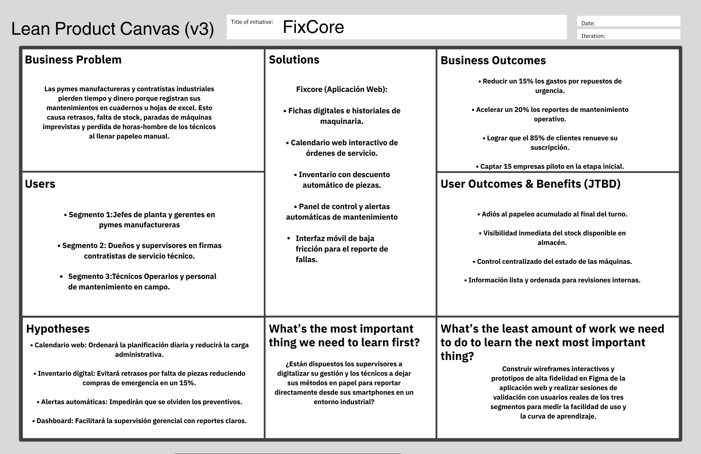
</div>


*Fuente: Elaboración propia.*

## 1.3. Segmentos objetivo. 

> **Segmento 1: Pymes de Manufactura y Producción**

* **Segmento objetivos:** Jefes de planta, coordinadores de producción y gerentes de mantenimiento interno en pequeñas y medianas empresas del sector manufacturero.
* **Descripción:** Unidades productivas que dependen de la disponibilidad continua de su maquinaria (como envasadoras, tornos o fajas transportadoras). Su necesidad principal es reducir los tiempos de inactividad, solicitar asistencia técnica de forma inmediata y llevar un control sobre sus equipos para evitar paradas de emergencia en su línea de producción.
* **Edad:** 30 a 55 años.
* **Sexo:** Hombres y mujeres.
* **Ubicación:** Sectores de actividad industrial y fábricas a nivel nacional, abarcando cualquier planta que cuente con conectividad a internet para plataformas web.
* **Formación educativa:** Estudios técnicos industriales, Ingeniería Industrial o profesionales con formación basada en la experiencia para la supervisión de líneas de producción.
* **Poder adquisitivo:** Medio y Medio-alto.
* **Clase social:** B y C.
* **Datos de sustento:** Durante el último año, el sector manufacturero peruano experimentó una contracción del 6,65 % en su producción; sin embargo, la inversión en bienes de capital (compra de nueva maquinaria) aumentó cerca de un 8 % (INEI, 2024). Este escenario obliga a las fábricas a proteger su nueva inversión, maximizando la vida útil de sus máquinas y reduciendo al mínimo los gastos por fallas imprevistas mediante plataformas de gestión centralizada.

> **Segmento 2: Firmas Consultoras y Contratistas de Ingeniería Industrial**

* **Segmento objetivos:** Dueños, gerentes de operaciones o supervisores de planificación en empresas proveedoras de servicios de consultoría, mantenimiento industrial y reparación de maquinaria.
* **Descripción:** Organizaciones B2B dedicadas a ejecutar planes de mantenimiento preventivo y correctivo para terceros. Requieren centralizar la asignación de técnicos en campo, gestionar inventarios de repuestos y asegurar el cumplimiento de sus tiempos de atención mediante herramientas digitales que eliminen el uso de papel.
* **Edad:** 35 a 60 años.
* **Sexo:** Hombres y mujeres.
* **Ubicación:** Zonas industriales, parques empresariales y polos de desarrollo a nivel nacional, con operaciones tanto en oficinas como en campo.
* **Formación educativa:** Titulados técnicos o profesionales en Ingeniería Industrial, Ingeniería Mecánica o Administración, generalmente con experiencia en gestión de activos.
* **Poder adquisitivo:** Medio-alto y Alto.
* **Clase social:** A y B.
* **Datos de sustento:** Según un estudio de McKinsey Global Institute (2015), la transición hacia modelos de mantenimiento preventivo soportados por herramientas digitales permite a las firmas consultoras y contratistas reducir los costos de reparación entre un 18 % y un 25 %. Además, la digitalización incrementa la productividad de los técnicos en campo, lo que genera una demanda directa de software especializado (SaaS) que reemplace las hojas de cálculo tradicionales para poder atender a más fábricas a la vez.

> **Segmento 3: Técnicos y Operarios de Mantenimiento Industrial**

* **Segmento objetivo:** Técnicos, operarios y personal de mantenimiento que ejecutan tareas preventivas y correctivas dentro de plantas industriales o empresas contratistas.
* **Descripción:** Usuarios operativos encargados de inspeccionar equipos, reportar fallas, ejecutar órdenes de trabajo, consultar manuales y repuestos, y registrar las actividades realizadas durante el mantenimiento. Necesitan una herramienta sencilla, rápida y adaptable a dispositivos móviles para trabajar directamente desde planta sin depender de papel, llamadas o mensajes dispersos.
* **Edad:** 20 a 50 años.
* **Sexo:** Hombres y mujeres.
* **Ubicación:** Plantas industriales, fábricas, talleres y zonas de mantenimiento en el Perú.
* **Formación educativa:** Técnicos industriales, técnicos mecánicos, técnicos eléctricos, electromecánicos u operarios con experiencia práctica en mantenimiento.
* **Poder adquisitivo:** Medio.
* **Clase social:** B y C.
* **Datos de sustento:** Las entrevistas realizadas a jefes de planta evidencian que los técnicos utilizan principalmente smartphones durante sus turnos y que la facilidad de uso es uno de los factores más importantes para adoptar una nueva herramienta de mantenimiento. Además, las dificultades actuales incluyen reportes tardíos, uso de WhatsApp, formatos manuales y baja adopción de sistemas complejos.


# Capítulo II: Requirements Elicitation & Analysis 

## 2.1. Competidores. 

**1. Fracttal**
- Plataforma CMMS 100% en la nube y móvil, muy consolidada en el mercado hispanohablante. Ofrece gestión de activos y mantenimiento predictivo con módulos de IoT. Sin embargo, sus planes de pago y la complejidad de implementación inicial pueden ser barreras de entrada para pymes industriales que buscan soluciones inmediatas.

**2. UpKeep**
- Solución de mantenimiento *"mobile-first"* diseñada específicamente para facilitar el trabajo del técnico en campo. Agiliza la creación de órdenes de trabajo mediante una interfaz sencilla. No obstante, carece de la profundidad necesaria para integraciones corporativas complejas con ERPs en industrias de gran escala.

**3. IBM Maximo**
- Software líder mundial en gestión de activos empresariales (EAM). Es extremadamente potente y personalizable, ideal para corporaciones gigantes con operaciones críticas. Su principal debilidad radica en sus altísimos costos de licencia, infraestructura pesada y una curva de aprendizaje muy pronunciada.

---

### 2.1.1. Análisis competitivo.


<table border="1" cellspacing="0" cellpadding="8">
<tr>
<th colspan="6">Competitive Analysis Landscape</th>
</tr>
<tr>
<th colspan="2">¿Por qué llevar a cabo este análisis?</th>
<td colspan="4">El objetivo de este análisis es identificar las fortalezas, debilidades, oportunidades y amenazas del entorno competitivo en el sector de software CMMS, con el fin de reconocer la ventaja competitiva de FixCore frente a otras soluciones existentes y orientar sus estrategias de diferenciación.</td>
</tr>
<tr>
<th colspan="2">Competidor</th>
<th>
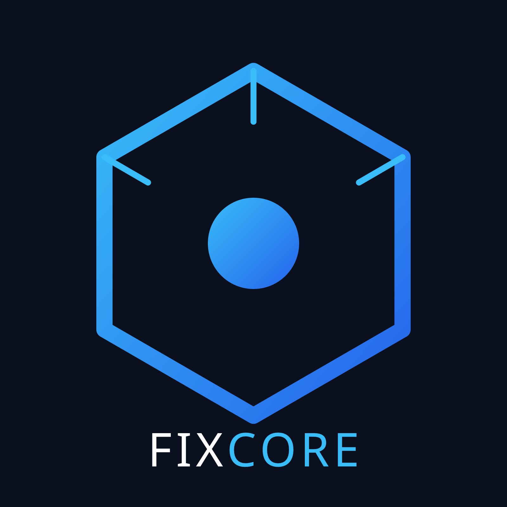<br><br>
FixCore
</th>
<th>
<br><br>
Fracttal
</th>
<th>
<br><br>
UpKeep
</th>
<th>
<br><br>
IBM Maximo
</th>
</tr>
<tr>
<th rowspan="2">Perfil</th>
<th>Overview</th>
<td>Plataforma web SaaS orientada a la gestión del mantenimiento industrial, centralizando activos, mantenimientos, fallas, órdenes de trabajo, inventario de repuestos y reportes.</td>
<td>Plataforma CMMS/EAM en la nube orientada a la gestión del mantenimiento, activos, órdenes de trabajo, analítica, IoT e integraciones.</td>
<td>Plataforma CMMS mobile-first orientada a gestionar órdenes de trabajo, mantenimiento preventivo, activos, inventario y actividades realizadas por técnicos.</td>
<td>Plataforma empresarial EAM orientada a la gestión, mantenimiento y confiabilidad de activos utilizados en operaciones de alta complejidad.</td>
</tr>
<tr>
<th>Ventaja competitiva<br>¿Qué valor ofrece a los clientes?</th>
<td>Baja fricción para técnicos, facilidad de adopción, centralización de la información y enfoque en pymes manufactureras y contratistas de mantenimiento industrial.</td>
<td>Amplio ecosistema de mantenimiento que integra movilidad, IoT, automatización, monitoreo de activos y analítica.</td>
<td>Experiencia mobile-first que facilita a los técnicos consultar, crear y gestionar órdenes de trabajo directamente desde campo.</td>
<td>Alta capacidad para administrar activos críticos, mantenimiento, planificación y operaciones empresariales complejas dentro de una misma plataforma.</td>
</tr>
<tr>
<th rowspan="2">Perfil de Marketing</th>
<th>Mercado objetivo</th>
<td>Pymes manufactureras, firmas consultoras y contratistas industriales, además de técnicos y operarios encargados de ejecutar actividades de mantenimiento.</td>
<td>Empresas y equipos de mantenimiento que necesitan digitalizar la gestión de activos y actividades de mantenimiento.</td>
<td>Equipos de mantenimiento y organizaciones que requieren gestionar operaciones desde dispositivos móviles y computadoras.</td>
<td>Grandes organizaciones intensivas en activos, como industrias manufactureras, energéticas, mineras y otras operaciones de alta complejidad.</td>
</tr>
<tr>
<th>Estrategias de marketing</th>
<td>Modelo freemium, pruebas piloto, demostraciones técnicas, alianzas con empresas industriales y énfasis en una adopción sencilla para los usuarios.</td>
<td>Contenido especializado, demostraciones comerciales, presencia internacional y comunicación orientada a la eficiencia operativa y mantenimiento inteligente.</td>
<td>Pruebas del producto, marketing digital, demostraciones y posicionamiento basado en una experiencia mobile-first.</td>
<td>Ventas empresariales, servicios especializados, alianzas estratégicas y una amplia red de partners tecnológicos.</td>
</tr>
<tr>
<th rowspan="3">Perfil de Producto</th>
<th>Productos &amp; Servicios</th>
<td>Gestión de activos, mantenimiento preventivo, reporte de fallas, órdenes de trabajo, inventario de repuestos, alertas, notificaciones y reportes.</td>
<td>Gestión de activos, órdenes de trabajo, mantenimiento preventivo, dashboards, KPIs, IoT, automatización, analítica e integraciones.</td>
<td>Órdenes de trabajo, mantenimiento preventivo, gestión de activos, inventario, repuestos, códigos QR, reportes e integraciones.</td>
<td>Enterprise Asset Management, mantenimiento de activos, confiabilidad, planificación, inspecciones, analítica e inteligencia artificial.</td>
</tr>
<tr>
<th>Precios &amp; Costos</th>
<td>Modelo freemium con funcionalidades básicas gratuitas y planes premium para acceder a capacidades y módulos avanzados.</td>
<td>Modelo de suscripción comercial con planes definidos según las necesidades y características de cada organización.</td>
<td>Modelo de suscripción basado en usuarios y funcionalidades contratadas.</td>
<td>Modelo de licenciamiento y suscripción empresarial configurable según los módulos y necesidades de cada organización.</td>
</tr>
<tr>
<th>Canales de distribución<br>(Web y/o Móvil)</th>
<td>Web Application responsive accesible desde computadoras, tablets y smartphones.</td>
<td>Plataforma web y aplicación móvil.</td>
<td>Plataforma web y aplicaciones móviles para iOS y Android.</td>
<td>Plataforma web y soluciones empresariales pertenecientes al ecosistema IBM Maximo.</td>
</tr>
<tr>
<th rowspan="5">Análisis SWOT</th>
<td colspan="5">El análisis SWOT permite comparar la posición de FixCore frente a sus competidores. Las fortalezas identificadas deben permitir aprovechar las oportunidades del mercado y contribuir a establecer una ventaja competitiva sostenible.</td>
</tr>
<tr>
<th>Fortalezas</th>
<td>Facilidad de uso, enfoque en pymes y contratistas, diseño web adaptable, baja fricción para técnicos y centralización de los procesos de mantenimiento.</td>
<td>Solución madura, integración de IoT, analítica, automatización y amplia cobertura funcional.</td>
<td>Experiencia móvil sencilla, facilidad de adopción y fuerte orientación hacia el trabajo diario de los técnicos.</td>
<td>Alta capacidad empresarial, gestión integral de activos, analítica avanzada y soporte para operaciones de gran escala.</td>
</tr>
<tr>
<th>Debilidades</th>
<td>Marca nueva, ausencia inicial de casos de éxito y menor cantidad de funcionalidades avanzadas frente a plataformas consolidadas.</td>
<td>Su amplia cantidad de funcionalidades puede incrementar la complejidad de adopción para organizaciones pequeñas que buscan soluciones sencillas.</td>
<td>Algunas funcionalidades avanzadas dependen de planes superiores y su amplitud puede superar las necesidades de pequeñas empresas.</td>
<td>Mayor complejidad de implementación y costos potencialmente elevados para pequeñas y medianas organizaciones.</td>
</tr>
<tr>
<th>Oportunidades</th>
<td>Crecimiento de la digitalización de pymes industriales, existencia de procesos manuales y mayor uso de smartphones por técnicos y operarios de mantenimiento.</td>
<td>Expansión del mantenimiento predictivo, IoT, inteligencia artificial y automatización aplicada a activos industriales.</td>
<td>Crecimiento de la digitalización móvil y automatización de las operaciones de mantenimiento.</td>
<td>Mayor adopción de inteligencia artificial, mantenimiento predictivo y modernización de organizaciones intensivas en activos.</td>
</tr>
<tr>
<th>Amenazas</th>
<td>Competidores consolidados, resistencia al cambio en organizaciones tradicionales y aparición de soluciones similares con precios competitivos.</td>
<td>Aparición de nuevas soluciones CMMS más económicas, simples y especializadas.</td>
<td>Competencia creciente de otras plataformas CMMS con experiencias móviles similares.</td>
<td>Soluciones CMMS modernas y más sencillas capaces de ofrecer las funciones esenciales con menor complejidad y costo.</td>
</tr>
</table>


### 2.1.2. Estrategias y tácticas frente a competidores.

| Estrategia / Táctica | Descripción |
| :--- | :--- |
| **Enfoque en Pymes y Contratistas Industriales** | Orientar FixCore principalmente a pymes manufactureras y firmas contratistas que necesitan digitalizar su mantenimiento sin la complejidad y los costos asociados a soluciones empresariales de gran escala. |
| **Automatización de Notificaciones** | Integrar alertas automáticas para informar sobre fallas, mantenimientos próximos, órdenes de trabajo y niveles bajos de stock, reduciendo retrasos y mejorando la coordinación entre supervisores y técnicos. |
| **Modelo Freemium** | Ofrecer una versión básica que permita a las empresas probar las funciones principales de FixCore antes de contratar planes con capacidades avanzadas, disminuyendo la barrera inicial de adopción. |
| **Alianzas Estratégicas B2B** | Establecer alianzas con firmas consultoras, contratistas de mantenimiento y organizaciones relacionadas con el sector industrial para facilitar la adopción de FixCore y ampliar su presencia en el mercado. |
| **Innovación en UX y Baja Fricción** | Diseñar una Web Application responsive, sencilla y accesible desde computadoras, tablets y smartphones, reduciendo la cantidad de pasos necesarios para tareas frecuentes como reportar fallas, consultar órdenes de trabajo o revisar repuestos. |


## 2.2. Entrevistas. 

### 2.2.1. Diseño de entrevistas. 

### Guía de preguntas para Pymes de Manufactura y Producción

* ¿Cuál es tu nombre, edad y qué cargo ocupas en la planta?
* ¿A qué sector industrial pertenece la empresa y, aproximadamente, cuántas máquinas principales operan?
* ¿Cómo gestionan actualmente el reporte de fallas de maquinaria y las órdenes de trabajo (ej. Excel, papel, grupos de WhatsApp, pizarras)?
* ¿Qué dispositivos utilizan más los operarios y técnicos durante su turno en planta (smartphones personales, tablets de la empresa, radios)?
* ¿Qué tan frecuente es que una máquina sufra tiempos muertos (downtime) debido a una mala comunicación o lentitud al reportar la falla?
* ¿Cuáles son las mayores frustraciones que enfrentas al intentar consolidar la información de mantenimiento a fin de mes?
* ¿Has intentado implementar algún software de mantenimiento anteriormente? Si es así, ¿cuál fue el resultado o la principal barrera de adopción por parte de los técnicos?
* ¿Qué elemento te generaría más confianza para adoptar un nuevo sistema: la facilidad de uso para el operario, la automatización de alertas, o el costo de implementación?
* ¿Cómo crees que impactaría en la productividad si los técnicos pudieran reportar una falla en menos de 3 clics desde su celular?
* ¿Qué tan útil te resultaría recibir notificaciones automáticas de fallas críticas directamente en tu WhatsApp?
* Si existiera una versión básica gratuita (modelo freemium) para probar el sistema con algunas máquinas, ¿te animarías a implementarlo en tu planta?
* Una vez comprobado el valor del sistema, ¿cuánto estarías dispuesto a pagar mensualmente por módulos avanzados y analítica de datos (rango en dólares o soles)?

### Guía de preguntas para Firmas Consultoras y Contratistas de Ingeniería Industrial

* ¿Podría indicarme su nombre, cargo y el tipo de servicios de ingeniería o mantenimiento que brinda su empresa?
* ¿A cuántas plantas industriales o clientes prestan servicio de manera simultánea?
* ¿Cómo coordinan actualmente el despliegue de sus técnicos en campo cuando un cliente reporta una emergencia o falla en sus equipos?
* Desde su experiencia operativa, ¿cuáles son las mayores limitaciones logísticas o tecnológicas que enfrentan para atender múltiples plantas a la vez?
* ¿Qué tan complejo les resulta estandarizar los reportes de mantenimiento y KPIs para entregárselos a diferentes clientes?
* ¿Suelen utilizar herramientas de automatización de flujos de trabajo o integración de APIs en sus operaciones diarias?
* ¿Qué funcionalidades considera indispensables en una plataforma digital para que decida utilizarla como el motor operativo de todos sus técnicos (ej. webhooks, portal multi-cliente, alertas en tiempo real)?
* ¿Qué tan importante sería para su firma poder integrar el sistema de mantenimiento con otras herramientas de comunicación (como notificaciones automáticas vía n8n a WhatsApp)?
* ¿Cree que ofrecer a sus clientes una herramienta ágil para que les reporten fallas mejoraría la percepción de su servicio tercerizado? ¿Por qué?
* ¿Preferiría un modelo de precios basado en la cantidad de técnicos (usuarios) o en la cantidad de plantas/clientes gestionados?
* ¿Estaría dispuesto a recomendar e implementar este sistema directamente en la infraestructura tecnológica de sus clientes?


### Guía de preguntas para Técnicos y Operarios de Mantenimiento Industrial

- ¿Cuál es tu nombre, edad y qué función desempeñas actualmente dentro del área de mantenimiento?
- ¿Cuánto tiempo llevas trabajando en mantenimiento industrial y qué tipo de máquinas o equipos atiendes con mayor frecuencia?
- ¿Cómo recibes actualmente las tareas u órdenes de mantenimiento que debes realizar durante tu turno?
- Cuando detectas una falla en una máquina, ¿cómo la reportas y a quién se la comunicas?
- ¿Qué información necesitas consultar antes de comenzar un mantenimiento o una reparación?
- ¿Cómo consultas actualmente los manuales, historiales de mantenimiento o información técnica de una máquina?
- ¿Cómo verificas si existe un repuesto disponible antes o durante una reparación?
- ¿Qué problemas o dificultades encuentras al utilizar papel, Excel, WhatsApp u otras herramientas durante tus actividades de mantenimiento?
- ¿Qué dispositivo utilizas con mayor frecuencia durante tu jornada de trabajo y para qué tareas lo utilizas?
- ¿Qué características debería tener una herramienta digital para que puedas utilizarla fácilmente mientras trabajas en planta?
- ¿Qué situaciones suelen hacer que una orden de trabajo se retrase o sea difícil de completar?
- ¿Cómo registras actualmente el trabajo realizado después de terminar un mantenimiento?
- ¿Qué tipo de alertas o información te sería más útil recibir durante tu turno?
- ¿Qué es lo que más te frustra del proceso actual de mantenimiento y qué cambiarías para hacerlo más sencillo?

### 2.2.2. Registro de entrevistas.

### Segmento 1: Pymes de Manufactura y Producción 

<table>
  <thead>
    <tr>
      <th align="center">Foto</th>
      <th align="left">Campo</th>
      <th align="left">Detalle</th>
    </tr>
  </thead>
  <tbody>
    <tr>
      <td rowspan="6" align="center" valign="middle" width="200">
        
      </td>
      <td><strong>Nombre y apellido</strong></td>
      <td>Caterina Villanueva</td>
    </tr>
    <tr>
      <td><strong>Edad</strong></td>
      <td>35 años</td>
    </tr>
    <tr>
      <td><strong>Ubicación</strong></td>
      <td>San Miguel</td>
    </tr>
    <tr>
      <td><strong>Inicio de la entrevista</strong></td>
      <td>11:59 am</td>
    </tr>
    <tr>
      <td><strong>Duración</strong></td>
      <td>4.56 min</td>
    </tr>
    <tr>
      <td><strong>Enlace</strong></td>
      <td><a href="URL_DEL_VIDEO">aca colocamos el link del video (todas las entrevistas juntas en uno solo)</a></td>
    </tr>
  </tbody>
</table>

**Resumen:**
**¿Cuál es tu nombre, edad y qué cargo ocupas en la planta?**
Mi nombre es Caterina, tengo 35 años y soy coordinadora de producción. Principalmente superviso que la producción se desarrolle con normalidad y coordino con el área de mantenimiento cuando ocurre algún problema con las máquinas.

**¿A qué sector industrial pertenece la empresa y, aproximadamente, cuántas máquinas principales operan?**
La empresa pertenece al sector manufacturero y tenemos alrededor de 18 máquinas.

**¿Cómo gestionan actualmente el reporte de fallas de maquinaria y las órdenes de trabajo (ej. Excel, papel, grupos de WhatsApp, pizarras)?**
La mayoría de problemas en sí se reportan por WhatsApp, que es lo más rápido. Tenemos un grupo de producción y mantenimiento, entonces por ahí se reportan las fallas, pero también utilizamos Excel y otros formatos físicos.

**¿Qué dispositivos utilizan más los operarios y técnicos durante su turno en planta (smartphones, tablets, radios)?**
Bueno, principalmente celulares, ya que es lo más fácil con el aparato del día. También tenemos algunas radios para algunas coordinaciones fáciles, o también mediante reportes.

**¿Qué tan frecuente es que una máquina sufra tiempos muertos debido a una mala comunicación o lentitud al reportar la falla?**
Bueno, si bien no sucede todos los días, sí ocurre varias veces al mes. Y a veces estas fallas se reportan rápido, pero el mensaje se pierde por el tema de que como tenemos el grupo, se envía mediante WhatsApp y hay bastantes coordinaciones que se dan. Y bueno, todo esto puede afectar la producción.

**¿Cuáles son las mayores frustraciones que enfrentas al intentar consolidar la información de mantenimiento a fin de mes?**
Para mí lo más complicado es que se encuentra en varios lados, en WhatsApp, en Excel. Tengo que revisar formatos y eso se hace bastante tedioso.

**¿Has intentado implementar algún software de mantenimiento anteriormente? Si es así, ¿cuál fue el resultado o la principal barrera de adopción por parte de los técnicos?**
Sí se intentó, pero como no muchos lo entendieron, al final ya se dejó de usar. Como hay gente mayor también, tienes que llenar formatos, tienes que saber manejar varias cosas, entonces no, se dejó de utilizar.

**¿Qué elemento te generaría más confianza para adoptar un nuevo sistema: la facilidad de uso para el operario, la automatización de alertas, o el costo de implementación?**
Para mí, como te digo, sería la facilidad de uso, ya que tenemos bastante personal que es mayor y a veces se les hace más difícil el comprender la forma en que se usa. Luego sería la automatización para agilizar los procesos y por último el costo, porque sobre todo tenemos esa falla de la organización.

**¿Cómo crees que impactaría en la productividad si los técnicos pudieran reportar una falla en menos de 3 clics desde su celular?**
Creo que sería más fácil que llenar los formularios. Tener que estar revisándolo todo sería mucho más práctico y facilitaría el seguimiento para lo que sigue.

**¿Qué tan útil te resultaría recibir notificaciones automáticas de fallas críticas directamente en tu WhatsApp?**
Me parecería bastante útil. Sobre todo para las más urgentes, porque a veces hay algunas fallas que son más fáciles de resolver que podrían pasar a segundo plano. Entonces mejor sería como que por prioridad.

**Si existiera una versión básica gratuita (modelo freemium) para probar el sistema con algunas máquinas, ¿te animarías a implementarlo en tu planta?**
Sí, yo creo que primero iniciaría con dos o tres máquinas y ya luego para toda la empresa.

**Una vez comprobado el valor del sistema, ¿cuánto estarías dispuesta a pagar mensualmente por módulos avanzados y analítica de datos (rango en dólares o soles)?**
Yo creo que entre 500 a 1000 soles. Incluso un poquito más. O sea, también tendría que ver qué es lo que me va a beneficiar y qué cosas van a comprender el paquete que me van a ofrecer. Pero no tendría ningún problema con pagarlo para poder optimizar los procesos.

<table>
  <thead>
    <tr>
      <th align="center">Foto</th>
      <th align="left">Campo</th>
      <th align="left">Detalle</th>
    </tr>
  </thead>
  <tbody>
    <tr>
      <td rowspan="6" align="center" valign="middle" width="200">
        
      </td>
      <td><strong>Nombre y apellido</strong></td>
      <td>Carla Aguilar</td>
    </tr>
    <tr>
      <td><strong>Edad</strong></td>
      <td>26 años</td>
    </tr>
    <tr>
      <td><strong>Ubicación</strong></td>
      <td>Magdalena del Mar</td>
    </tr>
    <tr>
      <td><strong>Inicio de la entrevista</strong></td>
      <td>4:38</td>
    </tr>
    <tr>
      <td><strong>Duración</strong></td>
      <td>4:19</td>
    </tr>
    <tr>
      <td><strong>Enlace</strong></td>
      <td><a href="https://upcedupe-my.sharepoint.com/:v:/g/personal/u202423973_upc_edu_pe/IQD8ECWrYrRxQaNhmjXB91vmAWdSEk3YRD64TUu5xywjVz8?nav=eyJyZWZlcnJhbEluZm8iOnsicmVmZXJyYWxBcHAiOiJTdHJlYW1XZWJBcHAiLCJyZWZlcnJhbFZpZXciOiJTaGFyZURpYWxvZy1MaW5rIiwicmVmZXJyYWxBcHBQbGF0Zm9ybSI6IldlYiIsInJlZmVycmFsTW9kZSI6InZpZXcifX0%3D&e=WNbf7E">Video de las entrevistas</a></td>
    </tr>
  </tbody>
</table>

**Resumen:**
**¿Cuál es tu nombre, edad y qué cargo ocupas en la planta?**
Hola mi Nombre es Carla Aguilar , tengo 26 años y soy jefa de planta

**¿A qué sector industrial pertenece la empresa y, aproximadamente, cuántas máquinas principales operan?**
La empresa es una fábrica de envases de plástico, ahorita tenemos 15 máquinas principales operando entre inyectores y sopladoras

**¿Cómo gestionan actualmente el reporte de fallas de maquinaria y las órdenes de trabajo (ej. Excel, papel, grupos de WhatsApp, pizarras)?**
Todo lo manejamos por grupos de WhatsApp y tenemos una pizarra que también usamos para las órdenes de trabajo, cuando es fin de mes me siento a pasar todo a un Excel para el reporte de gerencia.

**¿Qué dispositivos utilizan más los operarios y técnicos durante su turno en planta (smartphones, tablets, radios)?**
Casi todos los técnicos usan sus celulares personales, la gran mayoría cuenta con sistema Android, ya que es lo más común creo para este sector.

**¿Qué tan frecuente es que una máquina sufra tiempos muertos debido a una mala comunicación o lentitud al reportar la falla?** Nos pasa unas dos hasta tres veces en el mes. A veces la máquina empieza a fallar, el operario no me aviso a tiempo y terminamos con la línea parada por horas debido a esta falta de comunicación y errores que se comenten

**¿Cuáles son las mayores frustraciones que enfrentas al intentar consolidar la información de mantenimiento a fin de mes?**
Mi mayor dolor de cabeza es tener que buscar en las conversaciones de WhatsApp para acordarme cuando se cambió una pieza o sobre las fallas que hubo quien lo soluciono y eso más que nada.

**¿Has intentado implementar algún software de mantenimiento anteriormente? Si es así, ¿cuál fue el resultado o la principal barrera de adopción por parte de los técnicos?**
Una vez intentamos usar el Excel de Google, pero los muchachos no querían llenarlo porque las celdas se veían muy pequeñas en sus celulares y les quitaba tiempo, además que algunos no entendían.

**¿Qué elemento te generaría más confianza para adoptar un nuevo sistema: la facilidad de uso para el operario, la automatización de alertas, o el costo de implementación?**
Definitivamente la facilidad de uso para el operario. Si les pongo a teclear mucho texto, simplemente no lo van a usar.

**¿Cómo crees que impactaría en la productividad si los técnicos pudieran reportar una falla en menos de 3 clics desde su celular?**
Ayudaría muchísimo. Si pueden reportar una falla en tres clics, ya no tendrían la típica excusa de que estaban ocupados y no tuvieron tiempo de avisar.

**¿Qué tan útil te resultaría recibir notificaciones automáticas de fallas críticas directamente en tu WhatsApp?**
Para mí sería genial, yo paro metida en WhatsApp todo el día, así que recibir la alerta por ahí me ahorraría estar caminando por toda la planta para ver si algo falló o esperar que me avisen si es que no se olvidaron y así poder actuar rápidamente.

**Si existiera una versión básica gratuita (modelo freemium) para probar el sistema con algunas máquinas, ¿te animarías a implementarlo en tu planta?**
Sí me animaría totalmente. Empezaría probando con las tres máquinas inyectoras que son las más críticas para la producción.

**Una vez comprobado el valor del sistema, ¿cuánto estarías dispuesta a pagar mensualmente por módulos avanzados y analítica de datos (rango en dólares o soles)?**
Yo creo que pagaría entre 80 y 100 dólares mensuales si de verdad me soluciona todo el desorden que tenemos ahora.

<table>
  <thead>
    <tr>
      <th align="center">Foto</th>
      <th align="left">Campo</th>
      <th align="left">Detalle</th>
    </tr>
  </thead>
  <tbody>
    <tr>
      <td rowspan="6" align="center" valign="middle" width="200">
        
      </td>
      <td><strong>Nombre y apellido</strong></td>
      <td>Mitjail Landa</td>
    </tr>
    <tr>
      <td><strong>Edad</strong></td>
      <td>29 años</td>
    </tr>
    <tr>
      <td><strong>Ubicación</strong></td>
      <td>Ate Vitarte</td>
    </tr>
    <tr>
      <td><strong>Timing de la entrevista</strong></td>
      <td>Inicia: 8:58 - Termina: 16:47</td>
    </tr>
    <tr>
      <td><strong>Duración</strong></td>
      <td>7 minutos y 49 segundos</td>
    </tr>
    <tr>
      <td><strong>Enlace</strong></td>
      <td><a href="https://upcedupe-my.sharepoint.com/:v:/g/personal/u202423973_upc_edu_pe/IQD8ECWrYrRxQaNhmjXB91vmAWdSEk3YRD64TUu5xywjVz8?nav=eyJyZWZlcnJhbEluZm8iOnsicmVmZXJyYWxBcHAiOiJTdHJlYW1XZWJBcHAiLCJyZWZlcnJhbFZpZXciOiJTaGFyZURpYWxvZy1MaW5rIiwicmVmZXJyYWxBcHBQbGF0Zm9ybSI6IldlYiIsInJlZmVycmFsTW9kZSI6InZpZXcifX0%3D&e=WNbf7E">Video de las entrevistas</a></td>
    </tr>
  </tbody>
</table>

**Resumen:**
**¿Cuál es tu nombre, edad y qué cargo ocupas en la planta?**
Mitjail Landa, de 29 años, ocupa el cargo de gestión de proyectos.

**¿A qué sector industrial pertenece la empresa y, aproximadamente, cuántas máquinas principales operan?**
La empresa pertenece al sector de telecomunicaciones y opera cientos de equipos distribuidos a nivel nacional.

**¿Cómo gestionan actualmente el reporte de fallas de maquinaria y las órdenes de trabajo (ej. Excel, papel, grupos de WhatsApp, pizarras)?**
Los reportes son notificados por los usuarios mediante llamadas telefónicas y correos electrónicos.

**¿Qué dispositivos utilizan más los operarios y técnicos durante su turno en planta (smartphones, tablets, radios)?**
Los operarios utilizan mayormente celulares.

**¿Qué tan frecuente es que una máquina sufra tiempos muertos debido a una mala comunicación o lentitud al reportar la falla?** 
No es muy común, pero los tiempos muertos son altos.

**¿Cuáles son las mayores frustraciones que enfrentas al intentar consolidar la información de mantenimiento a fin de mes?**
La desorganización y saturación generada por el trabajo de varias personas de diferentes áreas.

**¿Has intentado implementar algún software de mantenimiento anteriormente? Si es así, ¿cuál fue el resultado o la principal barrera de adopción por parte de los técnicos?**
Se ha intentado y se está planeando su implementación para proyectos recientes que requieren mantenimiento preventivo.

**¿Qué elemento te generaría más confianza para adoptar un nuevo sistema: la facilidad de uso para el operario, la automatización de alertas, o el costo de implementación?**
Lo más importante es la facilidad de uso para el operario debido a que les ayudará a adaptarse al sistema. La automatización de alertas también es importante para tomar precauciones.

**¿Cómo crees que impactaría en la productividad si los técnicos pudieran reportar una falla en menos de 3 clics desde su celular?**
Sería muy bueno para brindar atención rápida

**¿Qué tan útil te resultaría recibir notificaciones automáticas de fallas críticas directamente en tu WhatsApp?**
Le resulta muy útil y plantea integraciones mediante mensajes de texto o audios pregrabados. 

**Si existiera una versión básica gratuita (modelo freemium) para probar el sistema con algunas máquinas, ¿te animarías a implementarlo en tu planta?**
Se animaría a probarlo para averiguar como se desarrolla o adapta en su contexto laboral.

**Una vez comprobado el valor del sistema, ¿cuánto estarías dispuesto a pagar mensualmente por módulos avanzados y analítica de datos (rango en dólares o soles)?**
Dependerá de los módulos y analíticas integradas, basándose en que tan útiles sean. Estima que, si es un buen sistema, un rango de precios que estaría dispuesto a pagar es de 50 a 100 soles mensuales, pero plantea realizar un estudio de mercado primero antes de dar un rango definitivo.

### Segmento 2: Firmas Consultoras y Contratistas de Ingeniería Industrial
<table>
  <thead>
    <tr>
      <th align="center">Foto</th>
      <th align="left">Campo</th>
      <th align="left">Detalle</th>
    </tr>
  </thead>
  <tbody>
    <tr>
      <td rowspan="6" align="center" valign="middle" width="200">
        
      </td>
      <td><strong>Nombre y apellido</strong></td>
      <td>Valeria Salazar</td>
    </tr>
    <tr>
      <td><strong>Edad</strong></td>
      <td>34 años</td>
    </tr>
    <tr>
      <td><strong>Ubicación</strong></td>
      <td>San Miguel</td>
    </tr>
    <tr>
      <td><strong>Inicio de la entrevista</strong></td>
      <td>24:11</td>
    </tr>
    <tr>
      <td><strong>Duración</strong></td>
      <td>4:26</td>
    </tr>
    <tr>
      <td><strong>Enlace</strong></td>
      <td><a href="https://upcedupe-my.sharepoint.com/:v:/g/personal/u202423973_upc_edu_pe/IQD8ECWrYrRxQaNhmjXB91vmAWdSEk3YRD64TUu5xywjVz8?nav=eyJyZWZlcnJhbEluZm8iOnsicmVmZXJyYWxBcHAiOiJTdHJlYW1XZWJBcHAiLCJyZWZlcnJhbFZpZXciOiJTaGFyZURpYWxvZy1MaW5rIiwicmVmZXJyYWxBcHBQbGF0Zm9ybSI6IldlYiIsInJlZmVycmFsTW9kZSI6InZpZXcifX0%3D&e=WNbf7E">Video de las entrevistas</a></td>
    </tr>
  </tbody>
</table>


**Resumen:**
**¿Podría indicarme su nombre, cargo y el tipo de servicios de ingeniería o mantenimiento que brinda su empresa?**
Hola me llamo Valeria Salazar, trabajo en el área de Operaciones en mi empresa, nosotros nos dedicamos a brindar mantenimiento industrial preventivo y correctivo

**¿A cuántas plantas industriales o clientes prestan servicio de manera simultánea?** Actualmente atendemos a ocho plantas fijas con las que tenemos contratos anuales

**¿Cómo coordinan actualmente el despliegue de sus técnicos en campo cuando un cliente reporta una emergencia o falla en sus equipos?** Todo es a base de llamadas telefónicas y correos. Cuando un cliente reporta una emergencia, tengo que empezar a llamar uno por uno a mis técnicos para ver quién está más cerca de esa fábrica

**Desde su experiencia operativa, ¿cuáles son las mayores limitaciones logísticas o tecnológicas que enfrentan para atender múltiples plantas a la vez?** Lo más limitante es el cruce de horarios y el hecho de no saber si es que tienen el repuesto exacto hasta que llega a la planta del cliente.

**¿Qué tan complejo les resulta estandarizar los reportes de mantenimiento y KPIs para entregárselos a diferentes clientes?** Es un trabajo agotador, cada cliente nos pide un formato distinto para su reporte, algunos quieren PDF, otros Excel, y perdemos horas valiosas transcribiendo todo.

**¿Suelen utilizar herramientas de automatización de flujos de trabajo o integración de APIs en sus operaciones diarias?** No, por ahora todo nuestro flujo operativo es completamente manual y dependemos de la memoria de los coordinadores.

**¿Qué funcionalidades considera indispensables en una plataforma digital para que decida utilizarla como el motor operativo de todos sus técnicos (ej. webhooks, portal multi-cliente, alertas en tiempo real)?** Yo creo que lo indispensable sería un portal unificado donde yo pueda ver a todos mis clientes en una sola pantalla y saber exactamente en qué estado está cada orden de trabajo.

**¿Qué tan importante sería para su firma poder integrar el sistema de mantenimiento con otras herramientas de comunicación (como notificaciones automáticas vía n8n a WhatsApp)?** Sería un valor agregado gigante, el cliente sentiría que estamos monitoreando sus máquinas todo el tiempo sin que nosotros tengamos que hacer el trabajo manual de avisarles.

**¿Cree que ofrecer a sus clientes una herramienta ágil para que les reporten fallas mejoraría la percepción de su servicio tercerizado? ¿Por qué?** Claro que sí, porque proyecta una imagen de empresa moderna y tecnológica, lo cual nos ayuda a justificar nuestras tarifas frente a la competencia.

**¿Preferiría un modelo de precios basado en la cantidad de técnicos (usuarios) o en la cantidad de plantas/clientes gestionados?** Prefiero un modelo basado en la cantidad de técnicos. De esa manera, si logro conseguir más clientes y fábricas, el sistema no me penaliza cobrándome más por cada nueva planta.

**¿Estaría dispuesto a recomendar e implementar este sistema directamente en la infraestructura tecnológica de sus clientes?** Sí lo haría, siempre y cuando el sistema nos permita poner el logotipo de nuestra consultora en los reportes finales que se le entregan al cliente.


<table>
  <thead>
    <tr>
      <th align="center">Foto</th>
      <th align="left">Campo</th>
      <th align="left">Detalle</th>
    </tr>
  </thead>
  <tbody>
    <tr>
      <td rowspan="6" align="center" valign="middle" width="200">
        
      </td>
      <td><strong>Nombre y apellido</strong></td>
      <td>Anderson Cabanillas</td>
    </tr>
    <tr>
      <td><strong>Edad</strong></td>
      <td>20 años</td>
    </tr>
    <tr>
      <td><strong>Ubicación</strong></td>
      <td>Ventanilla</td>
    </tr>
    <tr>
      <td><strong>Inicio de la entrevista</strong></td>
      <td>Completar timing</td>
    </tr>
    <tr>
      <td><strong>Duración</strong></td>
      <td>5 minutos y 56 segundos</td>
    </tr>
    <tr>
      <td><strong>Enlace</strong></td>
      <td><a href="https://upcedupe-my.sharepoint.com/:v:/g/personal/u202423973_upc_edu_pe/IQD8ECWrYrRxQaNhmjXB91vmAWdSEk3YRD64TUu5xywjVz8?nav=eyJyZWZlcnJhbEluZm8iOnsicmVmZXJyYWxBcHAiOiJTdHJlYW1XZWJBcHAiLCJyZWZlcnJhbFZpZXciOiJTaGFyZURpYWxvZy1MaW5rIiwicmVmZXJyYWxBcHBQbGF0Zm9ybSI6IldlYiIsInJlZmVycmFsTW9kZSI6InZpZXcifX0%3D&e=WNbf7E">Video de las entrevistas</a></td>
    </tr>
  </tbody>
</table>

**Resumen:**

**¿Podría indicarme su nombre, cargo y el tipo de servicios de ingeniería o mantenimiento que brinda su empresa?**

Hola, soy Anderson, tengo 20 años y trabajo como asistente de operaciones y soporte en una empresa que brinda servicios de mantenimiento preventivo y correctivo para sistemas electromecánicos y equipos en pequeñas plantas industriales.

**¿A cuántas plantas industriales o clientes prestan servicio de manera simultánea?**

Normalmente atendemos entre 4 y 6 clientes activos durante la semana. Sin embargo, algunas veces se presentan emergencias al mismo tiempo y tenemos que reorganizar rápidamente a los técnicos para atender diferentes plantas.

**¿Cómo coordinan actualmente el despliegue de sus técnicos en campo cuando un cliente reporta una emergencia o falla en sus equipos?**

La coordinación puede volverse un poco caótica. Actualmente manejamos las asignaciones mediante llamadas, mensajes directos y el grupo de WhatsApp de la empresa. El jefe de operaciones indica qué técnico se encuentra más cerca, pero algunas veces no sabemos con exactitud si ya terminó el servicio anterior o si cuenta con los repuestos necesarios.

**Desde su experiencia operativa, ¿cuáles son las mayores limitaciones logísticas o tecnológicas que enfrentan para atender múltiples plantas a la vez?**

Lo que más tiempo nos quita es la falta de comunicación en tiempo real. Como los técnicos están trabajando en las plantas de los clientes, algunas veces no reportan una falla inmediatamente y nos enteramos cuando el propio cliente vuelve a comunicarse porque la máquina continúa detenida. Además, no tenemos un inventario totalmente organizado de los repuestos disponibles en el taller o que llevan los técnicos.

**¿Qué tan complejo les resulta estandarizar los reportes de mantenimiento y KPIs para entregárselos a diferentes clientes?**

Es bastante complejo porque cada cliente solicita el reporte de una manera diferente. Al final tenemos que pasar información de notas o conversaciones a documentos de Word o Excel. Además, preparar los indicadores a fin de mes puede tomar varias horas que podrían utilizarse en otras actividades.

**¿Suelen utilizar herramientas de automatización de flujos de trabajo o integración de APIs en sus operaciones diarias?**

Actualmente no utilizamos automatizaciones complejas ni desarrollamos integraciones directamente. Dependemos principalmente de herramientas básicas como WhatsApp, aunque sería útil contar con algún sistema que envíe avisos automáticamente.

**¿Qué funcionalidades considera indispensables en una plataforma digital para que decida utilizarla como el motor operativo de todos sus técnicos?**

Lo principal serían las alertas en tiempo real para conocer rápidamente cuándo ocurre una falla y un panel donde podamos visualizar el estado de cada orden de trabajo sin tener que llamar constantemente a cada técnico.

**¿Qué tan importante sería para su firma poder integrar el sistema de mantenimiento con otras herramientas de comunicación, como notificaciones automáticas vía WhatsApp?**

Sería muy útil y nos ahorraría varios problemas de coordinación. Si al cliente o al jefe le llegara automáticamente un mensaje cuando el técnico termina una tarea o cuando ocurre una emergencia, podríamos responder mucho más rápido.

**¿Cree que ofrecer a sus clientes una herramienta ágil para que reporten fallas mejoraría la percepción de su servicio tercerizado? ¿Por qué?**

Sí. Si el cliente observa que tenemos un sistema organizado donde puede reportar una falla rápidamente y consultar el avance de la atención, tendría mayor confianza en nuestro servicio y podría percibir a la empresa como más moderna frente a otras que todavía utilizan procesos manuales.

**¿Preferiría un modelo de precios basado en la cantidad de técnicos o en la cantidad de plantas/clientes gestionados?**

Considero que nos convendría más un modelo basado en la cantidad de técnicos activos, porque la cantidad de clientes puede variar, mientras que normalmente trabajamos con el mismo equipo de técnicos.

**¿Estaría dispuesto a recomendar e implementar este sistema directamente en la infraestructura tecnológica de sus clientes?**

Sí, estaría dispuesto, siempre que sea una herramienta estable y fácil de utilizar. Considero que trabajar con tecnología moderna también mejora la imagen de la empresa frente a los clientes.


<table>
  <thead>
    <tr>
      <th align="center">Foto</th>
      <th align="left">Campo</th>
      <th align="left">Detalle</th>
    </tr>
  </thead>
  <tbody>
    <tr>
      <td rowspan="7" align="center" valign="middle" width="200">
        
      </td>
      <td><strong>Nombre y apellido</strong></td>
      <td>Diego Torres</td>
    </tr>
    <tr>
      <td><strong>Edad</strong></td>
      <td>20 años</td>
    </tr>
    <tr>
      <td><strong>Ubicación</strong></td>
      <td>Lima</td>
    </tr>
    <tr>
      <td><strong>Cargo</strong></td>
      <td>Asistente de Operaciones</td>
    </tr>
    <tr>
      <td><strong>Inicio de la entrevista</strong></td>
      <td>Pendiente</td>
    </tr>
    <tr>
      <td><strong>Duración</strong></td>
      <td>Pendiente</td>
    </tr>
    <tr>
      <td><strong>Enlace</strong></td>
      <td>Pendiente de entrevista real</td>
    </tr>
  </tbody>
</table>

> **Nota provisional:** Entrevista simulada utilizada únicamente para estructurar el documento. Debe ser reemplazada y validada con la entrevista real antes de la entrega final.

**Resumen provisional:**

**¿Podría indicarme su nombre, cargo y el tipo de servicios de ingeniería o mantenimiento que brinda su empresa?**

Mi nombre es Diego Torres, tengo 20 años y trabajo como asistente de operaciones en una empresa que brinda servicios de mantenimiento preventivo y correctivo para equipos electromecánicos utilizados en pequeñas y medianas empresas industriales.

**¿A cuántas plantas industriales o clientes prestan servicio de manera simultánea?**

Normalmente tenemos entre 5 y 7 clientes activos durante la semana. Dependiendo de las emergencias, podemos tener técnicos trabajando en varias plantas al mismo tiempo.

**¿Cómo coordinan actualmente el despliegue de sus técnicos en campo cuando un cliente reporta una emergencia o falla en sus equipos?**

La mayoría de coordinaciones se realizan por llamadas telefónicas y WhatsApp. Cuando ocurre una emergencia, el supervisor revisa quién está disponible y comienza a comunicarse con los técnicos para determinar quién puede atender al cliente más rápido.

**Desde su experiencia operativa, ¿cuáles son las mayores limitaciones logísticas o tecnológicas que enfrentan para atender múltiples plantas a la vez?**

Uno de los principales problemas es no tener información actualizada sobre el estado de cada técnico. También puede ocurrir que un técnico llegue a la planta y recién descubra que necesita un repuesto que no tiene disponible, lo cual genera retrasos.

**¿Qué tan complejo les resulta estandarizar los reportes de mantenimiento y KPIs para entregárselos a diferentes clientes?**

Resulta complicado porque cada cliente solicita información diferente. Algunas empresas piden archivos de Excel, otras documentos PDF y otras solamente un resumen. Al final se termina copiando información de mensajes, fotografías y formatos para preparar cada reporte.

**¿Suelen utilizar herramientas de automatización de flujos de trabajo o integración de APIs en sus operaciones diarias?**

Actualmente utilizamos principalmente WhatsApp, correo electrónico y hojas de cálculo. No tenemos automatizaciones avanzadas, aunque sería útil que ciertas notificaciones o cambios de estado se envíen automáticamente.

**¿Qué funcionalidades considera indispensables en una plataforma digital para que decida utilizarla como el motor operativo de todos sus técnicos?**

Me parecería importante tener un panel donde podamos visualizar las órdenes de trabajo, los técnicos asignados, el estado de cada servicio y la disponibilidad de repuestos. También serían útiles las alertas cuando ocurre una emergencia o una tarea cambia de prioridad.

**¿Qué tan importante sería para su firma poder integrar el sistema de mantenimiento con otras herramientas de comunicación como WhatsApp?**

Sería bastante importante porque WhatsApp es una herramienta que todos utilizamos actualmente. Si los avisos pudieran enviarse automáticamente, reduciríamos el tiempo que usamos llamando o escribiendo a cada persona.

**¿Cree que ofrecer a sus clientes una herramienta ágil para que reporten fallas mejoraría la percepción de su servicio tercerizado? ¿Por qué?**

Sí. Creo que permitir que el cliente reporte una falla y pueda conocer el estado de su atención daría una imagen más organizada y profesional de la empresa.

**¿Preferiría un modelo de precios basado en la cantidad de técnicos o en la cantidad de plantas/clientes gestionados?**

Preferiría un modelo basado en la cantidad de técnicos activos porque la cantidad de clientes puede cambiar dependiendo del mes, mientras que el equipo de trabajo suele mantenerse más estable.

**¿Estaría dispuesto a recomendar e implementar este sistema directamente en la infraestructura tecnológica de sus clientes?**

Sí, siempre que sea sencillo, estable y no requiera demasiado tiempo de capacitación. Si ayuda a organizar mejor las operaciones, sería una herramienta que podríamos recomendar también a nuestros clientes.


### Segmento 3: Técnicos y Operarios de Mantenimiento Industrial

<table>
  <thead>
    <tr>
      <th align="center">Foto</th>
      <th align="left">Campo</th>
      <th align="left">Detalle</th>
    </tr>
  </thead>
  <tbody>
    <tr>
      <td rowspan="6" align="center" valign="middle" width="200">
        
      </td>
      <td><strong>Nombre y apellido</strong></td>
      <td>George Cunya</td>
    </tr>
    <tr>
      <td><strong>Edad</strong></td>
      <td>25 años</td>
    </tr>
    <tr>
      <td><strong>Ubicación</strong></td>
      <td>Ventanilla</td>
    </tr>
    <tr>
      <td><strong>Inicio de la entrevista</strong></td>
      <td></td>
    </tr>
    <tr>
      <td><strong>Duración</strong></td>
      <td></td>
    </tr>
    <tr>
      <td><strong>Enlace</strong></td>
      <td><a href="URL_DEL_VIDEO"></a></td>
    </tr>
  </tbody>
</table>

**Resumen:**

**¿Cuál es tu nombre, edad y qué función desempeñas actualmente dentro del área de mantenimiento?**  
Hola, me llamo Geroge Cunya, tengo 25 años y trabajo como técnico de mantenimiento mecánico. Principalmente me encargo de revisar las máquinas, realizar mantenimientos preventivos y atender fallas cuando algún equipo deja de funcionar correctamente.

**¿Cuánto tiempo llevas trabajando en mantenimiento industrial y qué tipo de máquinas o equipos atiendes con mayor frecuencia?**  
Llevo aproximadamente cinco años trabajando en mantenimiento industrial. Normalmente atiendo motores, bombas, fajas transportadoras y algunas máquinas utilizadas directamente en producción.

**¿Cómo recibes actualmente las tareas u órdenes de mantenimiento que debes realizar durante tu turno?**  
Normalmente el supervisor nos comunica las tareas personalmente o mediante un grupo de WhatsApp. También tenemos algunas actividades programadas que se anotan en una pizarra.

**Cuando detectas una falla en una máquina, ¿cómo la reportas y a quién se la comunicas?**  
Primero le aviso al supervisor. Generalmente tomo una foto o un video con el celular y lo envío al grupo de WhatsApp indicando qué máquina tiene el problema y qué es lo que se ha observado.

**¿Qué información necesitas consultar antes de comenzar un mantenimiento o una reparación?**  
Necesito saber qué problema presenta la máquina, si anteriormente tuvo una falla parecida, qué mantenimiento se realizó y si contamos con los repuestos necesarios para trabajar.

**¿Cómo consultas actualmente los manuales, historiales de mantenimiento o información técnica de una máquina?**  
Algunos manuales están guardados en PDF y otros están impresos. Para revisar los mantenimientos anteriores normalmente tenemos que buscar en archivos de Excel o preguntar directamente al supervisor.

**¿Cómo verificas si existe un repuesto disponible antes o durante una reparación?**  
Normalmente tengo que preguntarle al encargado del almacén o ir personalmente a revisar si el repuesto está disponible.

**¿Qué problemas o dificultades encuentras al utilizar papel, Excel, WhatsApp u otras herramientas durante tus actividades de mantenimiento?**  
El problema principal es que toda la información está separada. Algunas cosas están en WhatsApp, otras en Excel y otras en documentos físicos. Cuando necesitamos revisar información antigua podemos perder bastante tiempo buscando.

**¿Qué dispositivo utilizas con mayor frecuencia durante tu jornada de trabajo y para qué tareas lo utilizas?**  
Principalmente utilizo mi celular. Lo uso para comunicarme con el supervisor, enviar fotografías de las fallas, revisar algunos documentos y buscar información técnica.

**¿Qué características debería tener una herramienta digital para que puedas utilizarla fácilmente mientras trabajas en planta?**  
Debería ser sencilla y rápida. Me gustaría que tenga botones claros y que no sea necesario llenar formularios muy largos para registrar una falla o terminar un trabajo.

**¿Qué situaciones suelen hacer que una orden de trabajo se retrase o sea difícil de completar?**  
Principalmente la falta de repuestos, no tener suficiente información sobre la máquina o recibir instrucciones incompletas sobre lo que tenemos que revisar.

**¿Cómo registras actualmente el trabajo realizado después de terminar un mantenimiento?**  
Avisamos al supervisor y normalmente llenamos un formato indicando lo que se realizó. Algunas veces también enviamos fotografías del trabajo terminado mediante WhatsApp.

**¿Qué tipo de alertas o información te sería más útil recibir durante tu turno?**  
Sería útil recibir alertas cuando me asignan una nueva orden de trabajo, cuando cambia la prioridad de una tarea o cuando llega un repuesto que estaba pendiente.

**¿Qué es lo que más te frustra del proceso actual de mantenimiento y qué cambiarías para hacerlo más sencillo?**  
Lo que más me incomoda es tener que preguntar varias veces dónde está determinada información. Me gustaría tener toda la información de la máquina y mis tareas disponibles desde el celular.


<table>
  <thead>
    <tr>
      <th align="center">Foto</th>
      <th align="left">Campo</th>
      <th align="left">Detalle</th>
    </tr>
  </thead>
  <tbody>
    <tr>
      <td rowspan="6" align="center" valign="middle" width="200">
        
      </td>
      <td><strong>Nombre y apellido</strong></td>
      <td>Luis Mendoza</td>
    </tr>
    <tr>
      <td><strong>Edad</strong></td>
      <td>35 años</td>
    </tr>
    <tr>
      <td><strong>Ubicación</strong></td>
      <td>Callao</td>
    </tr>
    <tr>
      <td><strong>Inicio de la entrevista</strong></td>
      <td></td>
    </tr>
    <tr>
      <td><strong>Duración</strong></td>
      <td></td>
    </tr>
    <tr>
      <td><strong>Enlace</strong></td>
      <td><a href="URL_DEL_VIDEO"></a></td>
    </tr>
  </tbody>
</table>

**Resumen:**

**¿Cuál es tu nombre, edad y qué función desempeñas actualmente dentro del área de mantenimiento?**  
Me llamo Luis Mendoza, tengo 35 años y trabajo como técnico electricista industrial. Me encargo principalmente de revisar los sistemas eléctricos de las máquinas, tableros, motores y sensores.

**¿Cuánto tiempo llevas trabajando en mantenimiento industrial y qué tipo de máquinas o equipos atiendes con mayor frecuencia?**  
Tengo aproximadamente nueve años de experiencia. Trabajo principalmente con motores eléctricos, tableros de control, sensores y algunas máquinas automatizadas de producción.

**¿Cómo recibes actualmente las tareas u órdenes de mantenimiento que debes realizar durante tu turno?**  
Al inicio del turno el jefe nos comunica qué actividades están pendientes. Cuando aparece alguna falla urgente normalmente nos llama directamente o nos escribe por WhatsApp.

**Cuando detectas una falla en una máquina, ¿cómo la reportas y a quién se la comunicas?**  
Primero reviso el problema para identificar aproximadamente qué puede estar fallando. Luego se lo comunico al supervisor y, si es necesario, envío fotografías o videos por WhatsApp.

**¿Qué información necesitas consultar antes de comenzar un mantenimiento o una reparación?**  
Necesito revisar el modelo del equipo, los diagramas eléctricos, el historial de mantenimiento y conocer si tenemos disponibles los componentes o repuestos que posiblemente vamos a utilizar.

**¿Cómo consultas actualmente los manuales, historiales de mantenimiento o información técnica de una máquina?**  
Tenemos algunos documentos guardados digitalmente y otros impresos. Cuando no encuentro rápidamente el manual, muchas veces termino buscando información del modelo de la máquina por Internet.

**¿Cómo verificas si existe un repuesto disponible antes o durante una reparación?**  
Normalmente consultamos al almacén. Algunas veces el Excel indica que existe un componente, pero cuando vamos a buscarlo ya fue utilizado y todavía no actualizaron el registro.

**¿Qué problemas o dificultades encuentras al utilizar papel, Excel, WhatsApp u otras herramientas durante tus actividades de mantenimiento?**  
WhatsApp funciona bien para comunicarnos rápido, pero después encontrar información antigua es complicado porque hay demasiados mensajes. Con Excel también tenemos el problema de que algunas veces no está actualizado.

**¿Qué dispositivo utilizas con mayor frecuencia durante tu jornada de trabajo y para qué tareas lo utilizas?**  
Uso bastante mi smartphone. Lo utilizo para comunicarme, tomar fotografías, revisar archivos PDF, buscar especificaciones técnicas y enviar evidencias del trabajo realizado.

**¿Qué características debería tener una herramienta digital para que puedas utilizarla fácilmente mientras trabajas en planta?**  
Debería cargar rápido desde el celular, mostrar solamente la información importante y permitir adjuntar fotografías. También debería evitar formularios demasiado largos.

**¿Qué situaciones suelen hacer que una orden de trabajo se retrase o sea difícil de completar?**  
La falta de repuestos es una de las principales. También ocurre cuando no tenemos el diagrama correcto de la máquina o el reporte de la falla tiene poca información.

**¿Cómo registras actualmente el trabajo realizado después de terminar un mantenimiento?**  
Normalmente llenamos un formato con lo que se hizo y luego esa información es revisada por el supervisor. Algunas veces termina siendo registrada nuevamente en Excel.

**¿Qué tipo de alertas o información te sería más útil recibir durante tu turno?**  
Me gustaría recibir alertas de órdenes nuevas, fallas críticas, mantenimientos próximos y avisos cuando algún repuesto importante se esté agotando.

**¿Qué es lo que más te frustra del proceso actual de mantenimiento y qué cambiarías para hacerlo más sencillo?**  
Lo que más me molesta es registrar varias veces la misma información. Preferiría registrar directamente desde mi celular lo que hice y que automáticamente quede almacenado.


<table>
  <thead>
    <tr>
      <th align="center">Foto</th>
      <th align="left">Campo</th>
      <th align="left">Detalle</th>
    </tr>
  </thead>
  <tbody>
    <tr>
      <td rowspan="6" align="center" valign="middle" width="200">
        
      </td>
      <td><strong>Nombre y apellido</strong></td>
      <td>Carlos Huamán</td>
    </tr>
    <tr>
      <td><strong>Edad</strong></td>
      <td>24 años</td>
    </tr>
    <tr>
      <td><strong>Ubicación</strong></td>
      <td>San Juan de Lurigancho</td>
    </tr>
    <tr>
      <td><strong>Inicio de la entrevista</strong></td>
      <td></td>
    </tr>
    <tr>
      <td><strong>Duración</strong></td>
      <td></td>
    </tr>
    <tr>
      <td><strong>Enlace</strong></td>
      <td><a href="URL_DEL_VIDEO"></a></td>
    </tr>
  </tbody>
</table>

**Resumen:**

**¿Cuál es tu nombre, edad y qué función desempeñas actualmente dentro del área de mantenimiento?**  
Me llamo Carlos Huamán, tengo 24 años y trabajo como operario de mantenimiento. Principalmente apoyo a los técnicos en inspecciones, limpieza, cambios de piezas y reparaciones básicas.

**¿Cuánto tiempo llevas trabajando en mantenimiento industrial y qué tipo de máquinas o equipos atiendes con mayor frecuencia?**  
Llevo aproximadamente dos años trabajando en mantenimiento. Normalmente trabajo con máquinas de producción, motores y fajas transportadoras.

**¿Cómo recibes actualmente las tareas u órdenes de mantenimiento que debes realizar durante tu turno?**  
Generalmente el supervisor me indica personalmente qué actividades tengo que realizar. Algunas veces también manda las tareas al grupo de WhatsApp.

**Cuando detectas una falla en una máquina, ¿cómo la reportas y a quién se la comunicas?**  
Le aviso inmediatamente al supervisor o a uno de los técnicos con mayor experiencia. Si es necesario, tomo una fotografía y la envío por WhatsApp.

**¿Qué información necesitas consultar antes de comenzar un mantenimiento o una reparación?**  
Principalmente necesito saber cuál es el problema, qué parte de la máquina tengo que revisar y qué herramientas o repuestos se van a necesitar.

**¿Cómo consultas actualmente los manuales, historiales de mantenimiento o información técnica de una máquina?**  
Normalmente pregunto a alguno de los técnicos con más experiencia. No siempre conozco dónde están guardados los manuales o los registros anteriores de la máquina.

**¿Cómo verificas si existe un repuesto disponible antes o durante una reparación?**  
Normalmente preguntamos al encargado del almacén o vamos directamente a revisar si tienen disponible el repuesto.

**¿Qué problemas o dificultades encuentras al utilizar papel, Excel, WhatsApp u otras herramientas durante tus actividades de mantenimiento?**  
En WhatsApp se envían muchos mensajes y algunas veces se pierde información importante. Los papeles también pueden perderse o terminar guardados en diferentes lugares.

**¿Qué dispositivo utilizas con mayor frecuencia durante tu jornada de trabajo y para qué tareas lo utilizas?**  
Uso principalmente mi celular. Lo utilizo para WhatsApp, tomar fotografías y revisar información que me envían los técnicos o el supervisor.

**¿Qué características debería tener una herramienta digital para que puedas utilizarla fácilmente mientras trabajas en planta?**  
Debería ser fácil de entender, tener pocas opciones en cada pantalla y mostrar claramente qué tarea tengo que realizar.

**¿Qué situaciones suelen hacer que una orden de trabajo se retrase o sea difícil de completar?**  
Cuando no encontramos algún repuesto, falta una herramienta o no tenemos suficiente información sobre cuál es exactamente el problema de la máquina.

**¿Cómo registras actualmente el trabajo realizado después de terminar un mantenimiento?**  
Primero aviso al supervisor. Dependiendo del trabajo, también llenamos un formato indicando qué se realizó y aproximadamente cuánto tiempo tomó.

**¿Qué tipo de alertas o información te sería más útil recibir durante tu turno?**  
Me sería útil recibir una alerta cuando tengo una nueva tarea, conocer cuál es la prioridad y saber exactamente qué máquina tengo que atender.

**¿Qué es lo que más te frustra del proceso actual de mantenimiento y qué cambiarías para hacerlo más sencillo?**  
A veces tenemos que esperar o preguntar para conseguir información que necesitamos. Me gustaría poder revisar desde el celular cuáles son mis tareas y registrar directamente cuando termino.


### 2.2.3. Análisis de entrevistas.

El análisis de las entrevistas permitió identificar características objetivas y subjetivas comunes entre los representantes de los tres segmentos objetivo de FixCore. Para ello, se revisaron las respuestas registradas en cada entrevista y se agruparon los principales patrones relacionados con las actividades de mantenimiento, herramientas utilizadas, dispositivos de preferencia, dificultades actuales, necesidades y expectativas frente a una posible solución digital.

Los porcentajes presentados en esta sección se calculan tomando como base las entrevistas actualmente registradas para cada segmento. Estos resultados permiten establecer patrones preliminares que posteriormente sirven como base para la construcción de los User Personas y los demás artefactos de Needfinding.

#### Segmento 1: Pymes de Manufactura y Producción

**Variables analizadas**

Para el análisis del segmento de Pymes de Manufactura y Producción se consideraron las siguientes variables:

1. Perfil y responsabilidad dentro de la organización.
2. Dispositivos utilizados durante las actividades de mantenimiento.
3. Herramientas y canales utilizados para reportar fallas.
4. Organización y centralización de la información.
5. Barreras para adoptar herramientas digitales.
6. Importancia de la facilidad de uso.
7. Utilidad de las alertas automáticas.
8. Impacto esperado de un reporte de fallas más rápido.
9. Disposición para probar una solución digital.

Estas variables permitieron identificar patrones relacionados con la supervisión del mantenimiento, la coordinación con los técnicos y las principales dificultades que enfrentan actualmente las organizaciones.

**Tabla de resultados**

| Variable analizada | Resultado |
| :--- | :---: |
| Entrevistados que desempeñan funciones relacionadas con coordinación, supervisión o gestión | **100% (3 de 3)** |
| Entrevistados que indican que los técnicos utilizan principalmente celulares durante sus actividades | **100% (3 de 3)** |
| Entrevistados que utilizan múltiples herramientas o canales para comunicar y registrar actividades de mantenimiento | **100% (3 de 3)** |
| Entrevistados que identifican problemas de desorganización, dispersión o dificultad para recuperar información | **100% (3 de 3)** |
| Entrevistados que consideran la facilidad de uso como un factor principal para adoptar una nueva herramienta | **100% (3 de 3)** |
| Entrevistados que consideran útiles las notificaciones automáticas para atender situaciones importantes | **100% (3 de 3)** |
| Entrevistados que consideran que un reporte de fallas rápido desde el celular mejoraría la atención o productividad | **100% (3 de 3)** |
| Entrevistados dispuestos a probar inicialmente una solución digital antes de extender su uso | **100% (3 de 3)** |
| Entrevistados que evidencian dificultades previas de adopción relacionadas con complejidad o usabilidad | **67% (2 de 3)** |

**Interpretación de resultados**

A partir de las entrevistas realizadas se identificó que uno de los principales problemas del segmento es la dispersión de la información. Los tres entrevistados utilizan diferentes medios para coordinar o registrar las actividades de mantenimiento, entre ellos WhatsApp, llamadas, correos electrónicos, Excel, pizarras y formatos físicos. Esta situación dificulta mantener un historial organizado y obliga a los responsables a buscar información en diferentes fuentes.

Otro patrón importante es el uso frecuente del celular por parte de los técnicos y operarios. Los tres entrevistados señalaron que este dispositivo se utiliza durante las actividades diarias, principalmente por su disponibilidad y facilidad para comunicarse rápidamente.

También se identificó que la facilidad de uso representa un elemento fundamental para la adopción de una nueva herramienta. Todos los entrevistados consideran importante que los técnicos puedan realizar acciones rápidamente y sin completar formularios complejos. En dos de las tres entrevistas se mencionaron directamente dificultades anteriores relacionadas con sistemas o herramientas que resultaban difíciles de utilizar.

Asimismo, los entrevistados mostraron una valoración positiva hacia las notificaciones automáticas y hacia la posibilidad de reportar fallas rápidamente desde un dispositivo móvil. Estas funciones permitirían mejorar los tiempos de respuesta y evitar que una incidencia importante quede perdida entre otros mensajes.

Finalmente, los tres entrevistados mostraron disposición para probar una solución digital antes de implementarla completamente, lo cual evidencia una oportunidad para introducir FixCore mediante pruebas controladas en algunas máquinas o procesos antes de extender su utilización.

**Relación con el User Persona**

Los patrones identificados permiten construir un User Persona representativo de responsables de planta que necesitan supervisar las actividades de mantenimiento, reducir los tiempos muertos y mantener información centralizada sobre fallas, máquinas, técnicos y repuestos.

Las principales características identificadas para este arquetipo son:

1. Responsabilidad sobre la continuidad de las operaciones.
2. Uso frecuente de herramientas digitales de comunicación.
3. Necesidad de centralizar la información.
4. Preocupación por los tiempos muertos.
5. Interés en alertas automáticas.
6. Necesidad de una herramienta sencilla para los técnicos.
7. Interés en consultar información desde diferentes dispositivos.

---

#### Segmento 2: Firmas Consultoras y Contratistas de Ingeniería Industrial

**Variables analizadas**

Para el análisis del segmento de Firmas Consultoras y Contratistas de Ingeniería Industrial se consideraron las siguientes variables:

1. Gestión simultánea de clientes y plantas.
2. Coordinación de técnicos en campo.
3. Disponibilidad de repuestos.
4. Elaboración y estandarización de reportes.
5. Uso de procesos manuales.
6. Necesidad de una visión multi-cliente.
7. Interés en automatizaciones e integraciones.
8. Modelo de precios esperado.
9. Personalización de reportes para clientes.

Estas variables permiten identificar las principales necesidades relacionadas con la gestión de operaciones de mantenimiento realizadas para diferentes empresas.

**Tabla de resultados**

| Variable analizada | Resultado |
| :--- | :---: |
| Entrevistados que gestionan varias plantas o clientes simultáneamente | **100% (1 de 1)** |
| Entrevistados que coordinan actualmente a sus técnicos mediante llamadas o correos | **100% (1 de 1)** |
| Entrevistados que identifican problemas relacionados con horarios y disponibilidad de repuestos | **100% (1 de 1)** |
| Entrevistados que presentan dificultades para estandarizar reportes y KPIs entre diferentes clientes | **100% (1 de 1)** |
| Entrevistados cuyo flujo operativo actual depende principalmente de procesos manuales | **100% (1 de 1)** |
| Entrevistados interesados en contar con una vista unificada de múltiples clientes | **100% (1 de 1)** |
| Entrevistados que consideran valiosas las integraciones y notificaciones automáticas | **100% (1 de 1)** |
| Entrevistados que prefieren un modelo de precios relacionado con la cantidad de técnicos | **100% (1 de 1)** |
| Entrevistados interesados en personalizar los reportes entregados a sus clientes | **100% (1 de 1)** |

**Interpretación de resultados**

La entrevista actualmente registrada para este segmento permitió identificar que las firmas contratistas necesitan administrar operaciones que se desarrollan simultáneamente en diferentes clientes y plantas. La coordinación de técnicos todavía depende principalmente de llamadas telefónicas y correos electrónicos, lo que obliga a los responsables a contactar individualmente al personal para determinar su disponibilidad.

Otro problema identificado está relacionado con la disponibilidad de repuestos y los cruces de horarios. La falta de información centralizada dificulta conocer anticipadamente si los recursos necesarios estarán disponibles antes de que el técnico llegue a las instalaciones del cliente.

La generación de reportes también representa una actividad que consume una cantidad importante de tiempo debido a que cada cliente puede solicitar formatos diferentes. Actualmente este proceso requiere transcribir y organizar información manualmente.

La entrevistada también manifestó interés en una plataforma multi-cliente que permita consultar desde un mismo lugar el estado de las Órdenes de Trabajo de diferentes empresas. Además, considera que la integración con canales de comunicación y las notificaciones automáticas aportarían valor tanto a la empresa contratista como a sus clientes.

También se identificó interés en un modelo comercial basado en la cantidad de técnicos y en la posibilidad de personalizar los reportes con la identidad de la empresa contratista.

> **Nota:** Los porcentajes de este segmento corresponden a la única entrevista registrada actualmente. Por ello, estos resultados deben actualizarse cuando se incorporen las entrevistas restantes del segmento.

**Relación con el User Persona**

Los hallazgos permiten definir preliminarmente un User Persona relacionado con la gestión de operaciones de una firma contratista que necesita coordinar técnicos, administrar diferentes clientes y mantener visibilidad sobre el estado de los servicios realizados.

Las características principales consideradas para este arquetipo son:

1. Gestión simultánea de múltiples clientes.
2. Coordinación de técnicos en campo.
3. Necesidad de información centralizada.
4. Seguimiento de Órdenes de Trabajo.
5. Generación de reportes y KPIs.
6. Interés en automatizaciones e integraciones.
7. Necesidad de escalar operaciones sin aumentar excesivamente el trabajo administrativo.

---

#### Segmento 3: Técnicos y Operarios de Mantenimiento Industrial

**Variables analizadas**

Para el análisis del segmento de Técnicos y Operarios de Mantenimiento Industrial se consideraron las siguientes variables:

1. Experiencia y funciones dentro del mantenimiento.
2. Forma de recepción de tareas.
3. Forma de reporte de fallas.
4. Acceso a manuales e historial de máquinas.
5. Consulta de disponibilidad de repuestos.
6. Herramientas utilizadas durante el trabajo.
7. Dispositivo utilizado con mayor frecuencia.
8. Principales causas de retraso de las Órdenes de Trabajo.
9. Preferencias de usabilidad.
10. Necesidades de alertas e información durante el turno.

Estas variables permiten comprender las condiciones reales en las que los técnicos realizan las actividades de mantenimiento y las dificultades que enfrentan directamente durante su jornada.

**Tabla de resultados**

| Variable analizada | Resultado |
| :--- | :---: |
| Entrevistados que desempeñan directamente funciones técnicas u operativas de mantenimiento | **100% (3 de 3)** |
| Entrevistados con experiencia previa en mantenimiento industrial | **100% (3 de 3)** |
| Entrevistados que reciben tareas directamente del supervisor y utilizan WhatsApp como canal complementario | **100% (3 de 3)** |
| Entrevistados que reportan fallas directamente al supervisor y utilizan fotografías o WhatsApp como apoyo | **100% (3 de 3)** |
| Entrevistados que encuentran la información técnica distribuida entre documentos, personas, Excel u otras fuentes | **100% (3 de 3)** |
| Entrevistados que deben consultar al almacén o desplazarse físicamente para confirmar la disponibilidad de repuestos | **100% (3 de 3)** |
| Entrevistados que utilizan principalmente el smartphone durante su jornada | **100% (3 de 3)** |
| Entrevistados que identifican la falta de repuestos como una causa de retraso en los mantenimientos | **100% (3 de 3)** |
| Entrevistados que prefieren una herramienta sencilla, rápida y con pocas acciones o formularios | **100% (3 de 3)** |
| Entrevistados interesados en recibir alertas relacionadas con tareas, prioridades, fallas o repuestos | **100% (3 de 3)** |
| Entrevistados que desean acceder a tareas e información relacionada con el mantenimiento desde el celular | **100% (3 de 3)** |

**Interpretación de resultados**

Las entrevistas realizadas a técnicos y operarios evidencian que el smartphone constituye la principal herramienta digital utilizada durante su jornada. Los tres entrevistados lo utilizan para comunicarse, tomar fotografías, enviar evidencias y consultar información relacionada con sus actividades.

Sin embargo, la información necesaria para realizar un mantenimiento se encuentra distribuida entre diferentes medios. Los entrevistados indicaron que los manuales pueden encontrarse en formato físico o digital, los historiales pueden estar registrados en Excel y otra información debe obtenerse preguntando directamente a supervisores o técnicos con mayor experiencia.

La disponibilidad de repuestos representa otra dificultad importante. Los tres entrevistados indicaron que normalmente deben consultar al encargado del almacén o desplazarse físicamente para verificar las existencias. Además, todos señalaron que la falta de un repuesto puede retrasar una Orden de Trabajo.

Respecto a la comunicación, las tareas suelen ser asignadas directamente por el supervisor y WhatsApp se utiliza como un canal complementario para transmitir información, fotografías o reportes de fallas. Aunque esta herramienta permite una comunicación rápida, los entrevistados también manifestaron dificultades para encontrar posteriormente información importante entre numerosos mensajes.

En cuanto a sus preferencias, los tres entrevistados coinciden en la necesidad de una herramienta sencilla y rápida que pueda utilizarse desde el celular. Se valoran especialmente los botones claros, formularios cortos, acceso inmediato a las tareas y posibilidad de consultar información importante sin tener que desplazarse o preguntar constantemente.

También existe interés en recibir alertas relacionadas con nuevas tareas, prioridades, fallas críticas, mantenimientos próximos o disponibilidad de repuestos. Estos hallazgos indican que la experiencia del técnico debe priorizar la rapidez, la simplicidad y el acceso móvil a la información.

**Relación con el User Persona**

Los resultados permiten construir un User Persona representativo del técnico u operario que realiza directamente actividades de mantenimiento dentro de planta y necesita acceder rápidamente a información mientras trabaja.

Las principales características identificadas para este arquetipo son:

1. Trabajo operativo dentro de planta.
2. Uso frecuente del smartphone.
3. Comunicación constante con supervisores.
4. Necesidad de consultar manuales e historial de máquinas.
5. Necesidad de conocer la disponibilidad de repuestos.
6. Frustración frente a información dispersa o desactualizada.
7. Preferencia por interfaces simples y rápidas.
8. Necesidad de recibir alertas y prioridades durante su turno.

---

#### Principales hallazgos generales

El análisis de los tres segmentos permitió identificar necesidades comunes y diferencias relacionadas con las responsabilidades de cada perfil.

En los tres segmentos aparece como problema recurrente la dispersión de la información entre distintos medios, como WhatsApp, llamadas, correos electrónicos, Excel, documentos físicos y comunicación verbal. Esta situación dificulta mantener trazabilidad sobre las actividades realizadas y aumenta el tiempo necesario para encontrar información.

Asimismo, el acceso desde dispositivos móviles presenta una importancia significativa, especialmente para los técnicos que trabajan directamente en planta. Esto evidencia la necesidad de que FixCore mantenga una experiencia responsive, sencilla y rápida.

También se identificó la necesidad de contar con información actualizada sobre las máquinas, las Órdenes de Trabajo y los repuestos. Mientras los técnicos requieren esta información para ejecutar correctamente sus actividades, los jefes de planta necesitan utilizarla para supervisar las operaciones y las firmas contratistas para coordinar múltiples técnicos y clientes.

Finalmente, los tres segmentos muestran una valoración positiva hacia la automatización de alertas y la centralización de la información. Estos patrones respaldan la orientación de FixCore hacia una plataforma que reduzca la dependencia de procesos manuales y facilite la comunicación entre los diferentes participantes del mantenimiento industrial.


## 2.3. Needfinding. 

# 2.3. Needfinding.

El proceso de needfinding permitió identificar las necesidades, motivaciones, dificultades y oportunidades relacionadas con la digitalización del mantenimiento industrial en los tres segmentos objetivo de FixCore: pymes de manufactura y producción, firmas consultoras o contratistas de ingeniería industrial, y técnicos u operarios de mantenimiento industrial. Los hallazgos obtenidos mediante las entrevistas permitieron reconocer patrones relacionados con el uso de herramientas manuales, la dispersión de la información, las dificultades para coordinar actividades de mantenimiento y la necesidad de contar con herramientas digitales simples y accesibles desde distintos dispositivos.

Estudios contemporáneos demuestran que, si bien las pymes reconocen el valor de avanzar hacia la digitalización y la Industria 4.0, la adopción de sistemas de gestión todavía presenta importantes barreras de entrada. Una investigación sobre la integración tecnológica en pymes evidenció una brecha entre el conocimiento de estas tecnologías y su implementación efectiva, debido principalmente a los costos iniciales, la complejidad de los sistemas y la resistencia al cambio hacia nuevas herramientas digitales (Narula et al., 2023).

Del mismo modo, el impacto de una gestión poco digitalizada y de una comunicación ineficiente puede afectar directamente la productividad. El reporte global *The True Cost of Downtime*, publicado por Senseye, compañía de Siemens, analizó el impacto de las paradas de maquinaria no planificadas y estimó que las pérdidas globales asociadas a la inactividad en la industria manufacturera alcanzan aproximadamente 1.5 billones de dólares anuales. Asimismo, el estudio destaca la importancia de mejorar la visibilidad de la información y reducir la dependencia de procesos manuales para disminuir los tiempos de respuesta frente a fallas (Senseye, 2022). Estos resultados se relacionan con los hallazgos obtenidos en las entrevistas, donde se identificó el uso frecuente de WhatsApp, Excel y formatos físicos para comunicar y registrar incidencias.

Asimismo, la literatura sobre Smart Maintenance destaca que la movilidad, el uso de dispositivos móviles y las plataformas conectadas representan elementos importantes para la evolución de la gestión del mantenimiento. Estas tecnologías permiten a los técnicos consultar información y gestionar órdenes de trabajo directamente durante sus actividades, favoreciendo la usabilidad, la adopción de los sistemas y la precisión de la información registrada (Bokrantz et al., 2020). Este aspecto coincide con las entrevistas realizadas, en las que el smartphone aparece como uno de los dispositivos más utilizados por técnicos y operarios durante su jornada laboral.

En conjunto, tanto los hallazgos obtenidos mediante las entrevistas como la literatura revisada evidencian la necesidad de herramientas de mantenimiento que centralicen la información, faciliten la comunicación entre responsables y técnicos, permitan consultar el estado de los repuestos y reduzcan la complejidad de las tareas de registro. Estos resultados sirven como base para la construcción de los User Personas, User Task Matrix, User Journey Maps, Empathy Maps y As-Is Scenario Maps de FixCore.


### Árbol de Problemas

El Árbol de Problemas fue elaborado para jerarquizar visualmente la problemática, estableciendo una relación de causalidad entre el problema central —la ineficiencia y altos costos por tiempos muertos (downtime) en la gestión de mantenimiento industrial de pymes y sus efectos. Las Causas (raíces) y los Efectos (impactos) identificados fueron validados mediante la triangulación de los hallazgos de las entrevistas de campo y la literatura sectorial reciente, la cual subraya que la dependencia de procesos manuales y la barrera de adopción de software complejo extienden drásticamente los tiempos de recuperación frente a fallas (Senseye, 2022; Narula et al., 2023).

<div align="center">
  <strong>Gráfico 1: Árbol de problemas</strong><br><br>
  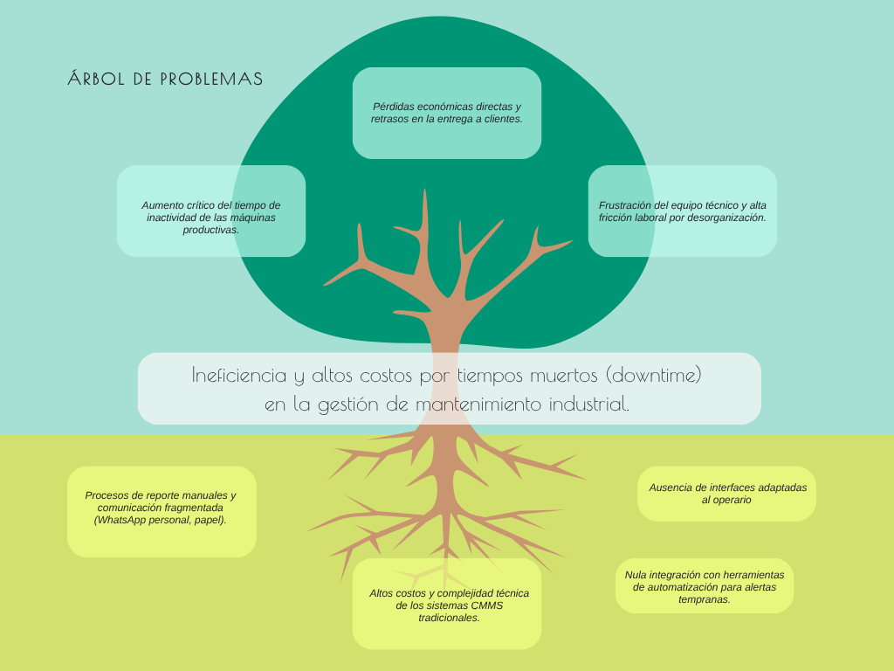<br>
  <em>Fuente: Elaboración propia.</em>
</div>

### Diagrama de Ishikawa

Para complementar el análisis estructural, se aplicó el Diagrama de Ishikawa (Espina de Pescado) categorizando las causas raíz en seis ejes fundamentales: Proceso, Personas, Tecnología, Información, Entorno y Gestión[cite: 6]. Este desglose sistemático no solo demuestra el rigor metodológico, sino que también justifica la multidimensionalidad de la solución FixCore al validar las causas operativas (p. ej., la necesidad de Tecnología móvil para superar las limitaciones del Entorno ruidoso de planta y la agilidad de Proceso para combatir la comunicación fragmentada).

<div align="center">
  <strong>Gráfico 2: Diagrama de Ishikawa</strong><br><br>
  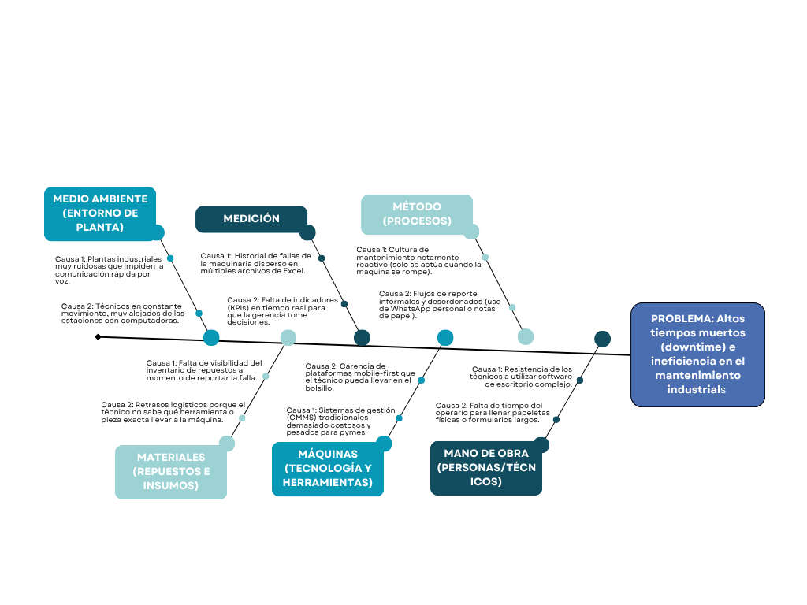<br>
  <em>Fuente: Elaboración propia.</em>
</div>


### 2.3.1. User Personas.

A partir del análisis de las entrevistas realizadas a los tres segmentos objetivo de FixCore, se desarrollaron tres User Personas representativos. Cada uno resume los principales objetivos, motivaciones, frustraciones, habilidades y comportamientos identificados en los usuarios entrevistados.

<div align="center">
  <strong>Gráfico 3: User Persona - Carla García, Jefa de Planta</strong><br><br>
  <br>
  <em>Fuente: Elaboración propia.</em>
</div>

<br>

<div align="center">
  <strong>Gráfico 4: User Persona - Víctor Salazar, Coordinador de Operaciones</strong><br><br>
  <br>
  <em>Fuente: Elaboración propia.</em>
</div>

<br>

<div align="center">
  <strong>Gráfico 5: User Persona - José Ramírez, Técnico de Mantenimiento Industrial</strong><br><br>
  <br>
  <em>Fuente: Elaboración propia.</em>
</div>

### 2.3.2. User Task Matrix.

El presente User Task Matrix reúne las principales tareas que realizan los User Personas representativos de los tres segmentos objetivo de FixCore para alcanzar sus objetivos relacionados con la gestión del mantenimiento industrial.

Las tareas consideradas corresponden a actividades que los usuarios realizan actualmente dentro de sus procesos de mantenimiento, independientemente de la existencia de FixCore. Para cada tarea se consideran dos criterios:

- **Frecuencia (Frc):** indica qué tan seguido el User Persona realiza la tarea.
- **Importancia (Imp):** indica qué tan relevante resulta la tarea para alcanzar sus objetivos.

Para ambos criterios se emplean los niveles **Alta, Media y Baja**.

Los User Personas considerados representan los siguientes segmentos:

1. **Técnicos y Operarios de Mantenimiento Industrial**
2. **Pymes de Manufactura y Producción**
3. **Firmas Consultoras y Contratistas de Ingeniería Industrial**

> **Nota:** Una vez definidos los User Personas, los nombres de los segmentos utilizados en la tabla serán reemplazados por el nombre correspondiente de cada User Persona.

### User Task Matrix - FixCore

| Tareas principales | Técnicos (Frc) | Técnicos (Imp) | Supervisores (Frc) | Supervisores (Imp) | Consultores (Frc) | Consultores (Imp) |
| :--- | :---: | :---: | :---: | :---: | :---: | :---: |
| **Reportar fallas o paradas de maquinaria** | Alta | Alta | Media | Alta | Baja | Media |
| **Ejecutar órdenes de trabajo de mantenimiento** | Alta | Alta | Media | Alta | Baja | Media |
| **Registrar las actividades realizadas después de un mantenimiento** | Alta | Alta | Media | Alta | Media | Media |
| **Consultar manuales, historial e información técnica de una máquina** | Alta | Alta | Alta | Alta | Media | Media |
| **Verificar la disponibilidad de repuestos** | Alta | Alta | Alta | Alta | Media | Alta |
| **Comunicar fallas críticas o situaciones que requieren atención inmediata** | Media | Alta | Alta | Alta | Media | Alta |
| **Asignar técnicos para atender mantenimientos o fallas** | Baja | Baja | Alta | Alta | Alta | Alta |
| **Planificar mantenimientos preventivos** | Baja | Media | Alta | Alta | Alta | Alta |
| **Generar reportes de mantenimiento y KPIs** | Baja | Baja | Alta | Alta | Alta | Alta |
| **Revisar tiempos muertos y disponibilidad de maquinaria** | Baja | Baja | Alta | Alta | Alta | Alta |
| **Verificar el cumplimiento de las órdenes de trabajo** | Media | Alta | Alta | Alta | Alta | Alta |
| **Coordinar técnicos entre diferentes plantas o clientes** | Baja | Baja | Baja | Media | Alta | Alta |

#### Análisis del User Task Matrix

A partir de la matriz se observan diferencias claras entre las responsabilidades de los tres User Personas.

En el caso de los **técnicos y operarios de mantenimiento**, las tareas con mayor frecuencia e importancia se relacionan directamente con la ejecución del trabajo en planta. Entre ellas destacan el reporte de fallas, la ejecución de órdenes de trabajo, el registro de las actividades realizadas, la consulta de información técnica y la verificación de repuestos. Esto evidencia que este segmento necesita acceder rápidamente a información operativa durante su jornada de trabajo.

Los **jefes de planta y supervisores de producción** presentan una mayor participación en actividades de coordinación y control. Para ellos son especialmente importantes la planificación de mantenimientos preventivos, la asignación de técnicos, la supervisión del cumplimiento de las órdenes de trabajo, la revisión de los tiempos muertos y la generación de reportes. Su principal objetivo es mantener organizada la operación y reducir las interrupciones en la producción.

Por otro lado, las **firmas consultoras y contratistas de ingeniería industrial** presentan una mayor frecuencia e importancia en tareas relacionadas con la coordinación de múltiples técnicos, plantas y clientes. Asimismo, requieren planificar mantenimientos, asignar personal, supervisar órdenes de trabajo y generar reportes para sus clientes.

Como coincidencia entre los tres perfiles, se identifica la necesidad de contar con información actualizada sobre las máquinas, las órdenes de trabajo y los repuestos disponibles. Sin embargo, mientras que los técnicos se enfocan principalmente en la ejecución de las actividades de mantenimiento, los supervisores se concentran en la planificación y seguimiento, y las firmas consultoras en la coordinación de operaciones entre diferentes clientes y plantas.

### Análisis de resultados

**Tareas más frecuentes:**
Entre los tres segmentos, las tareas *"Acceder desde smartphones en planta"*, *"Consultar inventario de repuestos"* y *"Comunicar alertas críticas"* presentan alta frecuencia. Esto refleja la necesidad operativa del día a día por tener acceso móvil, visibilidad de stock y una comunicación rápida para evitar paradas prolongadas.

**Tareas más importantes:**
En todos los casos, las tareas *"Comunicar alertas críticas"*, *"Auditar tiempos muertos (MTTR)"* y *"Validar cumplimiento de OTs"* destacan con alta importancia. Esto evidencia que los usuarios valoran resolver las emergencias de inmediato y tener un control de calidad estricto respaldado por datos para proteger los bienes de capital.

**Diferencias entre segmentos:**
*   **Los Técnicos de Piso** priorizan la inmediatez: su enfoque absoluto está en reportar fallas rápidamente, ejecutar OTs y consultar repuestos desde sus celulares sin interfaces complejas (baja fricción).
*   **Los Supervisores y Jefes de Planta (ej. Carla)** actúan como el puente de control: dan igual peso a la asignación de recursos, la planificación y la generación de reportes mensuales para la gerencia, buscando consolidar la información.
*   **Las Firmas Consultoras (ej. Víctor)** concentran sus tareas en la gestión a gran escala: auditar KPIs, estandarizar reportes y gestionar operaciones multi-planta para justificar el valor de su servicio tercerizado.

**Coincidencias clave:**
Todos los perfiles coinciden en la necesidad de un acceso digital unificado y sin fricción (especialmente móvil) que erradique la dependencia del papel y los grupos informales de WhatsApp. Esta convergencia valida el enfoque de FexCore como un núcleo centralizado que conecta la inmediatez del operario con la analítica del gerente.

### 2.3.3. User Journey Mapping. 

A partir de los User Personas definidos, se elaboraron tres User Journey Maps con el propósito de representar el recorrido actual de cada perfil durante las actividades relacionadas con el mantenimiento industrial. En cada mapa se muestran sus objetivos, procesos, principales problemas, experiencia emocional y oportunidades de mejora identificadas durante las entrevistas.

<div align="center">
  <strong>Gráfico 6: User Journey Map - Carla García, Jefa de Planta</strong><br><br>
  <br>
  <em>Fuente: Elaboración propia.</em>
</div>

<br>

<div align="center">
  <strong>Gráfico 7: User Journey Map - Víctor Salazar, Coordinador de Operaciones</strong><br><br>
  <br>
  <em>Fuente: Elaboración propia.</em>
</div>

<br>

<div align="center">
  <strong>Gráfico 8: User Journey Map - José Ramírez, Técnico de Mantenimiento Industrial</strong><br><br>
  <br>
  <em>Fuente: Elaboración propia.</em>
</div>

### 2.3.4. Empathy Mapping. 

A partir de los User Personas definidos y de los hallazgos obtenidos en las entrevistas, se elaboraron tres Empathy Maps para profundizar en las necesidades, comportamientos, pensamientos, frustraciones y expectativas de cada perfil representativo de los segmentos objetivo de FixCore.

<div align="center">
  <strong>Gráfico 9: Empathy Map - Carla García, Jefa de Planta</strong><br><br>
  <br>
  <em>Fuente: Elaboración propia.</em>
</div>

<br>

<div align="center">
  <strong>Gráfico 10: Empathy Map - Víctor Salazar, Coordinador de Operaciones</strong><br><br>
  <br>
  <em>Fuente: Elaboración propia.</em>
</div>

<br>

<div align="center">
  <strong>Gráfico 11: Empathy Map - José Ramírez, Técnico de Mantenimiento Industrial</strong><br><br>
  <br>
  <em>Fuente: Elaboración propia.</em>
</div>

### 2.3.5. As-Is Scenario Mapping.

<div align="center">
  <strong>Gráfico 9: As-Is Scenario Mapping - Pymes de Manufactura y Producción</strong><br><br>
  <br>
  <em>Fuente: Elaboración propia.</em>
</div>

<br>

<div align="center">
  <strong>Gráfico 10: As-Is Scenario Mapping - Firmas Consultoras y Contratistas de Ingeniería Industrial</strong><br><br>
  <br>
  <em>Fuente: Elaboración propia.</em>
</div>

<br>

<div align="center">
  <strong>Gráfico 11: As-Is Scenario Mapping - Técnicos y Operarios de Mantenimiento Industrial</strong><br><br>
  <br>
  <em>Fuente: Elaboración propia.</em>
</div>

## 2.4. Big Picture EventStorming. 

El Big Picture Event Storming consiste en una exploración de alto nivel que busca alinear a los involucrados mediante el mapeo de eventos de dominio en una línea de tiempo extensa. Su propósito es capturar la narrativa completa del negocio para identificar puntos de fricción y establecer los límites preliminares de los Bounded Contexts antes de realizar un diseño técnico detallado. A continuación se presentarán los pasos realizados para la elaboración del tablero.

**1- Generación de eventos del dominio**  
En esta primera etapa se colocaron tarjetas naranjas que representen a los diferentes eventos que pueden ocurrir dentro del dominio del negocio.

<div align="center">
  <strong>Gráfico 12: Etapa 1 del Big picture Event Storming</strong><br><br>
  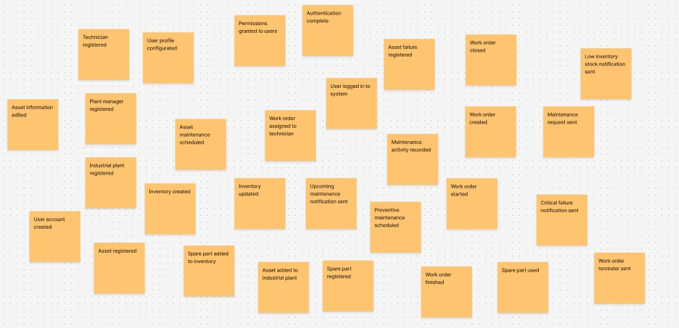<br>
  <em>Fuente: Elaboración propia.</em>
</div>

**2- Ordenamiento cronológico de eventos**  
En esta fase se ordenaron los eventos colocados previamente hasta formar una secuencia ordenada cronológicamente.

<div align="center">
  <strong>Gráfico 13: Etapa 2 del Big picture Event Storming</strong><br><br>
  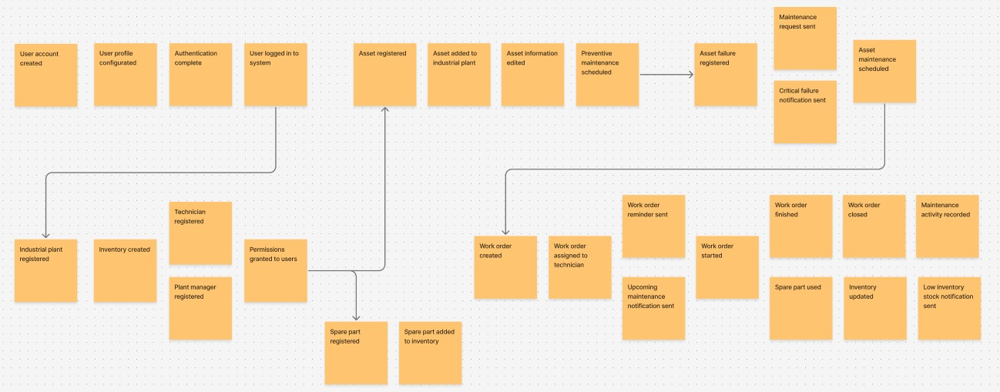<br>
  <em>Fuente: Elaboración propia.</em>
</div>

**3- Identificación de actores y sistemas externos**  
En esta etapa se agregaron tarjetas amarillas que representen a los usuarios responsables de generar ciertos eventos, así como tarjetas azules que representen unos sistemas externos involucrados.

<div align="center">
  <strong>Gráfico 14: Etapa 3 del Big picture Event Storming</strong><br><br>
  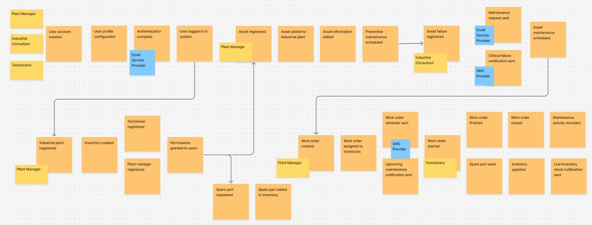<br>
  <em>Fuente: Elaboración propia.</em>
</div>

**4- Identificación de problemas**  
En esta última fase se colocaron tarjetas rosadas que indiquen posibles ambigüedades o problemas que tienen que discutirse en relación con la secuencia.

<div align="center">
  <strong>Gráfico 15: Etapa 4 del Big picture Event Storming</strong><br><br>
  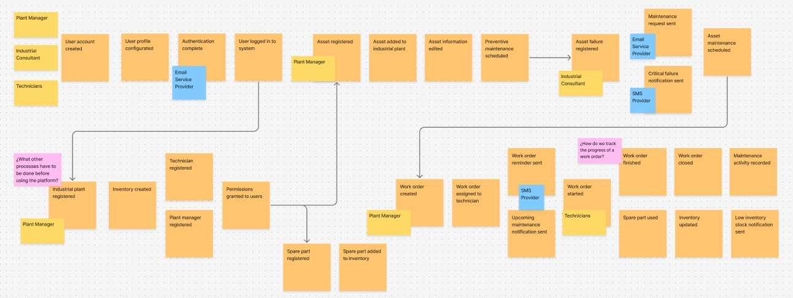<br>
  <em>Fuente: Elaboración propia.</em>
</div>

**Procesos clave:**  
Luego de elaborar el tablero de Big Picture Event Storming identificamos los siguientes procesos importantes para nuestro negocio:  
- Creación y acceso a cuentas de usuario.
- Registro de plantas industriales con sus integrantes.
- Registro de activos, repuestos y problemas.
- Planificación de mantenimientos.
- Creación y registro de órdenes de trabajo.

## 2.5. Ubiquitous Language. 

Es el lenguaje común compartido entre desarrolladores y expertos del negocio que se formula para alinear modelos mentales y eliminar ambigüedades. Este lenguaje asegura que tanto la documentación técnica como el código fuente final de FixCore utilicen exactamente los mismos términos definidos para el dominio de mantenimiento industrial.

| Concepto | Definición |
| :--- | :--- |
| **Técnico** | Usuario móvil del sistema encargado de ejecutar las órdenes de trabajo en planta y reportar incidencias. |
| **Jefe de Planta** | Usuario administrador responsable de supervisar la maquinaria, asignar tareas y analizar métricas operativas. |
| **Máquina (Activo)** | Equipo industrial físico registrado en el sistema que requiere monitoreo, historial y mantenimiento constante. |
| **Orden de Trabajo (OT)** | Registro digital que detalla una tarea de mantenimiento específica asignada a un técnico, incluyendo tiempos y repuestos. |
| **Falla (Incidencia)** | Evento imprevisto reportado en el que una máquina deja de funcionar correctamente, requiriendo atención inmediata. |
| **Tiempo Muerto (Downtime)** | Período durante el cual una máquina no está operativa debido a una falla, generando retrasos en la producción. |
| **Mantenimiento Preventivo** | Conjunto de tareas programadas y recurrentes para revisar y conservar las máquinas antes de que ocurra una falla. |
| **Mantenimiento Correctivo** | Acción de reparación que se ejecuta de manera reactiva después de que se ha reportado una falla en una máquina. |
| **Alerta Automatizada** | Notificación enviada en tiempo real (vía webhooks a WhatsApp) informando a los involucrados sobre un cambio de estado o falla. |
| **Repuesto (Insumo)** | Pieza física o material consumible necesario para completar una orden de trabajo (ej. rodamientos, lubricantes). |
| **Inventario** | Módulo que gestiona el stock y las existencias actualizadas de los repuestos disponibles en el almacén. |
| **Planta (Locación)** | Espacio físico, fábrica o instalación industrial donde se encuentran operando las máquinas registradas. |
| **KPI de Mantenimiento** | Indicador clave (ej. MTTR - Tiempo Medio de Reparación) generado automáticamente para medir la eficiencia del equipo. |
| **Plan Freemium** | Nivel de acceso básico de la plataforma que permite a la pyme gestionar un número limitado de OTs sin costo inicial. |

# Capítulo III: Requirements Specification 

## 3.1. User Stories.

| Story ID | Título | Descripción | Criterios de aceptación | Relacionado con |
| :--- | :--- | :--- | :--- | :--- |
| **US01** | Registrar planta | Como Jefe de Planta, deseo registrar una planta para organizar las máquinas que forman parte de sus operaciones. | **Escenario 1:** Dado que el Jefe de Planta cuenta con la información necesaria, cuando registra una nueva planta, entonces la planta queda registrada correctamente.<br><br>**Escenario 2:** Dado que falta información obligatoria, cuando intenta registrar la planta, entonces el registro no se completa y se informa qué datos faltan. | EP01 |
| **US02** | Editar información de una planta | Como Jefe de Planta, deseo actualizar la información de una planta para mantener sus datos correctos. | **Escenario 1:** Dado que la planta está registrada, cuando modifica sus datos con información válida, entonces los cambios quedan guardados.<br><br>**Escenario 2:** Dado que ingresa información no válida, cuando intenta guardar los cambios, entonces la información anterior se mantiene. | EP01 |
| **US03** | Registrar máquina | Como Jefe de Planta, deseo registrar una máquina para llevar un control de los activos que requieren mantenimiento. | **Escenario 1:** Dado que existe una planta registrada, cuando registra una máquina con sus datos obligatorios, entonces la máquina queda asociada a dicha planta.<br><br>**Escenario 2:** Dado que faltan datos obligatorios, cuando intenta registrar la máquina, entonces el registro no se completa. | EP01 |
| **US04** | Editar información de una máquina | Como Jefe de Planta, deseo actualizar los datos de una máquina para mantener su información técnica al día. | **Escenario 1:** Dado que la máquina está registrada, cuando modifica información válida, entonces los cambios quedan guardados.<br><br>**Escenario 2:** Dado que proporciona información incorrecta o incompleta, cuando intenta actualizarla, entonces los cambios no son registrados. | EP01 |
| **US05** | Consultar ficha técnica de una máquina | Como Técnico, deseo consultar la ficha técnica de una máquina para conocer sus características antes de realizar un mantenimiento. | **Escenario 1:** Dado que la máquina está registrada, cuando consulta su ficha técnica, entonces obtiene la marca, modelo y demás información disponible.<br><br>**Escenario 2:** Dado que la máquina no existe, cuando intenta consultar su ficha, entonces se informa que el activo no fue encontrado. | EP01 |
| **US06** | Asociar manual técnico a una máquina | Como Jefe de Planta, deseo asociar manuales a una máquina para mantener su documentación técnica centralizada. | **Escenario 1:** Dado que la máquina está registrada, cuando se asocia un manual válido, entonces el documento queda relacionado con el activo.<br><br>**Escenario 2:** Dado que el documento no cumple con las condiciones permitidas, cuando intenta asociarlo, entonces el manual no queda registrado. | EP01 |
| **US07** | Consultar manuales de una máquina | Como Técnico, deseo consultar los manuales de una máquina para tener información de apoyo durante el mantenimiento. | **Escenario 1:** Dado que existen manuales asociados a la máquina, cuando los consulta, entonces puede acceder a los documentos disponibles.<br><br>**Escenario 2:** Dado que no existen manuales asociados, cuando realiza la consulta, entonces se informa que no hay documentos disponibles. | EP01 |
| **US08** | Consultar estado de una máquina | Como Jefe de Planta, deseo conocer el estado de una máquina para saber si está operativa, en mantenimiento o presenta una falla. | **Escenario 1:** Dado que la máquina está registrada, cuando consulta su estado, entonces obtiene su condición actual.<br><br>**Escenario 2:** Dado que ocurre un cambio relacionado con una falla o mantenimiento, cuando vuelve a consultar la máquina, entonces obtiene el estado actualizado. | EP01 |
| **US09** | Consultar historial de una máquina | Como Jefe de Planta, deseo revisar el historial de una máquina para conocer sus fallas y mantenimientos anteriores. | **Escenario 1:** Dado que la máquina tiene actividades anteriores, cuando consulta su historial, entonces obtiene los eventos registrados en orden cronológico.<br><br>**Escenario 2:** Dado que la máquina todavía no tiene actividad registrada, cuando consulta su historial, entonces se informa que aún no existen registros. | EP01 |
| **US10** | Programar mantenimiento preventivo | Como Jefe de Planta, deseo programar un mantenimiento preventivo para reducir el riesgo de fallas inesperadas en una máquina. | **Escenario 1:** Dado que la máquina está registrada, cuando programa un mantenimiento con información válida, entonces la actividad queda registrada.<br><br>**Escenario 2:** Dado que faltan datos obligatorios, cuando intenta realizar la programación, entonces el mantenimiento no queda registrado. | EP02 |
| **US11** | Definir frecuencia de mantenimiento | Como Jefe de Planta, deseo establecer cada cuánto debe realizarse un mantenimiento para mantener una planificación preventiva constante. | **Escenario 1:** Dado que existe un mantenimiento preventivo, cuando establece una frecuencia válida, entonces quedan definidas las futuras revisiones.<br><br>**Escenario 2:** Dado que la frecuencia no es válida, cuando intenta registrarla, entonces la programación no se modifica. | EP02 |
| **US12** | Editar mantenimiento programado | Como Jefe de Planta, deseo modificar los datos de un mantenimiento pendiente para corregir cambios en su planificación. | **Escenario 1:** Dado que el mantenimiento está pendiente, cuando modifica información válida, entonces la planificación queda actualizada.<br><br>**Escenario 2:** Dado que el mantenimiento ya está completado, cuando intenta modificarlo, entonces el registro realizado se conserva. | EP02 |
| **US13** | Reprogramar mantenimiento | Como Jefe de Planta, deseo cambiar la fecha de un mantenimiento para adaptarlo a cambios en las operaciones de la planta. | **Escenario 1:** Dado que el mantenimiento está pendiente, cuando selecciona una nueva fecha válida, entonces queda reprogramado.<br><br>**Escenario 2:** Dado que la nueva fecha no es válida, cuando intenta realizar el cambio, entonces se conserva la fecha anterior. | EP02 |
| **US14** | Consultar calendario de mantenimientos | Como Jefe de Planta, deseo consultar los mantenimientos programados para organizar las actividades del equipo técnico. | **Escenario 1:** Dado que existen mantenimientos programados, cuando consulta un periodo determinado, entonces obtiene las actividades correspondientes.<br><br>**Escenario 2:** Dado que no existen actividades en el periodo consultado, cuando realiza la consulta, entonces se informa que no hay mantenimientos programados. | EP02 |
| **US15** | Consultar mantenimientos por planta | Como Gerente de Operaciones, deseo consultar los mantenimientos de cada planta atendida para organizar el trabajo de los técnicos entre diferentes clientes. | **Escenario 1:** Dado que administra varias plantas, cuando consulta una planta determinada, entonces obtiene los mantenimientos asociados únicamente a ella.<br><br>**Escenario 2:** Dado que una planta no tiene actividades programadas, cuando la consulta, entonces se informa que no existen mantenimientos pendientes. | EP02 |
| **US16** | Consultar próximos mantenimientos | Como Técnico, deseo conocer los próximos mantenimientos que debo realizar para prepararme antes de iniciar mis actividades. | **Escenario 1:** Dado que tiene mantenimientos próximos asignados, cuando consulta sus actividades, entonces obtiene las tareas pendientes ordenadas por fecha.<br><br>**Escenario 2:** Dado que no tiene mantenimientos próximos, cuando realiza la consulta, entonces se informa que no existen actividades pendientes. | EP02 |
| **US17** | Identificar mantenimientos vencidos | Como Jefe de Planta, deseo identificar los mantenimientos que no fueron realizados a tiempo para tomar acciones antes de que ocurra una falla. | **Escenario 1:** Dado que la fecha programada ya pasó y el mantenimiento continúa pendiente, cuando consulta sus actividades, entonces el mantenimiento aparece como vencido.<br><br>**Escenario 2:** Dado que el mantenimiento fue completado dentro de la fecha prevista, cuando consulta su estado, entonces no aparece como vencido. | EP02 |
| **US18** | Suspender o reactivar mantenimiento preventivo | Como Jefe de Planta, deseo suspender o reactivar un plan preventivo para adaptarlo al estado actual de una máquina. | **Escenario 1:** Dado que un plan está activo, cuando decide suspenderlo, entonces deja de generar nuevas actividades mientras permanezca suspendido.<br><br>**Escenario 2:** Dado que el plan se encuentra suspendido, cuando lo reactiva, entonces vuelve a considerar su programación establecida. | EP02 |
| **US19** | Reportar falla de una máquina | Como Técnico, deseo reportar rápidamente una falla para que pueda ser atendida y no se pierda entre otros medios de comunicación. | **Escenario 1:** Dado que la máquina está registrada, cuando el Técnico reporta una falla con la información necesaria, entonces la incidencia queda registrada.<br><br>**Escenario 2:** Dado que falta información obligatoria, cuando intenta reportarla, entonces la incidencia no queda registrada y se indican los datos faltantes. | EP03 |
| **US20** | Asignar prioridad a una falla | Como Jefe de Planta, deseo indicar la prioridad de una falla para atender primero las incidencias que generan mayor impacto en la producción. | **Escenario 1:** Dado que existe una falla registrada, cuando se establece una prioridad válida, entonces esta queda asociada a la incidencia.<br><br>**Escenario 2:** Dado que la prioridad cambia, cuando se actualiza la incidencia, entonces la nueva prioridad queda registrada. | EP03 |
| **US21** | Consultar fallas pendientes | Como Jefe de Planta, deseo consultar las fallas pendientes para conocer qué máquinas requieren atención. | **Escenario 1:** Dado que existen incidencias pendientes, cuando realiza la consulta, entonces obtiene las fallas que todavía requieren atención.<br><br>**Escenario 2:** Dado que no existen fallas pendientes, cuando realiza la consulta, entonces se informa que no existen incidencias por atender. | EP03 |
| **US22** | Consultar detalle de una falla | Como Jefe de Planta, deseo revisar la información de una falla para entender qué ocurrió antes de coordinar su atención. | **Escenario 1:** Dado que la incidencia existe, cuando consulta su detalle, entonces obtiene la máquina afectada, descripción, fecha, prioridad y estado.<br><br>**Escenario 2:** Dado que la incidencia no existe, cuando intenta consultarla, entonces se informa que no fue encontrada. | EP03 |
| **US23** | Generar orden correctiva desde una falla | Como Jefe de Planta, deseo crear una Orden de Trabajo a partir de una falla para iniciar formalmente su reparación. | **Escenario 1:** Dado que existe una falla pendiente, cuando genera la Orden de Trabajo correctiva, entonces la orden queda relacionada con la incidencia y la máquina.<br><br>**Escenario 2:** Dado que la falla ya tiene una orden activa, cuando intenta generar otra, entonces no se crea una orden duplicada. | EP03 |
| **US24** | Generar orden de mantenimiento preventivo | Como Jefe de Planta, deseo generar una Orden de Trabajo para un mantenimiento programado para organizar su ejecución. | **Escenario 1:** Dado que existe un mantenimiento preventivo pendiente, cuando genera una Orden de Trabajo, entonces ambos registros quedan relacionados.<br><br>**Escenario 2:** Dado que ya existe una orden para ese mantenimiento, cuando intenta generar otra, entonces se evita crear un duplicado. | EP03 |
| **US25** | Asignar técnico a una orden | Como Jefe de Planta, deseo asignar una Orden de Trabajo a un Técnico para definir quién será responsable del mantenimiento. | **Escenario 1:** Dado que la orden está pendiente y existe un Técnico disponible, cuando lo asigna, entonces la orden queda relacionada con dicho Técnico.<br><br>**Escenario 2:** Dado que el Técnico no está disponible para la actividad, cuando intenta asignarlo, entonces la asignación no se completa. | EP03 |
| **US26** | Reasignar orden de trabajo | Como Jefe de Planta, deseo cambiar el Técnico responsable de una orden para responder a cambios de disponibilidad. | **Escenario 1:** Dado que la orden todavía no está completada, cuando selecciona otro Técnico disponible, entonces el responsable queda actualizado.<br><br>**Escenario 2:** Dado que la orden ya está completada, cuando intenta reasignarla, entonces el responsable original se conserva. | EP03 |
| **US27** | Consultar órdenes asignadas | Como Técnico, deseo consultar mis Órdenes de Trabajo para saber qué actividades debo atender durante mi turno. | **Escenario 1:** Dado que tiene órdenes asignadas, cuando consulta sus actividades, entonces obtiene únicamente las órdenes que le corresponden.<br><br>**Escenario 2:** Dado que no tiene órdenes pendientes, cuando realiza la consulta, entonces se informa que no existen trabajos asignados. | EP03 |
| **US28** | Iniciar orden de trabajo | Como Técnico, deseo indicar que he comenzado una Orden de Trabajo para registrar desde cuándo se está atendiendo el mantenimiento. | **Escenario 1:** Dado que la orden está pendiente y asignada al Técnico, cuando inicia el trabajo, entonces la orden cambia a estado en progreso.<br><br>**Escenario 2:** Dado que la orden no pertenece al Técnico, cuando intenta iniciarla, entonces la operación no se realiza. | EP03 |
| **US29** | Registrar trabajo realizado | Como Técnico, deseo registrar lo realizado durante el mantenimiento para mantener una evidencia clara del trabajo efectuado. | **Escenario 1:** Dado que la orden está en progreso, cuando registra las actividades realizadas, entonces la información queda asociada a la Orden de Trabajo.<br><br>**Escenario 2:** Dado que falta información requerida, cuando intenta registrar el trabajo, entonces el registro no se completa. | EP03 |
| **US30** | Cerrar orden de trabajo | Como Técnico, deseo cerrar una Orden de Trabajo cuando termino el mantenimiento para dejar registrada su finalización. | **Escenario 1:** Dado que la orden está en progreso y contiene la información requerida, cuando el Técnico la finaliza, entonces cambia a estado completado.<br><br>**Escenario 2:** Dado que faltan datos necesarios del mantenimiento, cuando intenta cerrarla, entonces la orden permanece en progreso. | EP03 |
| **US31** | Registrar repuesto | Como Jefe de Planta, deseo registrar un repuesto para controlar los materiales disponibles para los mantenimientos. | **Escenario 1:** Dado que cuenta con la información requerida, cuando registra un nuevo repuesto, entonces este queda almacenado en el inventario.<br><br>**Escenario 2:** Dado que falta información obligatoria, cuando intenta registrarlo, entonces el repuesto no queda creado. | EP04 |
| **US32** | Editar información de un repuesto | Como Jefe de Planta, deseo actualizar los datos de un repuesto para mantener correcta la información del inventario. | **Escenario 1:** Dado que el repuesto está registrado, cuando modifica información válida, entonces los cambios quedan guardados.<br><br>**Escenario 2:** Dado que la información no es válida, cuando intenta actualizarla, entonces se conservan los datos anteriores. | EP04 |
| **US33** | Consultar stock de repuestos | Como Técnico, deseo consultar la cantidad disponible de un repuesto para saber si puedo utilizarlo durante un mantenimiento. | **Escenario 1:** Dado que el repuesto está registrado, cuando consulta su disponibilidad, entonces obtiene la cantidad actual existente.<br><br>**Escenario 2:** Dado que el repuesto no tiene unidades disponibles, cuando consulta su stock, entonces se indica que se encuentra agotado. | EP04 |
| **US34** | Buscar repuestos | Como Técnico, deseo buscar un repuesto para encontrar rápidamente el material que necesito durante una reparación. | **Escenario 1:** Dado que existen repuestos que coinciden con los datos consultados, cuando realiza la búsqueda, entonces obtiene los resultados correspondientes.<br><br>**Escenario 2:** Dado que ningún repuesto coincide, cuando realiza la búsqueda, entonces se informa que no existen resultados. | EP04 |
| **US35** | Definir stock mínimo | Como Jefe de Planta, deseo establecer una cantidad mínima para cada repuesto para saber cuándo es necesario reponerlo. | **Escenario 1:** Dado que el repuesto está registrado, cuando establece una cantidad mínima válida, entonces el límite queda guardado.<br><br>**Escenario 2:** Dado que la cantidad indicada no es válida, cuando intenta registrarla, entonces el stock mínimo no se modifica. | EP04 |
| **US36** | Registrar ingreso de repuestos | Como Jefe de Planta, deseo registrar el ingreso de nuevas unidades para mantener actualizado el inventario. | **Escenario 1:** Dado que el repuesto existe, cuando registra una cantidad válida de unidades recibidas, entonces el stock aumenta en la cantidad indicada.<br><br>**Escenario 2:** Dado que la cantidad ingresada no es válida, cuando intenta registrarla, entonces el stock permanece sin cambios. | EP04 |
| **US37** | Ajustar existencias de inventario | Como Jefe de Planta, deseo corregir las existencias registradas para solucionar diferencias encontradas en el inventario real. | **Escenario 1:** Dado que existe una diferencia comprobada, cuando registra un ajuste válido, entonces la nueva cantidad queda actualizada.<br><br>**Escenario 2:** Dado que se realiza un ajuste, cuando posteriormente se consulta el historial, entonces el movimiento puede ser identificado. | EP04 |
| **US38** | Registrar repuestos utilizados | Como Técnico, deseo registrar los repuestos utilizados en una Orden de Trabajo para dejar constancia de los materiales consumidos. | **Escenario 1:** Dado que la orden está en progreso y existe stock disponible, cuando registra un repuesto utilizado, entonces queda asociado a la orden.<br><br>**Escenario 2:** Dado que la cantidad solicitada supera el stock disponible, cuando intenta registrarla, entonces el consumo no es aceptado. | EP04 |
| **US39** | Actualizar stock al completar una orden | Como Jefe de Planta, deseo que el inventario considere los repuestos consumidos en las Órdenes de Trabajo para conocer el stock real disponible. | **Escenario 1:** Dado que una orden contiene repuestos utilizados, cuando se completa la Orden de Trabajo, entonces las cantidades correspondientes son descontadas del inventario.<br><br>**Escenario 2:** Dado que una orden no utilizó repuestos, cuando se completa, entonces las existencias permanecen sin cambios. | EP04 |
| **US40** | Consultar historial de inventario | Como Jefe de Planta, deseo consultar los movimientos de los repuestos para conocer cómo han cambiado sus existencias. | **Escenario 1:** Dado que existen movimientos registrados, cuando consulta el historial, entonces obtiene los ingresos, consumos y ajustes realizados.<br><br>**Escenario 2:** Dado que no existen movimientos para un repuesto, cuando consulta su historial, entonces se informa que todavía no tiene actividad registrada. | EP04 |
| **US41** | Consultar resumen de operaciones | Como Jefe de Planta, deseo consultar un resumen general del mantenimiento para conocer rápidamente la situación de las máquinas de la planta. | **Escenario 1:** Dado que existen datos de operación, cuando consulta el resumen, entonces obtiene información consolidada de máquinas, fallas y mantenimientos.<br><br>**Escenario 2:** Dado que existen registros nuevos, cuando vuelve a consultar el resumen, entonces la información refleja los datos más recientes disponibles. | EP05 |
| **US42** | Consultar tiempo muerto de las máquinas | Como Jefe de Planta, deseo conocer el Tiempo Muerto de las máquinas para identificar qué equipos generan mayores interrupciones en la producción. | **Escenario 1:** Dado que existen periodos de inactividad registrados, cuando consulta el indicador de Downtime, entonces obtiene el tiempo acumulado correspondiente.<br><br>**Escenario 2:** Dado que una máquina no registra inactividad, cuando consulta su indicador, entonces el tiempo muerto obtenido es cero. | EP05 |
| **US43** | Consultar MTTR | Como Jefe de Planta, deseo consultar el tiempo medio de reparación para evaluar qué tan rápido son atendidas las fallas. | **Escenario 1:** Dado que existen reparaciones completadas, cuando consulta el MTTR, entonces obtiene el promedio calculado utilizando los registros disponibles.<br><br>**Escenario 2:** Dado que no existen suficientes reparaciones registradas, cuando consulta el indicador, entonces se informa que aún no puede ser calculado. | EP05 |
| **US44** | Consultar cumplimiento preventivo | Como Jefe de Planta, deseo conocer el nivel de cumplimiento de los mantenimientos preventivos para saber si las revisiones se realizan dentro de las fechas planificadas. | **Escenario 1:** Dado que existen mantenimientos programados y completados, cuando consulta el cumplimiento, entonces obtiene el porcentaje correspondiente al periodo.<br><br>**Escenario 2:** Dado que no existen mantenimientos durante el periodo, cuando realiza la consulta, entonces se informa que no hay datos suficientes. | EP05 |
| **US45** | Consultar estado de las órdenes de trabajo | Como Jefe de Planta, deseo conocer cuántas Órdenes de Trabajo están pendientes, en progreso o completadas para supervisar las actividades de mantenimiento. | **Escenario 1:** Dado que existen órdenes registradas, cuando consulta su estado general, entonces obtiene las cantidades agrupadas según su situación.<br><br>**Escenario 2:** Dado que una orden cambia de estado, cuando vuelve a realizar la consulta, entonces el resumen refleja el cambio. | EP05 |
| **US46** | Consultar desempeño de técnicos | Como Gerente de Operaciones, deseo consultar las Órdenes de Trabajo realizadas por los técnicos para conocer su actividad y organizar mejor los recursos de la empresa. | **Escenario 1:** Dado que el Técnico tiene órdenes completadas, cuando consulta su actividad durante un periodo, entonces obtiene los trabajos realizados.<br><br>**Escenario 2:** Dado que el Técnico no registra actividad en el periodo seleccionado, cuando realiza la consulta, entonces se informa que no existen registros. | EP05 |
| **US47** | Generar reporte por cliente | Como Gerente de Operaciones, deseo generar un reporte de mantenimiento para cada cliente para entregar información clara sobre sus máquinas y servicios realizados. | **Escenario 1:** Dado que existen registros de mantenimiento del cliente, cuando genera el reporte para un periodo, entonces obtiene información relacionada con sus máquinas, fallas y Órdenes de Trabajo.<br><br>**Escenario 2:** Dado que no existen registros en el periodo seleccionado, cuando solicita el reporte, entonces se informa que no existen datos disponibles. | EP05 |
| **US48** | Recibir alerta de mantenimiento próximo | Como Jefe de Planta, deseo recibir una alerta antes de una fecha de mantenimiento para evitar que una revisión preventiva sea olvidada. | **Escenario 1:** Dado que existe un mantenimiento próximo, cuando se alcanza el periodo establecido para el aviso, entonces se genera una alerta.<br><br>**Escenario 2:** Dado que el mantenimiento ya fue completado, cuando llega el momento previsto para la alerta, entonces no se genera un aviso pendiente. | EP06 |
| **US49** | Recibir alerta de falla crítica | Como Jefe de Planta, deseo recibir una alerta cuando se registra una falla crítica para coordinar su atención lo antes posible. | **Escenario 1:** Dado que se registra una falla con prioridad crítica, cuando la incidencia queda confirmada, entonces se genera una alerta para los responsables.<br><br>**Escenario 2:** Dado que la falla no tiene prioridad crítica, cuando queda registrada, entonces conserva el nivel de prioridad correspondiente sin generar una alerta crítica. | EP06 |
| **US50** | Recibir notificación de orden asignada | Como Técnico, deseo recibir una notificación cuando se me asigna una Orden de Trabajo para conocer que tengo una nueva actividad pendiente. | **Escenario 1:** Dado que una orden es asignada al Técnico, cuando la asignación queda registrada, entonces se genera una notificación para dicho Técnico.<br><br>**Escenario 2:** Dado que la orden es reasignada a otro Técnico, cuando se confirma el cambio, entonces el nuevo responsable recibe la notificación correspondiente. | EP06 |
| **US51** | Recibir alerta de stock bajo | Como Jefe de Planta, deseo recibir una alerta cuando un repuesto alcanza su stock mínimo para poder reponerlo antes de que se agote. | **Escenario 1:** Dado que el stock alcanza o baja del mínimo establecido, cuando se actualizan las existencias, entonces se genera una alerta.<br><br>**Escenario 2:** Dado que el stock permanece por encima del mínimo, cuando se actualiza el inventario, entonces no se genera una alerta de stock bajo. | EP06 |
| **US52** | Configurar destinatarios de alertas | Como Jefe de Planta, deseo definir qué responsables deben recibir cada tipo de alerta para que la información llegue a las personas adecuadas. | **Escenario 1:** Dado que existe un usuario autorizado, cuando se configura como destinatario de una alerta, entonces queda asociado a ese tipo de notificación.<br><br>**Escenario 2:** Dado que se elimina un destinatario de la configuración, cuando ocurre posteriormente el evento, entonces dicho usuario ya no recibe esa alerta. | EP06 |
| **US53** | Recibir alertas mediante WhatsApp | Como Jefe de Planta, deseo recibir las alertas importantes mediante WhatsApp para enterarme de situaciones urgentes aunque no esté usando FixCore. | **Escenario 1:** Dado que ocurre un evento configurado para notificación externa, cuando se genera la alerta, entonces se envía la información mediante el servicio de WhatsApp integrado.<br><br>**Escenario 2:** Dado que el servicio externo no está disponible, cuando se intenta realizar el envío, entonces el fallo queda registrado para evitar perder el evento. | EP06 |
| **US54** | Iniciar sesión | Como usuario registrado, deseo iniciar sesión en FixCore para acceder a las funciones correspondientes a mi cuenta. | **Escenario 1:** Dado que las credenciales son correctas, cuando el usuario solicita acceso, entonces puede ingresar a su cuenta.<br><br>**Escenario 2:** Dado que las credenciales son incorrectas, cuando intenta acceder, entonces el inicio de sesión es rechazado. | EP07 |
| **US55** | Recuperar acceso a la cuenta | Como usuario registrado, deseo recuperar el acceso cuando olvido mi contraseña para volver a utilizar FixCore. | **Escenario 1:** Dado que existe una cuenta asociada al usuario, cuando solicita recuperar el acceso, entonces recibe el procedimiento de recuperación correspondiente.<br><br>**Escenario 2:** Dado que no existe una cuenta asociada a los datos proporcionados, cuando solicita la recuperación, entonces ninguna cuenta es modificada. | EP07 |
| **US56** | Registrar técnico | Como Jefe de Planta, deseo registrar Técnicos para poder asignarles las actividades de mantenimiento de la empresa. | **Escenario 1:** Dado que proporciona información válida del Técnico, cuando realiza el registro, entonces el Técnico queda disponible para ser asociado a actividades.<br><br>**Escenario 2:** Dado que ya existe un usuario con los mismos datos de identificación, cuando intenta registrarlo nuevamente, entonces no se crea un registro duplicado. | EP07 |
| **US57** | Editar información de un técnico | Como Jefe de Planta, deseo actualizar la información de un Técnico para mantener sus datos correctamente registrados. | **Escenario 1:** Dado que el Técnico existe, cuando modifica información válida, entonces los cambios quedan guardados.<br><br>**Escenario 2:** Dado que la información proporcionada no es válida, cuando intenta actualizarla, entonces se conservan los datos anteriores. | EP07 |
| **US58** | Asignar acceso según responsabilidad | Como Gerente de Operaciones, deseo definir a qué plantas puede acceder cada usuario para organizar el trabajo de los Técnicos que atienden diferentes clientes. | **Escenario 1:** Dado que el usuario está registrado, cuando se le asigna acceso a una planta autorizada, entonces puede consultar la información relacionada con dicha planta.<br><br>**Escenario 2:** Dado que el usuario no tiene acceso a una planta determinada, cuando intenta consultar su información, entonces el acceso es rechazado. | EP07 |
| **US59** | Conocer FixCore | Como Visitante, deseo conocer qué es FixCore para entender qué problema de mantenimiento industrial busca resolver. | **Escenario 1:** Dado que el Visitante accede al Landing Page, cuando consulta la presentación del producto, entonces puede conocer el propósito principal de FixCore.<br><br>**Escenario 2:** Dado que continúa revisando la información, cuando consulta la problemática presentada, entonces puede entender la relación entre FixCore y la gestión del mantenimiento industrial. | EP08 |
| **US60** | Conocer funcionalidades de FixCore | Como Visitante, deseo conocer las principales funcionalidades de FixCore para saber cómo puede ayudar a organizar el mantenimiento de una empresa. | **Escenario 1:** Dado que el Visitante consulta las características del producto, cuando revisa la información disponible, entonces puede identificar sus principales funcionalidades.<br><br>**Escenario 2:** Dado que consulta una funcionalidad, cuando revisa su descripción, entonces puede conocer el beneficio que ofrece. | EP08 |
| **US61** | Conocer beneficios según el segmento | Como Visitante, deseo conocer cómo FixCore puede ayudar a mi tipo de empresa para determinar si la solución responde a mis necesidades. | **Escenario 1:** Dado que el Visitante pertenece a una pyme manufacturera, cuando consulta la información dirigida a su segmento, entonces encuentra beneficios relacionados con el control de sus máquinas y mantenimientos.<br><br>**Escenario 2:** Dado que pertenece a una firma contratista, cuando consulta la información dirigida a su segmento, entonces encuentra beneficios relacionados con la gestión de técnicos y servicios para diferentes clientes. | EP08 |
| **US62** | Consultar planes de FixCore | Como Visitante, deseo conocer los planes disponibles para evaluar qué alternativa se adapta mejor a mi empresa. | **Escenario 1:** Dado que existen diferentes planes, cuando el Visitante consulta sus características, entonces puede identificar las diferencias principales entre ellos.<br><br>**Escenario 2:** Dado que existe un Plan Freemium, cuando consulta sus condiciones, entonces puede conocer las funcionalidades y límites incluidos. | EP08 |
| **US63** | Consultas adicionales sobre FixCore | Como Visitante, quiero que haya un espacio en la Landing Page donde pueda obtener información adicional sobre FixCore para así poder resolver mis dudas. | **Escenario 1:** Dado que el Visitante se encuentra en la Landing Page, cuando accede a la sección de preguntas frecuentes e interactúa con una pregunta, entonces visualiza una respuesta que aclara sus dudas.<br><br>**Escenario 2:** Dado que el Visitante se encuentra en la Landing Page, cuando accede a la sección del footer y presiona el botón de términos y condiciones, entonces es redirigido a una pestaña con los términos y condiciones asociados a FixCore. | EP08 |
| **US64** | Servicio de autenticación | Como Developer, deseo disponer de servicios RESTful de autenticación para controlar el acceso a los recursos protegidos de FixCore. | **Escenario 1:** Dado un request con credenciales válidas, cuando el API procesa la solicitud, entonces devuelve una respuesta exitosa con la información necesaria para identificar la sesión.<br><br>**Escenario 2:** Dado un request con credenciales incorrectas, cuando el API procesa la solicitud, entonces responde indicando que el acceso no está autorizado. | EP09 |
| **US65** | Servicio de plantas y máquinas | Como Developer, deseo disponer de endpoints para administrar plantas y máquinas para que la Web Application pueda gestionar los activos de FixCore. | **Escenario 1:** Dado un request válido para registrar un recurso, cuando el API procesa la solicitud, entonces el recurso queda creado y devuelve una respuesta exitosa.<br><br>**Escenario 2:** Dado un request para consultar un recurso existente, cuando el API procesa la solicitud, entonces devuelve la información correspondiente. | EP09 |
| **US66** | Servicio de mantenimiento preventivo | Como Developer, deseo disponer de endpoints para gestionar mantenimientos preventivos para permitir su programación y seguimiento desde la Web Application. | **Escenario 1:** Dado un request válido para crear un mantenimiento, cuando el API procesa la solicitud, entonces registra la actividad y devuelve una respuesta exitosa.<br><br>**Escenario 2:** Dado un request para consultar mantenimientos, cuando el API procesa la solicitud, entonces devuelve los registros que corresponden a los parámetros indicados. | EP09 |
| **US67** | Servicio de fallas y órdenes de trabajo | Como Developer, deseo disponer de endpoints para gestionar Fallas y Órdenes de Trabajo para soportar los procesos de mantenimiento correctivo y preventivo. | **Escenario 1:** Dado un request válido para registrar una Falla u Orden de Trabajo, cuando el API procesa la solicitud, entonces crea el recurso correspondiente.<br><br>**Escenario 2:** Dado un identificador inexistente, cuando se solicita el recurso, entonces el API responde indicando que no fue encontrado. | EP09 |
| **US68** | Servicio de inventario | Como Developer, deseo disponer de endpoints para gestionar repuestos y existencias para mantener actualizado el Inventario de FixCore. | **Escenario 1:** Dado un request válido para consultar un repuesto, cuando el API procesa la solicitud, entonces devuelve su información y stock disponible.<br><br>**Escenario 2:** Dado un request válido que modifica las existencias, cuando el API procesa la solicitud, entonces actualiza el stock y registra el movimiento correspondiente. | EP09 |
| **US69** | Servicio de métricas y reportes | Como Developer, deseo disponer de endpoints para consultar KPIs de mantenimiento y reportes para que la Web Application pueda presentar información de seguimiento. | **Escenario 1:** Dado un request con un periodo válido, cuando el API procesa la consulta, entonces devuelve las métricas calculadas con los registros disponibles.<br><br>**Escenario 2:** Dado un periodo sin información suficiente, cuando se realiza la consulta, entonces el API devuelve una respuesta indicando que no existen datos para calcular la métrica solicitada. | EP09 |
| **US70** | Servicio de notificaciones externas | Como Developer, deseo integrar el API con un servicio externo de notificaciones para enviar alertas relacionadas con eventos importantes de mantenimiento. | **Escenario 1:** Dado que ocurre un evento configurado para notificación externa, cuando el API envía el request al servicio correspondiente, entonces registra el envío realizado correctamente.<br><br>**Escenario 2:** Dado que el servicio externo responde con un error, cuando se intenta enviar la notificación, entonces el API registra el fallo y conserva el evento que originó la alerta. | EP09 |


### Epics

| Epic ID | Título | Descripción |
| :--- | :--- | :--- |
| **EP01** | Gestión de Plantas y Activos | Permite registrar, organizar y consultar plantas, máquinas, fichas técnicas, manuales, estados e historiales de mantenimiento de los activos. |
| **EP02** | Mantenimiento Preventivo | Permite programar, reprogramar, consultar y controlar los mantenimientos preventivos de las máquinas y sus frecuencias de ejecución. |
| **EP03** | Gestión de Fallas y Órdenes de Trabajo | Permite reportar y priorizar fallas, generar Órdenes de Trabajo, asignar técnicos y registrar la ejecución de actividades de mantenimiento. |
| **EP04** | Inventario y Repuestos | Permite registrar, consultar y controlar repuestos, existencias, movimientos de inventario y materiales utilizados durante los mantenimientos. |
| **EP05** | Monitoreo, Métricas y Reportes | Permite consultar el estado de las operaciones, tiempos muertos, MTTR, cumplimiento preventivo, desempeño de técnicos y generar reportes de mantenimiento. |
| **EP06** | Alertas y Notificaciones | Permite generar y enviar alertas relacionadas con mantenimientos próximos, fallas críticas, Órdenes de Trabajo asignadas y niveles bajos de stock. |
| **EP07** | Gestión de Usuarios y Accesos | Permite gestionar la autenticación, recuperación de acceso, registro de técnicos y permisos de los usuarios según sus responsabilidades y plantas asignadas. |
| **EP08** | Landing Page | Permite presentar FixCore a los visitantes, mostrando su propósito, funcionalidades, beneficios para los segmentos objetivo, planes disponibles y acceso a la Web Application. |
| **EP09** | RESTful API | Agrupa las Technical Stories necesarias para brindar mediante servicios RESTful las funcionalidades de autenticación, activos, mantenimiento, fallas, Órdenes de Trabajo, inventario, métricas y notificaciones de FixCore. |


## 3.2. Impact Mapping. 

<div align="center">
  <strong>Impact Mapping - FixCore</strong><br><br>
  <br>
  <em>Fuente: Elaboración propia.</em>
</div>


## 3.3. Product Backlog. 


El Product Backlog de FixCore reúne las User Stories identificadas para el desarrollo de la solución. Las historias fueron priorizadas considerando principalmente el valor que aportan a los segmentos objetivo y a las funciones principales del producto. Para la estimación se utilizaron Story Points siguiendo la escala 1, 2, 3, 5 y 8.

| # Orden | User Story ID | Título | Descripción | Story Points |
| :---: | :---: | :--- | :--- | :---: |
| 01 | **US59** | Conocer FixCore | Como Visitante, deseo conocer qué es FixCore para entender qué problema de mantenimiento industrial busca resolver. | 2 |
| 02 | **US60** | Conocer funcionalidades de FixCore | Como Visitante, deseo conocer las principales funcionalidades de FixCore para saber cómo puede ayudar a organizar el mantenimiento de una empresa. | 2 |
| 03 | **US61** | Conocer beneficios según el segmento | Como Visitante, deseo conocer cómo FixCore puede ayudar a mi tipo de empresa para determinar si la solución responde a mis necesidades. | 3 |
| 04 | **US63** | Comenzar a utilizar FixCore | Como Visitante, deseo acceder desde el Landing Page a la experiencia de FixCore para comenzar a probar la solución. | 2 |
| 05 | **US62** | Consultar planes de FixCore | Como Visitante, deseo conocer los planes disponibles para evaluar qué alternativa se adapta mejor a mi empresa. | 2 |
| 06 | **US03** | Registrar máquina | Como Jefe de Planta, deseo registrar una máquina para llevar un control de los activos que requieren mantenimiento. | 5 |
| 07 | **US05** | Consultar ficha técnica de una máquina | Como Técnico, deseo consultar la ficha técnica de una máquina para conocer sus características antes de realizar un mantenimiento. | 3 |
| 08 | **US19** | Reportar falla de una máquina | Como Técnico, deseo reportar rápidamente una falla para que pueda ser atendida y no se pierda entre otros medios de comunicación. | 3 |
| 09 | **US21** | Consultar fallas pendientes | Como Jefe de Planta, deseo consultar las fallas pendientes para conocer qué máquinas requieren atención. | 3 |
| 10 | **US23** | Generar orden correctiva desde una falla | Como Jefe de Planta, deseo crear una Orden de Trabajo a partir de una falla para iniciar formalmente su reparación. | 5 |
| 11 | **US25** | Asignar técnico a una orden | Como Jefe de Planta, deseo asignar una Orden de Trabajo a un Técnico para definir quién será responsable del mantenimiento. | 3 |
| 12 | **US27** | Consultar órdenes asignadas | Como Técnico, deseo consultar mis Órdenes de Trabajo para saber qué actividades debo atender durante mi turno. | 3 |
| 13 | **US28** | Iniciar orden de trabajo | Como Técnico, deseo indicar que he comenzado una Orden de Trabajo para registrar desde cuándo se está atendiendo el mantenimiento. | 2 |
| 14 | **US29** | Registrar trabajo realizado | Como Técnico, deseo registrar lo realizado durante el mantenimiento para mantener una evidencia clara del trabajo efectuado. | 3 |
| 15 | **US30** | Cerrar orden de trabajo | Como Técnico, deseo cerrar una Orden de Trabajo cuando termino el mantenimiento para dejar registrada su finalización. | 5 |
| 16 | **US10** | Programar mantenimiento preventivo | Como Jefe de Planta, deseo programar un mantenimiento preventivo para reducir el riesgo de fallas inesperadas en una máquina. | 5 |
| 17 | **US14** | Consultar calendario de mantenimientos | Como Jefe de Planta, deseo consultar los mantenimientos programados para organizar las actividades del equipo técnico. | 5 |
| 18 | **US16** | Consultar próximos mantenimientos | Como Técnico, deseo conocer los próximos mantenimientos que debo realizar para prepararme antes de iniciar mis actividades. | 3 |
| 19 | **US17** | Identificar mantenimientos vencidos | Como Jefe de Planta, deseo identificar los mantenimientos que no fueron realizados a tiempo para tomar acciones antes de que ocurra una falla. | 3 |
| 20 | **US48** | Recibir alerta de mantenimiento próximo | Como Jefe de Planta, deseo recibir una alerta antes de una fecha de mantenimiento para evitar que una revisión preventiva sea olvidada. | 3 |
| 21 | **US33** | Consultar stock de repuestos | Como Técnico, deseo consultar la cantidad disponible de un repuesto para saber si puedo utilizarlo durante un mantenimiento. | 2 |
| 22 | **US38** | Registrar repuestos utilizados | Como Técnico, deseo registrar los repuestos utilizados en una Orden de Trabajo para dejar constancia de los materiales consumidos. | 5 |
| 23 | **US39** | Actualizar stock al completar una orden | Como Jefe de Planta, deseo que el inventario considere los repuestos consumidos en las Órdenes de Trabajo para conocer el stock real disponible. | 5 |
| 24 | **US35** | Definir stock mínimo | Como Jefe de Planta, deseo establecer una cantidad mínima para cada repuesto para saber cuándo es necesario reponerlo. | 2 |
| 25 | **US51** | Recibir alerta de stock bajo | Como Jefe de Planta, deseo recibir una alerta cuando un repuesto alcanza su stock mínimo para poder reponerlo antes de que se agote. | 3 |
| 26 | **US41** | Consultar resumen de operaciones | Como Jefe de Planta, deseo consultar un resumen general del mantenimiento para conocer rápidamente la situación de las máquinas de la planta. | 5 |
| 27 | **US42** | Consultar tiempo muerto de las máquinas | Como Jefe de Planta, deseo conocer el Tiempo Muerto de las máquinas para identificar qué equipos generan mayores interrupciones en la producción. | 5 |
| 28 | **US44** | Consultar cumplimiento preventivo | Como Jefe de Planta, deseo conocer el nivel de cumplimiento de los mantenimientos preventivos para saber si las revisiones se realizan dentro de las fechas planificadas. | 5 |
| 29 | **US45** | Consultar estado de las órdenes de trabajo | Como Jefe de Planta, deseo conocer cuántas Órdenes de Trabajo están pendientes, en progreso o completadas para supervisar las actividades de mantenimiento. | 3 |
| 30 | **US47** | Generar reporte por cliente | Como Gerente de Operaciones, deseo generar un reporte de mantenimiento para cada cliente para entregar información clara sobre sus máquinas y servicios realizados. | 5 |
| 31 | **US53** | Recibir alertas mediante WhatsApp | Como Jefe de Planta, deseo recibir las alertas importantes mediante WhatsApp para enterarme de situaciones urgentes aunque no esté usando FixCore. | 5 |
| 32 | **US49** | Recibir alerta de falla crítica | Como Jefe de Planta, deseo recibir una alerta cuando se registra una falla crítica para coordinar su atención lo antes posible. | 3 |
| 33 | **US50** | Recibir notificación de orden asignada | Como Técnico, deseo recibir una notificación cuando se me asigna una Orden de Trabajo para conocer que tengo una nueva actividad pendiente. | 2 |
| 34 | **US09** | Consultar historial de una máquina | Como Jefe de Planta, deseo revisar el historial de una máquina para conocer sus fallas y mantenimientos anteriores. | 5 |
| 35 | **US08** | Consultar estado de una máquina | Como Jefe de Planta, deseo conocer el estado de una máquina para saber si está operativa, en mantenimiento o presenta una falla. | 3 |
| 36 | **US06** | Asociar manual técnico a una máquina | Como Jefe de Planta, deseo asociar manuales a una máquina para mantener su documentación técnica centralizada. | 3 |
| 37 | **US07** | Consultar manuales de una máquina | Como Técnico, deseo consultar los manuales de una máquina para tener información de apoyo durante el mantenimiento. | 2 |
| 38 | **US01** | Registrar planta | Como Jefe de Planta, deseo registrar una planta para organizar las máquinas que forman parte de sus operaciones. | 3 |
| 39 | **US02** | Editar información de una planta | Como Jefe de Planta, deseo actualizar la información de una planta para mantener sus datos correctos. | 2 |
| 40 | **US04** | Editar información de una máquina | Como Jefe de Planta, deseo actualizar los datos de una máquina para mantener su información técnica al día. | 3 |
| 41 | **US15** | Consultar mantenimientos por planta | Como Gerente de Operaciones, deseo consultar los mantenimientos de cada planta atendida para organizar el trabajo de los técnicos entre diferentes clientes. | 3 |
| 42 | **US11** | Definir frecuencia de mantenimiento | Como Jefe de Planta, deseo establecer cada cuánto debe realizarse un mantenimiento para mantener una planificación preventiva constante. | 3 |
| 43 | **US13** | Reprogramar mantenimiento | Como Jefe de Planta, deseo cambiar la fecha de un mantenimiento para adaptarlo a cambios en las operaciones de la planta. | 2 |
| 44 | **US12** | Editar mantenimiento programado | Como Jefe de Planta, deseo modificar los datos de un mantenimiento pendiente para corregir cambios en su planificación. | 3 |
| 45 | **US18** | Suspender o reactivar mantenimiento preventivo | Como Jefe de Planta, deseo suspender o reactivar un plan preventivo para adaptarlo al estado actual de una máquina. | 2 |
| 46 | **US20** | Asignar prioridad a una falla | Como Jefe de Planta, deseo indicar la prioridad de una falla para atender primero las incidencias que generan mayor impacto en la producción. | 2 |
| 47 | **US22** | Consultar detalle de una falla | Como Jefe de Planta, deseo revisar la información de una falla para entender qué ocurrió antes de coordinar su atención. | 2 |
| 48 | **US24** | Generar orden de mantenimiento preventivo | Como Jefe de Planta, deseo generar una Orden de Trabajo para un mantenimiento programado para organizar su ejecución. | 5 |
| 49 | **US26** | Reasignar orden de trabajo | Como Jefe de Planta, deseo cambiar el Técnico responsable de una orden para responder a cambios de disponibilidad. | 2 |
| 50 | **US31** | Registrar repuesto | Como Jefe de Planta, deseo registrar un repuesto para controlar los materiales disponibles para los mantenimientos. | 3 |
| 51 | **US32** | Editar información de un repuesto | Como Jefe de Planta, deseo actualizar los datos de un repuesto para mantener correcta la información del inventario. | 2 |
| 52 | **US34** | Buscar repuestos | Como Técnico, deseo buscar un repuesto para encontrar rápidamente el material que necesito durante una reparación. | 2 |
| 53 | **US36** | Registrar ingreso de repuestos | Como Jefe de Planta, deseo registrar el ingreso de nuevas unidades para mantener actualizado el inventario. | 3 |
| 54 | **US37** | Ajustar existencias de inventario | Como Jefe de Planta, deseo corregir las existencias registradas para solucionar diferencias encontradas en el inventario real. | 3 |
| 55 | **US40** | Consultar historial de inventario | Como Jefe de Planta, deseo consultar los movimientos de los repuestos para conocer cómo han cambiado sus existencias. | 3 |
| 56 | **US43** | Consultar MTTR | Como Jefe de Planta, deseo consultar el tiempo medio de reparación para evaluar qué tan rápido son atendidas las fallas. | 5 |
| 57 | **US46** | Consultar desempeño de técnicos | Como Gerente de Operaciones, deseo consultar las Órdenes de Trabajo realizadas por los técnicos para conocer su actividad y organizar mejor los recursos de la empresa. | 5 |
| 58 | **US52** | Configurar destinatarios de alertas | Como Jefe de Planta, deseo definir qué responsables deben recibir cada tipo de alerta para que la información llegue a las personas adecuadas. | 3 |
| 59 | **US56** | Registrar técnico | Como Jefe de Planta, deseo registrar Técnicos para poder asignarles las actividades de mantenimiento de la empresa. | 3 |
| 60 | **US57** | Editar información de un técnico | Como Jefe de Planta, deseo actualizar la información de un Técnico para mantener sus datos correctamente registrados. | 2 |
| 61 | **US58** | Asignar acceso según responsabilidad | Como Gerente de Operaciones, deseo definir a qué plantas puede acceder cada usuario para organizar el trabajo de los Técnicos que atienden diferentes clientes. | 5 |
| 62 | **US54** | Iniciar sesión | Como usuario registrado, deseo iniciar sesión en FixCore para acceder a las funciones correspondientes a mi cuenta. | 3 |
| 63 | **US55** | Recuperar acceso a la cuenta | Como usuario registrado, deseo recuperar el acceso cuando olvido mi contraseña para volver a utilizar FixCore. | 5 |
| 64 | **US64** | Servicio de autenticación | Como Developer, deseo disponer de servicios RESTful de autenticación para controlar el acceso a los recursos protegidos de FixCore. | 5 |
| 65 | **US65** | Servicio de plantas y máquinas | Como Developer, deseo disponer de endpoints para administrar plantas y máquinas para que la Web Application pueda gestionar los activos de FixCore. | 8 |
| 66 | **US67** | Servicio de fallas y órdenes de trabajo | Como Developer, deseo disponer de endpoints para gestionar Fallas y Órdenes de Trabajo para soportar los procesos de mantenimiento correctivo y preventivo. | 8 |
| 67 | **US66** | Servicio de mantenimiento preventivo | Como Developer, deseo disponer de endpoints para gestionar mantenimientos preventivos para permitir su programación y seguimiento desde la Web Application. | 8 |
| 68 | **US68** | Servicio de inventario | Como Developer, deseo disponer de endpoints para gestionar repuestos y existencias para mantener actualizado el Inventario de FixCore. | 8 |
| 69 | **US69** | Servicio de métricas y reportes | Como Developer, deseo disponer de endpoints para consultar KPIs de mantenimiento y reportes para que la Web Application pueda presentar información de seguimiento. | 8 |
| 70 | **US70** | Servicio de notificaciones externas | Como Developer, deseo integrar el API con un servicio externo de notificaciones para enviar alertas relacionadas con eventos importantes de mantenimiento. | 8 |

# Capítulo IV: Product Design 

## 4.1. Style Guidelines. 

### 4.1.1. General Style Guidelines. 

#### 4.1.1.1 Branding

El branding de FixCore se fundamenta en la misión de erradicar el caos operativo y reducir los altos costos por tiempos muertos (downtime) en el sector industrial. La marca busca transmitir solidez, agilidad tecnológica y pragmatismo, posicionándose como una herramienta robusta para la gerencia, pero sin fricción para el técnico de planta. A continuación se detallan los elementos fundamentales de la identidad de FixCore.

**Nombre de la Marca**
FixCore es una marca compuesta que transmite resolución y centralización. El prefijo "Fix" (reparar o solucionar en inglés) hace referencia directa a la acción principal del mantenimiento y la corrección de fallas. Por su parte, "Core" (núcleo o centro en inglés) representa el corazón de la operación industrial, centralizando los datos, reportes y métricas. La combinación transmite el mensaje de que el mantenimiento no es un gasto secundario, sino el núcleo vital para que la maquinaria y la rentabilidad de la empresa nunca se detengan.

**Logotipo**
El logotipo de FixCore consiste en un isotipo geométrico combinado con el nombre de la marca. El ícono principal es un hexágono delineado que forma un cubo isométrico, representando la estructura, la maquinaria y la industria manufacturera. En el centro de este cubo (el core), se encuentra un círculo sólido que simboliza el control centralizado y el motor del sistema. El diseño utiliza una paleta de azules eléctricos y degradados sobre un fondo oscuro, evocando tecnología moderna y precisión. La tipografía es limpia, sin serifas, dividiendo visualmente la palabra: "FIX" en color blanco para destacar la acción, y "CORE" en azul brillante, unificando el texto con el isotipo.

<div align="center">
  <strong>Gráfico: Logo de FixCore</strong><br><br>
  <br>
  <em>Fuente: Elaboración propia.</em>
</div>

**Eslogan**
El eslogan principal de FixCore es "El núcleo de tu mantenimiento industrial". Esta frase refleja el objetivo de la plataforma de convertirse en el eje central donde convergen operarios, gerentes y maquinaria. Transmite la promesa de dejar atrás la dispersión de los mensajes de WhatsApp y los Excel, consolidando toda la operación en un solo motor digital.

**Valores de Marca**
FixCore se basa en los siguientes valores fundamentales que guían todas las decisiones de diseño arquitectónico y de interfaz:

**1. Baja Fricción:** La plataforma entiende que el usuario tiene las manos ocupadas o sucias; por ello, la interfaz prioriza el minimalismo y permite reportar fallas en menos de 3 clics, asegurando la adopción por parte del técnico.

**2. Trazabilidad:** Cada orden de trabajo, repuesto y tiempo muerto queda registrado con precisión. El diseño transmite exactitud, permitiendo a la gerencia auditar y tomar decisiones basadas en datos reales.

**3. Agilidad:** FixCore valora el tiempo. La integración con automatizaciones (webhooks a WhatsApp) refleja una marca que reacciona en tiempo real ante las emergencias de la planta.

**4. Pragmatismo:** La plataforma se adapta a la realidad del sector industrial. Evita flujos de trabajo sobre-teorizados y se enfoca directamente en solucionar el problema de la máquina detenida.

**Personalidad de Marca**
La personalidad de FixCore se define en el espectro entre varios ejes comunicacionales:

Robusto pero Intuitivo: La arquitectura backend maneja lógicas complejas de mantenimiento, pero la cara visible para el operario es extremadamente sencilla. Es una herramienta seria de grado industrial, pero no requiere capacitaciones tediosas.

Estructurado sin ser Burocrático: A diferencia de los sistemas tradicionales (CMMS) que obligan a llenar formularios interminables, FixCore ordena la información de manera inteligente y automatizada, pidiendo solo los datos estrictamente necesarios al usuario.

Tecnológico pero Centrado en el Humano: Aunque es un sistema digital basado en la nube, la marca se comunica en el lenguaje del técnico. Entiende sus frustraciones y utiliza canales que ya domina, presentándose como un aliado en su turno, no como un auditor vigilante.

#### 4.1.1.2. Typography

El sistema tipográfico de FixCore establece una jerarquía técnica y estructurada que permite a operarios y gerentes escanear rápidamente datos críticos (como el estado de una máquina o los códigos de repuestos), manteniendo la claridad absoluta incluso en condiciones de poca iluminación o pantallas móviles sucias en la planta industrial.

**Familia Tipográfica Principal**

FixCore utiliza dos familias tipográficas complementarias que equilibran la estética de un software industrial (robusto y técnico) con la legibilidad necesaria para el trabajo operativo diario:

*   **Roboto (Sans-serif):** Utilizada para títulos, métricas en los dashboards (KPIs) y números de órdenes de trabajo. Es una fuente neo-grotesca, altamente legible y estructurada, desarrollada específicamente para pantallas móviles. Su versión Bold transmite la solidez y precisión mecánica que requiere el sector de mantenimiento industrial.
*   **Open Sans (Sans-serif):** Utilizada para el cuerpo de texto, descripciones de fallas e instrucciones técnicas. Su diseño abierto y neutral reduce la fatiga visual del operario al leer manuales o historiales largos de maquinaria, complementando perfectamente el peso estructurado de Roboto.

<div align="center">
  <strong>Gráfico: Tipografía utilizada en FixCore (Ejemplo Roboto)</strong><br><br>
  <br>
  <em>Fuente: Elaboración propia.</em>
</div>

**Jerarquía Tipográfica**

La jerarquía tipográfica de FixCore está optimizada para la lectura rápida (escaneo) y la visualización de datos numéricos en los tableros de control:

*   **Métricas y KPIs (Display):** Roboto Bold, 48-56px. Utilizado en los dashboards gerenciales para mostrar datos críticos de impacto inmediato (Ej. "Downtime Total", "MTTR").
*   **H1 (Títulos de página):** Roboto Bold, 32px. Utilizado para los títulos principales de los módulos, como "Inventario de Repuestos" o "Órdenes de Trabajo".
*   **H2 (Subtítulos y Tarjetas):** Roboto Medium, 24px. Utilizado para dividir la información técnica dentro de un activo o máquina específica.
*   **H3 (Títulos menores):** Roboto Medium, 18-20px. Ideal para agrupar detalles técnicos (ej. "Especificaciones del motor").
*   **Cuerpo (Texto general):** Open Sans Regular, 16px con interlineado de 1.5. Utilizado para la descripción de fallas reportadas y notas de los técnicos.
*   **Cuerpo pequeño (Metadatos):** Open Sans Regular, 14px. Utilizado para fechas, horas de reporte y nombres de operarios asignados.
*   **Botones y Acciones (CTAs):** Roboto Medium, 16px. Utilizado en botones críticos de la interfaz ("Reportar Falla", "Cerrar OT").
*   **Etiquetas y Badges (Labels):** Roboto Bold, 12px. Utilizado para mostrar estados codificados por colores en mayúsculas (ej. "OPERATIVO", "EN FALLA", "MANTENIMIENTO").

**Espaciado y Ritmo Tipográfico**

El sistema tipográfico de FixCore sigue un ritmo diseñado para evitar el desorden visual (clutter) común en los softwares industriales tradicionales:

*   El espaciado entre líneas (interlineado) en el cuerpo de texto es generoso (1.5x) para facilitar la lectura en movimiento dentro de la planta.
*   El espaciado debajo de los H1 y H2 es amplio (24px) para separar claramente los módulos de información técnica.
*   Los números utilizados en tablas e inventarios utilizan tabulación monoespaciada automática (tabular lining) para que los códigos de repuestos y los precios se alineen perfectamente en columnas.
*   Las etiquetas de estado (badges) utilizan un incremento de espaciado entre letras (tracking de +0.05em) y van siempre en mayúsculas para asegurar visibilidad a distancia.

#### 4.1.1.3. Color Palette

La paleta de colores de FixCore está diseñada para comunicar solidez técnica y agilidad operativa, manteniendo una legibilidad extrema para entornos industriales donde la iluminación puede ser deficiente o las pantallas pueden tener brillo reducido. Cada color tiene un propósito específico en el flujo de reporte y gestión de mantenimiento.

**Esquema de Color Primario**

El esquema de color primario de FixCore transmite tecnología, precisión y control centralizado:

*   **Core Blue (#38bdf8 - Sky 400):** El azul eléctrico de FixCore representa el núcleo del sistema, la conectividad y la eficiencia tecnológica. Es el color principal utilizado para botones de acción primarios (ej. "Crear Orden de Trabajo"), enlaces de navegación, estados activos y elementos centrales del dashboard. Su tono brillante garantiza un alto contraste sobre fondos oscuros, evocando un panel de control moderno.
*   **Core Dark (#0284c7 - Sky 600):** Una versión más profunda del azul primario, utilizada para estados *hover* (al pasar el cursor) y para dar énfasis estructural en las tarjetas de información de las máquinas, manteniendo la jerarquía sin saturar la vista.
*   **Core Light (#7dd3fc - Sky 300):** Una versión más clara utilizada para fondos sutiles, selección de pestañas o para resaltar filas específicas dentro del inventario de repuestos.

**Esquema de Color Secundario**

El esquema secundario se centra en el estado de salud de la maquinaria y la finalización de tareas:

*   **Operational Green (#10b981 - Emerald 500):** El verde en FixCore representa máquinas operativas, salud de los activos y éxito. Se utiliza exclusivamente para:
    *   Estado "Operativo" en el panel de maquinaria.
    *   Órdenes de Trabajo (OT) marcadas como "Completadas".
    *   Indicadores de mantenimiento preventivo al día.
*   **Operational Green Dark (#047857 - Emerald 700):** Versión más oscura para estados *hover* en botones de confirmación o cierre de tareas.

**Esquema de Color de Alerta**

En el mantenimiento industrial, las alertas equivalen a dinero y tiempo, por lo que estos colores comunican urgencia de forma inequívoca:

*   **Warning Amber (#f59e0b - Amber 500):** Naranja/Ámbar para advertencias de nivel medio y programación pendiente. Utilizado para:
    *   Mantenimientos preventivos próximos a vencer.
    *   Stock bajo de repuestos en el inventario.
    *   Máquinas operando con advertencias de rendimiento.
*   **Downtime Red (#ef4444 - Red 500):** Rojo para fallas críticas, inactividad y pérdidas de producción. Su uso es estricto y llama a la acción inmediata:
    *   Estado "Falla" o "Tiempo Muerto" (Downtime) de una máquina.
    *   Alertas críticas enviadas por webhook al WhatsApp del Jefe de Planta.
    *   Acciones destructivas (ej. "Eliminar activo").

**Paleta de Colores Neutral**

Los colores neutrales (basados en tonos fríos/pizarra) construyen la estructura visual, permitiendo un modo oscuro eficiente y un modo claro de alto contraste para las fábricas:

*   **White (#ffffff):** Color de fondo primario para tarjetas de información y formularios en el modo claro.
*   **Slate 50 (#f8fafc):** Fondo general de la aplicación para reducir el cansancio visual frente al blanco puro.
*   **Slate 100 (#f1f5f9):** Fondo para barras de navegación laterales y separadores de secciones de maquinaria.
*   **Slate 200 (#e2e8f0):** Bordes sutiles en tablas de historiales y divisiones de celdas.
*   **Slate 300 (#cbd5e1):** Bordes de campos de entrada (inputs) en los formularios de reporte.
*   **Slate 400 (#94a3b8):** Iconos secundarios y texto de apoyo (ej. "Última revisión hace 2 días").
*   **Slate 500 (#64748b):** Texto descriptivo en las tarjetas de inventario y manuales.
*   **Slate 700 (#334155):** Cuerpo de texto principal, descripciones de fallas y detalles técnicos.
*   **Slate 900 (#0f172a):** Texto de máxima jerarquía, títulos de máquinas y métricas clave en fondos claros; utilizado también como fondo principal para la interfaz en Modo Oscuro.

**Uso de Color en la Interfaz**

El sistema de color de FixCore obedece a estrictas normativas de seguridad industrial y accesibilidad:

*   El color **nunca** es el único indicador de una falla (las alertas rojas siempre van acompañadas del texto "FALLA" y un icono de advertencia).
*   Se prioriza el contraste ultra-alto (superando el estándar WCAG AA) debido a que los operarios utilizan las pantallas bajo luces fluorescentes industriales o luz solar directa.
*   Los estados interactivos responden de forma evidente (cambio de color + sombra + elevación) para confirmar las acciones táctiles rápidas del técnico en planta.

#### 4.1.1.4. Spacing System

El sistema de espaciado de FixCore establece una cuadrícula consistente que prioriza la usabilidad y precisión en entornos industriales. Está diseñado específicamente para evitar toques accidentales en pantallas táctiles (considerando operarios con guantes o en movimiento) y para estructurar visualmente la alta densidad de datos en los paneles de control gerenciales.

**Base de Espaciado**

El sistema de espaciado de FixCore utiliza una escala basada en múltiplos de 4 y 8 (estándar de 8pt grid) para mantener un ritmo vertical y horizontal matemático:

*   **4px (0.25rem):** Espaciado mínimo, utilizado para agrupaciones estrechas (ej. un icono junto a su texto).
*   **8px (0.5rem):** Espaciado pequeño para separar elementos relacionados dentro de una misma tarjeta o fila de datos.
*   **12px (0.75rem):** Espaciado intermedio para inputs y etiquetas.
*   **16px (1rem):** Espaciado base estándar. Margen interno mínimo de seguridad para evitar toques accidentales en dispositivos móviles.
*   **24px (1.5rem):** Espaciado principal entre componentes (ej. entre dos tarjetas de maquinaria).
*   **32px (2rem):** Espaciado para separar grupos lógicos de contenido en los dashboards.
*   **48px (3rem):** Área táctil mínima (Touch Target) recomendada para botones de acción crítica en la planta.
*   **64px (4rem):** Espaciado mayor para separar grandes módulos o secciones de la plataforma.

**Sistema de Grid**

FixCore utiliza un sistema de grillas flexible que se adapta desde las computadoras de la oficina hasta los teléfonos de los operarios:

*   **Grid de 12 columnas (Desktop):** Utilizado para los dashboards del Jefe de Planta, permitiendo dividir módulos analíticos y tablas de mantenimiento.
*   **Grid de 4 a 6 columnas (Tablet/Mobile):** Optimizado para la vista del técnico, priorizando tarjetas apiladas y botones de ancho completo.
*   **Gutter (Medianil) de 24px:** Separación estándar entre columnas para mantener el aire visual entre gráficas y tablas.
*   **Container máximo de 1440px:** Ancho máximo en escritorio para aprovechar monitores amplios sin perder la proporción de lectura.

**Espaciado en Componentes**

Cada componente de la interfaz tiene un espaciado interno (*padding*) definido para maximizar la legibilidad y la interacción:

*   **Botones (CTAs):** Padding vertical de 12-16px y horizontal de 24px. Garantiza un área interactiva robusta para operarios en la planta.
*   **Tarjetas (Activos/Máquinas):** Padding de 24px en desktop y 16px en móvil, conteniendo claramente los detalles técnicos y el estado del equipo.
*   **Campos de Formulario (Inputs):** Padding de 12px vertical y 16px horizontal, facilitando el ingreso de datos al reportar fallas.
*   **Tablas de Inventario/Historial:** Padding de 12px por celda para asegurar que los códigos de repuestos no se amontonen visualmente.

**Espaciado Responsivo**

La interfaz de FixCore muta drásticamente según el contexto de uso y el dispositivo:

*   **Desktop (>1024px - Vista Gerencial):** Se utiliza la escala de espaciado completa. Se aprovechan los márgenes de 32px a 48px para separar módulos analíticos y mantener un tablero limpio.
*   **Tablet (768-1024px - Vista de Supervisor):** Reducción de los márgenes externos a 24px para priorizar el contenido de las órdenes de trabajo.
*   **Mobile (<768px - Vista de Técnico de Planta):** Los márgenes externos se reducen a 16px, pero **se mantiene el tamaño de los botones (48px de alto)** y el espaciado interno de las áreas táctiles para asegurar una fricción cero al reportar fallas desde la fábrica.

### 4.1.2. Web Style Guidelines. 

#### 4.1.2.1. Responsive Design Principles

Los principios de diseño responsivo de FexCore garantizan que la plataforma sea una herramienta de alta precisión tanto para el gerente en su oficina como para el técnico que se desplaza por la planta industrial.

**Mobile-First Approach (Enfoque Técnico-Primero)**
FexCore adopta un diseño mobile-first riguroso, asumiendo que el reporte de fallas ocurrirá en condiciones adversas (de pie, con prisa o usando guantes). Este enfoque asegura que:
* El contenido esencial (botones de reporte y estado de la máquina) sea hiper-visible.
* Las áreas táctiles tengan un tamaño industrial (mínimo 48x48px).
* La versión móvil (app/PWA) esté centrada en la acción táctica, mientras que la versión de escritorio se expande hacia el análisis estratégico (dashboards y tablas complejas).

**Breakpoints Established**
FexCore define los siguientes puntos de quiebre para adaptar su interfaz:
* **Mobile (0-767px):** Optimizado para operarios en planta. Navegación simplificada, tarjetas apiladas verticalmente y CTAs de ancho completo.
* **Tablet (768-1023px):** Utilizado por supervisores de área en movimiento. Permite ver columnas duales y vistas previas de órdenes de trabajo.
* **Desktop (1024-1440px):** Vista analítica para la Gerencia. Tableros de control de 12 columnas, tablas de inventario extendidas y gráficos de mantenimiento predictivo.

**Fluid Typography**
La tipografía (Roboto y Open Sans) escala mediante *viewport units* y funciones `clamp()`, asegurando que las alertas de "MÁQUINA DETENIDA" sean legibles desde la distancia en un móvil, sin verse desproporcionadas en un monitor ultrawide.

#### 4.1.2.2. Web Component States

Los componentes de FexCore comunican sus estados de forma inconfundible para evitar errores críticos en la gestión de mantenimiento:

**Estados Interactivos**
* **Default:** Estado base. Tarjetas en *Slate 800* (modo oscuro) o *White* con bordes sutiles en *Slate 200*.
* **Hover (Escritorio):** El color de fondo se oscurece ligeramente (ej. de *Core Blue* a *Core Dark*), el cursor cambia a puntero y la tarjeta se eleva para indicar interactividad a los gerentes.
* **Active/Pressed (Móvil):** Estado crítico en planta. Al presionar, el botón reduce su escala al 95% instantáneamente y oscurece su fondo, brindando retroalimentación táctil visual de que la falla fue reportada.
* **Focus (Teclado):** Anillo de enfoque de 3px en *Core Blue*. Vital para el personal administrativo que ingresa inventarios rápidamente usando tabulación.
* **Disabled:** Botones opacos (50%) con cursor bloqueado. Utilizado para evitar reportes duplicados cuando una máquina ya está en estado de "Falla".

#### 4.1.2.3. Form Elements

Los formularios en FexCore están diseñados para requerir menos de 3 clics y minimizar la fricción cognitiva del operario.

**Input Fields (Campos de Entrada)**
* Altura mínima de 48px para facilitar el toque rápido.
* Bordes de alto contraste y tipografía grande (16px mínimo) para evitar zoom automático en móviles.
* Mensajes de error en *Downtime Red* ubicados explícitamente debajo del campo fallido.

**Buttons (Botones)**
* **Primary:** Fondo *Core Blue*, texto blanco. Para acciones de avance (ej. "Crear Orden", "Guardar").
* **Danger:** Fondo *Downtime Red*, texto blanco. Restringido a acciones críticas (ej. "Reportar Parada de Máquina", "Eliminar Activo").
* **Secondary:** Borde gris y texto *Slate 700*. Para acciones cancelatorias o filtros.
* Todos los botones móviles ocupan el 100% del ancho del contenedor.

**Selects y Dropdowns**
* Optimizados para búsquedas rápidas. Los selectores de maquinaria incluyen barras de búsqueda integradas para evitar el scroll infinito en listas de 100+ equipos.

#### 4.1.2.4. Navigation Patterns

**Global Navigation (Navegación Principal)**
* **Desktop:** Barra lateral izquierda (Sidebar) oscura, expandible/colapsable, mostrando todos los módulos (Dashboard, Activos, Órdenes, Inventario).
* **Mobile:** Barra de navegación inferior (Bottom Tab Bar) anclada a la pantalla para que el operario alcance los botones "Inicio", "Escanear QR" y "Alertas" con el dedo pulgar.

**Secondary Navigation (Breadcrumbs)**
* Vital para la estructura jerárquica industrial. Rastrea la ubicación exacta: `Planta Lima > Área de Empaque > Faja Transportadora B > Motor Eléctrico`.

#### 4.1.2.5. Accessibility Guidelines

FexCore cumple con el estándar WCAG AA, priorizando las realidades del trabajo físico.

**Visual Accessibility (Visibilidad en Planta)**
* Contraste ultra-alto (> 4.5:1). El sistema debe ser legible bajo la luz solar intensa o la luz fluorescente parpadeante de una fábrica.
* Las alertas de estado no dependen solo del color: una luz roja siempre va acompañada de la palabra en negrita "**FALLA CRÍTICA**" y un icono triangular de advertencia.

**Keyboard Navigation & Screen Readers**
* Soporte total de teclado (Tab, Enter, Space) y etiquetas ARIA para garantizar que el software sea utilizable por personal de oficina con limitaciones motrices o de visión.

#### 4.1.2.6. Animation Guidelines

En un entorno industrial, la velocidad supera a la estética. Las animaciones en FexCore son pragmáticas y utilitarias.

**Purpose of Animations (Propósito)**
* **Feedback inmediato:** Confirmar que un toque fue registrado para que el técnico no presione múltiples veces.
* **Carga de datos:** Usar *Skeleton Loaders* (esquemas grises parpadeantes) en lugar de spinners para que la interfaz se sienta más rápida, crucial cuando el Wi-Fi de la fábrica es inestable.

**Animation Principles**
* **Ultrarrápidas:** 150ms-200ms como máximo. El software debe sentirse instantáneo y mecánico, no flotante ni lento.
* Sin efectos de rebote (bounces) innecesarios; se utilizan curvas *ease-out* directas.
* Compatibilidad total con la preferencia del sistema operativo de reducción de movimiento (*prefers-reduced-motion*).

## 4.2. Information Architecture. 

### 4.2.1. Organization Systems. 

#### 4.2.1.1. Organización del Landing Page

El Landing Page de FexCore sirve como el punto de entrada principal para tomadores de decisión (Jefes de Planta, Gerentes de Operaciones) que buscan modernizar su gestión de mantenimiento. Su organización está diseñada para guiar al usuario a través de un recorrido de conversión altamente profesional y enfocado en el retorno de inversión (ROI) industrial.

**Estructura Jerárquica en el Landing Page**

La organización del Landing Page sigue una jerarquía visual clara que refleja el proceso lógico de evaluación B2B:
* **Nivel 1 - Header de Impacto:** El *hero section* presenta el valor principal de FexCore de manera inmediata ("El núcleo de tu mantenimiento industrial"). El visitante entiende en menos de 3 segundos que la plataforma reduce tiempos muertos. Incluye el título principal, subtítulo explicativo, una previsualización de la interfaz móvil/dashboard, y botones de llamada a la acción primarios ("Probar Gratis" / "Solicitar Demo").
* **Nivel 2 - Beneficios Clave:** Inmediatamente después, se presentan los diferenciadores principales en una cuadrícula de tarjetas (Baja Fricción, Trazabilidad, Alertas por WhatsApp). Responde a la pregunta: ¿Cómo FexCore elimina el caos de los reportes en papel?
* **Nivel 3 - Módulos y Flujo de Trabajo:** Las secciones siguientes explican la funcionalidad paso a paso (1. Escanea QR, 2. Reporta Falla, 3. Reparación Rápida) y profundizan en los módulos principales (Órdenes de Trabajo, Inventario, Dashboard).
* **Nivel 4 - Footer y Navegación Adicional:** El *footer* proporciona navegación secundaria, enlaces a políticas de privacidad, soporte técnico y opciones de contacto organizadas por función empresarial.

**Principios de Organización Aplicados**

La organización del Landing Page de FexCore aplica los siguientes principios:
* **Jerarquía visual estricta:** El usuario escanea naturalmente de arriba abajo, siendo guiado desde el problema (tiempos muertos) hacia la solución (software) y la acción (demo).
* **Progresión pragmática:** La narrativa avanza desde la promesa de valor gerencial hacia la facilidad de uso operativo, mitigando la objeción clásica de "mis técnicos no usarán un sistema complejo".
* **Agrupación por función:** Características similares (funcionalidades de campo vs. análisis gerencial) comparten secciones visualmente delimitadas.

#### 4.2.1.2. Organización de la Aplicación Web (Dashboard y Área Principal)

La aplicación web de FexCore posee una estructura dual, ya que debe satisfacer a dos perfiles de usuario con necesidades diametralmente opuestas: la urgencia táctica del técnico en planta y la necesidad analítica del gerente.

**Sistema de Organización Principal**

La aplicación utiliza un sistema matricial que combina los siguientes enfoques:

**1. Organización por audiencia (Roles de usuario):**
* **Técnico/Operario:** El usuario que está en la fábrica reportando y solucionando fallas. Su vista (mobile-first) se organiza en torno a la inmediatez: Escanear QR, Órdenes Asignadas Hoy, Reportar Falla.
* **Gerente/Supervisor:** El usuario que gestiona recursos y analiza datos. Su vista (desktop-first) se organiza en torno a métricas generales, aprobación de compras, control de inventario y tiempos medios de reparación (MTTR).

**2. Organización por función principal (Áreas del software):**
* **Mantenimiento:** Centro de operaciones para Órdenes de Trabajo (OTs), asignación de tareas y reportes de falla.
* **Activos:** El catálogo completo de maquinaria, especificaciones técnicas y manuales.
* **Inventario:** Control de repuestos, stock mínimo y valoración económica.
* **Analítica:** Dashboards, reportes exportables en PDF/Excel y auditoría de tiempos muertos.

**3. Organización cronológica y de urgencia:**
* **Órdenes de Trabajo:** Ordenadas por prioridad (Crítica, Alta, Media) y fecha de vencimiento.
* **Historial de Fallas:** Lista cronológica en orden inverso (más reciente primero) dentro del perfil de cada máquina.
* **Alertas:** Registro cronológico de notificaciones automatizadas enviadas.

**Esquemas de Categorización para Activos (Maquinaria)**

La maquinaria en FexCore se organiza para reflejar la realidad física de la planta:
* **Por Ubicación/Línea de Producción:** (Ej. Planta Lima > Área de Empaque > Línea 2).
* **Por Criticidad:** (Alta, Media, Baja) para determinar qué máquina recibe atención prioritaria en caso de fallas simultáneas.
* **Por Estado Operativo:** Operativo (Verde), En Falla (Rojo), Mantenimiento Preventivo (Ámbar).

**Esquemas de Categorización para el Inventario (Repuestos)**

El almacén de repuestos se organiza utilizando:
* **Por Familia/Categoría:** Eléctricos, Mecánicos, Neumáticos, Consumibles, Hidráulicos.
* **Por Compatibilidad:** Repuestos filtrados automáticamente según la máquina que se está reparando.
* **Por Nivel de Stock:** Stock Crítico (requiere compra inmediata), Stock Óptimo, Exceso.

#### 4.2.1.3. Estrategia de Organización para Búsqueda y Acceso Rápido

En el mantenimiento industrial, el tiempo de búsqueda es tiempo de inactividad (downtime). FexCore implementa una arquitectura orientada al acceso ultrarrápido:

**Accesos Directos Basados en Contexto**
* **Para el Técnico (Planta):** Escaneo de código QR pegado en la máquina física, que abre instantáneamente el formulario de reporte de esa máquina específica sin tener que buscarla en el sistema.
* **Para el Gerente (Oficina):** Tarjetas de KPI dinámicas en el dashboard que funcionan como filtros rápidos (ej. hacer clic en "3 Máquinas Detenidas" redirige automáticamente a la lista filtrada de esas 3 máquinas).

**Colecciones y Agrupaciones Predictivas**
* **Kits de Mantenimiento Previos (Bundles):** Agrupación de repuestos que siempre se consumen juntos (ej. "Kit de cambio de aceite: Filtro + Aceite 5W + Empaquetadura"). Al generar la Orden de Trabajo, el operario puede retirar todo el bloque con un solo clic.
* **Autocompletado de Búsqueda:** Buscadores globales que reconocen códigos de serie parciales (SKU) o nombres coloquiales con los que los operarios llaman a las herramientas.

### 4.2.2. Labeling Systems. 

Aquí el equipo explica de qué maneras se representarán los datos, priorizando la agilidad operativa y buscando evitar la confusión o fricción para los técnicos en planta y gerentes. En esta sección se especifican las etiquetas (con el mínimo número de palabras) a utilizar para representar los conjuntos de información y las asociaciones directas entre las mismas.

#### 4.2.2.1. Principios de Etiquetado

FexCore sigue principios específicos para todas las etiquetas utilizadas en la plataforma, enfocándose en la jerga industrial estandarizada:

*   **Mínimo número de palabras:** Las etiquetas son cortas, directas y accionables. Máximo 2 palabras para botones tácticos (ej. "Cerrar OT") y 3 para navegación.
*   **Lenguaje de planta (Común):** Se utilizan los términos que los técnicos e ingenieros ya emplean en su día a día. El sistema se adapta a la fábrica, no al revés.
*   **Consistencia estricta:** Un concepto tiene una única etiqueta en todo el software. "Maquinaria" siempre se etiqueta como "Activos" para evitar duplicidad conceptual con "Equipos" o "Sistemas".
*   **Diferenciación clara:** Las etiquetas de emergencia visualmente y textualmente se separan de las rutinarias ("Falla Crítica" vs. "Mantenimiento Preventivo").
*   **Orientación a la acción:** Los botones utilizan verbos imperativos claros para no generar dudas en situaciones de estrés ("Reportar", "Escanear", "Cerrar").

#### 4.2.2.2. Etiquetas de Navegación Principal

Las etiquetas del menú principal de navegación (Sidebar y Bottom Bar):

| Etiqueta | Descripción |
| :--- | :--- |
| **Dashboard** | Panel principal con KPIs, resumen operativo y alertas de planta |
| **Activos** | Inventario y jerarquía de toda la maquinaria y equipos físicos |
| **Órdenes (OTs)** | Centro de gestión de Órdenes de Trabajo (preventivas y correctivas) |
| **Inventario** | Control de almacén, repuestos y stock de consumibles |
| **Reportes** | Área de analítica, exportación de datos y auditoría de tiempos |
| **Configuración** | Ajustes de perfil, permisos de usuario y estructura de la planta |

#### 4.2.2.3. Etiquetas de Mantenimiento y Activos

Etiquetas utilizadas para estructurar la información técnica de las máquinas:

| Etiqueta | Descripción |
| :--- | :--- |
| **Falla / Parada** | Evento inesperado que detiene la producción (Downtime) |
| **OT Preventiva** | Tarea de mantenimiento programada por calendario o uso |
| **OT Correctiva** | Tarea de reparación en respuesta a una falla reportada |
| **Downtime** | Tiempo total acumulado de inactividad de una máquina |
| **Manuales** | Documentación técnica y diagramas adjuntos al activo |

#### 4.2.2.4. Etiquetas de Inventario

Etiquetas utilizadas para la gestión del almacén y repuestos:

| Etiqueta | Descripción |
| :--- | :--- |
| **SKU** | Código único de identificación del repuesto en almacén |
| **Stock Actual** | Cantidad física disponible del repuesto en tiempo real |
| **Stock Mínimo** | Nivel de alerta que indica la necesidad de reabastecer |
| **Consumibles** | Materiales de desgaste rápido (aceites, filtros, trapos) |
| **Solicitud de Compra** | Requerimiento formal para adquirir repuestos agotados |

#### 4.2.2.5. Etiquetas de Acciones de Usuario

Etiquetas para los botones y flujos de interacción:

| Etiqueta | Descripción |
| :--- | :--- |
| **Reportar Falla** | Acción de alta prioridad para alertar sobre una máquina detenida |
| **Escanear QR** | Acción móvil para identificar un activo físicamente en planta |
| **Iniciar OT** | Registrar el inicio del tiempo de reparación (marca el reloj) |
| **Cerrar OT** | Finalizar la tarea, documentar la solución y consumo de repuestos |
| **Asignar Técnico** | Acción gerencial para delegar una OT a un operario específico |
| **Exportar PDF** | Descargar el historial o reporte de la máquina para auditorías |

#### 4.2.2.6. Reglas de Asociación entre Etiquetas

Las etiquetas en FexCore se relacionan de manera predecible y jerárquica:

*   **Ruta Espacial (Breadcrumbs):** La navegación refleja la ubicación física real en la fábrica. *Planta > Área > Línea de Producción > Activo* (ej. Planta Lima > Empaque > Línea 2 > Faja Transportadora).
*   **Color a Estado:** Las etiquetas de estado siempre están vinculadas a la paleta de colores. "Operativo" (Verde), "Preventivo" (Ámbar), "En Falla" (Rojo).
*   **Botón a Acción Relacionada:** El título del formulario modal o la pantalla siguiente refleja exactamente el texto del botón presionado (Si presiona "Asignar Técnico", la ventana que se abre se titula "Asignar Técnico").

### 4.2.3. SEO Tags and Meta Tags 

En esta sección se incluyen los SEO Tags y Meta Tags, junto con los valores que se asignarán en las principales páginas de FexCore, abarcando tanto el sitio web estático (Landing Page) desplegado en Vercel como la estructura de la Web Application. Se definen Title, Meta Description, Keywords, Author y esquemas de datos clave.

#### 4.2.3.1. Configuración SEO General

FexCore implementa una configuración SEO robusta gestionada a través del enrutador y el archivo `app/layout.tsx` para maximizar su visibilidad en buscadores B2B.

**Nombre del Sitio**
FexCore - El núcleo de tu mantenimiento industrial

**Dominio Principal**
https://fixcore-eta.vercel.app/

#### 4.2.3.2. Landing Page SEO Tags

El Landing Page (`app/page.tsx`) es el punto de entrada más importante para la captación de leads y conversiones comerciales.

**Title Tag**
FexCore | El núcleo de tu mantenimiento industrial - Software CMMS

**Meta Description**
Erradica el caos operativo y reduce los tiempos muertos con la plataforma líder en gestión de activos y órdenes de trabajo. ¡Moderniza tu mantenimiento industrial hoy!

**Meta Keywords**
mantenimiento industrial, gestión de activos, órdenes de trabajo, reducir tiempos muertos, software CMMS, SaaS B2B, mantenimiento predictivo, control de inventario

**Meta Author**
FexCore Team

**Open Graph Tags (para redes sociales)**
*   `og:title` = FexCore | El núcleo de tu mantenimiento industrial
*   `og:description` = Erradica el caos operativo y reduce los tiempos muertos en tu planta. Diseñado para Gerentes, Supervisores y Técnicos.
*   `og:image` = https://fixcore-eta.vercel.app/favicon.ico
*   `og:url` = https://fixcore-eta.vercel.app/
*   `og:type` = website
*   `og:site_name` = FexCore

**Twitter Card Tags**
*   `twitter:card` = summary_large_image
*   `twitter:title` = FexCore | El núcleo de tu mantenimiento industrial
*   `twitter:description` = Erradica el caos operativo y reduce los tiempos muertos con la plataforma líder.
*   `twitter:image` = https://fixcore-eta.vercel.app/favicon.ico

#### 4.2.3.3. Web Application - Dashboard SEO Tags

El dashboard es la página principal (escritorio gerencial) a la que accede el usuario después de iniciar sesión en la aplicación.

**Title Tag**
Dashboard Ejecutivo - FexCore

**Meta Description**
Tu espacio de control industrial. Maximiza el ROI, audita tiempos muertos (MTTR) y supervisa el estado de tu planta en tiempo real.

**Meta Robots**
`noindex, nofollow`
*(El dashboard contiene información confidencial de la planta y no debe ser indexado por los motores de búsqueda).*

#### 4.2.3.4. Página de Detalles por Rol SEO Tags

Corresponde a la ruta dinámica `app/detalles/[rol]/page.tsx` diseñada para explicar el valor del software según el perfil del usuario.

**Title Tag**
Soluciones para [Gerencia / Supervisión / Técnicos] - FexCore

**Meta Description**
Descubre cómo FexCore optimiza la operación para tu rol. Accede a paneles analíticos, asignación de OTs sin fricción o reportes de fallas rápidos.

#### 4.2.3.5. Página de Gestión de Activos / Inventario SEO Tags

Sección transaccional de la aplicación enfocada en el control de almacén y la jerarquía de maquinaria.

**Title Tag**
Gestión de Activos e Inventario - FexCore

**Meta Description**
Controla el inventario de repuestos y la jerarquía física de tus activos. Mantén la trazabilidad total de tu fábrica y evita quiebres de stock.

#### 4.2.3.6. Página de Perfil de Activo Individual SEO Tags

**Title Tag**
[Nombre o Código del Activo / Máquina] - FexCore

**Meta Description**
[Descripción específica del estado operativo del activo, MTTR, ubicación en planta y fallas reportadas recientes de 150-160 caracteres]

#### 4.2.3.7. Página de Reporte de Fallas (OTs) SEO Tags

**Title Tag**
Reporte de Fallas y OTs - FexCore

**Meta Description**
Practica una respuesta ágil ante paradas de máquina. Reporta fallas en 3 clics, asigna técnicos y gestiona Órdenes de Trabajo desde cualquier dispositivo móvil.

### 4.2.3.8. Estructura de Datos Schema Markup

FexCore implementa `Schema.org` (en formato JSON-LD) para optimizar su presentación en motores de búsqueda como una solución de software empresarial B2B:

**Organization Schema**

```json
{
  "@context": "[https://schema.org](https://schema.org)",
  "@type": "Organization",
  "name": "FexCore",
  "url": "[https://fixcore-eta.vercel.app/](https://fixcore-eta.vercel.app/)",
  "logo": "[https://fixcore-eta.vercel.app/favicon.ico](https://fixcore-eta.vercel.app/favicon.ico)",
  "description": "Plataforma B2B para la gestión integral del mantenimiento industrial y reducción de tiempos muertos.",
  "sameAs": [
    "[https://www.linkedin.com/company/fexcore](https://www.linkedin.com/company/fexcore)"
  ]
}
```

**SoftwareApplication Schema (Para la Landing Page y SaaS)**

```json
{
  "@context": "[https://schema.org](https://schema.org)",
  "@type": "SoftwareApplication",
  "name": "FexCore",
  "applicationCategory": "BusinessApplication",
  "operatingSystem": "Web, iOS, Android",
  "description": "Software integral de gestión de mantenimiento (CMMS) con paneles gerenciales y aplicación de baja fricción para técnicos.",
  "offers": {
    "@type": "Offer",
    "priceCurrency": "USD",
    "price": "0",
    "description": "Demostración técnica gratuita para plantas industriales."
  }
}
```

### 4.2.3.9. Directrices SEO Generales

FexCore sigue las siguientes directrices estructurales para mantener un SEO técnico optimizado en toda la plataforma:

*   **URLs descriptivas:** Se utilizan rutas semánticas dinámicas generadas por el App Router de Next.js, como `/detalles/[rol]`[cite: 1].
*   **Un H1 por página:** Restricción estricta de un solo título principal por vista, típicamente alojado dentro del componente `HeroSection.tsx`[cite: 1].
*   **Jerarquía de encabezados correcta:** Uso escalonado y lógico de etiquetas H1 > H2 > H3, implementado modularmente en componentes como `AudienceSection.tsx` y `SolutionsSection.tsx`[cite: 1].
*   **Etiquetas alt significativas:** Todas las representaciones de interfaz y recursos visuales ubicados en `/components/mockups/` (como `DesktopMockup.tsx` o `MobileMockup.tsx`) cuentan con texto alternativo que describe exactamente la función que se está mostrando[cite: 1].
*   **Links con anchor text descriptivo:** Se evita el uso de frases genéricas como "clic aquí"[cite: 1]. Los enlaces generados en `Navbar.tsx` y `BottomCTA.tsx` utilizan textos de acción claros como "Solicitar Demostración" o "Ver Funcionamiento"[cite: 1].

### 4.2.4. Searching Systems. 

En esta sección el equipo explica qué medios de ayuda se brindará al usuario para la búsqueda de datos dentro de la plataforma web y móvil de FixCore. Dichas decisiones sobre los sistemas de búsqueda tratan de evitar que los usuarios se sientan perdidos entre el volumen de información industrial y operativa. Aquí se especifican qué opciones de búsqueda ofrecerá la aplicación, con qué filtros contará el usuario en cada módulo y cómo lucirán los datos después de la búsqueda.

#### 4.2.4.1. Sistema de Búsqueda General

FixCore implementa un sistema de búsqueda integral que permite a los usuarios encontrar rápidamente activos, personal o tickets de mantenimiento en toda la plataforma.

**Componentes de Búsqueda**
*   **Barra de búsqueda global:** Accesible de forma persistente desde el *header* (cabecera) en todas las vistas principales de la aplicación web. Permite la búsqueda rápida mediante códigos alfanuméricos exactos (ej. código de máquina o número de Orden de Trabajo).
*   **Escáner QR integrado (Móvil):** Para el uso en planta, la búsqueda principal física se realiza activando la cámara del dispositivo para escanear el código QR adherido a la maquinaria, lo cual redirige automáticamente al perfil detallado del activo en el sistema.
*   **Búsqueda predictiva:** El sistema muestra sugerencias instantáneas en un menú desplegable mientras el usuario escribe (ej. al teclear "Inyec...", sugiere opciones como "Inyectora 01", "Inyectora 02").

**Características de la Búsqueda**
*   **Autocomplete:** Autocompleta términos populares y coincidencias parciales de nombres de técnicos, maquinarias o repuestos registrados en la base de datos.
*   **Tolerancia a errores:** Maneja errores tipográficos comunes para no arrojar resultados vacíos ante faltas ortográficas leves.
*   **Resultados por categoría:** La interfaz agrupa los resultados encontrados bajo etiquetas visuales (ej. "Activos", "Órdenes de Trabajo", "Usuarios/Técnicos").

---

#### 4.2.4.2. Sistema de Búsqueda de Órdenes de Trabajo (OTs) y Fallas

El módulo central de mantenimiento cuenta con un sistema de búsqueda optimizado para gestionar el flujo de tickets diarios.

**Opciones de Búsqueda**
*   **Buscar por ID:** Localizar un ticket exacto ingresando su correlativo (ej. OT-1045).
*   **Buscar por Activo:** Visualizar todas las fallas o tickets asociados a un equipo específico.
*   **Buscar por Asignación:** Filtrar los tickets asignados a un técnico o equipo de trabajo particular.

**Filtros Disponibles**

| Filtro | Descripción | Opciones |
| :--- | :--- | :--- |
| **Tipo de Mantenimiento** | Naturaleza de la intervención | Preventivo, Correctivo, Predictivo |
| **Prioridad** | Nivel de urgencia del ticket | Crítica (Parada de línea), Alta, Media, Baja |
| **Estado de la OT** | Fase del flujo de trabajo | Pendiente, En curso, En pausa (falta repuesto), Cerrada |
| **Rango de Fechas** | Periodo de reporte de la falla | Hoy, Última semana, Último mes, Personalizado |

**Presentación de Resultados**
*   Los resultados se renderizan en un *DataGrid* (Tabla interactiva) con opciones de paginación o en una vista *Kanban* (Tarjetas desplazables).
*   Uso de *badges* (etiquetas) de colores semánticos (rojo, amarillo, verde, gris) para identificar visualmente la "Prioridad" y el "Estado".
*   Inclusión de botones de acción rápida en cada fila/tarjeta para "Ver detalles", "Editar" o "Asignar".

---

#### 4.2.4.3. Sistema de Búsqueda en Inventario y Gestión de Activos

El módulo de infraestructura y almacén tiene un sistema de búsqueda especializado para controlar el stock de repuestos y el catálogo de maquinaria.

**Opciones de Búsqueda**
*   **Búsqueda por nombre/SKU:** Coincidencia con nombres descriptivos de piezas o códigos de inventario (SKU).
*   **Búsqueda por categoría:** Filtrar el catálogo según el tipo de componente.
*   **Búsqueda por ubicación (Arquitectura Multi-Tenant):** Permite a los usuarios administradores filtrar en qué planta física, cliente o almacén específico se encuentra el repuesto o la máquina.

**Filtros Disponibles en Inventario**

| Filtro | Descripción | Opciones |
| :--- | :--- | :--- |
| **Categoría** | Familia del componente | Mecánico, Eléctrico, Neumático, Herramientas, EPPs |
| **Disponibilidad (Stock)** | Nivel de inventario en tiempo real | En stock, Stock crítico (Mínimo), Agotado |
| **Ubicación / Planta** | Sede donde se aloja el activo | Planta Principal, Almacén Externo, [Sede Seleccionable] |

**Orden de Resultados**
*   **Estado de Stock:** Ordenamiento ascendente/descendente para priorizar decisiones de compra.
*   **Alfabético (A-Z):** Orden estándar por nombre de repuesto o equipo.
*   **Rotación:** Componentes con mayor frecuencia de uso histórico.

**Presentación de Resultados de Búsqueda**
*   Interfaz en formato de lista o cuadrícula que expone: Nombre del ítem, SKU, ubicación designada y cantidad exacta disponible.
*   Alertas visuales automatizadas (íconos de advertencia en rojo/naranja) adheridas a los ítems que han alcanzado su umbral de stock crítico.

---

#### 4.2.4.4. Sistema de Búsqueda en Historial y Auditoría

Este sistema está diseñado para la extracción de datos analíticos, generación de reportes y auditoría del rendimiento general de la planta.

**Tipos de Búsqueda en Historial**
*   **Historial de Intervenciones:** Búsqueda del registro completo de mantenimientos pasados de un equipo para análisis de ciclo de vida.
*   **Registro de Tiempos Muertos (Downtime):** Búsqueda de eventos específicos de parada de línea.
*   **Auditoría de Rendimiento:** Búsqueda del historial de tickets resueltos por usuario/técnico.

**Filtros por Tipo de Historial**
*   **Historial de Activos:**
    *   Filtrado por rango temporal (ej. *Date picker* para seleccionar un trimestre específico).
    *   Filtrado por componentes o repuestos reemplazados durante la reparación.
*   **Historial de Tiempos Muertos:**
    *   Filtrado por rangos de duración de la parada (ej. > 2 horas).
    *   Filtrado por turno operativo u horario de ocurrencia.
*   **Presentación:** Los resultados alimentan un Dashboard analítico con gráficos interactivos. Incluye controles directos para exportar la data mostrada y filtrada a formatos estándar (PDF con branding personalizable o tablas Excel/CSV), visualizando métricas clave como el MTTR (Tiempo Medio de Reparación).

### 4.2.5. Navigation Systems. 

En esta sección el equipo explica cuáles serán las acciones y técnicas que guiarán a los usuarios (Jefes de Planta, Contratistas y Técnicos) a través del Landing Page y las aplicaciones de FixCore, permitiéndoles cumplir sus metas e interactuar de forma satisfactoria con el producto. Aquí se detalla de qué maneras los usuarios irán recorriendo los distintos módulos operativos y gerenciales.

#### 4.2.5.1. Sistema de Navegación Global

FixCore implementa un sistema de navegación global consistente, adaptado tanto para la gestión en oficina como para el trabajo en planta.

**Elementos de Navegación Principal**
*   **Header fijo (Desktop):**
    *   Logo de FixCore (redirecciona siempre al Dashboard principal).
    *   Selector de Tenant/Planta (Crucial para el perfil Contratista como Víctor).
    *   Barra de búsqueda global (para OTs, activos o repuestos).
    *   Acciones de usuario (Centro de notificaciones, perfil, configuración).
*   **Header colapsable (Mobile):**
    *   Hamburger menu con panel deslizable lateral.
    *   Logo reducido.
    *   Campana de notificaciones de alertas críticas.
*   **Sidebar (Aplicación Web):**
    *   Navegación principal de módulos.
    *   Acceso rápido a OTs urgentes o pendientes.
    *   Estado de conexión y sincronización de datos.

**Comportamiento de Navegación**
*   Transiciones rápidas e instantáneas (arquitectura SPA con Next.js).
*   Indicador visual (highlight) de la página actual en el menú.
*   Persistencia de estado en tablas y filtros al cambiar de vista y regresar.

---

#### 4.2.5.2. Navegación del Landing Page

El Landing Page corporativo tiene una navegación optimizada para la conversión B2B de PYMEs y firmas consultoras.

**Navegación Principal**
*   **Sticky header:** Se mantiene visible en la parte superior al hacer scroll.
*   **Links de anclaje (Smooth scroll):** Dirigen a secciones clave (Soluciones, Beneficios, Precios).
*   **CTA principal:** Botones prominentes de "Prueba Gratis" (para el modelo freemium) o "Solicitar Demo".
*   **Login:** Acceso directo al entorno de la aplicación para usuarios registrados.

**Navegación Footer**
*   Enlaces a casos de éxito y recursos (guías de mantenimiento).
*   Redes sociales corporativas (LinkedIn, Twitter).
*   Información legal (Términos de servicio, Política de privacidad B2B).
*   Datos de contacto y soporte técnico.

---

#### 4.2.5.3. Navegación de la Aplicación Web

La aplicación web, orientada a Jefes de Planta y Consultores, cuenta con una navegación estructurada para manejar altos volúmenes de datos.

**Tipos de Navegación**
*   **Navegación principal (Sidebar):**
    *   Dashboard (Vista general y KPIs)
    *   Órdenes de Trabajo (OTs)
    *   Inventario (Repuestos)
    *   Activos (Catálogo de maquinaria)
    *   Reportes
    *   Equipo (Usuarios y Roles)
*   **Navegación contextual:**
    *   Breadcrumbs para rastrear la ubicación en jerarquías profundas (ej. Plantas > Zonas > Máquinas).
    *   Tabs (Pestañas) para alternar vistas dentro del perfil de una máquina (ej. Info General, Historial de OTs, Manuales).
*   **Navegación de Retroceso:**
    *   Botón "Atrás" integrado en la cabecera de las vistas de detalle.
    *   Breadcrumbs interactivos para saltar a niveles superiores.

---

#### 4.2.5.4. Sistema de Breadcrumbs

FixCore implementa breadcrumbs para facilitar la navegación profunda en la jerarquía de activos e inventario.

**Estructura de Breadcrumbs (Ejemplo)**
*   FixCore > Planta San Miguel > Activos > Inyectoras > Inyectora 01 > OT-1045

**Reglas de Breadcrumbs**
*   Máximo 4 a 5 niveles de profundidad mostrados.
*   El elemento actual (el último de la derecha) no es enlazable y aparece en texto neutral.
*   Los niveles superiores son siempre hipervínculos navegables.
*   Separador consistente (ej. un ícono de flecha `>` o un *slash* `/`).

---

#### 4.2.5.5. Navegación Mobile

La navegación móvil está diseñada con un enfoque de "baja fricción" exclusivo para los operarios y técnicos en piso de planta.

**Patrón de Navegación Mobile**
*   **Bottom navigation bar (Barra inferior):** Acceso a un toque a las 4 secciones vitales: Inicio, Mis OTs, Inventario, Perfil.
*   **Botón de Acción Flotante (FAB):** Un botón central prominente para la acción principal: "Escanear QR / Reportar Falla".
*   **Hamburger menu:** Para configuraciones secundarias o cierre de sesión.
*   **Zonas táctiles amplias:** Navegación adaptada para ser usada con guantes de seguridad o pantallas industriales.

---

#### 4.2.5.6. Navegación Operativa (Flujo de Trabajo)

El flujo de atención de mantenimiento tiene una navegación guiada para evitar errores en campo.

**Flujo de Creación / Cierre de OT**
*   **Asistente paso a paso (Wizard):** Navegación lineal para reporte de fallas (Paso 1: Escanear, Paso 2: Seleccionar problema, Paso 3: Confirmar).
*   **Indicador de progreso:** Barra visual al llenar el checklist de mantenimiento preventivo.
*   **Prevención de pérdida de datos:** Modal de advertencia ("¿Estás seguro de salir?") si un técnico intenta abandonar el formulario de cierre de OT sin guardar los cambios.

---

#### 4.2.5.7. Accesibilidad en Navegación

FixCore asegura una navegación inclusiva y adaptada a entornos industriales de alta demanda visual.

**Características de Accesibilidad**
*   **Alto contraste:** Uso de colores de estado (Rojo para máquina parada, Verde para operativa) con contraste suficiente para lectura en pantallas móviles bajo luz natural.
*   **Navegación por teclado:** Soporte completo para que los usuarios administrativos puedan navegar por las tablas (DataGrids) usando flechas y tabulador.
*   **Labels descriptivos:** Textos claros en botones e íconos (ej. el ícono de llave inglesa siempre acompañado del texto "Reparar" en *tooltips*).

---

#### 4.2.5.8. Feedback de Navegación

FixCore proporciona respuestas visuales inmediatas para confirmar que las acciones críticas del mantenimiento han sido registradas.

**Indicadores Visuales**
*   **Estados Activos:** Resaltado claro (*active state highlighted*) de la sección actual en el menú lateral.
*   **Cambio de estados:** Transiciones de color inmediatas cuando una máquina pasa de "Operativa" a "Falla" en el Dashboard.
*   **Toasts/Snackbars:** Mensajes emergentes breves confirmando acciones (ej. "OT-1045 creada exitosamente", "Alerta enviada a Jefatura").

**Estados de Carga**
*   **Skeleton screens:** Para simular el diseño mientras cargan los grandes volúmenes de datos del inventario o el historial de OTs, evitando saltos visuales.
*   **Spinners:** Para procesamientos de botones (ej. al hacer clic en "Guardar Reporte").

## 4.3. Landing Page UI Design. 

### 4.3.1. Landing Page Wireframe. 

#### 4.3.1.1. Introducción al Wireframe del Landing Page

El wireframe del Landing Page de FixCore establece la estructura fundamental y el flujo de persuasión B2B antes de la aplicación de la interfaz gráfica final (UI). Este esquema sirve como plano arquitectónico para definir la jerarquía de la información, guiando al visitante desde la propuesta de valor inicial en el *Hero Section* centrada en la reducción de tiempos muertos, pasando por la validación técnica (métricas de impacto y características del sistema), hasta los planes de suscripción y el llamado a la acción final (CTA).

Aunque el diseño adopta un enfoque responsivo indispensable para su eventual visualización en el entorno operativo, la estructura del wireframe prioriza una lectura analítica y detallada en resolución *desktop*. Esto responde directamente al perfil del comprador objetivo (Jefaturas de Planta y Gerencias de Operaciones), quienes evalúan, comparan y toman decisiones de adquisición de software SaaS principalmente desde equipos de oficina. La distribución en bloques modulares —como la grilla de beneficios y la segmentación por perfiles de usuario— garantiza que el recorrido de navegación sea intuitivo, escalable y esté optimizado para maximizar la conversión hacia el modelo *Freemium* o la solicitud de demostraciones.

#### 4.3.1.2. Wireframe Desktop
El wireframe desktop del Landing Page se estructura en las siguientes regiones principales:

Estructura General Desktop

<div align="center">
  <strong>Gráfico: Wireframe desktop del Landing de FixCore</strong><br><br>
  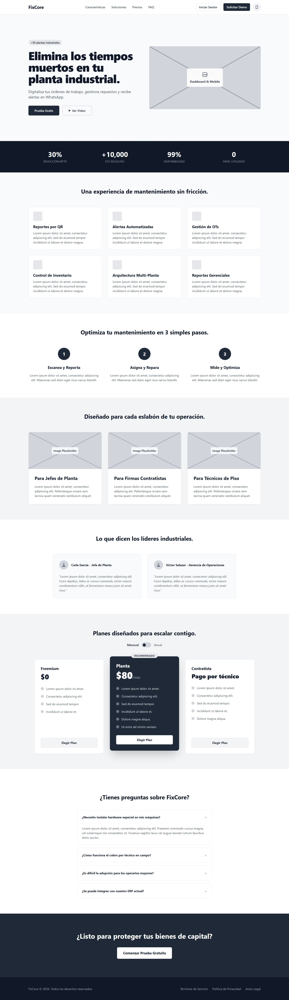<br>
  <em>Fuente: Elaboración propia.</em>
</div>

#### 4.3.1.3. wireframe Mobile
El wireframe mobile adapta la estructura desktop a formatos verticales:

<div align="center">
  <strong>Wireframe mobile del Landing de FixCore</strong><br><br>
  <br>
  <em>Fuente: Elaboración propia.</em>
</div>

#### 4.3.1.1. Introducción al Wireframe del Landing Page

El wireframe del Landing Page de FixCore establece la estructura fundamental y el flujo de persuasión B2B antes de la aplicación de la interfaz gráfica final (UI). Este esquema sirve como plano arquitectónico para definir la jerarquía de la información, guiando al visitante desde la propuesta de valor inicial en el *Hero Section* centrada en la reducción de tiempos muertos, pasando por la validación técnica (métricas de impacto y características del sistema), hasta los planes de suscripción y el llamado a la acción final (CTA).

El diseño del wireframe sigue el principio de "mobile-first" adaptando el flujo en una sola columna para operarios en campo, pero prioriza la presentación analítica en desktop, dado que el Landing Page busca maximizar conversiones corporativas. Los compradores objetivos (Jefaturas de Planta y Gerencias de Operaciones) evalúan y toman decisiones de adquisición de software SaaS principalmente desde pantallas grandes. El wireframe está diseñado para ser escalable, modular y mantener su efectividad en ambos formatos.

---

#### 4.3.1.4. Regiones del wireframe y su Función

A continuación se detalla cada región de los wireframes (Desktop y Mobile) según su función en el recorrido de conversión del usuario B2B:

**A. Header (Navegación Global)**
El header contiene la identidad de FixCore y las vías rápidas de contacto. En desktop es una barra horizontal persistente; en mobile se colapsa en un menú hamburguesa para ahorrar espacio en pantalla.
*   **Elementos:**
    *   Logo de FixCore (enlace al inicio).
    *   Navegación principal: Características, Soluciones, Precios, FAQ.
    *   Botones de acción (CTAs): "Iniciar Sesión" (Ghost button) y "Solicitar Demo" / "Prueba Gratis" (Botón sólido).
*   **Principios aplicados:** Posicionamiento estándar SaaS (login a la derecha) y máxima prominencia visual para el botón de conversión principal.

**B. Hero Section**
Es la primera impresión. Diseñado para enganchar inmediatamente al tomador de decisión mediante la promesa de valor central y apoyo visual de la plataforma.
*   **Elementos:**
    *   Badge superior de validación (ej. "+50 plantas industriales").
    *   Título principal (H1) orientado a la reducción de tiempos muertos.
    *   Subtítulo descriptivo sobre la digitalización de OTs.
    *   Bloque central inferior para un mockup de alta fidelidad (Dashboard de métricas + celular escaneando QR).
*   **Principios aplicados:** Estructura en "Z" invertida o bloque central para dirigir la mirada desde el texto directamente hacia la previsualización del producto y los botones de acción.

**C. Stats Section (Barra de Impacto)**
Una franja horizontal oscura que contrasta fuertemente para mostrar métricas duras.
*   **Elementos:** 4 bloques cuantitativos (ej. 30% reducción MTTR, +10,000 OTs, 99% disponibilidad, 0 papel). En mobile se apilan en formato 2x2 o 1x4.
*   **Principios aplicados:** Scaneo rápido de información, uso de números grandes para generar confianza inmediata y justificar el ROI del producto.

**D. Features Section (Características Principales)**
Desglosa el "cómo" lo hace a través de una grilla de funcionalidades de la plataforma.
*   **Elementos:** Grilla de 6 tarjetas (3x2 en desktop, 1x6 scrollable en mobile). Cada una incluye un placeholder para ícono, título (ej. "Reportes por QR", "Control de Inventario") y un texto breve.
*   **Principios aplicados:** Uniformidad visual, lectura en patrón de "F" y uso de iconografía para romper la monotonía del texto técnico.

**E. How It Works Section (Paso a Paso)**
Explica el flujo operativo del mantenimiento de forma simplificada.
*   **Elementos:** 3 columnas numeradas secuencialmente (1. Escanea y Reporta, 2. Asigna y Repara, 3. Mide y Optimiza).
*   **Principios aplicados:** Reducción de la carga cognitiva. Transformar un proceso industrial complejo en 3 pasos digeribles.

**F. Use Cases / Solutions Section (Soluciones por Perfil)**
Segmenta la propuesta de valor para los diferentes actores (Jefes de Planta vs. Contratistas).
*   **Elementos:** 3 tarjetas de gran tamaño. En desktop se distribuyen 2 arriba y 1 centrada abajo; en mobile se apilan verticalmente. Contienen placeholders para ilustraciones complejas.
*   **Principios aplicados:** *Targeting* visual. Permite que cada *User Persona* (Carla o Víctor) encuentre rápidamente la solución a sus dolores específicos.

**G. Pricing Section (Planes de Suscripción)**
Presenta el modelo de negocio (*Freemium*, *Planta*, *Contratista*).
*   **Elementos:** Un *toggle switch* superior (Mensual/Anual) y 3 tarjetas de precios. La tarjeta central es ligeramente más grande y destacada.
*   **Principios aplicados:** Efecto "Señuelo" (Decoy effect) y anclaje de precios. Destacar el plan intermedio o más rentable como la opción por defecto.

**H. FAQ Section (Preguntas Frecuentes)**
Resolución de objeciones B2B comunes antes del cierre.
*   **Elementos:** Lista tipo acordeón (collapsible) con preguntas sobre implementación, hardware, adopción de operarios y cobro por licencias.
*   **Principios aplicados:** Diseño expansible para mantener la página limpia y retener a los usuarios que buscan respuestas técnicas específicas.

**I. Bottom CTA & Footer**
El último esfuerzo de conversión y navegación secundaria.
*   **Elementos:** 
    *   Franja oscura con un título persuasivo ("¿Listo para proteger tus activos?").
    *   Botón central ("Comienza tu Prueba Gratuita").
    *   Footer: Logo, enlaces legales (Privacidad, Términos B2B), redes y soporte.
*   **Principios aplicados:** Contraste de fondo para "despertar" al usuario al final del scroll y aislar la decisión de compra.

---

#### 4.3.1.5. Principios de Diseño Aplicados en los Wireframes

El esquema estructural de FixCore se sostiene en los siguientes fundamentos UX/UI:

*   **Jerarquía Visual y Contraste:** Uso de bloques con fondos oscuros (Stats y Bottom CTA) intercalados con fondos claros para crear "cortes" naturales en la lectura y evitar la fatiga visual.
*   **Modularidad (Grid System):** Aplicación de un sistema de grillas estricto (12 columnas en desktop) que permite que los bloques de 3 (Features, How it works) y 2 (Testimonios) se redistribuyan perfectamente al hacer reflow en pantallas móviles (1 columna).
*   **Diseño Orientado a la Conversión (CRO):** Los llamados a la acción (CTAs) mantienen una ubicación estratégica y constante a lo largo de todo el recorrido (Header, Hero, Pricing, Bottom), reduciendo la fricción para solicitar la demo.
*   **Escalabilidad Mobile-First:** Elementos como el acordeón de FAQs y la barra de navegación se transforman en patrones nativos móviles (hamburguesa, menús desplegables) asegurando áreas táctiles de mínimo 44x44px.

### 4.3.2. Landing Page Mock-up. 

### 4.3.2. Landing Page Mock-up

Esta sección presenta y explica los Mock-ups (prototipos de alta fidelidad) del Landing Page de FixCore, tanto en su versión para Desktop Web Browser como Mobile Web Browser. En esta propuesta se evidencia la aplicación de los principios de diseño visual, accesibilidad y la arquitectura de información validada previamente en los wireframes, consolidando el Design System corporativo orientado al sector B2B (Mantenimiento Industrial).

#### 4.3.2.1. Introducción al Mock-up

El mock-up del Landing Page representa la implementación visual final del producto. Transforma el esquema estructural (Lo-Fi) aplicando los colores corporativos, tipografías, iconografía y espaciados definidos para crear una experiencia visual coherente que transmita confianza, modernidad y eficiencia operativa, valores centrales de FixCore.

#### 4.3.2.2. Mock-up Desktop

El mock-up desktop del Landing Page aplica los siguientes elementos del Design System para maximizar la conversión en pantallas grandes:

**Paleta de Colores Aplicada**
*   **Primary (Azul Brillante):** `#0ea5e9` (Aprox.)
    *   Utilizado en botones primarios principales (Hero Section, Iniciar Sesión), enlaces activos e iconografía clave.
*   **Corporate Dark (Azul Marino/Navy):** `#0f172a` (Aprox.)
    *   Utilizado para crear contrastes fuertes en secciones de alto impacto: Barra de Estadísticas (Stats), Tarjeta de Precio destacada ("Planta") y el Bottom CTA.
*   **Success Accent (Verde):** `#16a34a` (Aprox.)
    *   Utilizado estratégicamente en el botón final de conversión ("Comenzar Prueba Gratuita") y en los *checkmarks* de los planes de precios para indicar beneficios activos.
*   **Escala de Grises y Fondos:**
    *   Fondos principales: Blanco (White) y Gris muy claro (Gray-50) para separar secciones sutilmente.
    *   Texto: Gray-900 para títulos de alta jerarquía y Gray-600 para legibilidad en párrafos descriptivos.

**Tipografía Aplicada**
*   **Headings (Ej. Inter o Poppins)**
    *   H1: 48-64px ExtraBold - Título principal del Hero ("Elimina los tiempos muertos...").
    *   H2: 36-40px Bold - Títulos de sección centrados.
    *   H3: 20-24px SemiBold - Nombres de características y títulos de tarjetas.
*   **Body Text**
    *   Body: 16px Regular - Descripciones y párrafos.
    *   Small: 14px Regular - Elementos secundarios, navegación y *footers*.

**Componentes Visuales**
*   **Tarjetas (Cards):**
    *   Fondo: Blanco sólido para características y testimonios. Fondo oscuro degradado para los Casos de Uso.
    *   Bordes y Radio: Esquinas redondeadas (aprox. 12px a 16px) para suavizar la estética industrial.
    *   Sombra: Sombras sutiles (`shadow-sm` y `shadow-md`) para crear profundidad y separar los elementos del fondo gris claro.
*   **Botones:**
    *   Primario: Relleno azul, texto blanco, esquinas redondeadas.
    *   Secundario (Ghost): Texto gris oscuro, fondo transparente y borde sutil.
    *   Call to Action Final: Relleno verde vibrante para atraer la vista al final del recorrido.

#### 4.3.2.3. Mock-up Mobile

El mock-up mobile mantiene una estricta consistencia visual con la versión desktop, adaptando la experiencia de lectura y navegación a pantallas pequeñas (Mobile-first adaptativo):

**Adaptaciones Mobile**
*   **Diseño Responsive (Reflow):**
    *   El grid de contenido colapsa de 3 o 2 columnas a **1 sola columna vertical** (Features, Casos de Uso, Pricing).
    *   La barra de navegación horizontal desaparece y se condensa en un menú hamburguesa (Hamburger menu) ubicado en la esquina superior derecha.
    *   La barra de estadísticas (Stats) adapta sus 4 métricas a un grid de 2x2 para no hacer el scroll excesivamente largo y mantener los números legibles.
*   **Touch Targets (Zonas Táctiles):**
    *   Botones expandidos al 100% del ancho del contenedor (`w-full`) para facilitar el toque con una sola mano.
    *   Espaciado (padding) aumentado en el menú desplegable de las FAQs para evitar toques accidentales entre preguntas.
*   **Optimización Visual:**
    *   El mockup del Dashboard y el celular en el Hero Section se escala proporcionalmente y se centra debajo del texto principal.

#### 4.3.2.4. Vistas Detalladas por Sección

*   **Hero Section:** Fondo blanco limpio. Título alineado a la izquierda (en desktop) con fuerte contraste. Los botones de acción están agrupados ("Prueba Gratis" sólido y "Ver Video" con ícono). A la derecha, una composición gráfica en alta fidelidad de la plataforma.
*   **Stats Section:** Franja horizontal azul oscuro que rompe el fondo blanco. Números enormes en color blanco con subtítulos en azul brillante para rápida lectura de métricas clave (MTTR, OTs).
*   **Features Section:** Grilla limpia (3x2 en desktop). Cada tarjeta incluye un ícono azul minimalista en la parte superior izquierda, seguido de un título en negrita y un párrafo gris.
*   **Use Cases Section:** Tres tarjetas oscuras con ilustraciones integradas que rompen el patrón claro de la página, llamando la atención de los tres perfiles de comprador (Jefes, Contratistas, Técnicos).
*   **Pricing Section:** Destaca por el efecto anclaje. La tarjeta central (Plan Planta) es más alta y tiene fondo azul oscuro con texto blanco, forzando la atención visual hacia ella frente a las dos tarjetas blancas laterales.
*   **FAQ y Bottom CTA:** Preguntas frecuentes limpias con divisores grises delgados. El recorrido culmina en un bloque azul oscuro masivo que contiene un único botón verde brillante, creando el punto de mayor contraste de toda la página para forzar el clic final.

#### 4.3.2.5. Aplicación del Design System y Accesibilidad

El mock-up evidencia una aplicación madura de los principios de diseño para productos SaaS:
*   **Jerarquía y "Scannability":** Los usuarios pueden escanear la página leyendo solo los H2 (Títulos de sección centrados) y entender toda la propuesta de valor sin leer los párrafos pequeños.
*   **Diseño Inclusivo y Contraste:** El uso de texto blanco puro sobre los fondos azul oscuro (Navy) supera holgadamente los estándares de contraste WCAG AA, asegurando legibilidad incluso en monitores industriales con bajo brillo.
*   **Consistencia:** Los radios de los botones, las sombras de las tarjetas y los grosores de línea se repiten uniformemente a través de todas las secciones, generando confianza institucional.

#### 4.3.2.6. Referencias Visuales
Las siguiente referencias muestran el mock-up final:

**Desktop Homepage Mock-up**

<div align="center">
  <strong>Gráfico: Mock-up desktop del Landing de Fixcore</strong><br><br>
  <br>
  <em>Fuente: Elaboración propia.</em>
</div>

El mockup desktop muestra:

*   Hero section completo con mockup de la plataforma (Dashboard en monitor y escáner en móvil)
*   Barra de estadísticas oscura con 4 métricas clave
*   6 features cards en grid (distribución 3x2)
*   3 steps visuales numerados (Paso a paso)
*   3 tarjetas oscuras de casos de uso por perfil (distribución 2x1)
*   2 tarjetas de testimonios con avatares
*   3 tarjetas de planes de precios (con el plan central destacado)
*   Sección FAQ en formato acordeón
*   Bottom CTA section oscuro con botón de conversión final y footer

**Mobile Homepage Mock-up**

<div align="center">
  <strong>Gráfico: Mock-up mobile del Landing de Fixcore</strong><br><br>
  <br>
  <em>Fuente: Elaboración propia.</em>
</div>

El mockup mobile muestra:

*   Menú de navegación colapsado (Hamburger menu) para maximizar el espacio de visualización.
*   Hero section adaptado a formato vertical, priorizando la lectura (Texto > Botones CTA > Mockup de la plataforma).
*   Barra de estadísticas (Stats) reestructurada en un bloque apilado para lectura rápida sin scroll horizontal.
*   Grilla de 6 *Features cards* colapsada a una lista vertical de 1 columna.
*   Tarjetas de "Casos de Uso" y "Pasos" alineadas verticalmente ocupando el ancho completo (`w-full`) de la pantalla.
*   Tarjetas de "Planes de Precios" apiladas en scroll vertical, manteniendo el plan "Planta" con fondo oscuro visualmente destacado.
*   Sección FAQ optimizada para interacción táctil en formato acordeón de 1 columna.
*   Bottom CTA adaptado a la pantalla móvil con el botón verde de conversión principal centrado.

---

#### 4.3.2.7. Estados Interactivos en el Mock-up

Los mock-ups móviles también definen los estados interactivos de los componentes principales para asegurar un *feedback* táctil adecuado:

**Estados de Botón (CTAs)**
*   **Default:** Color de relleno sólido (Azul corporativo o Verde para el CTA final), con sombra sutil (`shadow-sm`).
*   **Touch/Hover:** Oscurecimiento leve del fondo y aumento de la sombra (`shadow-md`) para indicar interactividad.
*   **Active (Tap):** Escala ligeramente reducida (ej. `scale-95`) para proporcionar respuesta táctil inmediata al usuario al pulsar en la pantalla.
*   **Disabled:** Opacidad reducida al 50% e inhabilitación de eventos táctiles.

**Estados de Tarjeta (Features, Pricing y Casos de Uso)**
*   **Default:** Borde sutil o sombra media (`shadow-md`), esquinas redondeadas.
*   **Tap/Focus:** Sombra incrementada (`shadow-lg`) y leve elevación visual (`translateY(-4px)`).
*   **Transición:** Suave de `300ms ease-in-out` para evitar saltos bruscos en la interfaz móvil.

**Estados de Acordeón (FAQ)**
*   **Collapsed (Cerrado):** Pregunta visible, ícono de cruz (+) o flecha hacia abajo.
*   **Expanded (Abierto):** Ícono cambia a menos (-) o flecha hacia arriba, la respuesta se despliega con una animación suave, el título adopta un color azul activo para indicar su estado.

---

#### 4.3.2.8. Diseño Responsivo General

El mock-up aplica los principios de diseño responsivo *Mobile-First* a través de las siguientes configuraciones:

**Breakpoints Aplicados**
*   **Mobile:** 320px - 639px (Vista actual representada en el mock-up).
*   **Tablet:** 640px - 1023px.
*   **Desktop:** 1024px+.

**Comportamiento en Mobile (Reflow y Adaptación)**
*   **Stacking de Grids:** Todos los contenedores que en desktop eran de 2 o 3 columnas (Características, Casos de uso, Precios) se colapsan a 1 sola columna vertical.
*   **Ajuste Tipográfico:** Reducción proporcional de los tamaños de fuente (ej. el H1 del Hero baja de 56px a 36px o 40px) para evitar la fragmentación excesiva de palabras y mantener la legibilidad.
*   **Touch Targets (Zonas táctiles):** Expansión de los botones principales y enlaces del menú para que cumplan con la altura mínima recomendada de 44px a 48px, facilitando el uso con el pulgar.
*   **Alineación:** Transición de alineación izquierda (Desktop) a alineación centrada o de ancho completo (Mobile) para equilibrar el peso visual.

**Imágenes Responsivas y Rendimiento**
*   Uso de atributos `srcset` para cargar versiones reducidas de las ilustraciones y mockups en redes móviles.
*   Implementación de *Lazy Loading* (carga diferida) para las imágenes de las secciones inferiores (Casos de Uso, Testimonios) que se encuentran por debajo del *fold* (primera pantalla visual).

## 4.4. Web Applications UX/UI Design. 

### 4.4.1. Web Applications Wireframes. 

### 4.4.2. Web Applications Wireflow Diagrams. 

### 4.4.2. Web Applications Mock-ups. 

### 4.4.3. Web Applications User Flow Diagrams. 

## 4.5. Web Applications Prototyping. 

## 4.6. Domain-Driven Software Architecture. 

### 4.6.1. Design-Level EventStorming. 

Realizamos una sesión de Design-Level EventStorming tomando como punto de partida los resultados obtenidos en el Big Picture EventStorming. En esta etapa profundizamos en los principales procesos identificados del dominio de FixCore, detallamos los actores, comandos, aggregates, eventos de dominio, reglas de negocio y consultas involucrados en cada flujo. Esto nos ayudo a mejorar el modelo inicial, delimitar las responsabilidades del sistema y establecer una primera definición de los Bounded Contexts, buscando que cada uno mantenga una responsabilidad clara dentro de la arquitectura de la plataforma.

<div align="center">
  <strong>Gráfico 20:Design-Level EventStorming </strong><br><br>
  <br>
  <em>Fuente: Elaboración propia.</em>
</div>

### 4.6.2. Software Architecture Context Diagram. 

En esta sección se presenta el Diagrama de Contexto de FixCore, con el fin de mostrar el sistema desde una perspectiva general y su relación con los principales usuarios y sistemas externos. El diagrama permite identificar quiénes interactúan con FixCore y cuál es el propósito general de estas interacciones.Este diagrama muestra a FixCore como el sistema central para la gestión del mantenimiento industrial. El administrador de planta utiliza la plataforma para gestionar plantas, activos, actividades de mantenimiento y órdenes de trabajo.El tecnico la usa para reportar fallas, ejecutar ordenes y registrar actividades de mantenimiento,por ultimo qel Consultor Industrial coordina los servicios de mantenimiento y técnicos en las plantas. Además, FixCore se comunica con el Servicio de Notificaciones WhatsApp, un sistema externo encargado de enviar alertas y notificaciones importantes relacionadas con el mantenimiento.


<div align="center">
  <strong></strong><br><br>
  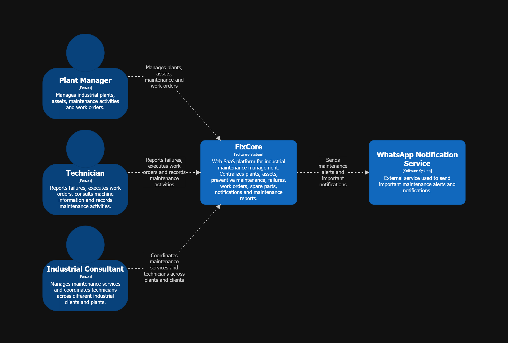<br>
  <em>Fuente: Elaboración propia.</em>
</div>

### 4.6.3. Software Architecture Container Diagrams. 

En esta sección se presenta el Container Diagram de FixCore, elaborado bajo el C4 Model donde intentamos mostrar los elementos principales de la arquitectura y como se distribuyen las responsabilidades entre ellos. El diagrama incluye la Aplicación Web, API REST, servicios especializados y sus respectivas bases de datos,tambien incluimos el servicio externo de notificaciones.Por ultimo,en el diagrama indicamos las principales decisiones tecnológicas y las formas de comunicación entre los containers mediante HTTPS, REST y JSON. Cada container representa una unidad de despliegue independiente, permitiendo organizar las funcionalidades de FixCore de acuerdo con sus responsabilidades.

<div align="center">
  <strong></strong><br><br>
  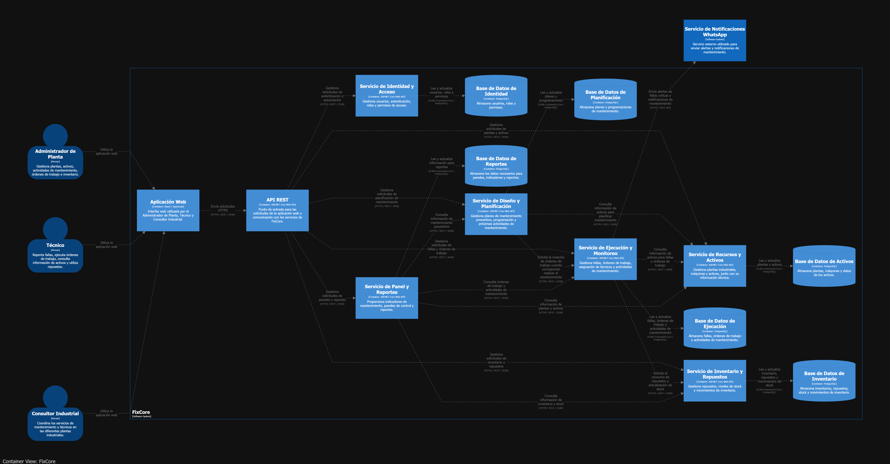<br>
  <em>Fuente: Elaboración propia.</em>
</div>

### 4.6.4. Software Architecture Components Diagrams. 

Ahora presentamos los Diagramas de Componentes de FixCore, desarrollados a partir de los containers definidos apartado anterior. Estos diagramas permiten profundizar en la estructura interna de cada container, identificando sus principales componentes, responsabilidades, relaciones e implementación tecnológica,estos nos ayuda a obtener una vision más detallada de como se organiza cada parte de la plataforma y como es que sus componentes colaboran para cumplir con las funcionalidades definidas para FixCore.

* **1.Diagrama de Componentes – Aplicación Web**

Este diagrama muestra la descomposición de la Aplicación Web de FixCore. Se presentan los componentes responsables de la navegación, autenticación, gestión de activos, mantenimiento preventivo, fallas y ordenes de trabajo, inventario, reportes y notificaciones. Los componentes utilizan un Cliente API para comunicarse con la API REST.
<div align="center">
  <strong></strong><br><br>
  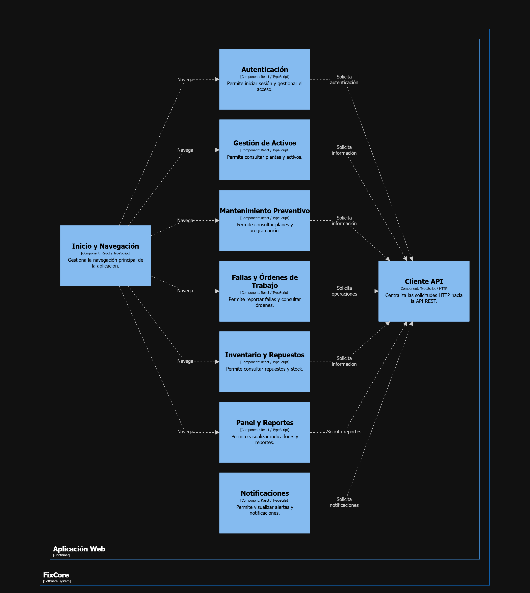<br>
  <em>Fuente: Elaboración propia.</em>
</div>


* **2.Diagrama de Componentes – API REST**

Este diagrama representa la estructura interna de la API REST de FixCore. Se muestran los controladores encargados de recibir y gestionar las solicitudes relacionadas con autenticación, usuarios, activos, mantenimiento, fallas, órdenes de trabajo, inventario y reportes, funcionando como punto de comunicación entre la Aplicación Web y los servicios del sistema.
<div align="center">
  <strong></strong><br><br>
  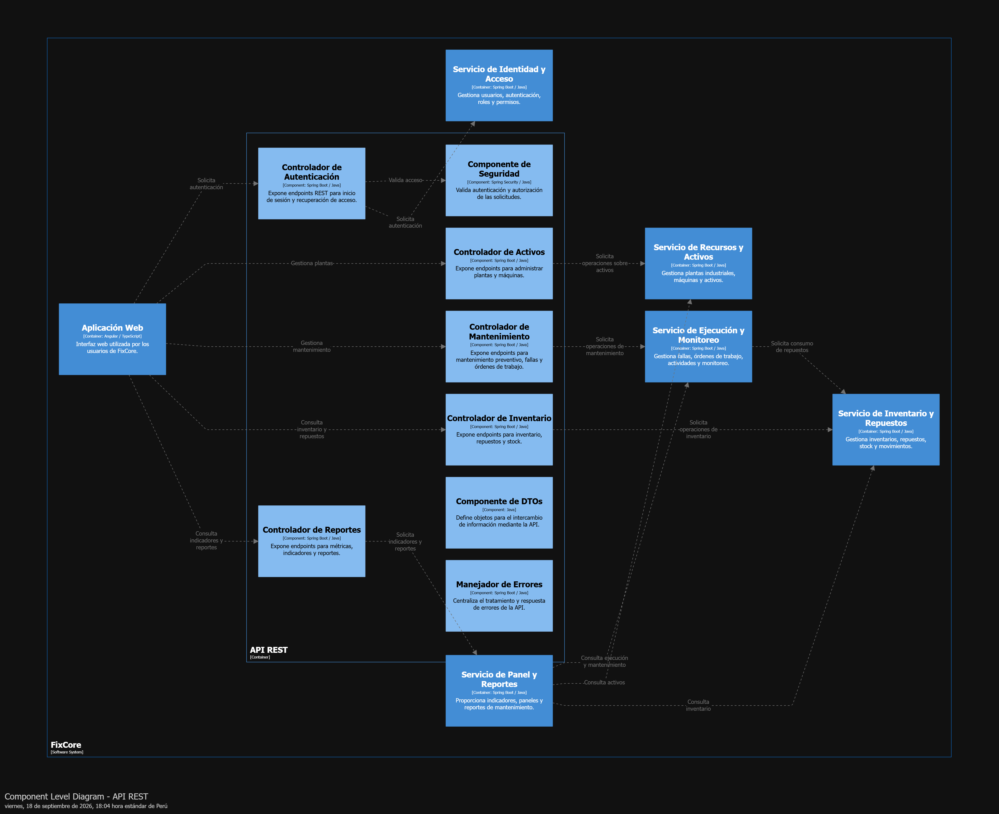<br>
  <em>Fuente: Elaboración propia.</em>
</div>

* **3.Diagrama de Componentes – Identidad y Acceso**

Este diagrama presenta los componentes encargados de la gestión de identidad y acceso en FixCore.Incluimos la autenticacion,gestión de usuarios, roles, permisos y recuperación de acceso, además del parte responsable de la persistencia de esta información en la Base de Datos de Identidad.

<div align="center">
  <strong></strong><br><br>
  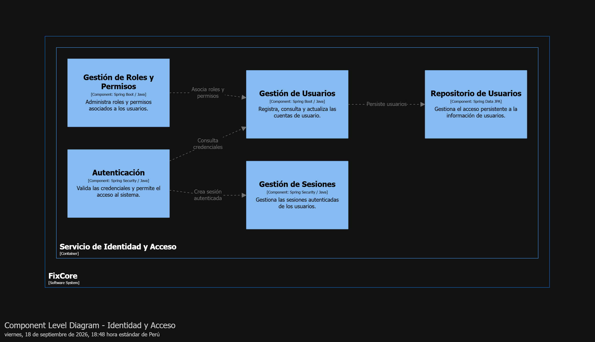<br>
  <em>Fuente: Elaboración propia.</em>
</div>


* **4.Diagrama de Componentes – Recursos y Activos**

Este diagrama muestra la descomposición del servicio encargado de administrar los recursos y activos industriales. Sus componentes permiten gestionar plantas, activos, fichas técnicas, manuales e historial de los activos, utilizando un repositorio para almacenar y consultar la información correspondiente.

<div align="center">
  <strong></strong><br><br>
  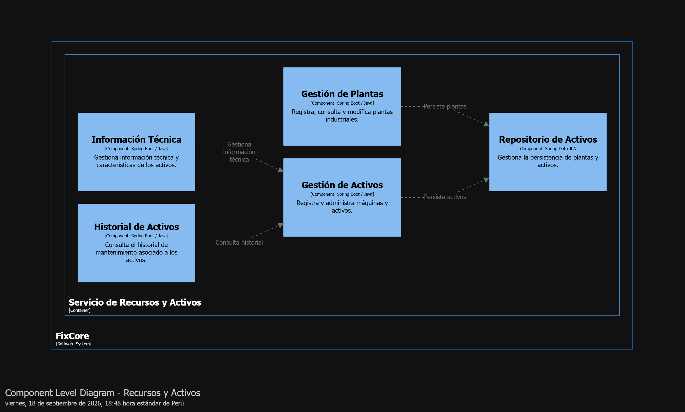<br>
  <em>Fuente: Elaboración propia.</em>
</div>

* **5.Diagrama de Componentes – Diseño y planificacion**

Este diagrama representa los componentes relacionados con el diseño y planificación del mantenimiento preventivo. Incluye la gestion de planes, programacion, reprogramacion, calendario y control de vencimientos. El repositorio de planificacion permite almacenar y consultar la informacion necesaria para gestionar las actividades programadas.

<div align="center">
  <strong></strong><br><br>
  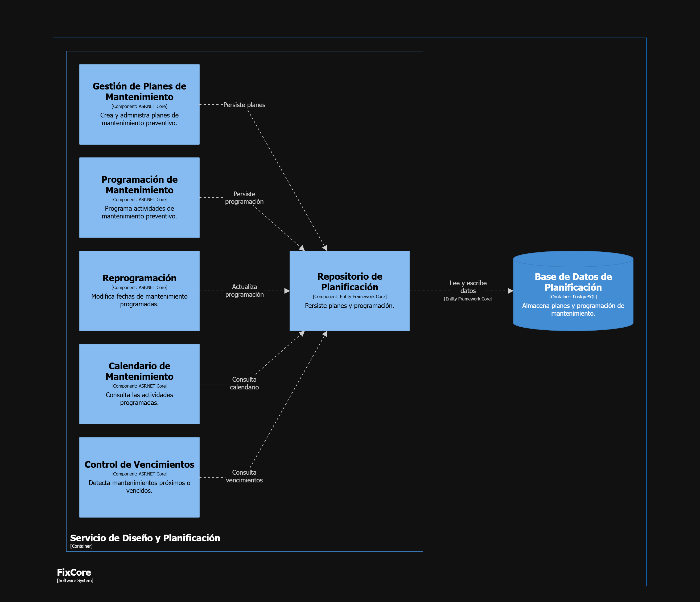<br>
  <em>Fuente: Elaboración propia.</em>
</div>

* **6.Diagrama de Componentes – Ejecución y Monitoreo**

Este diagrama muestra los componentes principales para la ejecucion del mantenimiento en FixCore. Incluye la gestion de fallas,ordenes de trabajo, cuando se asigna un tecnico, la ejecucion, registro de actividades, cierre y gestión de alertas. Tambien se incorpora el cliente de notificaciones WhatsApp y el repositorio encargado de persistir la información de ejecucion.

<div align="center">
  <strong></strong><br><br>
  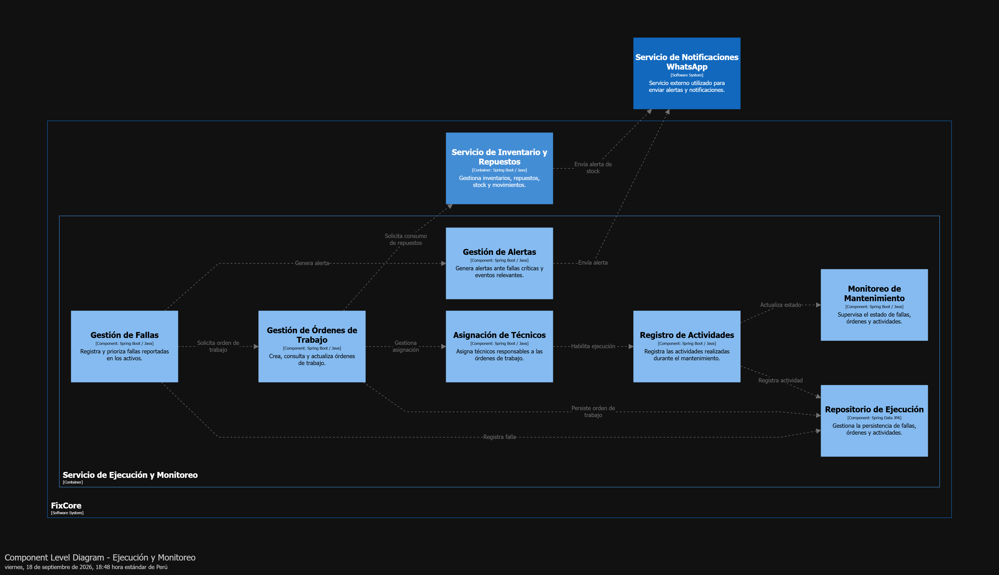<br>
  <em>Fuente: Elaboración propia.</em>
</div>

* **7.Diagrama de Componentes – Inventario y Repuestos**

Este diagrama representa los componentes responsables de administrar el inventario y los repuestos que se usaron en las actividades de mantenimiento. Incluye la gestion de inventario,control de stock, consumo, movimientos y alertas de stock, ademas de la persistencia de datos.

<div align="center">
  <strong></strong><br><br>
  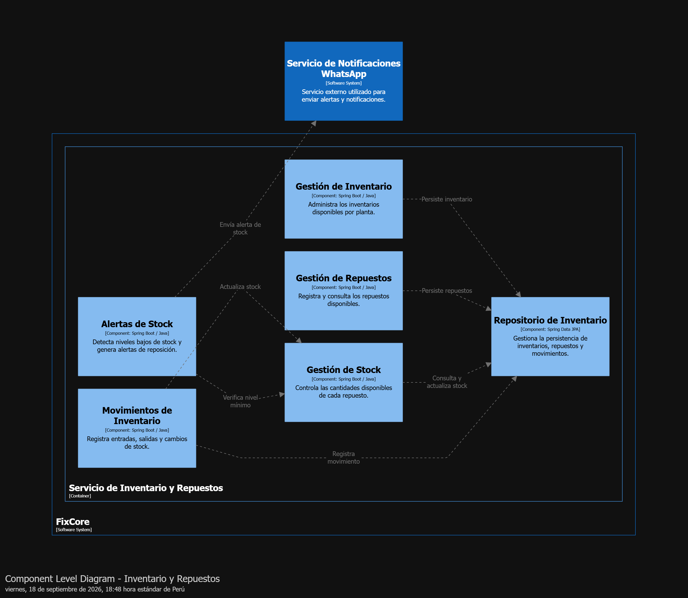<br>
  <em>Fuente: Elaboración propia.</em>
</div>

* **8.Diagrama de Componentes – Panel y Reportes**

Este diagrama muestra la estructura interna del servicio encargado de proporcionar información para el analisis,sus componentes permiten consultar KPIs, metricas de mantenimiento y operativas, desempeño de técnicos, generar reportes y preparar la informacion para el panel de control.

<div align="center">
  <strong></strong><br><br>
  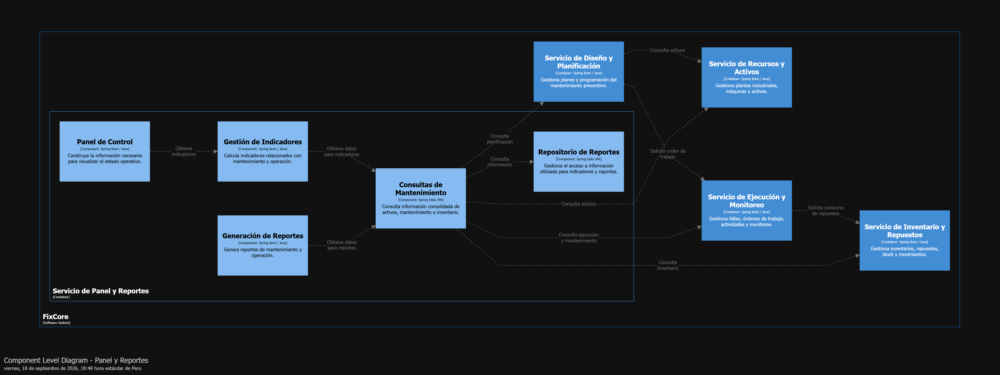<br>
  <em>Fuente: Elaboración propia.</em>
</div>

## 4.7. Software Object-Oriented Design. 

En esta sección se presenta el diseño orientado a objetos de FixCore, detallando la estructura de sus principales elementos de software y su organización dentro de los bounded contexts que se definieron.

### 4.7.1. Class Diagrams. 

Se presentan los diagramas de clases UML de cada bounded context, mostrando sus clases, interfaces, enumeraciones, atributos, métodos, visibilidad y relaciones, con el fin de representar con mayor detalle la estructura del sistema.

#### 4.7.1.1. Class Diagram – Identity & Access Management

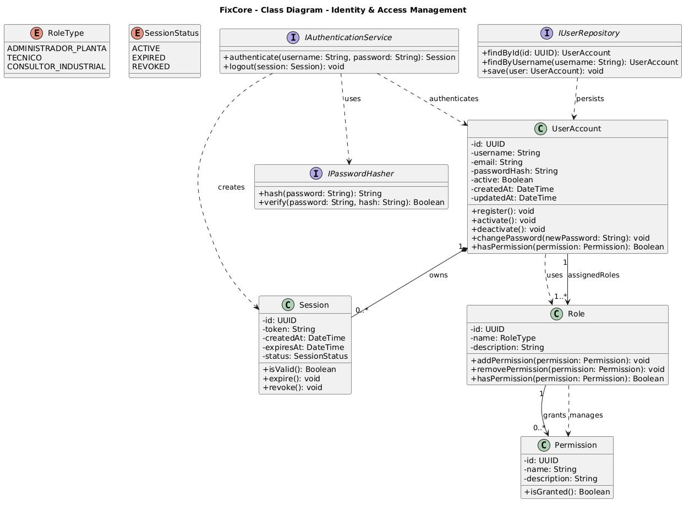

#### 4.7.1.2. Class Diagram – Resource & Asset Management

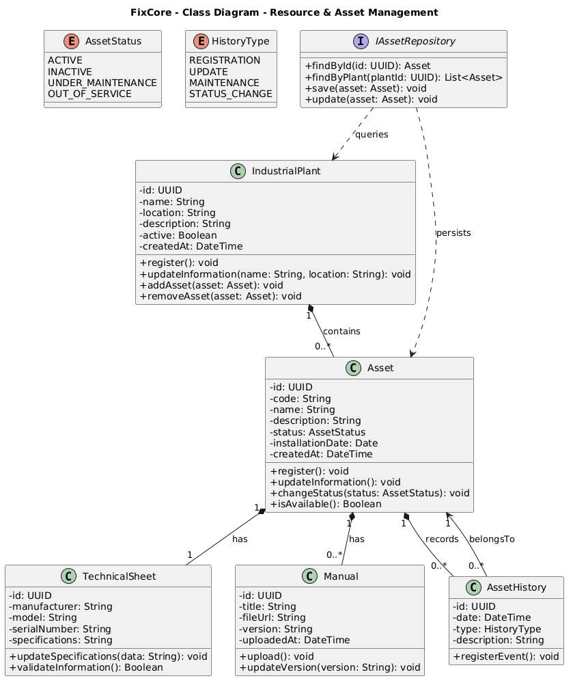
#### 4.7.1.3. Class Diagram – Service Design & Planning

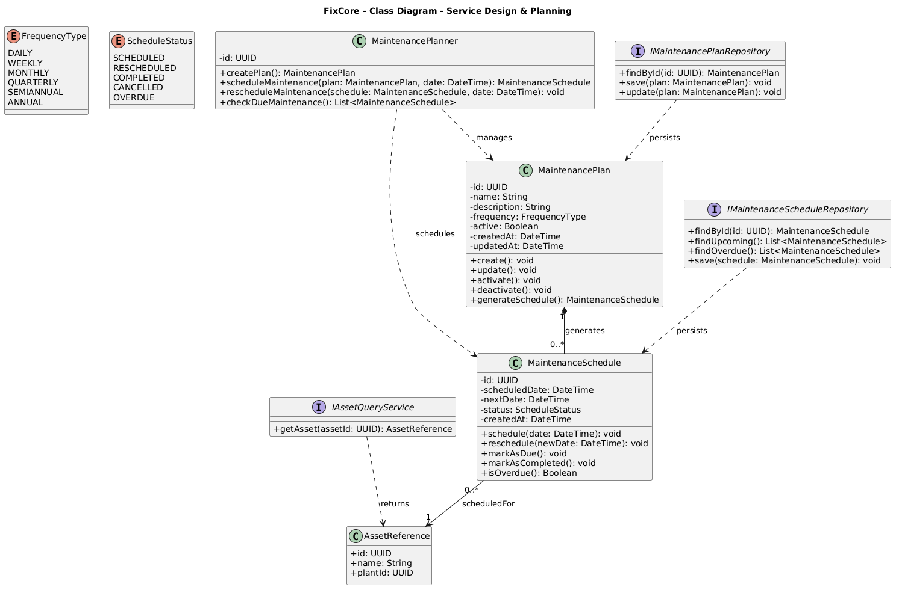

#### 4.7.1.4. Class Diagram – Service Execution & Monitoring

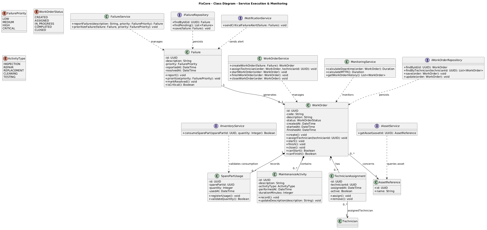

#### 4.7.1.5. Class Diagram – Inventory & Spare Parts Management

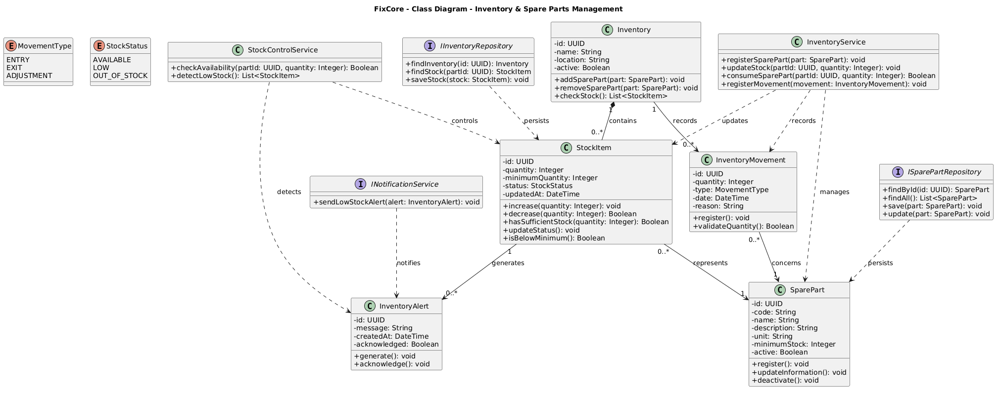


## 4.8. Database Design. 

En esta sección presentamos el diseño de las bases de datos de FixCore para cada Bounded Context, considerando la estructura necesaria para la persistencia de la información. Los diagramas muestran las principales tablas, columnas, claves primarias, claves foráneas, restricciones y relaciones entre las entidades de cada contexto.

### 4.8.1. Database Diagrams. 

En este apartado mostramos los Database Diagrams correspondientes a cada Bounded Context, detallando las tablas y sus relaciones para representar como se almacenara y organizara la informacion de FixCore en una base de datos relacional.

#### 4.8.1.1. Database Diagram – Identity & Access Management

<div align="center">
  <strong></strong><br><br>
  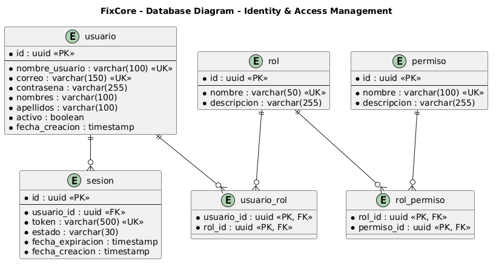<br>
  <em>Fuente: Elaboración propia.</em>
</div>

#### 4.8.1.2. Database Diagram – Resource & Asset Management

<div align="center">
  <strong></strong><br><br>
  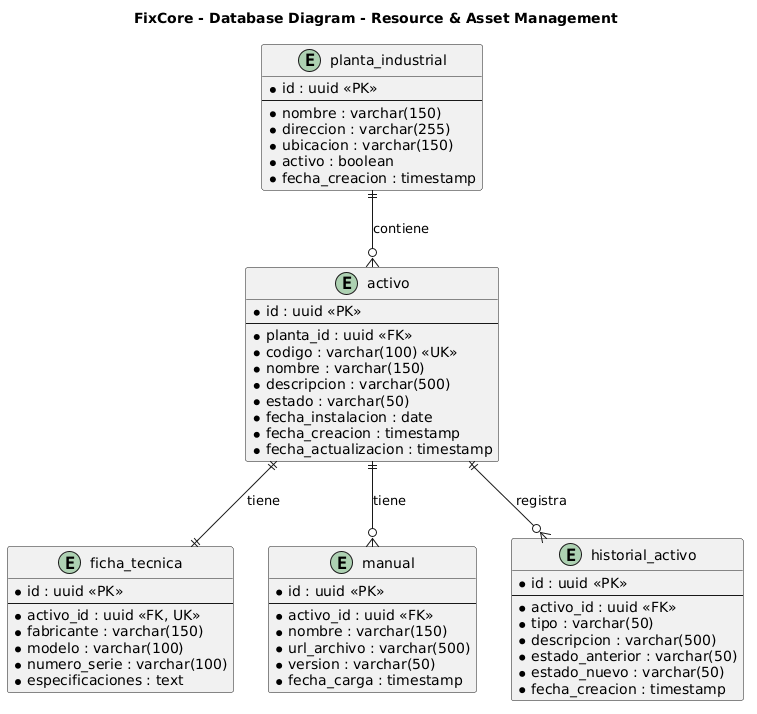<br>
  <em>Fuente: Elaboración propia.</em>
</div>

#### 4.8.1.3. Database Diagram – Service Design & Planning

<div align="center">
  <strong></strong><br><br>
  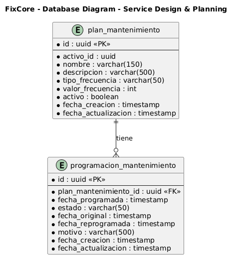<br>
  <em>Fuente: Elaboración propia.</em>
</div>

#### 4.8.1.4. Database Diagram – Service Execution & Monitoring

<div align="center">
  <strong></strong><br><br>
  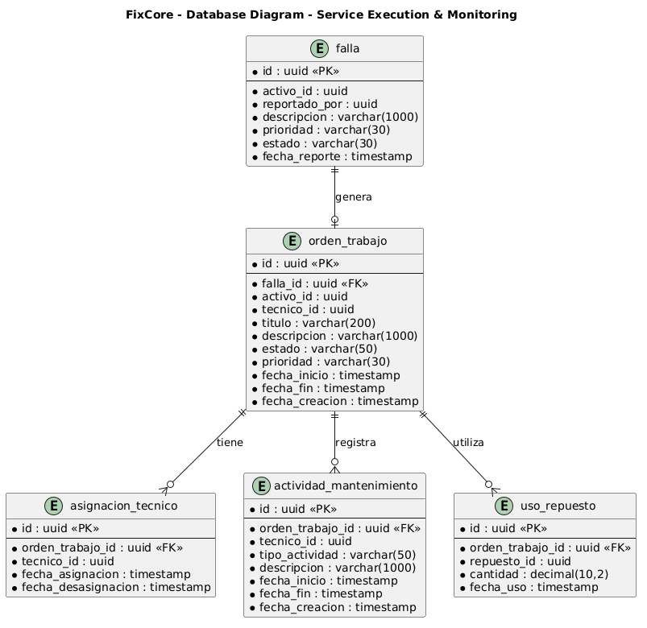<br>
  <em>Fuente: Elaboración propia.</em>
</div>

#### 4.8.1.5. Database Diagram – Inventory & Spare Parts Management

<div align="center">
  <strong></strong><br><br>
  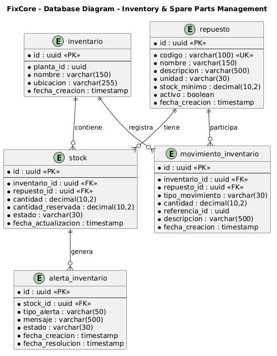<br>
  <em>Fuente: Elaboración propia.</em>
</div>


# Capítulo V: Product Implementation, Validation & Deployment  

## 5.1. Software Configuration Management. 

### 5.1.1. Software Development Environment Configuration. 

En esta sección se presentan las herramientas usadas por los integrantes del equipo durante el desarrollo del proyecto, considerando cada tipo de actividades realizadas.

**Project Management**

Esta sección corresponde a los productos usados para la administración de proyecto, así como la comunicación entre integrantes.

|Producto|Proposito de uso|Ruta de referencia|
|:-------|:---------------|:-----------------|
|Trello| Organización de las actividades del proyecto, seguimiento de tareas y gestión del Product Backlog|https://trello.com/b/yJyuiOSO
|GitHub|Alojamiento de repos, control de versiones y revision de código mediante Pull Requests|https://github.com/TechMakers-upc/Report|
||||

**Requirements Management** 

En esta sección se presentan los productos usados para la gestión de los requisitos del proyecto.

|Producto|Proposito de uso|Ruta de referencia|
|:-------|:---------------|:-----------------|
|Uxpressia|Elaboración de User Personas, User Journey Maps, Empathy Maps y otras herramientas utilizadas para identificar y analizar las necesidades, problemas y características de los usuarios del proyecto| https://uxpressia.com/w/v8FzI/t/zbzV3|
|Figjam|Elaboración colaborativa del Big Picture y Design-Level EventStorming para el modelado de dominio|https://www.figma.com/board/fFAW94zEsw4HGJnAICg41F/TechMakers-EventStorming?node-id=0-1&t=UzKfOfmFc1j0e5H7-1|
|Trello|Gestión y organización del Product Backlog, historias de usuario|https://trello.com/b/yJyuiOSO|
||||

**Product UX/UI Design** 

A continuación se presentan los productos utilizados para el diseño de interfaces y de experiencia del usuario.

|Producto|Proposito de uso|Ruta de referencia|
|:-------|:---------------|:-----------------|
|Figma|Diseño de wireframes,mockups,prototipos|
||||

**Software Development** 

En esta sección se encuentran las herramientas usadas por los integrantes del equipo para el desarrollo del software relacionado al proyecto.

|Producto|Proposito de uso|Ruta de referencia|
|:-------|:---------------|:-----------------|
|Visual Studio Code |Usado para el desarrollo de la Landing Page|https://code.visualstudio.com/
|Git|Control de versiones|https://git-scm.com/
||||

**Software Deployment** 

Aca se presentan los productos usados para el despliegue de nuestros productos de software.

|Producto|Proposito de uso|Ruta de referencia|
|:-------|:---------------|:-----------------|
||||

**Software Documentation**

A continuación se presentan los productos utilizados para documentar el software del proyecto.

|Producto|Proposito de uso|Ruta de referencia|
|:-------|:---------------|:-----------------|
||||

### 5.1.2. Source Code Management. 

Para administrar los cambios realizados en los distintos ambitos de nuestro proyecto, usamos la plataforma GitHub, en la cual creamos una organización con repositorios correspondientes a cada entregable.

Enlace de la organización: [https://github.com/TechMakers-upc](https://github.com/TechMakers-upc)  

Enlace del repositorio del informe: [https://github.com/TechMakers-upc/Report](https://github.com/TechMakers-upc/Report)  

Enlace del repositorio de la Landing Page: [https://github.com/TechMakers-upc/Landing-Page](https://github.com/TechMakers-upc/Landing-Page)

Además, usamos el flujo de trabajo conocido como "GitFlow".


### 5.1.3. Source Code Style Guide & Conventions. 

Para el desarrollo de la solución, el equipo ha adoptado de forma estricta el uso del idioma inglés para toda la nomenclatura del código fuente. Esta aplica a la definición de variables, interfaces, clases, métodos, nombres de archivos y comentarios técnicos dentro de los lenguajes utilizados: HTML, CSS, JavaScript, TypeScript y Java.
A fin de asegurar la calidad, mantenibilidad y legibilidad del código a lo largo del ciclo de vida del proyecto, se han establecido las siguientes convenciones y guías de estilo para cada tecnología:

* HTML y CSS: Se siguen las directrices de la "HTML Style Guide and Coding Conventions" y la "Google HTML/CSS Style Guide". Esto asegura una estructura semántica clara, el uso de selectores óptimos y un código visualmente limpio.

* JavaScript: La lógica y manipulación general del DOM en el Landing Page se rige por las mejores prácticas establecidas en la "Google JavaScript Style Guide" y las convenciones estándar de MDN/W3C, garantizando consistencia y rendimiento.

* Frontend Framework: Para el desarrollo de las Frontend Web Applications, se adopta la "Angular Coding Style Guide" y la "Google TypeScript Style Guide". Estas guías establecen las convenciones fundamentales para la estructuración de componentes, el tipado estricto y la inyección de dependencias.

* Web Services: La construcción de la API RESTful orientada a servicios se rige bajo la "Google Java Style Guide" y las características de "Spring Boot Features". Esto estandariza el uso de PascalCase para clases e interfaces, camelCase para métodos y atributos, y define las convenciones de arquitectura para los repositorios de Spring Data JPA.

* Especificaciones de Requisitos: La redacción de los escenarios y criterios de aceptación en las historias de usuario se estandariza utilizando las "Gherkin Conventions for Readable Specifications", aplicando sistemáticamente la estructura de comportamiento de negocio Given-When-Then.

### 5.1.4. Software Deployment Configuration. 


## 5.2. Landing Page, Services & Applications Implementation. 

### 5.2.1. Sprint 1 
En esta sección registramos y explicamos el avance del equipo durante el Sprint 1, tanto en términos del desarrollo del producto en este caso el Landing Page,como en el trabajo colaborativo. El objetivo central de esta iteración fue la construcción y despliegue del sitio web estático que presenta el modelo de negocio de FixCore  
#### 5.2.1.1. Sprint Planning 1. 

<div align="center">
<table border="1">
  <tr>
    <th> Sprint #
    </th>
    <th> Sprint 1
    </td>
  </tr>
  <tr>
    <th> Sprint Planning Background
    </th>
  </tr>

  <tr>
    <th> Date
    </th>
    <td> 2026-09-11
    </td>
  </tr>

  <tr>
    <th> Time
    </th>
    <td> 7:00 PM - 8:PM
    </td>
  </tr>

  <tr>
    <th> Location
    </th>
    <td> Discord
    </td>
  </tr>

  <tr>
    <th> Prepared By
    </th>
    <td> Alvar Lucas Córdova 
    </td>
  </tr>

  <tr>
    <th> Attendees
    </th>
    <td> Sunio Danilo Landa Sánchez<br>Giuseppe Adrián Villanueva Rodríguez<br>Diego Rances Rojas Huaranga<br>Pierre Alessandro Mendoza Boluarte
    </td>
    
  </tr>

  <tr>
    <th colspan="2"> Sprint Goal & User Stories
    </th>
  </tr>

  <tr>
    <th> Sprint 1 Goal
    </th>
    <td> 
    <b>Our focus is on</b> deploying a clear, responsive, and functional Landing Page that effectively presents the core benefits of the FixCore industrial maintenance platform.<br><br>
      <b>We believe it delivers</b> a professional first impression and increases trust by providing clear value propositions to our target segments: Plant Managers, Technicians, and Industrial Consultants.<br><br>
      <b>This will be confirmed when</b> the landing page is successfully deployed and visitors can navigate
    </td>
  </tr>

  <tr>
    <th> Sprint 1 Velocity
    </th>
    <td> 11
    </td>
  </tr>

  <tr>
    <th> Sum of Story Points
    </th>
    <td> 11
    </td>
  </tr>
</table>
</div>

#### 5.2.1.2. Aspect Leaders and Collaborators. 

A continuación se presenta la Leadership And Collaboration Matrix elaborada para el desarrollo de este Sprint.

Los aspectos que se tomarán en cuenta son:

- Aspect 1:
- Aspect 2:
- ...

|Team Member |GitHub Username|Aspect 1:  | Aspect 2:  |  ... |
|:-----------|:--------------|----|----|----|

#### 5.2.1.3. Sprint Backlog 1. 

El principal objetivo de este sprint fue el desarrollo de la Landing Page (...)

Enlace al tablero publico en Trello: 

<div align="center">
<table border="1">
  <tr>
    <th>Sprint #</th>
    <th colspan="7">Sprint 1</th>
  </tr>
  <tr>
    <th colspan="2">User Story</th>
    <th colspan="6">Work Item / Task</th>
  </tr>
  <tr>
    <th>Story ID</th>
    <th>Story Title</th>
    <th>Task ID</th>
    <th>Task Title</th>
    <th>Task Description</th>
    <th>Estimation (hours)</th>
    <th>Assigned To</th>
    <th>Status</th>
  </tr>

  <tr>
    <td rowspan="2"></td>
    <td rowspan="2"></td>
    <td></td>
    <td></td>
    <td></td>
    <td></td>
    <td></td>
    <td></td>
  </tr>
  <tr>
    <td></td>
    <td></td>
    <td></td>
    <td></td>
    <td></td>
    <td></td>
  </tr>

  <tr>
    <td rowspan="2"></td>
    <td rowspan="2"></td>
    <td></td>
    <td></td>
    <td></td>
    <td></td>
    <td></td>
    <td></td>
  </tr>
  <tr>
    <td></td>
    <td></td>
    <td></td>
    <td></td>
    <td></td>
    <td></td>
  </tr>
</table>
</div>

#### 5.2.1.4. Development Evidence for Sprint Review. 

Los principales avances en la implementación durante este sprint fueron (...)

|Repository|Branch|Commit Id|Commit Message|Commit Message Body|Commited on|
|:---------|:-----|:--------|:-------------|:------------------|:----------|
|||||||

#### 5.2.1.5. Execution Evidence for Sprint Review. 

Los avances realizados durante este Sprint fueron (...)

**Capturas de pantalla de los avances realizados**


**Enlace al video de visualización y navegación:**

#### 5.2.1.6. Services Documentation Evidence for Sprint Review. 


#### 5.2.1.7. Software Deployment Evidence for Sprint Review. 


#### 5.2.1.8. Team Collaboration Insights during Sprint. 

A continuación se presentan los aportes realizados por todos los integrantes del grupo.

# Conclusiones 

# Bibliografía 

# Anexos
