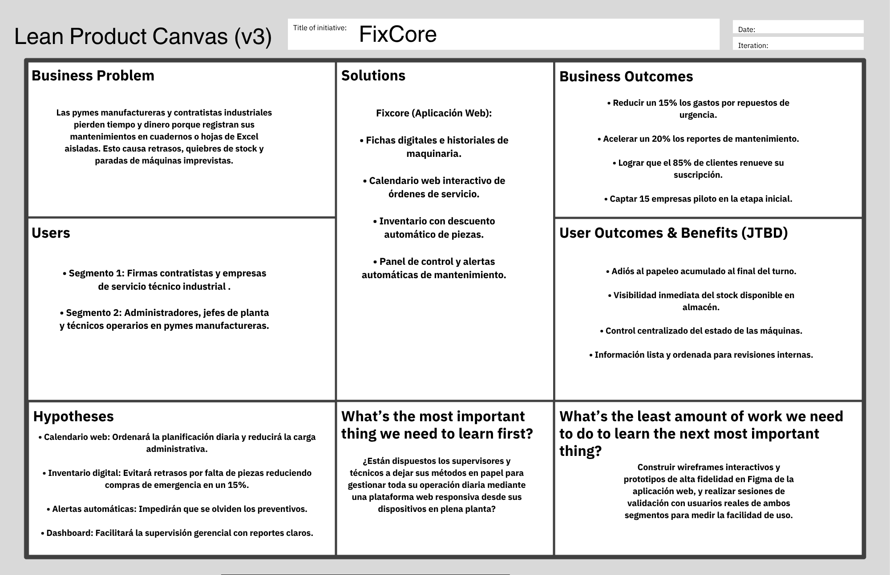

## Universidad Peruana de Ciencias Aplicadas

**Facultad:** Ingeniería

**Carrera:** Ingeniería de Software 

**Ciclo:** 2026-20

**Curso:** 1ASI0729 - Desarrollo de Aplicaciones Open Source

**NRC:** 16692

**Profesor:** Ángel Augusto Velásquez Núñez

**"Informe de Trabajo Final"**

**Startup:** TechMakers

**Producto:** FixCore

**Relación de integrantes:**

| Integrante                              | Código      |
|-----------------------------------------|-------------|
|Alvar Lucas Córdova                      |u202324461   |
|Sunio Danilo Landa Sánchez               |u202423973   |
|Giuseppe Adrián Villanueva Rodríguez     |u20221c554   |
|Diego Rances Rojas Huaranga              |u20241E096   |
|Pierre Alessandro Mendoza Boluarte       |u202320973   |

**Setiembre, 2026**

# Registro de Versiones del Informe 

|Versión|Fecha|Autor|Fecha de modificación|
|:------|:----|:----|:--------------------|
|||||

# Project Report Collaboration Insights 

# Contenido 

## Tabla de contenidos 
- [Registro de Versiones del Informe](#registro-de-versiones-del-informe)
- [Project Report Collaboration Insights](#project-report-collaboration-insights)
- [Contenido](#contenido)
  - [Tabla de contenidos](#tabla-de-contenidos)
- [Student Outcome](#student-outcome)
- [Capítulo I: Introducción](#capítulo-i-introducción)
  - [1.1. Startup Profile](#11-startup-profile)
    - [1.1.1. Descripción de la Startup](#111-descripción-de-la-startup)
    - [1.1.2. Perfiles de integrantes del equipo](#112-perfiles-de-integrantes-del-equipo)
  - [1.2. Solution Profile](#12-solution-profile)
    - [1.2.1 Antecedentes y problemática](#121-antecedentes-y-problemática)
    - [1.2.2 Lean UX Process.](#122-lean-ux-process)
      - [1.2.2.1. Lean UX Problem Statements.](#1221-lean-ux-problem-statements)
      - [1.2.2.2. Lean UX Assumptions.](#1222-lean-ux-assumptions)
      - [1.2.2.3. Lean UX Hypothesis Statements.](#1223-lean-ux-hypothesis-statements)
      - [1.2.2.4. Lean UX Canvas.](#1224-lean-ux-canvas)
  - [1.3. Segmentos objetivo.](#13-segmentos-objetivo)
- [Capítulo II: Requirements Elicitation \& Analysis](#capítulo-ii-requirements-elicitation--analysis)
  - [2.1. Competidores.](#21-competidores)
    - [2.1.1. Análisis competitivo.](#211-análisis-competitivo)
    - [2.1.2. Estrategias y tácticas frente a competidores.](#212-estrategias-y-tácticas-frente-a-competidores)
  - [2.2. Entrevistas.](#22-entrevistas)
    - [2.2.1. Diseño de entrevistas.](#221-diseño-de-entrevistas)
    - [2.2.2. Registro de entrevistas.](#222-registro-de-entrevistas)
    - [2.2.3. Análisis de entrevistas.](#223-análisis-de-entrevistas)
  - [2.3. Needfinding.](#23-needfinding)
    - [2.3.1. User Personas.](#231-user-personas)
    - [2.3.2. User Task Matrix.](#232-user-task-matrix)
    - [2.3.3. User Journey Mapping.](#233-user-journey-mapping)
    - [2.3.4. Empathy Mapping.](#234-empathy-mapping)
  - [2.4. Big Picture EventStorming.](#24-big-picture-eventstorming)
  - [2.5. Ubiquitous Language.](#25-ubiquitous-language)
- [Capítulo III: Requirements Specification](#capítulo-iii-requirements-specification)
  - [3.1. User Stories.](#31-user-stories)
  - [3.2. Impact Mapping.](#32-impact-mapping)
  - [3.3. Product Backlog.](#33-product-backlog)
- [Capítulo IV: Product Design](#capítulo-iv-product-design)
  - [4.1. Style Guidelines.](#41-style-guidelines)
    - [4.1.1. General Style Guidelines.](#411-general-style-guidelines)
    - [4.1.2. Web Style Guidelines.](#412-web-style-guidelines)
  - [4.2. Information Architecture.](#42-information-architecture)
    - [4.2.1. Organization Systems.](#421-organization-systems)
    - [4.2.2. Labeling Systems.](#422-labeling-systems)
    - [4.2.3. SEO Tags and Meta Tags](#423-seo-tags-and-meta-tags)
    - [4.2.4. Searching Systems.](#424-searching-systems)
    - [4.2.5. Navigation Systems.](#425-navigation-systems)
  - [4.3. Landing Page UI Design.](#43-landing-page-ui-design)
    - [4.3.1. Landing Page Wireframe.](#431-landing-page-wireframe)
    - [4.3.2. Landing Page Mock-up.](#432-landing-page-mock-up)
  - [4.4. Web Applications UX/UI Design.](#44-web-applications-uxui-design)
    - [4.4.1. Web Applications Wireframes.](#441-web-applications-wireframes)
    - [4.4.2. Web Applications Wireflow Diagrams.](#442-web-applications-wireflow-diagrams)
    - [4.4.2. Web Applications Mock-ups.](#442-web-applications-mock-ups)
    - [4.4.3. Web Applications User Flow Diagrams.](#443-web-applications-user-flow-diagrams)
  - [4.5. Web Applications Prototyping.](#45-web-applications-prototyping)
  - [4.6. Domain-Driven Software Architecture.](#46-domain-driven-software-architecture)
    - [4.6.1. Design-Level EventStorming.](#461-design-level-eventstorming)
    - [4.6.2. Software Architecture Context Diagram.](#462-software-architecture-context-diagram)
    - [4.6.3. Software Architecture Container Diagrams.](#463-software-architecture-container-diagrams)
    - [4.6.4. Software Architecture Components Diagrams.](#464-software-architecture-components-diagrams)
  - [4.7. Software Object-Oriented Design.](#47-software-object-oriented-design)
    - [4.7.1. Class Diagrams.](#471-class-diagrams)
  - [4.8. Database Design.](#48-database-design)
    - [4.8.1. Database Diagrams.](#481-database-diagrams)
- [Capítulo V: Product Implementation, Validation \& Deployment](#capítulo-v-product-implementation-validation--deployment)
  - [5.1. Software Configuration Management.](#51-software-configuration-management)
    - [5.1.1. Software Development Environment Configuration.](#511-software-development-environment-configuration)
    - [5.1.2. Source Code Management.](#512-source-code-management)
    - [5.1.3. Source Code Style Guide \& Conventions.](#513-source-code-style-guide--conventions)
    - [5.1.4. Software Deployment Configuration.](#514-software-deployment-configuration)
  - [5.2. Landing Page, Services \& Applications Implementation.](#52-landing-page-services--applications-implementation)
    - [5.2.1. Sprint 1](#521-sprint-1)
      - [5.2.1.1. Sprint Planning 1.](#5211-sprint-planning-1)
      - [5.2.1.2. Aspect Leaders and Collaborators.](#5212-aspect-leaders-and-collaborators)
      - [5.2.1.3. Sprint Backlog 1.](#5213-sprint-backlog-1)
      - [5.2.1.4. Development Evidence for Sprint Review.](#5214-development-evidence-for-sprint-review)
      - [5.2.1.5. Execution Evidence for Sprint Review.](#5215-execution-evidence-for-sprint-review)
      - [5.2.1.6. Services Documentation Evidence for Sprint Review.](#5216-services-documentation-evidence-for-sprint-review)
      - [5.2.1.7. Software Deployment Evidence for Sprint Review.](#5217-software-deployment-evidence-for-sprint-review)
      - [5.2.1.8. Team Collaboration Insights during Sprint.](#5218-team-collaboration-insights-during-sprint)
- [Conclusiones](#conclusiones)
- [Bibliografía](#bibliografía)
- [Anexos](#anexos)

# Student Outcome 

 
 

  

 
 

## 1.1. Startup Profile

### 1.1.1. Descripción de la Startup

TechMakers es una startup desarrollada por un grupo de estudiantes de Ingeniería de Software que tienen como objetivo crear soluciones tecnológicas que puedan ayudar a mejorar la forma en que trabajan distintos negocios. La idea de este proyecto surge al tener en cuenta cómo se realizan actualmente algunas actividades de mantenimiento en empresas del sector industrial. En muchos casos el control de estas actividades todavía se realiza mediante cuadernos, pizarras o archivos de Excel.

Esta forma de trabajar puede dificultar el acceso y seguimiento de la información ya que cuando no se cuenta con un registro adecuado de los mantenimientos podría ocurrir que una actividad como el mantenimiento no sea realizada en la fecha que se debía hacer. Esto aumenta la posibilidad de que una máquina presente algún problema inesperado, generando interrupciones en la producción y gastos que podrían evitarse con una mejor planificación.

Es por esto que se creó **FixCore**, la propuesta consiste en reunir en una misma plataforma la información y las actividades relacionadas con el mantenimiento de los equipos industriales. Una de las características principales de Fixcore es la posibilidad de contar con un registro digital de cada activo. En este registro se puede almacenar información como la marca, el modelo y los manuales correspondientes, de modo que los técnicos puedan consultar la información cuando sea necesaria.

### Misión

La misión de TechMakers es ofrecer a empresas manufactureras y contratistas una herramienta que facilite la organización de sus actividades de mantenimiento. Mediante Fixcore se busca centralizar la información para mejorar la programación de los mantenimientos y llevar un mejor control de los repuestos contribuyendo así a reducir las interrupciones a causa de problemas en los equipos.

### Visión

La visión de TechMakers es conseguir que Fixcore se convierta progresivamente en una alternativa reconocida en el Perú para la gestión de mantenimientos industriales. El proyecto busca aprovechar las ventajas de las tecnologías para ofrecer una plataforma que pueda adaptarse al crecimiento de las empresas y que contribuya a digitalizar procesos que actualmente se realizan de forma manual.

### 1.1.2. Perfiles de integrantes del equipo

| Integrante | Descripcion | 
| :--- | :--- | 
|  | | 
|  |  | 
|  |Mendoza Boluarte Pierre (u202320973) | 
|  | | 
|  |  | 

## 1.2. Solution Profile 

### 1.2.1 Antecedentes y problemática 

Para entender el contexto de Fixcore, analizamos la situación del sector manufacturero en el Perú el cual es un pilar fundamental para la economía que necesita optimización constante. Según datos del Instituto Nacional de Estadística e Informática (INEI), en el año 2023 el sector manufactura contribuyó con un 12,2 % al Producto Bruto Interno (PBI) nacional, sin embargo este sector experimentó una disminución del 6,6 % en su producción durante ese mismo año haciendo que las empresas industriales busquen mayor eficiencia y reducir sobrecostos operativos. Una de las principales vías para lograrlo es la modernización de la gestión de sus activos físicos. Investigaciones como la de la firma consultora McKinsey & Company demuestran que el pasar de un modelo de mantenimiento reactivo a enfoques preventivos y predictivos permite reducir los costos generales de mantenimiento entre un 18 % y un 25 %.También se podemos decir que la implementación de estas tecnologías logran disminuir el tiempo de inactividad no planificado hasta en un 50 %.
Aunque el impacto positivo de la digitalización es notoria apreciamos que los contratistas de servicios técnicos y los administradores de pymes industriales sufren graves fricciones en su operación diaria. El problema se centra en las dificultades para gestionar eficientemente las programaciones de mantenimiento y el inventario de repuestos necesarios. Esto pasa porque la gran mayoría sigue empleando métodos como cuadernos de cargo, pizarras o herramientas digitales como hojas de Excel, que no brindan soporte adecuado a un modelo de negocio que puede escalar. Al no contar con un sistema especializado las fechas de servicio preventivo caducan sin previo aviso, se sufre de falta de stock en piezas clave y los equipos fallan de repente. Entonces esta carencia de control provoca paradas de emergencia en las líneas de producción lo que eleva drásticamente los costos de reparación y afecta la rentabilidad de las empresas involucradas.

---
### Técnica de The 5 'W's y 2 'H's

| Pregunta | Formulación | Respuesta |
| :--- | :--- | :--- |
| **Who?** | ¿Quienes son los afectados? | Firmas contratistas de servicio técnico industrial y dueños o administradores de Pymes del sector manufacturero. |
| **What?** | ¿Cual es el problema? | Dificultades para planificar fechas de mantenimiento y controlar el inventario de repuestos debido al uso de registros manuales y sistemas desconectados. |
| **Where?** | ¿Dónde ocurre? | En plantas de producción, fábricas, talleres industriales, negocios con equipamiento industrial en el Perú. |
| **When?** | ¿Cuando se hace la evidencia? | Durante la operación diaria, especialmente cuando caduca la fecha de revisión de una máquina y puede llegar a ocurrir una falla imprevista o se requiere un repuesto urgente que no está en almacén a falta de stock que no se previó anteriormente. |
| **Why?** | ¿Por qué ocurre? | Porque dependen de cuadernos de cargo, pizarras y hojas de excel, lo que impide generar alertas automáticas, rastrear el historial técnico y sincronizar el inventario. |
| **How?** | ¿Cómo se manifiesta? | A través de paradas de planta no planificadas a causa de máquinas paralizadas sin previo aviso por fallas técnicas, falta de stock de piezas críticas y desorganización en las visitas de los técnicos. |
| **How Much?** | ¿Cuál es la magnitud? | Las paradas de emergencia y fallas imprevistas pueden llegar a paralizar líneas enteras de producción, lo que genera sobrecostos operativos no esperados, por reparaciones reactivas que impactan directamente en la rentabilidad de los afectados. |

---

### 1.2.2 Lean UX Process. 

#### 1.2.2.1. Lean UX Problem Statements. 

El estado actual del mantenimiento industrial se ha centrado principalmente en contratistas de servicio técnico y pymes manufactureras que aún dependen de cuadernos de cargo, pizarras acrílicas o tablas de Excel aisladas para programar sus revisiones y controlar los repuestos utilizados. Lo que los productos y servicios actuales no logran resolver es una plataforma web accesible y adaptable que unifique la programación preventiva de los equipos con el control de inventario y el seguimiento operativo, sin requerir implementaciones de software costosas o complejas. Nuestro producto abordará esta brecha mediante Fixcore, una aplicación web SaaS intuitiva que centraliza los perfiles técnicos de la maquinaria, ofrece un calendario interactivo de mantenimientos, automatiza alertas de vencimiento y descuenta repuestos en tiempo real. Nuestro enfoque inicial serán las firmas contratistas de mantenimiento industrial y los administradores de planta en pymes manufactureras. Sabremos que tenemos éxito cuando al menos el 75% de los operarios utilice la aplicación web desde sus dispositivos durante su turno, los clientes reduzcan sus paradas de máquina no planificadas en al menos un 30% y los quiebres de stock de repuestos críticos disminuyan en un 25%.

#### 1.2.2.2. Lean UX Assumptions. 

**Business Assumptions**
* Creemos que nuestros clientes necesitan dejar de usar cuadernos y hojas de cálculo porque la información se pierde o desactualiza, y requieren un historial centralizado de sus máquinas.
* Estas necesidades se pueden resolver con una aplicación web moderna donde cada máquina tenga su propia ficha técnica digital accesible de forma rápida.
* Nuestros clientes iniciales son los jefes de mantenimiento de fábricas y los dueños de empresas que prestan servicios tecnicos.
* El valor principal que un cliente busca es evitar paradas imprevistas en la línea de producción y tener control total sobre sus activos físicos.
* El cliente también se beneficiará al poder ver de forma ágil el rendimiento de sus técnicos y los costos de reparación asociados.
* Conseguiremos clientes ofreciendo pruebas piloto directas en una línea de producción de sus instalaciones para demostrar el valor de la plataforma.
* Ganaremos dinero cobrando una suscripción mensual (SaaS) escalonada según la cantidad de equipos o sucursales registradas en el sistema.
* Nuestra competencia principal son los programas tipo ERP (que son muy costosos y complejos de implementar) y los registros manuales tradicionales en papel o Excel. 
* Los venceremos ofreciendo una interfaz web especializada en flujos de servicio técnico, rápida de desplegar y muy fácil de usar en el día a día.
* Nuestro mayor riesgo de producto es que los técnicos tengan pantallas de celular pequeñas y la plataforma web se vuelva incómoda de leer o usar en la planta. 
* Resolveremos esto aplicando un diseño web adaptable usando botones grandes y contrastes claros para que cargue perfecto en cualquier navegador móvil o de escritorio.

**Business Outcome Assumptions**
* Creemos que el gasto en repuestos de emergencia bajará un 15% porque el sistema web avisará con tiempo qué piezas se están agotando.
* Creemos que los técnicos completarán sus reportes un 20% más rápido al no tener que transcribir documentos de papel al final del día.
* Creemos que el 85% de los clientes renovará su suscripción mensual tras ver el orden operativo en sus talleres.

**User Assumptions**
* **¿Quién es el usuario?** El supervisor o jefe de mantenimiento, que organiza la programación y el técnico operario que consulta tareas y reporta desde la planta.
* **¿Dónde encaja nuestro producto?** En la rutina diaria del taller y de la planta de producción, sirviendo como la bitácora oficial y centralizada del negocio.
* **¿Qué problemas tiene?** La falta de alertas en las revisiones y el desconocimiento del stock real de piezas.
* **¿Cuándo y cómo es usado?** De manera continua durante los turnos de trabajo mediante navegadores web desde PCs, tablets o smartphones.
* **¿Qué características son importantes?** Calendario interactivo, perfiles digitales de máquinas, control de repuestos y notificaciones automáticas.
* **¿Cómo debe verse?** Una interfaz web limpia, moderna, con navegación intuitiva y diseñada bajo los estándares para facilitar la lectura.

**User Outcome and Benefit Assumptions**
* Creemos que los jefes quieren organizar mejor las tareas para evitar el pago excesivo de horas extras por emergencias.
* Creemos que los técnicos quieren saber si hay un repuesto disponible en el almacén sin tener que caminar largas distancias para preguntar.
* Creemos que los dueños quieren reportes web automáticos para conocer el estado de sus equipos sin revisar cuadernos físicos.
* Creemos que todos los involucrados quieren eliminar los errores causados por documentos extraviados o ilegibles.

**Feature Assumptions**
* El calendario interactivo permitirá visualizar y reasignar mantenimientos diarios de manera ágil.
* Los perfiles de maquinaria digitalizarán manuales, marcas y modelos en una vista centralizada.
* El módulo de inventario actualizará las existencias automáticamente al cerrar una orden de servicio.
* El sistema de notificaciones enviará alertas antes de que caduquen las fechas de revisión preventiva.
* El panel principal (Dashboard) mostrará métricas y resúmenes gráficos del estado de las operaciones.

#### 1.2.2.3. Lean UX Hypothesis Statements. 

* **Hipótesis 1:** Creemos que reduciremos las compras de emergencia en un 15% si los jefes de mantenimiento obtienen alertas automáticas cuando un repuesto se está acabando con el módulo de control de inventario en tiempo real.
* **Hipótesis 2:** Creemos que los técnicos reportan sus trabajos un 20% más rápido si los operarios de campo obtienen un acceso inmediato a las fichas técnicas y manuales desde cualquier dispositivo con la aplicación web adaptable.
* **Hipótesis 3:** Creemos que lograremos una alta adopción de la plataforma si el personal técnico obtiene un flujo de trabajo simplificado para registrar reparaciones sin escribir de más con las órdenes de trabajo digitales de la interfaz web.
* **Hipótesis 4:** Creemos que el 85% de las empresas se quedarán con nosotros si los dueños y gerentes obtienen reportes claros sobre el comportamiento de sus máquinas con el panel de control analítico de la plataforma.

#### 1.2.2.4. Lean UX Canvas. 

  
<b>Gráfico 1</b>: Lean UX Canvas FixCore

  

*Fuente: Elaboración propia.*

## 1.3. Segmentos objetivo. 

> **Segmento 1: Pymes de Manufactura y Producción**

* **Segmento objetivos:** Jefes de planta, coordinadores de producción y gerentes de mantenimiento interno en pequeñas y medianas empresas del sector manufacturero.
* **Descripción:** Unidades productivas que dependen de la disponibilidad continua de su maquinaria (como envasadoras, tornos o fajas transportadoras). Su necesidad principal es reducir los tiempos de inactividad, solicitar asistencia técnica de forma inmediata y llevar un control sobre sus equipos para evitar paradas de emergencia en su línea de producción.
* **Edad:** 30 a 55 años.
* **Sexo:** Hombres y mujeres.
* **Ubicación:** Sectores de actividad industrial y fábricas a nivel nacional, abarcando cualquier planta que cuente con conectividad a internet para plataformas web.
* **Formación educativa:** Estudios técnicos industriales, Ingeniería Industrial o profesionales con formación basada en la experiencia para la supervisión de líneas de producción.
* **Poder adquisitivo:** Medio y Medio-alto.
* **Clase social:** B y C.
* **Datos de sustento:** Durante el último año, el sector manufacturero peruano experimentó una contracción del 6,65 % en su producción; sin embargo, la inversión en bienes de capital (compra de nueva maquinaria) aumentó cerca de un 8 % (INEI, 2024). Este escenario obliga a las fábricas a proteger su nueva inversión, maximizando la vida útil de sus máquinas y reduciendo al mínimo los gastos por fallas imprevistas mediante plataformas de gestión centralizada.

> **Segmento 2: Firmas Consultoras y Contratistas de Ingeniería Industrial**

* **Segmento objetivos:** Dueños, gerentes de operaciones o supervisores de planificación en empresas proveedoras de servicios de consultoría, mantenimiento industrial y reparación de maquinaria.
* **Descripción:** Organizaciones B2B dedicadas a ejecutar planes de mantenimiento preventivo y correctivo para terceros. Requieren centralizar la asignación de técnicos en campo, gestionar inventarios de repuestos y asegurar el cumplimiento de sus tiempos de atención mediante herramientas digitales que eliminen el uso de papel.
* **Edad:** 35 a 60 años.
* **Sexo:** Hombres y mujeres.
* **Ubicación:** Zonas industriales, parques empresariales y polos de desarrollo a nivel nacional, con operaciones tanto en oficinas como en campo.
* **Formación educativa:** Titulados técnicos o profesionales en Ingeniería Industrial, Ingeniería Mecánica o Administración, generalmente con experiencia en gestión de activos.
* **Poder adquisitivo:** Medio-alto y Alto.
* **Clase social:** A y B.
* **Datos de sustento:** Según un estudio de McKinsey Global Institute (2015), la transición hacia modelos de mantenimiento preventivo soportados por herramientas digitales permite a las firmas consultoras y contratistas reducir los costos de reparación entre un 18 % y un 25 %. Además, la digitalización incrementa la productividad de los técnicos en campo, lo que genera una demanda directa de software especializado (SaaS) que reemplace las hojas de cálculo tradicionales para poder atender a más fábricas a la vez.

# Capítulo II: Requirements Elicitation & Analysis 

## 2.1. Competidores. 

**1. Fracttal**
- Plataforma CMMS 100% en la nube y móvil, muy consolidada en el mercado hispanohablante. Ofrece gestión de activos y mantenimiento predictivo con módulos de IoT. Sin embargo, sus planes de pago y la complejidad de implementación inicial pueden ser barreras de entrada para pymes industriales que buscan soluciones inmediatas.

**2. UpKeep**
- Solución de mantenimiento *"mobile-first"* diseñada específicamente para facilitar el trabajo del técnico en campo. Agiliza la creación de órdenes de trabajo mediante una interfaz sencilla. No obstante, carece de la profundidad necesaria para integraciones corporativas complejas con ERPs en industrias de gran escala.

**3. IBM Maximo**
- Software líder mundial en gestión de activos empresariales (EAM). Es extremadamente potente y personalizable, ideal para corporaciones gigantes con operaciones críticas. Su principal debilidad radica en sus altísimos costos de licencia, infraestructura pesada y una curva de aprendizaje muy pronunciada.

---

### 2.1.1. Análisis competitivo. 

| ¿Por qué llevar a cabo este análisis? | El objetivo de este análisis es identificar las fortalezas, debilidades, oportunidades y amenazas del entorno competitivo en el sector de software CMMS, con el fin de definir la ventaja competitiva de nuestro sistema frente a las alternativas existentes y orientar las estrategias de diferenciación e innovación. |
| :--- | :--- |

| **Competidores** | &nbsp; | **FixCore**   | **Fracttal**   | **UpKeep**   | **IBM Maximo**   |
| :--- | :--- | :--- | :--- | :--- | :--- |
| **Perfil** | **Overview** | Sistema integral de gestión de mantenimiento industrial, enfocado en escalabilidad, arquitectura moderna y automatización de procesos. | Plataforma CMMS/EAM basada en la nube y enfocada en IoT y movilidad para mantenimiento predictivo. | Solución móvil (mobile-first) para agilizar la gestión de órdenes de trabajo de técnicos en campo. | EAM robusto a nivel empresarial para operaciones críticas e industrias de gran envergadura. |
| &nbsp; | **Ventaja competitiva** | Arquitectura backend de alto rendimiento, flujos automatizados de alertas en tiempo real y modelo de adopción de baja fricción. | Ecosistema de IoT integrado y fuerte presencia en el mercado de habla hispana. | Extrema facilidad de uso y curva de adopción casi nula para el usuario final (técnicos). | Capacidad de personalización ilimitada y potencia para manejar millones de activos. |
| **Perfil de Marketing** | **Mercado objetivo** | Firmas de ingeniería industrial, empresas de manufactura y flotas que buscan digitalizar su mantenimiento sin costos excesivos. | Medianas y grandes empresas de mantenimiento industrial y facilities que requieren digitalización formal. | Pymes y equipos de campo que necesitan digitalizar órdenes de trabajo rápidamente. | Corporaciones globales, mineras, petroleras y plantas de manufactura masiva. |
| &nbsp; | **Estrategias de marketing** | Demostraciones técnicas, alianzas con consultoras de ingeniería industrial y enfoque open-core / freemium. | Inbound marketing corporativo, webinars, y difusión de casos de éxito B2B. | Posicionamiento en tiendas de apps, SEO agresivo y pruebas gratuitas autogestionadas. | Ventas directas corporativas (Enterprise Sales) y red global de partners integradores. |
| **Perfil de Producto** | **Productos & Servicios** | Gestión de activos, órdenes de trabajo, alertas interactivas vía webhooks, reportes de KPI y APIs abiertas. | CMMS completo, módulo IoT, integración ERP, exámenes y reportes avanzados. | App móvil de gestión de tareas, escaneo de códigos QR, inventario básico. | Gestión del ciclo de vida de activos, predictivo con IA, control de inventarios complejos. |
| &nbsp; | **Precios & costos** | Modelo freemium: acceso básico gratuito/open-source y planes premium para módulos analíticos. | Pago por usuario (medio a alto). | Suscripción por licencia de usuario (bajo a medio). | Licenciamiento empresarial extremadamente alto y costos de implementación. |
| &nbsp; | **Canales** | Web responsive y app móvil (Android/iOS). | Web y app móvil (Android/iOS). | Principalmente app móvil (iOS/Android) y Web. | Implementación in-situ (On-premise) o nube corporativa. |
| **Análisis SWOT** | **Fortalezas** | Backend escalable; fácil integración con automatizaciones externas; costos competitivos. | Solución muy madura; ecosistema IoT nativo; contenido validado en el sector. | Interfaz intuitiva; alta usabilidad; adopción rápida por los operarios en terreno. | Poder absoluto de procesamiento de datos; IA integrada; respaldo global corporativo. |
| &nbsp; | **Debilidades** | Marca nueva en el mercado; necesidad de construir casos de éxito iniciales. | Curva de aprendizaje media; soporte técnico a veces lento en planes bajos; alto costo. | Falta de funciones empresariales profundas y gestión financiera de activos. | Complejidad excesiva; inalcanzable para pymes; requiere consultoría extensa. |
| &nbsp; | **Oportunidades** | Gran segmento de pymes con procesos manuales; integrar simuladores de fallas. | Expansión global y mejora de sus algoritmos de predicción. | Añadir módulos de IA sencillos para predecir fallas; ampliar idiomas. | Migración de empresas tradicionales a la nube híbrida y modernización. |
| &nbsp; | **Amenazas** | Competidores establecidos con mayores presupuestos; desconfianza inicial. | Surgimiento de startups más ágiles y económicas. | Soluciones completas que bajen sus precios y ofrezcan mejores interfaces. | Softwares modernos que ofrezcan 80% de sus funciones por 10% del precio. |
---

### 2.1.2. Estrategias y tácticas frente a competidores. 

| Estrategia / Táctica | Descripción |
| :--- | :--- |
| **Arquitectura de Alto Rendimiento** | Desarrollar una infraestructura backend sólida que garantice escalabilidad y procesamiento ágil de datos de maquinaria sin caídas. |
| **Automatización de Notificaciones** | Integrar automatizaciones (mediante webhooks o plataformas como n8n) para crear flujos de trabajo que envíen alertas de fallas y órdenes directamente al técnico, reduciendo tiempos muertos. |
| **Modelo Freemium** | Ofrecer un núcleo de gestión básico gratuito para que las empresas prueben la herramienta sin riesgo financiero, monetizando a través de módulos avanzados (analítica, integraciones complejas). |
| **Alianzas Estratégicas B2B** | Colaborar con consultoras de ingeniería industrial y programas académicos para que integren el sistema en sus proyectos, validando la plataforma frente a clientes finales. |
| **Innovación en UX** | Diseñar una interfaz web y móvil minimalista que requiera la menor cantidad de clics posibles para reportar una falla, ofreciendo una experiencia de usuario única frente a los sistemas tradicionales sobrecargados. |

## 2.2. Entrevistas. 

### Guía de preguntas para Pymes de Manufactura y Producción

* ¿Cuál es tu nombre, edad y qué cargo ocupas en la planta?
* ¿A qué sector industrial pertenece la empresa y, aproximadamente, cuántas máquinas principales operan?
* ¿Cómo gestionan actualmente el reporte de fallas de maquinaria y las órdenes de trabajo (ej. Excel, papel, grupos de WhatsApp, pizarras)?
* ¿Qué dispositivos utilizan más los operarios y técnicos durante su turno en planta (smartphones personales, tablets de la empresa, radios)?
* ¿Qué tan frecuente es que una máquina sufra tiempos muertos (downtime) debido a una mala comunicación o lentitud al reportar la falla?
* ¿Cuáles son las mayores frustraciones que enfrentas al intentar consolidar la información de mantenimiento a fin de mes?
* ¿Has intentado implementar algún software de mantenimiento anteriormente? Si es así, ¿cuál fue el resultado o la principal barrera de adopción por parte de los técnicos?
* ¿Qué elemento te generaría más confianza para adoptar un nuevo sistema: la facilidad de uso para el operario, la automatización de alertas, o el costo de implementación?
* ¿Cómo crees que impactaría en la productividad si los técnicos pudieran reportar una falla en menos de 3 clics desde su celular?
* ¿Qué tan útil te resultaría recibir notificaciones automáticas de fallas críticas directamente en tu WhatsApp?
* Si existiera una versión básica gratuita (modelo freemium) para probar el sistema con algunas máquinas, ¿te animarías a implementarlo en tu planta?
* Una vez comprobado el valor del sistema, ¿cuánto estarías dispuesto a pagar mensualmente por módulos avanzados y analítica de datos (rango en dólares o soles)?

### Guía de preguntas para Firmas Consultoras y Contratistas de Ingeniería Industrial

* ¿Podría indicarme su nombre, cargo y el tipo de servicios de ingeniería o mantenimiento que brinda su empresa?
* ¿A cuántas plantas industriales o clientes prestan servicio de manera simultánea?
* ¿Cómo coordinan actualmente el despliegue de sus técnicos en campo cuando un cliente reporta una emergencia o falla en sus equipos?
* Desde su experiencia operativa, ¿cuáles son las mayores limitaciones logísticas o tecnológicas que enfrentan para atender múltiples plantas a la vez?
* ¿Qué tan complejo les resulta estandarizar los reportes de mantenimiento y KPIs para entregárselos a diferentes clientes?
* ¿Suelen utilizar herramientas de automatización de flujos de trabajo o integración de APIs en sus operaciones diarias?
* ¿Qué funcionalidades considera indispensables en una plataforma digital para que decida utilizarla como el motor operativo de todos sus técnicos (ej. webhooks, portal multi-cliente, alertas en tiempo real)?
* ¿Qué tan importante sería para su firma poder integrar el sistema de mantenimiento con otras herramientas de comunicación (como notificaciones automáticas vía n8n a WhatsApp)?
* ¿Cree que ofrecer a sus clientes una herramienta ágil para que les reporten fallas mejoraría la percepción de su servicio tercerizado? ¿Por qué?
* ¿Preferiría un modelo de precios basado en la cantidad de técnicos (usuarios) o en la cantidad de plantas/clientes gestionados?
* ¿Estaría dispuesto a recomendar e implementar este sistema directamente en la infraestructura tecnológica de sus clientes?

### 2.2.1. Diseño de entrevistas. 

### 2.2.2. Registro de entrevistas.

### Segmento 1 : Pymes de Manufactura y Producción 

<table>
  <thead>
    <tr>
      <th align="center">Foto</th>
      <th align="left">Campo</th>
      <th align="left">Detalle</th>
    </tr>
  </thead>
  <tbody>
    <tr>
      <td rowspan="6" align="center" valign="middle" width="200">
        
      </td>
      <td><strong>Nombre y apellido</strong></td>
      <td>Caterina Villanueva</td>
    </tr>
    <tr>
      <td><strong>Edad</strong></td>
      <td>35 años</td>
    </tr>
    <tr>
      <td><strong>Ubicación</strong></td>
      <td>San Miguel</td>
    </tr>
    <tr>
      <td><strong>Inicio de la entrevista</strong></td>
      <td>11:59 am</td>
    </tr>
    <tr>
      <td><strong>Duración</strong></td>
      <td>4.56 min</td>
    </tr>
    <tr>
      <td><strong>Enlace</strong></td>
      <td><a href="URL_DEL_VIDEO">aca colocamos el link del video (todas las entrevistas juntas en uno solo)</a></td>
    </tr>
  </tbody>
</table>

**Resumen:**
**¿Cuál es tu nombre, edad y qué cargo ocupas en la planta?**
Mi nombre es Caterina, tengo 35 años y soy coordinadora de producción. Principalmente superviso que la producción se desarrolle con normalidad y coordino con el área de mantenimiento cuando ocurre algún problema con las máquinas.

**¿A qué sector industrial pertenece la empresa y, aproximadamente, cuántas máquinas principales operan?**
La empresa pertenece al sector manufacturero y tenemos alrededor de 18 máquinas.

**¿Cómo gestionan actualmente el reporte de fallas de maquinaria y las órdenes de trabajo (ej. Excel, papel, grupos de WhatsApp, pizarras)?**
La mayoría de problemas en sí se reportan por WhatsApp, que es lo más rápido. Tenemos un grupo de producción y mantenimiento, entonces por ahí se reportan las fallas, pero también utilizamos Excel y otros formatos físicos.

**¿Qué dispositivos utilizan más los operarios y técnicos durante su turno en planta (smartphones, tablets, radios)?**
Bueno, principalmente celulares, ya que es lo más fácil con el aparato del día. También tenemos algunas radios para algunas coordinaciones fáciles, o también mediante reportes.

**¿Qué tan frecuente es que una máquina sufra tiempos muertos debido a una mala comunicación o lentitud al reportar la falla?**
Bueno, si bien no sucede todos los días, sí ocurre varias veces al mes. Y a veces estas fallas se reportan rápido, pero el mensaje se pierde por el tema de que como tenemos el grupo, se envía mediante WhatsApp y hay bastantes coordinaciones que se dan. Y bueno, todo esto puede afectar la producción.

**¿Cuáles son las mayores frustraciones que enfrentas al intentar consolidar la información de mantenimiento a fin de mes?**
Para mí lo más complicado es que se encuentra en varios lados, en WhatsApp, en Excel. Tengo que revisar formatos y eso se hace bastante tedioso.

**¿Has intentado implementar algún software de mantenimiento anteriormente? Si es así, ¿cuál fue el resultado o la principal barrera de adopción por parte de los técnicos?**
Sí se intentó, pero como no muchos lo entendieron, al final ya se dejó de usar. Como hay gente mayor también, tienes que llenar formatos, tienes que saber manejar varias cosas, entonces no, se dejó de utilizar.

**¿Qué elemento te generaría más confianza para adoptar un nuevo sistema: la facilidad de uso para el operario, la automatización de alertas, o el costo de implementación?**
Para mí, como te digo, sería la facilidad de uso, ya que tenemos bastante personal que es mayor y a veces se les hace más difícil el comprender la forma en que se usa. Luego sería la automatización para agilizar los procesos y por último el costo, porque sobre todo tenemos esa falla de la organización.

**¿Cómo crees que impactaría en la productividad si los técnicos pudieran reportar una falla en menos de 3 clics desde su celular?**
Creo que sería más fácil que llenar los formularios. Tener que estar revisándolo todo sería mucho más práctico y facilitaría el seguimiento para lo que sigue.

**¿Qué tan útil te resultaría recibir notificaciones automáticas de fallas críticas directamente en tu WhatsApp?**
Me parecería bastante útil. Sobre todo para las más urgentes, porque a veces hay algunas fallas que son más fáciles de resolver que podrían pasar a segundo plano. Entonces mejor sería como que por prioridad.

**Si existiera una versión básica gratuita (modelo freemium) para probar el sistema con algunas máquinas, ¿te animarías a implementarlo en tu planta?**
Sí, yo creo que primero iniciaría con dos o tres máquinas y ya luego para toda la empresa.

**Una vez comprobado el valor del sistema, ¿cuánto estarías dispuesta a pagar mensualmente por módulos avanzados y analítica de datos (rango en dólares o soles)?**
Yo creo que entre 500 a 1000 soles. Incluso un poquito más. O sea, también tendría que ver qué es lo que me va a beneficiar y qué cosas van a comprender el paquete que me van a ofrecer. Pero no tendría ningún problema con pagarlo para poder optimizar los procesos.

| Campo | Detalle |
| :--- | :--- |
| **Nombre y apellido** | Carla Aguilar |
| **Edad** | 26 años | 
| **Ubicación** | Magdalena del Mar |
| **Inicio de la entrevista** |  |
| **Duración** |  |
| **Enlace** | aca colocamos el link del video (todas las entrevistas juntas en uno solo)|

> **Resumen:**
> Carla es una profesional muy práctica y siempre enfocada en cumplir las metas de producción de la fábrica. Su personalidad es directa y prefiere soluciones rápidas antes que cosas complicadas o muy visuales. A nivel tecnológico se defiende bastante bien y confía en marcas duraderas como Samsung para su celular personal y equipos Dell para su computadora de oficina. En su día a día utiliza el navegador Google Chrome para gestionar sus correos y hojas de cálculo. Su principal canal de comunicación es WhatsApp, una herramienta que usa tanto para hablar con su familia como para dirigir a todo su equipo de operarios. Durante la charla mostró mucha frustración porque la información importante se pierde entre tantos mensajes del chat grupal. La propuesta de nuestra plataforma le llamó bastante la atención, en especial la idea de que los operarios puedan reportar fallas haciendo solo un par de clics desde sus teléfonos, y valoró mucho la posibilidad de recibir alertas automáticas directo a su celular para no tener que estar adivinando qué pasa en la planta.

### Segmento 2 : Firmas Consultoras y Contratistas de Ingeniería Industrial
| Campo | Detalle |
| :--- | :--- |
| **Nombre y apellido** | Valeria Salazar |
| **Edad** | 34 años | 
| **Ubicación** | San Miguel |
| **Inicio de la entrevista** |  |
| **Duración** |  |
| **Enlace** | aca colocamos el link del video (todas las entrevistas juntas en uno solo)|

> **Resumen:**
> Valeria tiene una mentalidad muy orientada a los negocios y analiza todo desde el punto de vista de la rentabilidad. Su mayor preocupación todos los días es mantener contentos a sus clientes corporativos y aprovechar al máximo las horas de trabajo de sus técnicos. Ella es usuaria de productos Apple y maneja toda su agenda desde su iPhone y su iPad, mientras que en la oficina prefiere usar un navegador comun en su entorno para revisar correos y contratos. Se nota que confía en marcas industriales de prestigio, ya que siempre busca mostrar profesionalismo y seguridad. En la entrevista indico se cansa por la cantidad de trabajo manual que implica armar reportes distintos para cada cliente,considera que el sistema encaja perfecto con lo que necesitan porque funcionaría como un panel de control central para monitorear a todas las plantas al mismo tiempo. Además, le pareció justo un modelo de pago basado en la cantidad de operarios que usan la plataforma y destacó que esta tecnología le serviría como una excelente herramienta de ventas para demostrar innovación.

### 2.2.3. Análisis de entrevistas. 

## 2.3. Needfinding. 

El proceso de needfinding permitió identificar las necesidades reales, motivaciones, dificultades y oportunidades relacionadas con la digitalización del mantenimiento industrial en los dos segmentos objetivo de FixCore: pymes de manufactura y firmas consultoras o contratistas de ingeniería.

Estudios contemporáneos demuestran que, si bien las pymes reconocen el valor de transicionar hacia la digitalización y la Industria 4.0, la adopción de sistemas de gestión se ve severamente frenada por barreras de entrada. Una investigación sobre la integración tecnológica en pymes evidenció que existe una gran brecha entre la conciencia tecnológica y la implementación real; las empresas dudan en adoptar softwares de mantenimiento robustos debido a los altísimos costos iniciales, la complejidad del sistema y la resistencia al cambio hacia herramientas complejas (Narula et al., 2023).

Del mismo modo, el impacto de no digitalizar y comunicar ágilmente estos procesos es crítico para la rentabilidad. El reporte global *The True Cost of Downtime* publicado por Senseye (compañía de Siemens) examinó el impacto de las paradas de maquinaria no planificadas, revelando que las pérdidas globales por inactividad en la industria manufacturera ascienden a casi 1.5 billones de dólares anuales. La investigación refuerza que la falta de visibilidad en tiempo real y la dependencia de procesos de comunicación manuales extienden el tiempo de recuperación frente a fallas (Senseye, 2022). Esto subraya la urgencia de dotar a los operarios de herramientas estructuradas de reporte directamente en el punto de falla.

Asimismo, la evidencia científica reciente señala que los sistemas tradicionales de gestión de mantenimiento (CMMS) basados en escritorio limitan el compromiso del técnico de campo. En contraste, estudios sobre "Smart Maintenance" (Mantenimiento Inteligente) demuestran que el enfoque en la movilidad el uso de dispositivos móviles y plataformas conectadas es un pilar fundamental para el futuro de la industria, ya que permite a los técnicos gestionar órdenes de trabajo sobre la marcha, aumentando drásticamente la usabilidad, adopción de la herramienta y la precisión de los datos (Bokrantz et al., 2020).

En conjunto, esta literatura reciente confirma que existe una necesidad sostenida de herramientas de mantenimiento modernas, de adopción inmediata (baja fricción) y financieramente accesibles como una plataforma de automatización en entorno móvil que permitan a las plantas industriales y contratistas responder en tiempo real ante tiempos muertos, coincidiendo plenamente con los hallazgos operativos obtenidos en las entrevistas de campo.

### Árbol de Problemas

El Árbol de Problemas fue elaborado para jerarquizar visualmente la problemática, estableciendo una relación de causalidad entre el problema central —la ineficiencia y altos costos por tiempos muertos (downtime) en la gestión de mantenimiento industrial de pymes y sus efectos. Las Causas (raíces) y los Efectos (impactos) identificados fueron validados mediante la triangulación de los hallazgos de las entrevistas de campo y la literatura sectorial reciente, la cual subraya que la dependencia de procesos manuales y la barrera de adopción de software complejo extienden drásticamente los tiempos de recuperación frente a fallas (Senseye, 2022; Narula et al., 2023).

**Gráfico 2: Árbol de problemas**

*Fuente: Elaboración propia.*

### Diagrama de Ishikawa

Para complementar el análisis estructural, se aplicó el Diagrama de Ishikawa (Espina de Pescado) categorizando las causas raíz en seis ejes fundamentales: Proceso, Personas, Tecnología, Información, Entorno y Gestión[cite: 6]. Este desglose sistemático no solo demuestra el rigor metodológico, sino que también justifica la multidimensionalidad de la solución FixCore al validar las causas operativas (p. ej., la necesidad de Tecnología móvil para superar las limitaciones del Entorno ruidoso de planta y la agilidad de Proceso para combatir la comunicación fragmentada).

**Gráfico 3: Diagrama de Ishikawa**

*Fuente: Elaboración propia.*

### 2.3.1. User Personas. 

### 2.3.2. User Task Matrix. 

### 2.3.3. User Journey Mapping. 

### 2.3.4. Empathy Mapping. 

## 2.4. Big Picture EventStorming. 

El Big Picture EventStorming consiste en una exploración de alto nivel que busca alinear a los involucrados mediante el mapeo de eventos de dominio en una línea de tiempo extensa. Su propósito es capturar la narrativa completa del negocio para identificar puntos de fricción y establecer los límites preliminares de los Bounded Contexts antes de realizar un diseño técnico detallado.

## 2.5. Ubiquitous Language. 

Es el lenguaje común compartido entre desarrolladores y expertos del negocio que se formula para alinear modelos mentales y eliminar ambigüedades. Este lenguaje asegura que tanto la documentación técnica como el código fuente final de FixCore utilicen exactamente los mismos términos definidos para el dominio de mantenimiento industrial.

| Concepto | Definición |
| :--- | :--- |
| **Técnico** | Usuario móvil del sistema encargado de ejecutar las órdenes de trabajo en planta y reportar incidencias. |
| **Jefe de Planta** | Usuario administrador responsable de supervisar la maquinaria, asignar tareas y analizar métricas operativas. |
| **Máquina (Activo)** | Equipo industrial físico registrado en el sistema que requiere monitoreo, historial y mantenimiento constante. |
| **Orden de Trabajo (OT)** | Registro digital que detalla una tarea de mantenimiento específica asignada a un técnico, incluyendo tiempos y repuestos. |
| **Falla (Incidencia)** | Evento imprevisto reportado en el que una máquina deja de funcionar correctamente, requiriendo atención inmediata. |
| **Tiempo Muerto (Downtime)** | Período durante el cual una máquina no está operativa debido a una falla, generando retrasos en la producción. |
| **Mantenimiento Preventivo** | Conjunto de tareas programadas y recurrentes para revisar y conservar las máquinas antes de que ocurra una falla. |
| **Mantenimiento Correctivo** | Acción de reparación que se ejecuta de manera reactiva después de que se ha reportado una falla en una máquina. |
| **Alerta Automatizada** | Notificación enviada en tiempo real (vía webhooks a WhatsApp) informando a los involucrados sobre un cambio de estado o falla. |
| **Repuesto (Insumo)** | Pieza física o material consumible necesario para completar una orden de trabajo (ej. rodamientos, lubricantes). |
| **Inventario** | Módulo que gestiona el stock y las existencias actualizadas de los repuestos disponibles en el almacén. |
| **Planta (Locación)** | Espacio físico, fábrica o instalación industrial donde se encuentran operando las máquinas registradas. |
| **KPI de Mantenimiento** | Indicador clave (ej. MTTR - Tiempo Medio de Reparación) generado automáticamente para medir la eficiencia del equipo. |
| **Plan Freemium** | Nivel de acceso básico de la plataforma que permite a la pyme gestionar un número limitado de OTs sin costo inicial. |

# Capítulo III: Requirements Specification 

## 3.1. User Stories. 

|Epic / Story ID|Título|Descripción|Criterios de aceptación|Relacionado con|
|:--------------|:-----|:----------|:----------------------|:--------------|
||||||

## 3.2. Impact Mapping. 

## 3.3. Product Backlog. 

|# Orden|User Story ID|Título|Descripción|Story Points|
|:--------------|:-----|:----------|:----------------------|:--------------|
||||||

# Capítulo IV: Product Design 

## 4.1. Style Guidelines. 

### 4.1.1. General Style Guidelines. 

#### 4.1.1.1 Branding

El branding de FixCore se fundamenta en la misión de erradicar el caos operativo y reducir los altos costos por tiempos muertos (downtime) en el sector industrial. La marca busca transmitir solidez, agilidad tecnológica y pragmatismo, posicionándose como una herramienta robusta para la gerencia, pero sin fricción para el técnico de planta. A continuación se detallan los elementos fundamentales de la identidad de FixCore.

### Nombre de la Marca
FixCore es una marca compuesta que transmite resolución y centralización. El prefijo "Fix" (reparar o solucionar en inglés) hace referencia directa a la acción principal del mantenimiento y la corrección de fallas. Por su parte, "Core" (núcleo o centro en inglés) representa el corazón de la operación industrial, centralizando los datos, reportes y métricas. La combinación transmite el mensaje de que el mantenimiento no es un gasto secundario, sino el núcleo vital para que la maquinaria y la rentabilidad de la empresa nunca se detengan.

### Logotipo
El logotipo de FixCore consiste en un isotipo geométrico combinado con el nombre de la marca. El ícono principal es un hexágono delineado que forma un cubo isométrico, representando la estructura, la maquinaria y la industria manufacturera. En el centro de este cubo (el core), se encuentra un círculo sólido que simboliza el control centralizado y el motor del sistema. El diseño utiliza una paleta de azules eléctricos y degradados sobre un fondo oscuro, evocando tecnología moderna y precisión. La tipografía es limpia, sin serifas, dividiendo visualmente la palabra: "FIX" en color blanco para destacar la acción, y "CORE" en azul brillante, unificando el texto con el isotipo.

  <strong>Gráfico: Logo de FixCore</strong>  
   
  <em>Fuente: Elaboración propia.</em>

### Eslogan
El eslogan principal de FixCore es "El núcleo de tu mantenimiento industrial". Esta frase refleja el objetivo de la plataforma de convertirse en el eje central donde convergen operarios, gerentes y maquinaria. Transmite la promesa de dejar atrás la dispersión de los mensajes de WhatsApp y los Excel, consolidando toda la operación en un solo motor digital.

### Valores de Marca
FixCore se basa en los siguientes valores fundamentales que guían todas las decisiones de diseño arquitectónico y de interfaz:

**1. Baja Fricción:** La plataforma entiende que el usuario tiene las manos ocupadas o sucias; por ello, la interfaz prioriza el minimalismo y permite reportar fallas en menos de 3 clics, asegurando la adopción por parte del técnico.

**2. Trazabilidad:** Cada orden de trabajo, repuesto y tiempo muerto queda registrado con precisión. El diseño transmite exactitud, permitiendo a la gerencia auditar y tomar decisiones basadas en datos reales.

**3. Agilidad:** FixCore valora el tiempo. La integración con automatizaciones (webhooks a WhatsApp) refleja una marca que reacciona en tiempo real ante las emergencias de la planta.

**4. Pragmatismo:** La plataforma se adapta a la realidad del sector industrial. Evita flujos de trabajo sobre-teorizados y se enfoca directamente en solucionar el problema de la máquina detenida.

### Personalidad de Marca
La personalidad de FixCore se define en el espectro entre varios ejes comunicacionales:

Robusto pero Intuitivo: La arquitectura backend maneja lógicas complejas de mantenimiento, pero la cara visible para el operario es extremadamente sencilla. Es una herramienta seria de grado industrial, pero no requiere capacitaciones tediosas.

Estructurado sin ser Burocrático: A diferencia de los sistemas tradicionales (CMMS) que obligan a llenar formularios interminables, FixCore ordena la información de manera inteligente y automatizada, pidiendo solo los datos estrictamente necesarios al usuario.

Tecnológico pero Centrado en el Humano: Aunque es un sistema digital basado en la nube, la marca se comunica en el lenguaje del técnico. Entiende sus frustraciones y utiliza canales que ya domina, presentándose como un aliado en su turno, no como un auditor vigilante.

### 4.1.2. Web Style Guidelines. 

## 4.2. Information Architecture. 

### 4.2.1. Organization Systems. 

### 4.2.2. Labeling Systems. 

### 4.2.3. SEO Tags and Meta Tags 

### 4.2.4. Searching Systems. 

### 4.2.5. Navigation Systems. 

## 4.3. Landing Page UI Design. 

### 4.3.1. Landing Page Wireframe. 

### 4.3.2. Landing Page Mock-up. 

## 4.4. Web Applications UX/UI Design. 

### 4.4.1. Web Applications Wireframes. 

### 4.4.2. Web Applications Wireflow Diagrams. 

### 4.4.2. Web Applications Mock-ups. 

### 4.4.3. Web Applications User Flow Diagrams. 

## 4.5. Web Applications Prototyping. 

## 4.6. Domain-Driven Software Architecture. 

### 4.6.1. Design-Level EventStorming. 

### 4.6.2. Software Architecture Context Diagram. 

### 4.6.3. Software Architecture Container Diagrams. 

### 4.6.4. Software Architecture Components Diagrams. 

## 4.7. Software Object-Oriented Design. 

### 4.7.1. Class Diagrams. 

## 4.8. Database Design. 

### 4.8.1. Database Diagrams. 

# Capítulo V: Product Implementation, Validation & Deployment  

## 5.1. Software Configuration Management. 

### 5.1.1. Software Development Environment Configuration. 

### 5.1.2. Source Code Management. 

### 5.1.3. Source Code Style Guide & Conventions. 

### 5.1.4. Software Deployment Configuration. 

## 5.2. Landing Page, Services & Applications Implementation. 

### 5.2.1. Sprint 1 

#### 5.2.1.1. Sprint Planning 1. 

#### 5.2.1.2. Aspect Leaders and Collaborators. 

#### 5.2.1.3. Sprint Backlog 1. 

#### 5.2.1.4. Development Evidence for Sprint Review. 

#### 5.2.1.5. Execution Evidence for Sprint Review. 

#### 5.2.1.6. Services Documentation Evidence for Sprint Review. 

#### 5.2.1.7. Software Deployment Evidence for Sprint Review. 

#### 5.2.1.8. Team Collaboration Insights during Sprint. 

# Conclusiones 

# Bibliografía 

# Anexos
