<div align="center">


Universidad Peruana de Ciencias Aplicadas

Carrera de Ingenieria de Software

<br>

**1ASI0729**

**Desarrollo de Aplicaciones Open Source**

NRC

**16692** 

**Informe de Trabajo Final**

Docente

**Ángel Augusto Velásquez Núñez** 

<br>

Equipo

**TechMakers** 

Proyecto

**FixCore** 

**Integrantes**

| Código      | Apellidos y nombres                     |
|:------------|:----------------------------------------|
|u202324461   |Alvar Lucas Córdova                      |
|u202423973   |Sunio Danilo Landa Sánchez               |
|u20221c554   |Giuseppe Adrián Villanueva Rodríguez     |
|u20241E096   |Diego Rances Rojas Huaranga              |
|u202320973   |Pierre Alessandro Mendoza Boluarte       |

<br>

**Periodo 202620**

**Octubre 2026**
</div>

<div style="page-break-after: always;"></div>

# Registro de Versiones del Informe 

<table style="width: 100%; border-collapse: collapse;">
  <thead>
    <tr>
      <th style="border: 1px solid black; padding: 6px; text-align: center;">Versión</th>
      <th style="border: 1px solid black; padding: 6px; text-align: center;">Fecha</th>
      <th style="border: 1px solid black; padding: 6px;">Autor</th>
      <th style="border: 1px solid black; padding: 6px;">Descripción de modificación</th>
    </tr>
  </thead>
  <tbody>
    <tr>
      <td style="border: 1px solid black; text-align: center;">1</td>
      <td style="border: 1px solid black; text-align: center;">06/09/2026</td>
      <td style="border: 1px solid black;">Pierre Alessandro Mendoza Boluarte</td>
      <td style="border: 1px solid black;">Primera versión del informe: Redacción e incorporación del Capítulo I (Introducción, Antecedentes y Perfiles de Usuario).</td>
    </tr>
    <tr>
      <td style="border: 1px solid black; text-align: center;">2</td>
      <td style="border: 1px solid black; text-align: center;">06/09/2026</td>
      <td style="border: 1px solid black;">Giuseppe Adrián Villanueva Rodríguez</td>
      <td style="border: 1px solid black;">Adición del análisis de competidores directos e indirectos, tácticas competitivas y definición del lenguaje ubicuo.</td>
    </tr>
    <tr>
      <td style="border: 1px solid black; text-align: center;">3</td>
      <td style="border: 1px solid black; text-align: center;">09/09/2026</td>
      <td style="border: 1px solid black;">Pierre Alessandro Mendoza Boluarte</td>
      <td style="border: 1px solid black;">Registro y documentación de las entrevistas estructuradas correspondientes a cada segmento objetivo en el Capítulo II.</td>
    </tr>
    <tr>
      <td style="border: 1px solid black; text-align: center;">4</td>
      <td style="border: 1px solid black; text-align: center;">09/09/2026</td>
      <td style="border: 1px solid black;">Giuseppe Adrián Villanueva Rodríguez</td>
      <td style="border: 1px solid black;">Inclusión de especificaciones de diseño: estados de componentes web y catálogo de elementos de formulario.</td>
    </tr>
    <tr>
      <td style="border: 1px solid black; text-align: center;">5</td>
      <td style="border: 1px solid black; text-align: center;">12/09/2026</td>
      <td style="border: 1px solid black;">Giuseppe Adrián Villanueva Rodríguez</td>
      <td style="border: 1px solid black;">Definición de la arquitectura de información del sitio web y especificación de etiquetas SEO y meta tags.</td>
    </tr>
    <tr>
      <td style="border: 1px solid black; text-align: center;">6</td>
      <td style="border: 1px solid black; text-align: center;">15/09/2026</td>
      <td style="border: 1px solid black;">Diego Rances Rojas Huaranga</td>
      <td style="border: 1px solid black;">Diseño y documentación de los wireframes iniciales de baja fidelidad para la aplicación web.</td>
    </tr>
    <tr>
      <td style="border: 1px solid black; text-align: center;">7</td>
      <td style="border: 1px solid black; text-align: center;">16/09/2026</td>
      <td style="border: 1px solid black;">Sunio Danilo Landa Sánchez</td>
      <td style="border: 1px solid black;">Incorporación de tablas descriptivas de los miembros del equipo y estructura de la matriz de Student Outcomes.</td>
    </tr>
    <tr>
      <td style="border: 1px solid black; text-align: center;">8</td>
      <td style="border: 1px solid black; text-align: center;">16/09/2026</td>
      <td style="border: 1px solid black;">Alvar Lucas Córdova</td>
      <td style="border: 1px solid black;">Desarrollo del Impact Mapping y definición detallada de User Personas para los segmentos definidos.</td>
    </tr>
    <tr>
      <td style="border: 1px solid black; text-align: center;">9</td>
      <td style="border: 1px solid black; text-align: center;">16/09/2026</td>
      <td style="border: 1px solid black;">Sunio Danilo Landa Sánchez</td>
      <td style="border: 1px solid black;">Documentación de procesos clave del dominio mediante la técnica de Big Picture EventStorming.</td>
    </tr>
    <tr>
      <td style="border: 1px solid black; text-align: center;">10</td>
      <td style="border: 1px solid black; text-align: center;">16/09/2026</td>
      <td style="border: 1px solid black;">Giuseppe Adrián Villanueva Rodríguez</td>
      <td style="border: 1px solid black;">Diseño y documentación de wireframes y mockups de alta fidelidad para la Landing Page.</td>
    </tr>
    <tr>
      <td style="border: 1px solid black; text-align: center;">11</td>
      <td style="border: 1px solid black; text-align: center;">17/09/2026</td>
      <td style="border: 1px solid black;">Pierre Alessandro Mendoza Boluarte</td>
      <td style="border: 1px solid black;">Elaboración e inclusión de diagramas de arquitectura de software:C4 Model , clases y modelo de base de datos.</td>
    </tr>
    <tr>
      <td style="border: 1px solid black; text-align: center;">12</td>
      <td style="border: 1px solid black; text-align: center;">18/09/2026</td>
      <td style="border: 1px solid black;">Sunio Danilo Landa Sánchez</td>
      <td style="border: 1px solid black;">Refinamiento de historias de usuario con criterios de aceptación y actualización del tablero de Product Backlog en Trello.</td>
    </tr>
    <tr>
      <td style="border: 1px solid black; text-align: center;">13</td>
      <td style="border: 1px solid black; text-align: center;">18/09/2026</td>
      <td style="border: 1px solid black;">Giuseppe Adrián Villanueva Rodríguez</td>
      <td style="border: 1px solid black;">Redacción de conclusiones y recomendaciones correspondientes a la primera entrega del proyecto.</td>
    </tr>
    <tr>
      <td style="border: 1px solid black; text-align: center;">14</td>
      <td style="border: 1px solid black; text-align: center;">19/09/2026</td>
      <td style="border: 1px solid black;">Pierre Alessandro Mendoza Boluarte</td>
      <td style="border: 1px solid black;">Documentación de artefactos de desarrollo del Capítulo V correspondientes al Sprint 1.</td>
    </tr>
    <tr>
      <td style="border: 1px solid black; text-align: center;">15</td>
      <td style="border: 1px solid black; text-align: center;">19/09/2026</td>
      <td style="border: 1px solid black;">Diego Rances Rojas Huaranga</td>
      <td style="border: 1px solid black;">Versión inicial de flujos de usuario  detallando las rutas de navegación por cada rol dentro de la aplicación.</td>
    </tr>
    <tr>
      <td style="border: 1px solid black; text-align: center;">16</td>
      <td style="border: 1px solid black; text-align: center;">19/09/2026</td>
      <td style="border: 1px solid black;">Alvar Lucas Córdova</td>
      <td style="border: 1px solid black;">Consolidación de anexos, enlaces de grabación de entrevistas y corrección general de consistencia para el cierre del Sprint 1.</td>
    </tr>
    <tr>
      <td style="border: 1px solid black; text-align: center;">17</td>
      <td style="border: 1px solid black; text-align: center;">30/09/2026</td>
      <td style="border: 1px solid black;">Pierre Alessandro Mendoza Boluarte</td>
      <td style="border: 1px solid black;">Actualización del código fuente en PlantUML de los diagramas de clases, base de datos y modelo C4 para mejorar su trazabilidad.</td>
    </tr>
    <tr>
      <td style="border: 1px solid black; text-align: center;">18</td>
      <td style="border: 1px solid black; text-align: center;">01/10/2026</td>
      <td style="border: 1px solid black;">Pierre Alessandro Mendoza Boluarte</td>
      <td style="border: 1px solid black;">Incorporación de evidencias de despliegue y desarrollo correspondientes a la Landing Page en el Capítulo V.</td>
    </tr>
    <tr>
      <td style="border: 1px solid black; text-align: center;">19</td>
      <td style="border: 1px solid black; text-align: center;">02/10/2026</td>
      <td style="border: 1px solid black;">Sunio Danilo Landa Sánchez</td>
      <td style="border: 1px solid black;">Inclusión de evidencias de trabajo en equipo y redacción de la sección Project Report Collaboration Insights.</td>
    </tr>
    <tr>
      <td style="border: 1px solid black; text-align: center;">20</td>
      <td style="border: 1px solid black; text-align: center;">03/10/2026</td>
      <td style="border: 1px solid black;">Pierre Alessandro Mendoza Boluarte</td>
      <td style="border: 1px solid black;">Ajuste de convenciones de nombrado y relaciones en los diagramas de arquitectura de software.</td>
    </tr>
    <tr>
      <td style="border: 1px solid black; text-align: center;">21</td>
      <td style="border: 1px solid black; text-align: center;">05/10/2026</td>
      <td style="border: 1px solid black;">Diego Rances Rojas Huaranga</td>
      <td style="border: 1px solid black;">Mejora de la guía de entrevistas incorporando preguntas técnicas orientadas a la adopción de herramientas digitales.</td>
    </tr>
    <tr>
      <td style="border: 1px solid black; text-align: center;">22</td>
      <td style="border: 1px solid black; text-align: center;">06/10/2026</td>
      <td style="border: 1px solid black;">Sunio Danilo Landa Sánchez</td>
      <td style="border: 1px solid black;">Actualización de diagramas y documentación del Design-Level EventStorming alineado a los alcanzes del profesor.</td>
    </tr>
    <tr>
      <td style="border: 1px solid black; text-align: center;">23</td>
      <td style="border: 1px solid black; text-align: center;">07/10/2026</td>
      <td style="border: 1px solid black;">Alvar Lucas Córdova</td>
      <td style="border: 1px solid black;">Corrección de observaciones del docente en la sección de Needfinding y reordenamiento de la numeración de figuras del Capítulo II.</td>
    </tr>
    <tr>
      <td style="border: 1px solid black; text-align: center;">24</td>
      <td style="border: 1px solid black; text-align: center;">07/10/2026</td>
      <td style="border: 1px solid black;">Alvar Lucas Córdova</td>
      <td style="border: 1px solid black;">Revisión y corrección de la documentación de evidencias de ejecución y servicios del Sprint 1.</td>
    </tr>
    <tr>
      <td style="border: 1px solid black; text-align: center;">25</td>
      <td style="border: 1px solid black; text-align: center;">08/10/2026</td>
      <td style="border: 1px solid black;">Alvar Lucas Córdova</td>
      <td style="border: 1px solid black;">Planificación del Sprint 2 y redacción del backlog técnico de componentes para el frontend.</td>
    </tr>
    <tr>
      <td style="border: 1px solid black; text-align: center;">26</td>
      <td style="border: 1px solid black; text-align: center;">08/10/2026</td>
      <td style="border: 1px solid black;">Sunio Danilo Landa Sánchez</td>
      <td style="border: 1px solid black;">Inclusión de wireframes de escritorio y nueva sección de prototipado para la aplicación web.</td>
    </tr>
    <tr>
      <td style="border: 1px solid black; text-align: center;">27</td>
      <td style="border: 1px solid black; text-align: center;">08/10/2026</td>
      <td style="border: 1px solid black;">Sunio Danilo Landa Sánchez</td>
      <td style="border: 1px solid black;">Refactorización y reemplazo de los wireflows y flujos de usuario  por una nueva versión ajustada a la retroalimentación de diseño.</td>
    </tr>
    <tr>
      <td style="border: 1px solid black; text-align: center;">28</td>
      <td style="border: 1px solid black; text-align: center;">08/10/2026</td>
      <td style="border: 1px solid black;">Pierre Alessandro Mendoza Boluarte</td>
      <td style="border: 1px solid black;">Refinamiento de redacción en el Sprint 2 Backlog y actualización del registro de versiones del informe.</td>
    </tr>
  </tbody>
</table>

<div style="page-break-after: always;"></div>

# Project Report Collaboration Insights 

Enlace al repositorio del Project Report: [Repositorio Report TechMakers](https://github.com/TechMakers-upc/Report)

**Avance 1**

Para el desarrollo de las actividades del informe, nuestro equipo subió cada avance realizado mediante commits en el repositorio del informe en GitHub. Para la gran mayoría de cambios se siguieron las convenciones dictadas por GitFlow y Conventional Commits, esto mediante la creación de ramas Feature en el repositorio que abarquen distintos aspectos del informe y mediante la redacción de mensajes de commits que especifiquen de forma breve cada cambio. En esta primera entrega varios avances se enfocaron en la elaboración del archivo Markdown principal, además de la agregación de imágenes de apoyo como fotos, diagramas, evidencias o diseños de acuerdo con lo que se abarca en cada capítulo.

A continuación se presenta la pestaña Pulse elaborada por GitHub, donde se muestra el número de pull requests, commits y autores del repositorio. Esta captura abarca datos desde el 30 de agosto hasta el 30 de setiembre.

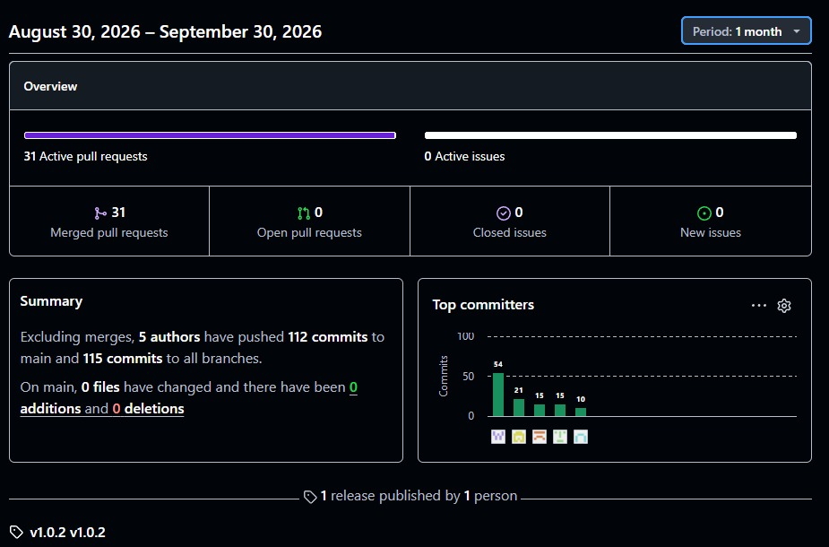

Seguidamente se presenta la pestaña Contributors, donde se muestran los números de commits de cada integrante del equipo. Esta captura abarca datos desde el inicio del proyecto hasta la finalización del primer avance. 

|Integrante|Nombre de usuario en GitHub|
|:---------|:--------------------------|
| Rojas Huaranga, Diego Rances | diego27-16 |
| Mendoza Boluarte, Pierre Alessandro | pierreale2302 |
| Córdova, Alvar Lucas | AlvarLC |
| Landa Sánchez, Sunio Danilo | DanLandio |
| Villanueva Rodríguez, Giuseppe Adrián | Giuseppe152004 |

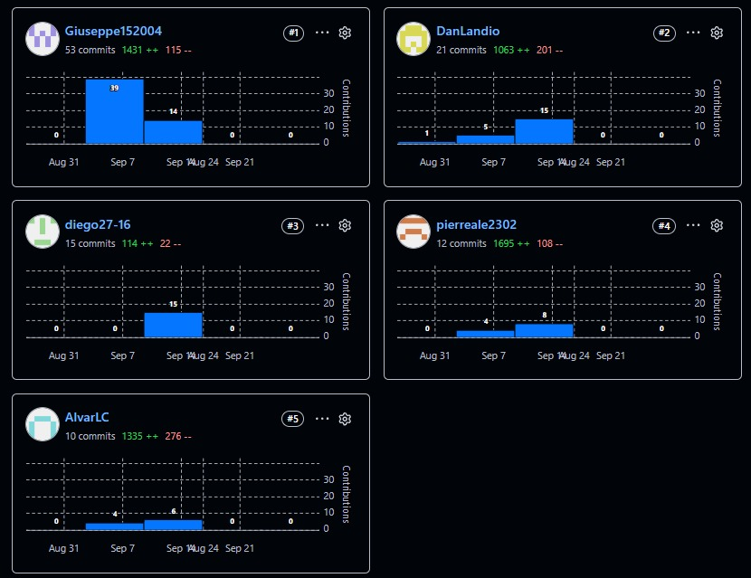

<div style="page-break-after: always;"></div>


# Contenido

## Tabla de contenidos

- [Registro de Versiones del Informe](#registro-de-versiones-del-informe)
- [Project Report Collaboration Insights](#project-report-collaboration-insights)
- [Contenido](#contenido)
  - [Tabla de contenidos](#tabla-de-contenidos)
- [Student Outcome](#student-outcome)
- [Capítulo I: Introduction](#capítulo-i-introduction)
  - [1.1. Startup Profile](#11-startup-profile)
    - [1.1.1. Descripción de la Startup](#111-descripción-de-la-startup)
    - [1.1.2. Perfiles de integrantes del equipo](#112-perfiles-de-integrantes-del-equipo)
  - [1.2. Solution Profile](#12-solution-profile)
    - [1.2.1 Antecedentes y problemática](#121-antecedentes-y-problemática)
    - [1.2.2 Lean UX Process.](#122-lean-ux-process)
      - [1.2.2.1. Lean UX Problem Statements.](#1221-lean-ux-problem-statements)
      - [1.2.2.2. Lean UX Assumptions.](#1222-lean-ux-assumptions)
      - [1.2.2.3. Lean UX Hypothesis Statements.](#1223-lean-ux-hypothesis-statements)
      - [1.2.2.4. Lean UX Canvas.](#1224-lean-ux-canvas)
  - [1.3. Segmentos objetivo.](#13-segmentos-objetivo)
- [Capítulo II: Requirements Elicitation \& Analysis](#capítulo-ii-requirements-elicitation--analysis)
  - [2.1. Competidores.](#21-competidores)
    - [2.1.1. Análisis competitivo.](#211-análisis-competitivo)
    - [2.1.2. Estrategias y tácticas frente a competidores.](#212-estrategias-y-tácticas-frente-a-competidores)
  - [2.2. Entrevistas.](#22-entrevistas)
    - [2.2.1. Diseño de entrevistas.](#221-diseño-de-entrevistas)
    - [2.2.2. Registro de entrevistas.](#222-registro-de-entrevistas)
    - [2.2.3. Análisis de entrevistas.](#223-análisis-de-entrevistas)
  - [2.3. Needfinding.](#23-needfinding)
    - [2.3.1. User Personas.](#231-user-personas)
    - [2.3.2. User Task Matrix.](#232-user-task-matrix)
    - [2.3.3. User Journey Mapping.](#233-user-journey-mapping)
    - [2.3.4. Empathy Mapping.](#234-empathy-mapping)
    - [2.3.5. As-Is Scenario Mapping.](#235-as-is-scenario-mapping)
  - [2.4. Big Picture EventStorming.](#24-big-picture-eventstorming)
  - [2.5. Ubiquitous Language.](#25-ubiquitous-language)
- [Capítulo III: Requirements Specification](#capítulo-iii-requirements-specification)
  - [3.1. User Stories.](#31-user-stories)
  - [3.2. Impact Mapping.](#32-impact-mapping)
  - [3.3. Product Backlog.](#33-product-backlog)
- [Capítulo IV: Product Design](#capítulo-iv-product-design)
  - [4.1. Style Guidelines.](#41-style-guidelines)
    - [4.1.1. General Style Guidelines.](#411-general-style-guidelines)
      - [4.1.1.1 Branding](#4111-branding)
      - [4.1.1.2. Typography](#4112-typography)
      - [4.1.1.3. Color Palette](#4113-color-palette)
      - [4.1.1.4. Spacing System](#4114-spacing-system)
    - [4.1.2. Web Style Guidelines.](#412-web-style-guidelines)
      - [4.1.2.1. Responsive Design Principles](#4121-responsive-design-principles)
      - [4.1.2.2. Web Component States](#4122-web-component-states)
      - [4.1.2.3. Form Elements](#4123-form-elements)
      - [4.1.2.4. Navigation Patterns](#4124-navigation-patterns)
      - [4.1.2.5. Accessibility Guidelines](#4125-accessibility-guidelines)
      - [4.1.2.6. Animation Guidelines](#4126-animation-guidelines)
  - [4.2. Information Architecture.](#42-information-architecture)
    - [4.2.1. Organization Systems.](#421-organization-systems)
      - [4.2.1.1. Organización del Landing Page](#4211-organización-del-landing-page)
      - [4.2.1.2. Organización de la Aplicación Web (Dashboard y Área Principal)](#4212-organización-de-la-aplicación-web-dashboard-y-área-principal)
      - [4.2.1.3. Estrategia de Organización para Búsqueda y Acceso Rápido](#4213-estrategia-de-organización-para-búsqueda-y-acceso-rápido)
    - [4.2.2. Labeling Systems.](#422-labeling-systems)
      - [4.2.2.1. Principios de Etiquetado](#4221-principios-de-etiquetado)
      - [4.2.2.2. Etiquetas de Navegación Principal](#4222-etiquetas-de-navegación-principal)
      - [4.2.2.3. Etiquetas de Mantenimiento y Activos](#4223-etiquetas-de-mantenimiento-y-activos)
      - [4.2.2.4. Etiquetas de Inventario](#4224-etiquetas-de-inventario)
      - [4.2.2.5. Etiquetas de Acciones de Usuario](#4225-etiquetas-de-acciones-de-usuario)
      - [4.2.2.6. Reglas de Asociación entre Etiquetas](#4226-reglas-de-asociación-entre-etiquetas)
    - [4.2.3. SEO Tags and Meta Tags](#423-seo-tags-and-meta-tags)
    - [4.2.4. Searching Systems.](#424-searching-systems)
    - [4.2.5. Navigation Systems.](#425-navigation-systems)
  - [4.3. Landing Page UI Design.](#43-landing-page-ui-design)
    - [4.3.1. Landing Page Wireframe.](#431-landing-page-wireframe)
    - [4.3.2. Landing Page Mock-up.](#432-landing-page-mock-up)
  - [4.4. Web Applications UX/UI Design.](#44-web-applications-uxui-design)
    - [4.4.1. Web Applications Wireframes.](#441-web-applications-wireframes)
    - [4.4.2. Web Applications Wireflow Diagrams.](#442-web-applications-wireflow-diagrams)
    - [4.4.3. Web Applications Mock-ups.](#443-web-applications-mock-ups)
    - [4.4.4. Web Applications User Flow Diagrams.](#444-web-applications-user-flow-diagrams)
  - [4.5. Web Applications Prototyping.](#45-web-applications-prototyping)
  - [4.6. Domain-Driven Software Architecture.](#46-domain-driven-software-architecture)
    - [4.6.1. Design-Level EventStorming.](#461-design-level-eventstorming)
    - [4.6.2. Software Architecture Context Diagram.](#462-software-architecture-context-diagram)
    - [4.6.3. Software Architecture Container Diagrams.](#463-software-architecture-container-diagrams)
    - [4.6.4. Software Architecture Components Diagrams.](#464-software-architecture-components-diagrams)
  - [4.7. Software Object-Oriented Design.](#47-software-object-oriented-design)
    - [4.7.1. Class Diagrams.](#471-class-diagrams)
  - [4.8. Database Design.](#48-database-design)
    - [4.8.1. Database Diagrams.](#481-database-diagrams)
- [Capítulo V: Product Implementation, Validation \& Deployment](#capítulo-v-product-implementation-validation--deployment)
  - [5.1. Software Configuration Management.](#51-software-configuration-management)
    - [5.1.1. Software Development Environment Configuration.](#511-software-development-environment-configuration)
    - [5.1.2. Source Code Management.](#512-source-code-management)
    - [5.1.3. Source Code Style Guide \& Conventions.](#513-source-code-style-guide--conventions)
    - [5.1.4. Software Deployment Configuration.](#514-software-deployment-configuration)
  - [5.2. Landing Page, Services \& Applications Implementation.](#52-landing-page-services--applications-implementation)
    - [5.2.1. Sprint 1](#521-sprint-1)
      - [5.2.1.1. Sprint Planning 1.](#5211-sprint-planning-1)
      - [5.2.1.2. Aspect Leaders and Collaborators.](#5212-aspect-leaders-and-collaborators)
      - [5.2.1.3. Sprint Backlog 1.](#5213-sprint-backlog-1)
      - [5.2.1.4. Development Evidence for Sprint Review.](#5214-development-evidence-for-sprint-review)
      - [5.2.1.5. Execution Evidence for Sprint Review.](#5215-execution-evidence-for-sprint-review)
      - [5.2.1.6. Services Documentation Evidence for Sprint Review.](#5216-services-documentation-evidence-for-sprint-review)
      - [5.2.1.7. Software Deployment Evidence for Sprint Review.](#5217-software-deployment-evidence-for-sprint-review)
      - [5.2.1.8. Team Collaboration Insights during Sprint.](#5218-team-collaboration-insights-during-sprint)
    - [5.2.2. Sprint 2.](#522-sprint-2)
      - [5.2.2.1. Sprint Planning 2.](#5221-sprint-planning-2)
      - [5.2.2.2. Aspect Leaders and Collaborators.](#5222-aspect-leaders-and-collaborators)
      - [5.2.2.3. Sprint Backlog 2.](#5223-sprint-backlog-2)
      - [5.2.2.4. Development Evidence for Sprint Review.](#5224-development-evidence-for-sprint-review)
      - [5.2.2.5. Execution Evidence for Sprint Review.](#5225-execution-evidence-for-sprint-review)
      - [5.2.2.6. Services Documentation Evidence for Sprint Review.](#5226-services-documentation-evidence-for-sprint-review)
      - [5.2.2.7. Software Deployment Evidence for Sprint Review.](#5227-software-deployment-evidence-for-sprint-review)
      - [5.2.2.8. Team Collaboration Insights during Sprint.](#5228-team-collaboration-insights-during-sprint)
- [Conclusiones](#conclusiones)
- [Bibliografía](#bibliografía)
- [Anexos](#anexos)


<div style="page-break-after: always;"></div>

# Student Outcome 

<div align="center">
<table border="1">
  <tr>
    <th>Criterio Especifico</th>
    <th>Acciones Realizadas</th>
    <th>Conclusiones</th>
  </tr>

  <tr>
    <th>Comunica oralmente con efectividad a diferentes rangos de audiencia</th>
    <td>
    Alvar Lucas Córdova <br> AV1: Participé en las reuniones y coordinaciones del equipo explicando los avances realizados en el proyecto, principalmente en los artefactos de Requirements Elicitation & Analysis y Requirements Specification, como User Personas, User Task Matrix, User Journey Mapping, Empathy Mapping, User Stories, Impact Mapping y Product Backlog. También comuniqué decisiones y avances relacionados con el diseño y desarrollo del producto.<br> TB1: Coordiné con el equipo los avances y las correcciones de la integración del frontend durante el Sprint 2.<br><br>
    Sunio Danilo Landa Sánchez <br> AV1: Participé en la coordinación del equipo para el desarrollo del proyecto siguiendo las convenciones descritas en el enunciado. Además, participé en la exposición de los avances realizados.<br> TB1: Comuniqué los avances del módulo de mantenimiento preventivo, incluyendo programación, calendario y navegación.<br><br>
    Giuseppe Adrián Villanueva Rodríguez <br> AV1: Colaboré en el desarrollo de los capítulos II, III y IV, así como en algunas partes del desarrollo y despliegue de la Landing Page. También comuniqué al equipo los avances realizados en estas actividades.<br> TB1: Expliqué los avances del reporte de fallas y de los indicadores del dashboard.<br><br>
    Diego Rances Rojas Huaranga <br> AV1: Apoyé en la elaboración del primer avance del proyecto y en la realización de entrevistas correspondientes a los tres segmentos definidos. También participé en las coordinaciones del equipo para integrar estos aportes al informe.<br> TB1: Comuniqué los avances del flujo de órdenes de trabajo y la conexión desde la Landing Page.<br><br>
    Pierre Alessandro Mendoza Boluarte <br> AV1: Participé activamente en la elaboración del primer avance, aportando contenido para el Capítulo I relacionado con la definición del negocio y los segmentos objetivo. Asimismo, realicé dos entrevistas y comuniqué al equipo los resultados obtenidos.<br> TB1: Presenté los avances del inventario, los repuestos y la integración de módulos mediante pull requests.
    </td>
    <td>
    AV1: La comunicación oral permitió coordinar las actividades entre los integrantes, presentar los avances realizados y compartir las decisiones tomadas durante el desarrollo del proyecto. Asimismo, facilitó la explicación de la problemática, los requerimientos y la propuesta de FixCore durante las reuniones y exposiciones del equipo.
    <br><br>    TB1: La comunicación oral facilitó la coordinación del Sprint 2, la explicación de avances de cada módulo y la identificación de correcciones para integrar FixCore.
    </td>
  </tr>

  <tr>
    <th>Comunica por escrito con efectividad a diferentes rangos de audiencia</th>
    <td>
    Alvar Lucas Córdova <br> AV1: Elaboré y redacté diferentes secciones del informe, incluyendo User Personas, User Task Matrix, User Journey Mapping, Empathy Mapping, User Stories, Impact Mapping y Product Backlog. Además, participé en la documentación de secciones relacionadas con el diseño del producto y el avance de la implementación.<br> TB1: Actualicé Needfinding y el Sprint Planning 2; implementé la gestión de plantas y máquinas, integré el frontend y corregí problemas detectados en la auditoría.<br><br>
    Sunio Danilo Landa Sánchez <br> AV1: Apoyé en la aplicación de convenciones durante el control de versiones del proyecto y en la nomenclatura de los mensajes de cambio realizados en el repositorio.<br> TB1: Registré mediante commits los formularios de mantenimiento preventivo, el calendario, los estados y las rutas del módulo.<br><br>
    Giuseppe Adrián Villanueva Rodríguez <br> AV1: Redacté diferentes secciones comprendidas desde Style Guidelines hasta Landing Page Mock-up. Además, participé en la elaboración de dos entrevistas y en la redacción de sus respectivos resúmenes.<br> TB1: Registré mediante commits el desarrollo del registro de fallas, el dashboard y los ajustes de diagramas de base de datos del informe.<br><br>
    Diego Rances Rojas Huaranga <br> AV1: Participé en el desarrollo de la propuesta visual y de interacción de la plataforma orientada al mantenimiento industrial, elaborando wireframes de baja fidelidad en Figma. También integré los wireframes con los flujos de interacción y cambios de estado según los objetivos de cada rol, y participé en el desarrollo de los mock-ups de alta fidelidad aplicando el Design System de FixCore.<br> TB1: Documenté mediante commits la creación, asignación, ejecución y cierre de órdenes de trabajo, además de la conexión con la Landing Page.<br><br>
    Pierre Alessandro Mendoza Boluarte <br> AV1: Participé en la planificación del EventStorming, colaboré en la elaboración de diagramas y apoyé en la redacción de diferentes apartados correspondientes al Capítulo V.<br> TB1: Registré commits y pull requests de gestión de inventario, repuestos, validaciones, niveles mínimos de stock e integración de módulos.
    </td>
    <td>
    AV1: La documentación elaborada permitió comunicar de forma organizada la problemática, los segmentos objetivo, los requerimientos, el diseño y los avances de implementación de FixCore. La utilización de una estructura común, artefactos visuales y convenciones de documentación permitió mantener coherencia entre los diferentes capítulos del informe y facilitar su comprensión.
    <br><br>    TB1: La documentación del Sprint 2 y el registro de commits permitieron explicar las responsabilidades del equipo, mantener trazabilidad y comunicar las mejoras del frontend.
    </td>
  </tr>
</table>
</div>

<div style="page-break-after: always;"></div>

# Capítulo I: Introduction 

## 1.1. Startup Profile

### 1.1.1. Descripción de la Startup

TechMakers es una startup conformada por estudiantes de Ingeniería de Software que busca desarrollar soluciones tecnológicas orientadas a mejorar y digitalizar procesos presentes en distintos sectores empresariales.

Actualmente, TechMakers se enfoca en una problemática presente en empresas del sector industrial: la gestión del mantenimiento de maquinaria y equipos. En muchas organizaciones, actividades como la programación de mantenimientos, el registro de fallas y el control de repuestos todavía se gestionan mediante cuadernos, pizarras, archivos de Excel o canales de comunicación separados.

Esta forma de trabajo dificulta el acceso y seguimiento de la información y puede provocar que ciertos mantenimientos no se realicen en las fechas previstas, que no exista suficiente disponibilidad de repuestos o que una falla no sea atendida oportunamente. Estas situaciones pueden ocasionar tiempos muertos, interrupciones en la producción y mayores costos para las empresas.

Frente a esta problemática surge **FixCore**, una plataforma orientada a centralizar la información y las actividades relacionadas con el mantenimiento industrial. FixCore permitirá gestionar los activos de una empresa mediante fichas digitales que contienen información como marca, modelo, manuales e historial de mantenimiento. Asimismo, busca facilitar la programación de mantenimientos, el registro de fallas, la gestión de órdenes de trabajo y el control de repuestos.

De esta manera, TechMakers busca ofrecer una solución accesible y fácil de utilizar que permita a las empresas mejorar la organización de sus actividades de mantenimiento y reducir los problemas generados por procesos manuales o información dispersa.

### Misión

La misión de TechMakers es ofrecer a empresas manufactureras y contratistas de mantenimiento industrial una solución tecnológica que facilite la organización y gestión de sus actividades de mantenimiento. Mediante FixCore buscamos centralizar la información de las máquinas, mejorar la programación de los mantenimientos y facilitar el control de los repuestos, contribuyendo a reducir las interrupciones ocasionadas por fallas o una planificación inadecuada.

### Visión

La visión de TechMakers es lograr que FixCore se convierta progresivamente en una alternativa reconocida en el Perú para la gestión del mantenimiento industrial. Buscamos desarrollar una plataforma que pueda adaptarse al crecimiento de las empresas y contribuir a la digitalización de procesos que actualmente se realizan de manera manual o mediante herramientas desconectadas.

### 1.1.2. Perfiles de integrantes del equipo

A continuación, se presentan los integrantes de TechMakers y las principales capacidades que cada uno aporta al desarrollo del proyecto.

<div align="center">

<table border="1">
  <tr>
    <th>Integrante</th>
    <th colspan="2">Descripción</th>
  </tr>

  <tr>
    <th rowspan="2">Alvar Lucas Córdova</th>
    <td colspan="2"></td>
  </tr>
  <tr>
    <td colspan="2">
      <b>Código:</b> u202324461 <br>
      <b>Carrera:</b> Ingeniería de Software <br>
      <b>Conocimientos técnicos y habilidades:</b> Cuenta con conocimientos en desarrollo web utilizando HTML, CSS y JavaScript, así como conocimientos básicos de Vue.js y C# con .NET. También posee experiencia utilizando Git y GitHub para el control de versiones y trabajo colaborativo. Destaca por su organización, responsabilidad y capacidad para coordinar actividades dentro del equipo.
    </td>
  </tr>

  <tr>
    <th rowspan="2">Sunio Danilo Landa Sánchez</th>
    <td colspan="2"></td>
  </tr>
  <tr>
    <td colspan="2">
      <b>Código:</b> u202423973 <br>
      <b>Carrera:</b> Ingeniería de Software <br>
      <b>Conocimientos técnicos y habilidades:</b> Posee conocimientos en programación con C++ y JavaScript, además de fundamentos de HTML y CSS para el desarrollo de interfaces web. También conoce el uso básico de Git, GitHub y el marco de trabajo Scrum. Destaca por su capacidad de aprendizaje, responsabilidad y disposición para trabajar en equipo.
    </td>
  </tr>

  <tr>
    <th rowspan="2">Giuseppe Adrián Villanueva Rodríguez</th>
    <td colspan="2"></td>
  </tr>
  <tr>
    <td colspan="2">
      <b>Código:</b> u20221c554 <br>
      <b>Carrera:</b> Ingeniería de Software <br>
      <b>Conocimientos técnicos y habilidades:</b> Cuenta con conocimientos básicos de Java, SQL y desarrollo de aplicaciones web. Tiene experiencia introductoria con Angular y TypeScript, además del uso de Git y GitHub para gestionar cambios en proyectos. Se caracteriza por su capacidad para resolver problemas, adaptarse a nuevas tecnologías y colaborar con otros integrantes.
    </td>
  </tr>

  <tr>
    <th rowspan="2">Diego Rances Rojas Huaranga</th>
    <td colspan="2"></td>
  </tr>
  <tr>
    <td colspan="2">
      <b>Código:</b> u20241E096 <br>
      <b>Carrera:</b> Ingeniería de Software <br>
      <b>Conocimientos técnicos y habilidades:</b> Posee conocimientos básicos de C#, .NET y SQL, así como fundamentos para el desarrollo y consumo de servicios REST. También cuenta con conocimientos de Vue.js, HTML y CSS para la creación de interfaces web. Destaca por su pensamiento lógico, capacidad de análisis y disposición para aprender nuevas herramientas.
    </td>
  </tr>

  <tr>
    <th rowspan="2">Pierre Alessandro Mendoza Boluarte</th>
    <td colspan="2"></td>
  </tr>
  <tr>
    <td colspan="2">
      <b>Código:</b> u202320973 <br>
      <b>Carrera:</b> Ingeniería de Software <br>
      <b>Conocimientos técnicos y habilidades:</b> Considero que tengo conocimientos en HTML, CSS,C++ y un poco de JavaScript . Ademas uso GitHub para el trabajo colaborativo y tengo nociones de diseño de interfaces y prototipado. Creo que soy creativo y apoyare en lo que pueda para tener una comunicación y capacidad para trabajar de manera colaborativa.
    </td>
  </tr>
</table>

</div>

## 1.2. Solution Profile 

### 1.2.1 Antecedentes y problemática

El sector manufacturero depende en gran medida de la disponibilidad y correcto funcionamiento de sus máquinas y equipos. Por ello, una adecuada gestión del mantenimiento resulta importante para reducir interrupciones en la producción, organizar las intervenciones técnicas y mantener un mayor control sobre los activos de una empresa.

En este contexto, una de las principales dificultades identificadas se encuentra en la forma en que algunas pymes manufactureras, empresas contratistas y equipos técnicos gestionan sus actividades de mantenimiento. Procesos como la programación de mantenimientos preventivos, el registro de fallas, la asignación de órdenes de trabajo y el control de repuestos todavía pueden realizarse mediante cuadernos, pizarras, hojas de cálculo, llamadas telefónicas o mensajes de WhatsApp.

El uso de diferentes medios para registrar y compartir información puede ocasionar que los datos se encuentren dispersos o desactualizados. Como consecuencia, los responsables de mantenimiento pueden tener dificultades para conocer qué equipos necesitan atención, qué actividades se encuentran pendientes, qué técnico está encargado de una intervención o qué repuestos se encuentran disponibles.

Estas dificultades también afectan a los técnicos y operarios que trabajan directamente en planta, quienes necesitan consultar información de las máquinas, registrar fallas, revisar órdenes de trabajo y reportar las actividades realizadas durante una intervención.

Frente a esta problemática surge la oportunidad de centralizar estas actividades mediante una plataforma web que permita organizar la información relacionada con los activos, los mantenimientos, las fallas, las órdenes de trabajo y los repuestos.

FixCore busca responder a esta necesidad mediante una solución orientada a pymes manufactureras, empresas contratistas de mantenimiento industrial y técnicos u operarios que participan directamente en los procesos de mantenimiento.


**Técnica de The 5 'W's y 2 'H's**

| Pregunta | Formulación | Respuesta |
| :--- | :--- | :--- |
| **Who?** | ¿Quiénes son los afectados? | Dueños, administradores, jefes de mantenimiento y responsables de pymes manufactureras; empresas contratistas de mantenimiento industrial; y técnicos u operarios encargados de ejecutar actividades de mantenimiento. |
| **What?** | ¿Cuál es el problema? | Existen dificultades para programar mantenimientos, registrar y atender fallas, gestionar órdenes de trabajo, controlar repuestos y consultar información histórica debido al uso de registros manuales o herramientas desconectadas. |
| **Where?** | ¿Dónde ocurre? | En plantas de producción, fábricas, talleres industriales y empresas contratistas que realizan actividades de mantenimiento. |
| **When?** | ¿Cuándo ocurre el problema? | Durante las actividades diarias de mantenimiento, especialmente cuando se aproxima una fecha de mantenimiento, ocurre una falla, se asigna una intervención o se necesita consultar la disponibilidad de un repuesto. |
| **Why?** | ¿Por qué ocurre? | Porque la información puede encontrarse distribuida entre cuadernos, hojas de cálculo, llamadas, mensajes y otros medios que no mantienen un registro centralizado de las actividades. |
| **How?** | ¿Cómo se manifiesta? | Mediante información desactualizada, dificultades para coordinar técnicos, mantenimientos realizados fuera de la fecha prevista, falta de trazabilidad de las intervenciones y problemas para conocer la disponibilidad de repuestos. |
| **How Much?** | ¿Cuál es la magnitud? | Su impacto varía según el tamaño y operación de cada empresa, pero puede traducirse en tiempo adicional dedicado a buscar información, retrasos en la atención de fallas, interrupciones operativas y mayores costos asociados al mantenimiento. |

### 1.2.2 Lean UX Process. 

#### 1.2.2.1. Lean UX Problem Statements

El mantenimiento de maquinaria y equipos en pymes manufactureras y empresas contratistas puede presentar dificultades cuando la información relacionada con activos, mantenimientos, fallas, órdenes de trabajo y repuestos se administra mediante herramientas separadas o registros manuales.

Los principales usuarios afectados son los responsables de mantenimiento, administradores, técnicos y operarios, quienes necesitan consultar y registrar información durante sus actividades diarias. Cuando estos procesos dependen de cuadernos, hojas de cálculo, llamadas o mensajes, puede resultar más difícil mantener la información actualizada y conocer el estado de las actividades de mantenimiento.

Las soluciones existentes no siempre se adaptan a las necesidades y recursos de pequeñas y medianas organizaciones, especialmente cuando requieren procesos de implementación complejos o interfaces poco prácticas para el personal que trabaja directamente en planta.

Existe, por lo tanto, una oportunidad para desarrollar una solución que centralice la información y permita realizar las principales actividades de mantenimiento desde una interfaz sencilla y adaptable a diferentes dispositivos.

FixCore abordará esta oportunidad mediante una aplicación web SaaS que permitirá registrar activos, programar mantenimientos preventivos, reportar fallas, gestionar órdenes de trabajo, controlar repuestos y consultar información relacionada con las actividades realizadas.

El producto estará orientado inicialmente a pymes manufactureras, empresas contratistas de mantenimiento industrial y técnicos u operarios. El éxito de la solución será evaluado mediante la validación con usuarios, considerando aspectos como facilidad de uso, organización de la información, reducción de tareas manuales y utilidad de las principales funcionalidades propuestas.

#### 1.2.2.2. Lean UX Assumptions

**Business Assumptions**

* Creemos que las pymes manufactureras y empresas contratistas necesitan una forma más organizada de gestionar la información relacionada con sus máquinas y actividades de mantenimiento.
* Creemos que centralizar la información de los activos puede facilitar el seguimiento de mantenimientos, fallas e intervenciones realizadas.
* Creemos que nuestros clientes iniciales pueden ser responsables de mantenimiento, administradores de pymes manufactureras y responsables de empresas que prestan servicios de mantenimiento industrial.
* Creemos que uno de los principales valores de FixCore será facilitar la organización de las actividades de mantenimiento y reducir la dependencia de registros manuales o herramientas desconectadas.
* Creemos que los responsables de las empresas valorarán poder consultar información sobre máquinas, órdenes de trabajo, técnicos y repuestos desde una misma plataforma.
* Creemos que las demostraciones y pruebas con empresas pueden ayudarnos a validar si FixCore responde adecuadamente a sus necesidades.
* Creemos que un modelo de suscripción SaaS puede ser una alternativa adecuada para ofrecer la plataforma a empresas de diferentes tamaños.
* Creemos que algunas soluciones empresariales existentes pueden resultar complejas para pequeñas organizaciones que únicamente necesitan gestionar sus actividades de mantenimiento.
* Creemos que una interfaz especializada en mantenimiento industrial puede facilitar la adopción del producto.
* Creemos que uno de los principales riesgos es que la plataforma resulte difícil de utilizar desde dispositivos móviles durante las actividades realizadas en planta.
* Creemos que un diseño web adaptable puede facilitar el uso de FixCore desde computadoras, tablets y smartphones.

**Business Outcome Assumptions**

* Creemos que algunas empresas que prueben FixCore podrían considerar utilizar la plataforma de manera continua si perciben mejoras en la organización de sus actividades de mantenimiento.
* Creemos que una experiencia sencilla y útil puede favorecer la permanencia de los clientes que utilicen la plataforma.
* Creemos que las pymes manufactureras y empresas contratistas representan un mercado inicial en el que podemos validar el modelo de negocio de FixCore.
* Creemos que realizar demostraciones y pruebas piloto puede ayudarnos a conocer el interés de potenciales clientes antes de realizar una expansión del producto.

**User Assumptions**

* Creemos que los principales usuarios de FixCore serán los responsables de mantenimiento y los técnicos u operarios que participan en las actividades de mantenimiento.
* Creemos que FixCore puede utilizarse como una herramienta para organizar las actividades diarias realizadas en plantas, talleres y empresas contratistas.
* Creemos que los usuarios presentan dificultades para conocer los mantenimientos próximos, consultar información de las máquinas y verificar la disponibilidad de repuestos.
* Creemos que algunos usuarios necesitarán utilizar la plataforma desde dispositivos móviles mientras se encuentran realizando actividades en planta.
* Creemos que funciones como el calendario de mantenimiento, las fichas de los activos, las órdenes de trabajo, el control de repuestos y las notificaciones pueden resultar útiles para los usuarios.
* Creemos que los usuarios valorarán una interfaz sencilla que les permita registrar y consultar información rápidamente.

**User Outcome and Benefit Assumptions**

* Creemos que los responsables de mantenimiento podrán organizar mejor las actividades semanales al centralizar la programación y seguimiento de los mantenimientos.
* Creemos que los técnicos podrán registrar fallas e intervenciones de manera más ordenada desde la plataforma.
* Creemos que disponer de información actualizada sobre el inventario permitirá a los responsables conocer con mayor facilidad la disponibilidad de repuestos.
* Creemos que mantener un historial digital de las actividades puede reducir la pérdida de información y facilitar la comunicación entre responsables y técnicos.
* Creemos que los usuarios podrán consultar con mayor rapidez la información relacionada con una máquina o una intervención.

**Feature Assumptions**

* Creemos que el uso de códigos QR asociados a las máquinas puede facilitar a los técnicos el acceso a sus fichas e información técnica.
* Creemos que las Órdenes de Trabajo digitales pueden facilitar la asignación, seguimiento y registro de las actividades realizadas por los técnicos.
* Creemos que un módulo de inventario relacionado con las Órdenes de Trabajo puede mejorar el control de los repuestos utilizados durante una intervención.
* Creemos que las alertas y notificaciones pueden ayudar a los responsables a recordar mantenimientos próximos o identificar eventos que requieren atención.
* Creemos que un dashboard con indicadores puede facilitar a los responsables la consulta del estado general de las actividades de mantenimiento.

#### 1.2.2.3. Lean UX Hypothesis Statements

A partir de los Business Outcome Assumptions, User Assumptions, User Outcome and Benefit Assumptions y Feature Assumptions previamente definidos, se plantean las siguientes hipótesis. Estas hipótesis permitirán validar si las principales funcionalidades propuestas generan valor para los segmentos objetivo de FixCore.

* **Hipótesis 1:** Creemos que lograremos incrementar el interés de las empresas en utilizar FixCore si los técnicos de mantenimiento pueden consultar rápidamente la información de una máquina mediante fichas digitales accesibles a través de códigos QR desde sus dispositivos.

* **Hipótesis 2:** Creemos que aumentará la utilidad percibida de FixCore si los responsables de mantenimiento y técnicos pueden reducir la pérdida de información y mejorar la coordinación de sus actividades mediante Órdenes de Trabajo digitales.

* **Hipótesis 3:** Creemos que las empresas encontrarán mayor valor en FixCore si los responsables de mantenimiento pueden consultar y actualizar la disponibilidad de repuestos mediante un módulo de inventario relacionado con las Órdenes de Trabajo.

* **Hipótesis 4:** Creemos que los responsables de mantenimiento utilizarán FixCore con mayor frecuencia si pueden conocer los mantenimientos próximos y los eventos que requieren atención mediante un sistema de alertas y notificaciones.

* **Hipótesis 5:** Creemos que los jefes de mantenimiento y responsables de las empresas podrán comprender con mayor facilidad el estado de sus operaciones si cuentan con un dashboard que consolide información relevante sobre mantenimientos, órdenes de trabajo e incidencias.

#### 1.2.2.4. Lean UX Canvas

El Lean UX Canvas de FixCore resume los principales problemas identificados, los segmentos involucrados, los resultados esperados para el negocio y los usuarios, así como las funcionalidades e hipótesis que deberán ser validadas durante el desarrollo del producto.

<div align="center">
  <p><b>Gráfico 1</b>: Lean UX Canvas FixCore</p>
  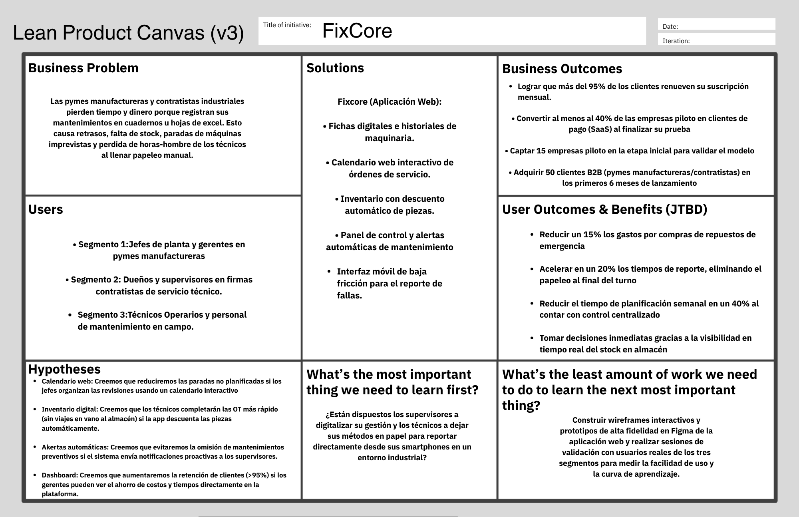
</div>

*Fuente: Elaboración propia.*

## 1.3. Segmentos objetivo

A partir del problema identificado y del contexto en el que se desarrollará FixCore, se definieron tres segmentos principales. Estos segmentos representan tanto a las organizaciones responsables de gestionar el mantenimiento como a los usuarios que participan directamente en las actividades operativas.

> **Segmento 1: Pymes de Manufactura y Producción**

* **Usuarios principales:** Jefes de planta, responsables de mantenimiento, coordinadores de producción y administradores de pequeñas y medianas empresas manufactureras.
* **Descripción:** Organizaciones que dependen del funcionamiento continuo de sus máquinas y equipos para desarrollar sus actividades productivas. Necesitan mantener organizada la información de sus activos, programar mantenimientos y conocer el estado de las actividades realizadas sobre cada máquina.
* **Contexto de uso:** Plantas de producción, fábricas y talleres donde se realizan actividades de mantenimiento preventivo y correctivo.
* **Principales necesidades:** Programar mantenimientos, consultar el historial de los equipos, conocer las fallas reportadas, supervisar las Órdenes de Trabajo y verificar la disponibilidad de repuestos.
* **Problemas identificados:** Información distribuida en diferentes medios, dificultad para realizar seguimiento a los mantenimientos, falta de trazabilidad de las intervenciones y problemas para conocer el estado actualizado de los equipos.
* **Relación con FixCore:** Este segmento utilizará FixCore principalmente para administrar los activos de la empresa, organizar los mantenimientos, supervisar las actividades técnicas y consultar información relacionada con el estado de las máquinas.

> **Segmento 2: Firmas Consultoras y Contratistas de Ingeniería Industrial**

* **Usuarios principales:** Dueños, gerentes de operaciones, supervisores de mantenimiento y responsables de planificación de empresas que brindan servicios de mantenimiento industrial.
* **Descripción:** Organizaciones que realizan actividades de mantenimiento preventivo y correctivo para diferentes clientes y necesitan coordinar técnicos, equipos, Órdenes de Trabajo y repuestos durante la prestación de sus servicios.
* **Contexto de uso:** Oficinas, talleres y plantas de clientes donde los técnicos realizan intervenciones de mantenimiento.
* **Principales necesidades:** Organizar las Órdenes de Trabajo, asignar técnicos, consultar información de las máquinas atendidas, registrar intervenciones y controlar los repuestos utilizados.
* **Problemas identificados:** Dificultades para mantener centralizada la información de diferentes servicios, coordinación mediante llamadas o mensajes, seguimiento limitado del trabajo realizado y registros distribuidos entre diferentes herramientas.
* **Relación con FixCore:** Este segmento utilizará FixCore para organizar los servicios realizados a sus clientes, coordinar las actividades de los técnicos y mantener un registro de las intervenciones y recursos utilizados.

> **Segmento 3: Técnicos y Operarios de Mantenimiento Industrial**

* **Usuarios principales:** Técnicos, operarios y personal encargado de ejecutar actividades de mantenimiento preventivo y correctivo.
* **Descripción:** Usuarios operativos que trabajan directamente con máquinas y equipos y que necesitan consultar información, reportar fallas, ejecutar Órdenes de Trabajo y registrar las actividades realizadas durante una intervención.
* **Contexto de uso:** Plantas industriales, fábricas, talleres y otras áreas en las que se realizan actividades de mantenimiento.
* **Principales necesidades:** Consultar información de las máquinas, conocer las tareas asignadas, registrar fallas, actualizar el estado de una Orden de Trabajo y verificar los repuestos necesarios para una intervención.
* **Problemas identificados:** Dependencia de registros manuales, comunicación mediante llamadas o mensajes, dificultad para acceder rápidamente a información técnica y necesidad de utilizar herramientas sencillas desde dispositivos móviles.
* **Relación con FixCore:** Este segmento utilizará principalmente las funciones operativas de la plataforma para consultar activos, revisar Órdenes de Trabajo, registrar intervenciones y actualizar información directamente desde el lugar donde realiza el mantenimiento.

<div style="page-break-after: always;"></div>

# Capítulo II: Requirements Elicitation & Analysis 

## 2.1. Competidores. 

**1. Fracttal**
- Plataforma CMMS 100% en la nube y móvil, muy consolidada en el mercado hispanohablante. Ofrece gestión de activos y mantenimiento predictivo con módulos de IoT. Sin embargo, sus planes de pago y la complejidad de implementación inicial pueden ser barreras de entrada para pymes industriales que buscan soluciones inmediatas.

**2. UpKeep**
- Solución de mantenimiento *"mobile-first"* diseñada específicamente para facilitar el trabajo del técnico en campo. Agiliza la creación de órdenes de trabajo mediante una interfaz sencilla. No obstante, carece de la profundidad necesaria para integraciones corporativas complejas con ERPs en industrias de gran escala.

**3. IBM Maximo**
- Software líder mundial en gestión de activos empresariales (EAM). Es extremadamente potente y personalizable, ideal para corporaciones gigantes con operaciones críticas. Su principal debilidad radica en sus altísimos costos de licencia, infraestructura pesada y una curva de aprendizaje muy pronunciada.

### 2.1.1. Análisis competitivo.


<table border="1" cellspacing="0" cellpadding="8">
<tr>
<th colspan="6">Competitive Analysis Landscape</th>
</tr>
<tr>
<th colspan="2">¿Por qué llevar a cabo este análisis?</th>
<td colspan="4">El objetivo de este análisis es identificar las fortalezas, debilidades, oportunidades y amenazas del entorno competitivo en el sector de software CMMS, con el fin de reconocer la ventaja competitiva de FixCore frente a otras soluciones existentes y orientar sus estrategias de diferenciación.</td>
</tr>
<tr>
<th colspan="2">Competidor</th>
<th>
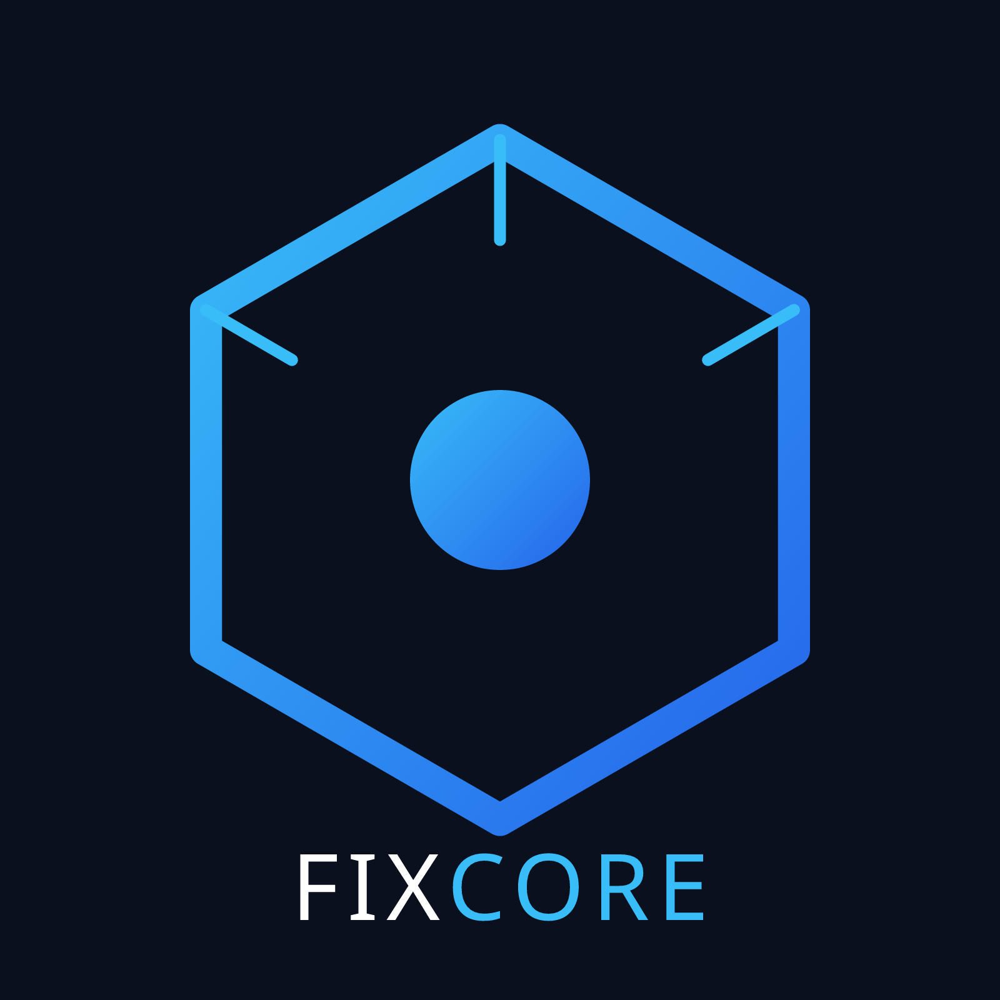<br><br>
FixCore
</th>
<th>
<br><br>
Fracttal
</th>
<th>
<br><br>
UpKeep
</th>
<th>
<br><br>
IBM Maximo
</th>
</tr>
<tr>
<th rowspan="2">Perfil</th>
<th>Overview</th>
<td>Plataforma web SaaS orientada a la gestión del mantenimiento industrial, centralizando activos, mantenimientos, fallas, órdenes de trabajo, inventario de repuestos y reportes.</td>
<td>Plataforma CMMS/EAM en la nube orientada a la gestión del mantenimiento, activos, órdenes de trabajo, analítica, IoT e integraciones.</td>
<td>Plataforma CMMS mobile-first orientada a gestionar órdenes de trabajo, mantenimiento preventivo, activos, inventario y actividades realizadas por técnicos.</td>
<td>Plataforma empresarial EAM orientada a la gestión, mantenimiento y confiabilidad de activos utilizados en operaciones de alta complejidad.</td>
</tr>
<tr>
<th>Ventaja competitiva<br>¿Qué valor ofrece a los clientes?</th>
<td>Baja fricción para técnicos, facilidad de adopción, centralización de la información y enfoque en pymes manufactureras y contratistas de mantenimiento industrial.</td>
<td>Amplio ecosistema de mantenimiento que integra movilidad, IoT, automatización, monitoreo de activos y analítica.</td>
<td>Experiencia mobile-first que facilita a los técnicos consultar, crear y gestionar órdenes de trabajo directamente desde campo.</td>
<td>Alta capacidad para administrar activos críticos, mantenimiento, planificación y operaciones empresariales complejas dentro de una misma plataforma.</td>
</tr>
<tr>
<th rowspan="2">Perfil de Marketing</th>
<th>Mercado objetivo</th>
<td>Pymes manufactureras, firmas consultoras y contratistas industriales, además de técnicos y operarios encargados de ejecutar actividades de mantenimiento.</td>
<td>Empresas y equipos de mantenimiento que necesitan digitalizar la gestión de activos y actividades de mantenimiento.</td>
<td>Equipos de mantenimiento y organizaciones que requieren gestionar operaciones desde dispositivos móviles y computadoras.</td>
<td>Grandes organizaciones intensivas en activos, como industrias manufactureras, energéticas, mineras y otras operaciones de alta complejidad.</td>
</tr>
<tr>
<th>Estrategias de marketing</th>
<td>Modelo freemium, pruebas piloto, demostraciones técnicas, alianzas con empresas industriales y énfasis en una adopción sencilla para los usuarios.</td>
<td>Contenido especializado, demostraciones comerciales, presencia internacional y comunicación orientada a la eficiencia operativa y mantenimiento inteligente.</td>
<td>Pruebas del producto, marketing digital, demostraciones y posicionamiento basado en una experiencia mobile-first.</td>
<td>Ventas empresariales, servicios especializados, alianzas estratégicas y una amplia red de partners tecnológicos.</td>
</tr>
<tr>
<th rowspan="3">Perfil de Producto</th>
<th>Productos y Servicios</th>
<td>Gestión de activos, mantenimiento preventivo, reporte de fallas, órdenes de trabajo, inventario de repuestos, alertas, notificaciones y reportes.</td>
<td>Gestión de activos, órdenes de trabajo, mantenimiento preventivo, dashboards, KPIs, IoT, automatización, analítica e integraciones.</td>
<td>Órdenes de trabajo, mantenimiento preventivo, gestión de activos, inventario, repuestos, códigos QR, reportes e integraciones.</td>
<td>Enterprise Asset Management, mantenimiento de activos, confiabilidad, planificación, inspecciones, analítica e inteligencia artificial.</td>
</tr>
<tr>
<th>Precios y Costos</th>
<td>Modelo freemium con funcionalidades básicas gratuitas y planes premium para acceder a capacidades y módulos avanzados.</td>
<td>Modelo de suscripción comercial con planes definidos según las necesidades y características de cada organización.</td>
<td>Modelo de suscripción basado en usuarios y funcionalidades contratadas.</td>
<td>Modelo de licenciamiento y suscripción empresarial configurable según los módulos y necesidades de cada organización.</td>
</tr>
<tr>
<th>Canales de distribución<br>(Web y/o Móvil)</th>
<td>Web Application responsive accesible desde computadoras, tablets y smartphones.</td>
<td>Plataforma web y aplicación móvil.</td>
<td>Plataforma web y aplicaciones móviles para iOS y Android.</td>
<td>Plataforma web y soluciones empresariales pertenecientes al ecosistema IBM Maximo.</td>
</tr>
<tr>
<th rowspan="5">Análisis SWOT</th>
<td colspan="5">El análisis SWOT permite comparar la posición de FixCore frente a sus competidores. Las fortalezas identificadas deben permitir aprovechar las oportunidades del mercado y contribuir a establecer una ventaja competitiva sostenible.</td>
</tr>
<tr>
<th>Fortalezas</th>
<td>Facilidad de uso, enfoque en pymes y contratistas, diseño web adaptable, baja fricción para técnicos y centralización de los procesos de mantenimiento.</td>
<td>Solución madura, integración de IoT, analítica, automatización y amplia cobertura funcional.</td>
<td>Experiencia móvil sencilla, facilidad de adopción y fuerte orientación hacia el trabajo diario de los técnicos.</td>
<td>Alta capacidad empresarial, gestión integral de activos, analítica avanzada y soporte para operaciones de gran escala.</td>
</tr>
<tr>
<th>Debilidades</th>
<td>Marca nueva, ausencia inicial de casos de éxito y menor cantidad de funcionalidades avanzadas frente a plataformas consolidadas.</td>
<td>Su amplia cantidad de funcionalidades puede incrementar la complejidad de adopción para organizaciones pequeñas que buscan soluciones sencillas.</td>
<td>Algunas funcionalidades avanzadas dependen de planes superiores y su amplitud puede superar las necesidades de pequeñas empresas.</td>
<td>Mayor complejidad de implementación y costos potencialmente elevados para pequeñas y medianas organizaciones.</td>
</tr>
<tr>
<th>Oportunidades</th>
<td>Crecimiento de la digitalización de pymes industriales, existencia de procesos manuales y mayor uso de smartphones por técnicos y operarios de mantenimiento.</td>
<td>Expansión del mantenimiento predictivo, IoT, inteligencia artificial y automatización aplicada a activos industriales.</td>
<td>Crecimiento de la digitalización móvil y automatización de las operaciones de mantenimiento.</td>
<td>Mayor adopción de inteligencia artificial, mantenimiento predictivo y modernización de organizaciones intensivas en activos.</td>
</tr>
<tr>
<th>Amenazas</th>
<td>Competidores consolidados, resistencia al cambio en organizaciones tradicionales y aparición de soluciones similares con precios competitivos.</td>
<td>Aparición de nuevas soluciones CMMS más económicas, simples y especializadas.</td>
<td>Competencia creciente de otras plataformas CMMS con experiencias móviles similares.</td>
<td>Soluciones CMMS modernas y más sencillas capaces de ofrecer las funciones esenciales con menor complejidad y costo.</td>
</tr>
</table>

### 2.1.2. Estrategias y tácticas frente a competidores.

| Estrategia / Táctica | Descripción |
| :--- | :--- |
| **Enfoque en Pymes y Contratistas Industriales** | Orientar FixCore principalmente a pymes manufactureras y firmas contratistas que necesitan digitalizar su mantenimiento sin la complejidad y los costos asociados a soluciones empresariales de gran escala. |
| **Automatización de Notificaciones** | Integrar alertas automáticas para informar sobre fallas, mantenimientos próximos, órdenes de trabajo y niveles bajos de stock, reduciendo retrasos y mejorando la coordinación entre supervisores y técnicos. |
| **Modelo Freemium** | Ofrecer una versión básica que permita a las empresas probar las funciones principales de FixCore antes de contratar planes con capacidades avanzadas, disminuyendo la barrera inicial de adopción. |
| **Alianzas Estratégicas B2B** | Establecer alianzas con firmas consultoras, contratistas de mantenimiento y organizaciones relacionadas con el sector industrial para facilitar la adopción de FixCore y ampliar su presencia en el mercado. |
| **Innovación en UX y Baja Fricción** | Diseñar una Web Application responsive, sencilla y accesible desde computadoras, tablets y smartphones, reduciendo la cantidad de pasos necesarios para tareas frecuentes como reportar fallas, consultar órdenes de trabajo o revisar repuestos. |

## 2.2. Entrevistas. 

### 2.2.1. Diseño de entrevistas. 

**Guía de preguntas para Pymes de Manufactura y Producción**

* ¿Cuál es tu nombre, edad y qué cargo ocupas en la planta?
* ¿A qué sector industrial pertenece la empresa y, aproximadamente, cuántas máquinas principales operan?
* Para coordinar el día a día y gestionar el mantenimiento, ¿qué herramientas o software utilizas habitualmente en tu computadora (ej. Excel, sistemas de gestión) y qué dispositivos móviles manejas (smartphones, tablets) para mantenerte comunicada con tu equipo?
* ¿Qué marca y modelo de smartphone y computadora sueles utilizar para tus labores, y qué navegador web (ej. Chrome, Safari, Edge) prefieres para abrir tus plataformas de trabajo?
* ¿Cómo gestionan actualmente el reporte de fallas de maquinaria y las órdenes de trabajo (ej. Excel, papel, grupos de WhatsApp, pizarras)?
* ¿Cuáles son tus canales de comunicación principales (llamadas, WhatsApp, reuniones presenciales o correo) cuando ocurre una emergencia en planta, y cómo lidias con que la información esté dispersa entre ellos?
* ¿Qué dispositivos utilizan más los operarios y técnicos durante su turno en planta (smartphones personales, tablets de la empresa, radios)?
* ¿Qué tan frecuente es que una máquina sufra tiempos muertos (downtime) debido a una mala comunicación o lentitud al reportar la falla?
* ¿Cuáles son las mayores frustraciones que enfrentas al intentar consolidar la información de mantenimiento a fin de mes?
* ¿Has intentado implementar algún software de mantenimiento anteriormente? Si es así, ¿cuál fue el resultado o la principal barrera de adopción por parte de los técnicos?
* ¿Qué elemento te generaría más confianza para adoptar un nuevo sistema: la facilidad de uso para el operario, la automatización de alertas, o el costo de implementación?
* A nivel profesional o tecnológico, ¿qué marcas, empresas referentes o fuentes de contenido industrial e innovación sigues o consideras un modelo a imitar en tu gestión?
* ¿Cómo crees que impactaría en la productividad si los técnicos pudieran reportar una falla en menos de 3 clics desde su celular?
* ¿Qué tan útil te resultaría recibir notificaciones automáticas de fallas críticas directamente en tu WhatsApp?
* Si existiera una versión básica gratuita (modelo freemium) para probar el sistema con algunas máquinas, ¿te animarías a implementarlo en tu planta?
* Una vez comprobado el valor del sistema, ¿cuánto estarías dispuesto a pagar mensualmente por módulos avanzados y analítica de datos (rango en dólares o soles)?

**Guía de preguntas para Firmas Consultoras y Contratistas de Ingeniería Industrial**

* ¿Podría indicarme su nombre, cargo y el tipo de servicios de ingeniería o mantenimiento que brinda su empresa?
* ¿A cuántas plantas industriales o clientes prestan servicio de manera simultánea?
* Para coordinar las operaciones desde la oficina o campo, ¿qué dispositivos utilizas habitualmente y qué herramientas o software manejas para gestionar el día a día?
* ¿Qué marca y modelo de computadora/laptop y smartphone utilizas para tus labores de coordinación, y qué navegador web (ej. Chrome, Safari, Edge) prefieres utilizar en tu día a día?
* ¿Cómo coordinan actualmente el despliegue de sus técnicos en campo cuando un cliente reporta una emergencia o falla en sus equipos?
* ¿Cuáles son tus canales de comunicación principales (llamadas telefónicas, WhatsApp o correos) para contactar a los técnicos y clientes, y cómo manejas la dispersión de información entre ellos?
* Desde su experiencia operativa, ¿cuáles son las mayores limitaciones logísticas o tecnológicas que enfrentan para atender múltiples plantas a la vez?
* ¿Qué tan complejo les resulta estandarizar los reportes de mantenimiento y KPIs para entregárselos a diferentes clientes?
* ¿Suelen utilizar herramientas de automatización de flujos de trabajo o integración de APIs en sus operaciones diarias?
* ¿Qué funcionalidades considera indispensables en una plataforma digital para que decida utilizarla como el motor operativo de todos sus técnicos (ej. webhooks, portal multi-cliente, alertas en tiempo real)?
* ¿Qué tan importante sería para su firma poder integrar el sistema de mantenimiento con otras herramientas de comunicación (como notificaciones automáticas vía WhatsApp)?
* A nivel tecnológico o de gestión de operaciones, ¿qué marcas, empresas referentes o plataformas digitales sigues o tomas como inspiración para tu trabajo?
* ¿Cree que ofrecer a sus clientes una herramienta ágil para que les reporten fallas mejoraría la percepción de su servicio tercerizado? ¿Por qué?
* ¿Preferiría un modelo de precios basado en la cantidad de técnicos (usuarios) o en la cantidad de plantas/clientes gestionados?
* ¿Estaría dispuesto a recomendar e implementar este sistema directamente en la infraestructura tecnológica de sus clientes?

**Guía de preguntas para Técnicos y Operarios de Mantenimiento Industrial**

- ¿Cuál es tu nombre, edad y qué función desempeñas actualmente dentro del área de mantenimiento?
- ¿Cuánto tiempo llevas trabajando en mantenimiento industrial y qué tipo de máquinas o equipos atiendes con mayor frecuencia?
- ¿Qué dispositivo utilizas con mayor frecuencia durante tu jornada de trabajo y para qué tareas lo utilizas?
- ¿Qué marca y modelo de smartphone utilizas principalmente en campo, y qué navegador web (ej. Chrome, Safari) sueles emplear si necesitas consultar algo desde el celular o una computadora?
- ¿Cómo recibes actualmente las tareas u órdenes de mantenimiento que debes realizar durante tu turno?
- Cuando detectas una falla en una máquina, ¿cómo la reportas y a quién se la comunicas?
- ¿Qué información necesitas consultar antes de comenzar un mantenimiento o una reparación?
- ¿Cómo consultas actualmente los manuales, historiales de mantenimiento o información técnica de una máquina?
- ¿Cómo verificas si existe un repuesto disponible antes o durante una reparación?
- ¿Qué problemas o dificultades encuentras al utilizar papel, Excel, WhatsApp u otras herramientas durante tus actividades de mantenimiento?
- ¿Qué características debería tener una herramienta digital para que puedas utilizarla fácilmente mientras trabajas en planta?
- ¿Qué situaciones suelen hacer que una orden de trabajo se retrase o sea difícil de completar?
- ¿Cómo registras actualmente el trabajo realizado después de terminar un mantenimiento?
- ¿Qué tipo de alertas o información te sería más útil recibir durante tu turno?
- A nivel de herramientas tecnológicas, aplicaciones o plataformas del día a día, ¿qué marcas, apps móviles o referentes sigues o te parecen más intuitivos para trabajar?
- ¿Qué es lo que más te frustra del proceso actual de mantenimiento y qué cambiarías para hacerlo más sencillo?


### 2.2.2. Registro de entrevistas

### Segmento 1: Pymes de Manufactura y Producción

<table>
  <thead>
    <tr>
      <th align="center">Foto</th>
      <th align="left">Campo</th>
      <th align="left">Detalle</th>
    </tr>
  </thead>
  <tbody>
    <tr>
      <td rowspan="6" align="center" valign="middle" width="200">
        
      </td>
      <td><strong>Nombre y apellido</strong></td>
      <td>Caterina Villanueva</td>
    </tr>
    <tr>
      <td><strong>Edad</strong></td>
      <td>35 años</td>
    </tr>
    <tr>
      <td><strong>Ubicación</strong></td>
      <td>San Miguel</td>
    </tr>
    <tr>
      <td><strong>Timing de la entrevista</strong></td>
      <td>Inicia: 00:00 - Termina: 04:38</td>
    </tr>
    <tr>
      <td><strong>Duración</strong></td>
      <td>4 minutos y 38 segundos</td>
    </tr>
    <tr>
      <td><strong>Enlace</strong></td>
      <td><a href="https://upcedupe-my.sharepoint.com/:v:/g/personal/u202423973_upc_edu_pe/IQBCKuUvc8VeT4YtxyBRxNnnAerbBFUqAE8C5H7KH6vx3GU?e=f8X1Pp">Video de las entrevistas</a></td>
    </tr>
  </tbody>
</table>

**Resumen:**

**¿Cuál es tu nombre, edad y qué cargo ocupas en la planta?**

Mi nombre es Caterina Villanueva, tengo 35 años y soy coordinadora de producción. Principalmente superviso que la producción se desarrolle con normalidad y coordino con el área de mantenimiento cuando ocurre algún problema con las máquinas.

**¿A qué sector industrial pertenece la empresa y, aproximadamente, cuántas máquinas principales operan?**

La empresa pertenece al sector manufacturero y tenemos alrededor de 18 máquinas principales en operación.

**¿Cómo gestionan actualmente el reporte de fallas de maquinaria y las órdenes de trabajo?**

La mayoría de los problemas se reportan mediante WhatsApp porque es el medio más rápido. Tenemos un grupo de producción y mantenimiento donde se comunican las fallas. También utilizamos Microsoft Excel y algunos formatos físicos para registrar información.

**¿Qué dispositivos, marcas y herramientas digitales utilizan con mayor frecuencia durante el trabajo?**

Durante el trabajo utilizamos principalmente celulares. En mi caso utilizo un iPhone para comunicarme y revisar información cuando estoy fuera de la oficina. También trabajo desde una laptop con Windows. Para las coordinaciones utilizamos WhatsApp y, cuando necesitamos revisar o compartir información, usamos Microsoft Excel, Google Drive, Gmail y Google Chrome. Algunos trabajadores también utilizan radios para coordinaciones rápidas dentro de la planta.

**¿Qué tan frecuente es que una máquina sufra tiempos muertos debido a una mala comunicación o lentitud al reportar la falla?**

No sucede todos los días, pero sí puede ocurrir varias veces al mes. Algunas fallas se comunican rápidamente, pero el mensaje puede perderse entre todas las conversaciones del grupo de WhatsApp. Esto puede retrasar la atención y terminar afectando la producción.

**¿Cuáles son las mayores frustraciones que enfrentas al intentar consolidar la información de mantenimiento a fin de mes?**

Lo más complicado es que la información se encuentra distribuida en diferentes medios. Tengo que revisar WhatsApp, archivos de Excel y formatos físicos, por lo que consolidar todo termina siendo un proceso tedioso.

**¿Has intentado implementar algún software de mantenimiento anteriormente? Si es así, ¿cuál fue el resultado o la principal barrera de adopción por parte de los técnicos?**

Sí, anteriormente se intentó utilizar un sistema, pero varios trabajadores tuvieron dificultades para entenderlo y finalmente se dejó de usar. Algunos integrantes del personal no estaban acostumbrados a llenar formularios o utilizar herramientas con muchas opciones.

**¿Qué elemento te generaría más confianza para adoptar un nuevo sistema: la facilidad de uso para el operario, la automatización de alertas o el costo de implementación?**

Considero que lo más importante sería la facilidad de uso. Tenemos trabajadores con diferentes niveles de experiencia utilizando herramientas digitales, por lo que el sistema debería ser sencillo de entender. Después consideraría la automatización de alertas y, finalmente, el costo.

**¿Cómo crees que impactaría en la productividad si los técnicos pudieran reportar una falla en pocos pasos desde su celular?**

Sería mucho más práctico que llenar formularios extensos. Permitiría comunicar las fallas más rápido y facilitaría el seguimiento de las actividades posteriores.

**¿Qué tan útil te resultaría recibir notificaciones automáticas de fallas críticas directamente en WhatsApp?**

Me resultaría bastante útil, especialmente para las fallas de mayor prioridad. De esta manera sería posible distinguir rápidamente cuáles requieren atención inmediata y cuáles pueden esperar.

**Si existiera una versión básica gratuita para probar el sistema con algunas máquinas, ¿te animarías a implementarlo en tu planta?**

Sí. Empezaría probándolo con dos o tres máquinas y, dependiendo de los resultados, evaluaría implementarlo progresivamente en el resto de la empresa.

**Una vez comprobado el valor del sistema, ¿cuánto estarías dispuesta a pagar mensualmente por módulos avanzados y analítica de datos?**

Consideraría un rango aproximado de 500 a 1000 soles mensuales, dependiendo de las funcionalidades incluidas y del beneficio que pueda generar para las operaciones de la empresa.


<table>
  <thead>
    <tr>
      <th align="center">Foto</th>
      <th align="left">Campo</th>
      <th align="left">Detalle</th>
    </tr>
  </thead>
  <tbody>
    <tr>
      <td rowspan="6" align="center" valign="middle" width="200">
        
      </td>
      <td><strong>Nombre y apellido</strong></td>
      <td>Carla Aguilar</td>
    </tr>
    <tr>
      <td><strong>Edad</strong></td>
      <td>26 años</td>
    </tr>
    <tr>
      <td><strong>Ubicación</strong></td>
      <td>Magdalena del Mar</td>
    </tr>
    <tr>
      <td><strong>Timing de la entrevista</strong></td>
      <td>Inicia: 04:38 - Termina: 08:57</td>
    </tr>
    <tr>
      <td><strong>Duración</strong></td>
      <td>4 minutos y 19 segundos</td>
    </tr>
    <tr>
      <td><strong>Enlace</strong></td>
      <td><a href="https://upcedupe-my.sharepoint.com/:v:/g/personal/u202423973_upc_edu_pe/IQBCKuUvc8VeT4YtxyBRxNnnAerbBFUqAE8C5H7KH6vx3GU?e=f8X1Pp">Video de las entrevistas</a></td>
    </tr>
  </tbody>
</table>

**Resumen:**

**¿Cuál es tu nombre, edad y qué cargo ocupas en la planta?**

Mi nombre es Carla Aguilar, tengo 26 años y soy jefa de planta.

**¿A qué sector industrial pertenece la empresa y, aproximadamente, cuántas máquinas principales operan?**

La empresa es una fábrica de envases de plástico. Actualmente tenemos aproximadamente 15 máquinas principales operando, entre inyectoras y sopladoras.

**¿Cómo gestionan actualmente el reporte de fallas de maquinaria y las órdenes de trabajo?**

La mayor parte de las coordinaciones se realiza mediante grupos de WhatsApp. También utilizamos una pizarra para organizar algunas órdenes de trabajo y, al finalizar el mes, consolido la información en Microsoft Excel para elaborar los reportes de gerencia.

**¿Qué dispositivos, marcas y herramientas digitales utilizan con mayor frecuencia durante el trabajo?**

Casi todos los técnicos utilizan sus celulares personales durante el turno. La mayoría cuenta con dispositivos Android, principalmente de marcas como Samsung y Xiaomi. Yo también utilizo una laptop con Windows para preparar los reportes. Para coordinarnos usamos WhatsApp y para organizar información utilizamos Microsoft Excel y Google Sheets. También usamos Google Drive y Google Chrome cuando necesitamos consultar o compartir documentos.

**¿Qué tan frecuente es que una máquina sufra tiempos muertos debido a una mala comunicación o lentitud al reportar la falla?**

Puede ocurrir aproximadamente dos o tres veces al mes. Algunas veces una máquina comienza a presentar problemas y la información no llega a tiempo al responsable de mantenimiento, lo que puede provocar que la línea permanezca detenida durante varias horas.

**¿Cuáles son las mayores frustraciones que enfrentas al intentar consolidar la información de mantenimiento a fin de mes?**

Lo más complicado es revisar las conversaciones de WhatsApp para recordar cuándo se cambió una pieza, qué falla ocurrió o quién realizó una determinada intervención. La información se encuentra demasiado dispersa.

**¿Has intentado implementar algún software de mantenimiento anteriormente? Si es así, ¿cuál fue el resultado o la principal barrera de adopción por parte de los técnicos?**

En una oportunidad intentamos trabajar con hojas de cálculo de Google, pero a varios técnicos les resultaba incómodo completar la información desde sus celulares porque las celdas eran pequeñas y el proceso les tomaba tiempo. Algunos tampoco estaban acostumbrados a utilizar este tipo de herramientas, por lo que finalmente dejamos de usarlas.

**¿Qué elemento te generaría más confianza para adoptar un nuevo sistema: la facilidad de uso para el operario, la automatización de alertas o el costo de implementación?**

Principalmente la facilidad de uso. Si el sistema requiere escribir demasiado o completar formularios extensos, probablemente los técnicos no lo utilizarían de manera constante.

**¿Cómo crees que impactaría en la productividad si los técnicos pudieran reportar una falla en pocos pasos desde su celular?**

Ayudaría bastante porque permitiría comunicar una falla rápidamente sin interrumpir demasiado el trabajo del técnico.

**¿Qué tan útil te resultaría recibir notificaciones automáticas de fallas críticas directamente en WhatsApp?**

Sería bastante útil porque utilizo WhatsApp constantemente durante la jornada. Recibir una alerta permitiría conocer un problema sin tener que recorrer toda la planta o esperar a que alguien lo comunique personalmente.

**Si existiera una versión básica gratuita para probar el sistema con algunas máquinas, ¿te animarías a implementarlo en tu planta?**

Sí. Empezaría utilizando el sistema con las tres máquinas inyectoras que son más importantes para la producción y evaluaría los resultados antes de ampliarlo.

**Una vez comprobado el valor del sistema, ¿cuánto estarías dispuesta a pagar mensualmente por módulos avanzados y analítica de datos?**

Consideraría pagar entre 80 y 100 dólares mensuales si la plataforma realmente permite organizar mejor las actividades y reducir los problemas actuales.


<table>
  <thead>
    <tr>
      <th align="center">Foto</th>
      <th align="left">Campo</th>
      <th align="left">Detalle</th>
    </tr>
  </thead>
  <tbody>
    <tr>
      <td rowspan="6" align="center" valign="middle" width="200">
        
      </td>
      <td><strong>Nombre y apellido</strong></td>
      <td>Mitjail Landa</td>
    </tr>
    <tr>
      <td><strong>Edad</strong></td>
      <td>29 años</td>
    </tr>
    <tr>
      <td><strong>Ubicación</strong></td>
      <td>Ate Vitarte</td>
    </tr>
    <tr>
      <td><strong>Timing de la entrevista</strong></td>
      <td>Inicia: 08:58 - Termina: 16:47</td>
    </tr>
    <tr>
      <td><strong>Duración</strong></td>
      <td>7 minutos y 49 segundos</td>
    </tr>
    <tr>
      <td><strong>Enlace</strong></td>
      <td><a href="https://upcedupe-my.sharepoint.com/:v:/g/personal/u202423973_upc_edu_pe/IQBCKuUvc8VeT4YtxyBRxNnnAerbBFUqAE8C5H7KH6vx3GU?e=f8X1Pp">Video de las entrevistas</a></td>
    </tr>
  </tbody>
</table>

**Resumen:**

Mitjail Landa, de 29 años, trabaja en el área de gestión de proyectos dentro del sector de telecomunicaciones. La empresa administra cientos de equipos distribuidos a nivel nacional y coordina los reportes mediante llamadas telefónicas y correos electrónicos. Entre las principales dificultades identifica la desorganización de la información y la coordinación entre diferentes áreas. Considera que una nueva solución debe ser fácil de utilizar y permitir la automatización de alertas.

**¿Cuál es tu nombre, edad y qué cargo ocupas?**

Mi nombre es Mitjail Landa, tengo 29 años y trabajo en gestión de proyectos.

**¿A qué sector pertenece la empresa y, aproximadamente, cuántos equipos gestionan?**

La empresa pertenece al sector de telecomunicaciones y opera cientos de equipos distribuidos a nivel nacional.

**¿Cómo gestionan actualmente el reporte de fallas y las actividades de mantenimiento?**

Los reportes son comunicados principalmente mediante llamadas telefónicas y correos electrónicos.

**¿Qué dispositivos, marcas y herramientas digitales utilizan con mayor frecuencia durante sus actividades?**

Los operarios utilizan principalmente celulares Android, mientras que para las actividades administrativas trabajamos desde computadoras y laptops con Windows. En mi caso utilizo un smartphone Android y una laptop. Para las comunicaciones usamos llamadas telefónicas, WhatsApp y correo electrónico, principalmente Gmail y Outlook. También utilizamos Microsoft Excel, Google Drive y Google Chrome para organizar, compartir y consultar información.

**¿Qué tan frecuente es que un equipo presente tiempos muertos debido a una mala comunicación o lentitud al reportar la falla?**

No ocurre con mucha frecuencia, pero cuando sucede los tiempos de inactividad pueden ser elevados.

**¿Cuáles son las mayores frustraciones que enfrentas al intentar consolidar la información de mantenimiento?**

La principal dificultad es la desorganización y la saturación de información generada por el trabajo de personas pertenecientes a diferentes áreas.

**¿Has intentado implementar algún software de mantenimiento anteriormente?**

Se ha evaluado la implementación de este tipo de software y actualmente se considera su uso para proyectos que requieren mantenimiento preventivo.

**¿Qué elemento te generaría más confianza para adoptar un nuevo sistema?**

Considero que lo más importante sería la facilidad de uso para los operarios, ya que esto facilitaría su adaptación. También resultaría importante contar con alertas automáticas para anticiparse a determinados problemas.

**¿Cómo crees que impactaría en la productividad si los técnicos pudieran reportar una falla en pocos pasos desde su celular?**

Sería beneficioso porque permitiría reportar una incidencia con mayor rapidez y reduciría el tiempo necesario para comunicar una falla al personal responsable.

**¿Qué tan útil te resultaría recibir notificaciones automáticas de fallas críticas?**

Sería bastante útil, especialmente si el sistema pudiera integrarse con mensajes de texto, WhatsApp u otros medios de comunicación que permitan informar rápidamente una incidencia.

**Si existiera una versión básica gratuita para probar el sistema, ¿te animarías a utilizarla?**

Sí. La probaría inicialmente para evaluar cómo se adapta al contexto de trabajo y qué beneficios proporciona.

**Una vez comprobado el valor del sistema, ¿cuánto estarías dispuesto a pagar mensualmente?**

El monto dependería de los módulos y funcionalidades disponibles. Como referencia inicial consideraría un rango de 50 a 100 soles mensuales, aunque sería necesario evaluar previamente las características del producto.


### Segmento 2: Firmas Consultoras y Contratistas de Ingeniería Industrial

<table>
  <thead>
    <tr>
      <th align="center">Foto</th>
      <th align="left">Campo</th>
      <th align="left">Detalle</th>
    </tr>
  </thead>
  <tbody>
    <tr>
      <td rowspan="6" align="center" valign="middle" width="200">
        
      </td>
      <td><strong>Nombre y apellido</strong></td>
      <td>Cristofer Vilchez</td>
    </tr>
    <tr>
      <td><strong>Edad</strong></td>
      <td>20 años</td>
    </tr>
    <tr>
      <td><strong>Ubicación</strong></td>
      <td>Lima</td>
    </tr>
    <tr>
      <td><strong>Timing de la entrevista</strong></td>
      <td>Inicia: 16:47 - Termina: 24:10</td>
    </tr>
    <tr>
      <td><strong>Duración</strong></td>
      <td>7 minutos y 23 segundos</td>
    </tr>
    <tr>
      <td><strong>Enlace</strong></td>
      <td><a href="https://upcedupe-my.sharepoint.com/:v:/g/personal/u202423973_upc_edu_pe/IQBCKuUvc8VeT4YtxyBRxNnnAerbBFUqAE8C5H7KH6vx3GU?e=f8X1Pp">Video de las entrevistas</a></td>
    </tr>
  </tbody>
</table>

**Resumen:**

**¿Podría indicarme su nombre, cargo y el tipo de servicios de ingeniería o mantenimiento que brinda su empresa?**

Mi nombre es Cristofer Vilchez, tengo 20 años y trabajo como asistente de operaciones en una empresa que brinda servicios de mantenimiento preventivo y correctivo para equipos electromecánicos utilizados en pequeñas y medianas empresas industriales.

**¿A cuántas plantas industriales o clientes prestan servicio de manera simultánea?**

Normalmente tenemos entre cinco y siete clientes activos durante la semana. Dependiendo de las emergencias, podemos tener técnicos trabajando en varias plantas al mismo tiempo.

**¿Cómo coordinan actualmente el despliegue de sus técnicos cuando un cliente reporta una emergencia o falla?**

La mayoría de las coordinaciones se realiza mediante llamadas telefónicas y WhatsApp. Cuando ocurre una emergencia, el supervisor revisa quién se encuentra disponible y se comunica con los técnicos para determinar quién puede atender al cliente con mayor rapidez.

**¿Qué dispositivos, marcas y herramientas digitales utiliza normalmente para coordinar sus actividades y las de los técnicos?**

Utilizo principalmente un smartphone Samsung con Android y una laptop con Windows. Durante el trabajo usamos WhatsApp y llamadas telefónicas para comunicarnos con los técnicos. Para las coordinaciones por correo utilizo Gmail y, cuando tenemos que organizar información, usamos Microsoft Excel y Google Sheets. También utilizamos Google Drive para compartir documentos, Google Calendar para algunas programaciones y Google Chrome para acceder a servicios web.

**Desde su experiencia operativa, ¿cuáles son las mayores limitaciones logísticas o tecnológicas que enfrentan para atender múltiples plantas a la vez?**

Uno de los principales problemas es no disponer de información actualizada sobre el estado de cada técnico. También puede ocurrir que un técnico llegue a la planta y recién descubra que necesita un repuesto que no se encuentra disponible, lo cual genera retrasos.

**¿Qué tan complejo les resulta estandarizar los reportes de mantenimiento y KPIs para entregarlos a diferentes clientes?**

Resulta complicado porque cada cliente solicita información diferente. Algunas empresas requieren archivos de Excel, otras documentos PDF y otras únicamente un resumen. Finalmente terminamos recopilando información de mensajes, fotografías y diferentes formatos para preparar cada reporte.

**¿Suelen utilizar herramientas de automatización de flujos de trabajo o integración de APIs?**

Actualmente utilizamos principalmente WhatsApp, correo electrónico y hojas de cálculo. No contamos con automatizaciones avanzadas, aunque sería útil que determinadas notificaciones o cambios de estado pudieran enviarse automáticamente.

**¿Qué funcionalidades considera indispensables en una plataforma digital?**

Me parecería importante contar con un panel donde podamos visualizar las órdenes de trabajo, los técnicos asignados, el estado de cada servicio y la disponibilidad de repuestos. También serían útiles las alertas cuando ocurre una emergencia o cambia la prioridad de una tarea.

**¿Qué tan importante sería integrar el sistema con herramientas de comunicación como WhatsApp?**

Sería bastante importante porque WhatsApp es una herramienta utilizada diariamente. Si los avisos pudieran enviarse automáticamente, reduciríamos el tiempo empleado en llamar o escribir individualmente a cada persona.

**¿Cree que permitir a los clientes reportar fallas mediante una plataforma mejoraría la percepción del servicio?**

Sí. Permitir que un cliente reporte una falla y consulte el estado de su atención proyectaría una imagen más organizada y profesional.

**¿Preferiría un modelo de precios basado en la cantidad de técnicos o en la cantidad de plantas gestionadas?**

Preferiría un modelo basado en la cantidad de técnicos activos porque la cantidad de clientes puede cambiar dependiendo del mes, mientras que el equipo de trabajo suele mantenerse más estable.

**¿Estaría dispuesto a recomendar e implementar este sistema con sus clientes?**

Sí, siempre que sea sencillo, estable y no requiera demasiado tiempo de capacitación. Si permite organizar mejor las operaciones, sería una herramienta que podríamos recomendar.


<table>
  <thead>
    <tr>
      <th align="center">Foto</th>
      <th align="left">Campo</th>
      <th align="left">Detalle</th>
    </tr>
  </thead>
  <tbody>
    <tr>
      <td rowspan="6" align="center" valign="middle" width="200">
        
      </td>
      <td><strong>Nombre y apellido</strong></td>
      <td>Valeria Salazar</td>
    </tr>
    <tr>
      <td><strong>Edad</strong></td>
      <td>34 años</td>
    </tr>
    <tr>
      <td><strong>Ubicación</strong></td>
      <td>San Miguel</td>
    </tr>
    <tr>
      <td><strong>Timing de la entrevista</strong></td>
      <td>Inicia: 24:11 - Termina: 28:37</td>
    </tr>
    <tr>
      <td><strong>Duración</strong></td>
      <td>4 minutos y 26 segundos</td>
    </tr>
    <tr>
      <td><strong>Enlace</strong></td>
      <td><a href="https://upcedupe-my.sharepoint.com/:v:/g/personal/u202423973_upc_edu_pe/IQBCKuUvc8VeT4YtxyBRxNnnAerbBFUqAE8C5H7KH6vx3GU?e=f8X1Pp">Video de las entrevistas</a></td>
    </tr>
  </tbody>
</table>

**Resumen:**

**¿Podría indicarme su nombre, cargo y el tipo de servicios de ingeniería o mantenimiento que brinda su empresa?**

Mi nombre es Valeria Salazar y trabajo en el área de Operaciones de una empresa dedicada a brindar servicios de mantenimiento industrial preventivo y correctivo.

**¿A cuántas plantas industriales o clientes prestan servicio de manera simultánea?**

Actualmente atendemos ocho plantas con las que mantenemos contratos anuales.

**¿Cómo coordinan actualmente el despliegue de sus técnicos cuando un cliente reporta una emergencia o falla?**

La coordinación se realiza principalmente mediante llamadas telefónicas y correos electrónicos. Cuando un cliente reporta una emergencia, tengo que comunicarme con los técnicos para conocer quién se encuentra disponible o quién está más cerca de la planta.

**¿Qué dispositivos, marcas y herramientas digitales utiliza normalmente para coordinar sus actividades y las de los técnicos?**

Utilizo principalmente un iPhone y una laptop con Windows. Durante el día utilizo WhatsApp y llamadas telefónicas para las coordinaciones rápidas, mientras que para comunicaciones más formales utilizo Gmail y Outlook. También trabajo con Microsoft Excel para los reportes, Google Drive para compartir archivos, documentos PDF y Google Chrome para acceder a diferentes servicios y sistemas web.

**Desde su experiencia operativa, ¿cuáles son las mayores limitaciones logísticas o tecnológicas que enfrentan para atender múltiples plantas a la vez?**

Una de las principales limitaciones es el cruce de horarios y no saber con anticipación si el técnico cuenta con el repuesto necesario antes de llegar a la planta del cliente.

**¿Qué tan complejo les resulta estandarizar los reportes de mantenimiento y KPIs para entregarlos a diferentes clientes?**

Es un proceso bastante demandante porque cada cliente solicita formatos diferentes. Algunos requieren documentos PDF, otros archivos de Excel y, en varios casos, tenemos que dedicar bastante tiempo a consolidar y transcribir la información antes de entregar el reporte.

**¿Suelen utilizar herramientas de automatización de flujos de trabajo o integración de APIs?**

Actualmente no utilizamos automatizaciones avanzadas. Gran parte del flujo operativo sigue siendo manual y depende de la coordinación realizada por los responsables de operaciones.

**¿Qué funcionalidades considera indispensables en una plataforma digital?**

Considero indispensable contar con un portal centralizado desde el cual pueda visualizar a los clientes, las órdenes de trabajo, los técnicos asignados y el estado de cada servicio.

**¿Qué tan importante sería integrar el sistema con herramientas de comunicación como WhatsApp?**

Sería muy útil porque permitiría automatizar parte de la comunicación con los clientes y técnicos. De esta manera podrían recibir avisos sobre cambios importantes sin que el coordinador tenga que comunicarlos manualmente uno por uno.

**¿Cree que ofrecer a sus clientes una herramienta para reportar fallas mejoraría la percepción del servicio?**

Sí. Una plataforma de este tipo permitiría proyectar una imagen más organizada y tecnológica, además de ofrecer mayor visibilidad sobre el estado de los servicios.

**¿Preferiría un modelo de precios basado en la cantidad de técnicos o en la cantidad de plantas gestionadas?**

Preferiría un modelo basado en la cantidad de técnicos, porque permitiría incorporar nuevos clientes sin incrementar directamente el costo por cada planta registrada.

**¿Estaría dispuesta a recomendar e implementar este sistema con sus clientes?**

Sí, siempre que permita adaptar los reportes a las necesidades de la empresa y facilite la gestión de los servicios realizados.


<table>
  <thead>
    <tr>
      <th align="center">Foto</th>
      <th align="left">Campo</th>
      <th align="left">Detalle</th>
    </tr>
  </thead>
  <tbody>
    <tr>
      <td rowspan="6" align="center" valign="middle" width="200">
        
      </td>
      <td><strong>Nombre y apellido</strong></td>
      <td>Anderson Cabanillas</td>
    </tr>
    <tr>
      <td><strong>Edad</strong></td>
      <td>20 años</td>
    </tr>
    <tr>
      <td><strong>Ubicación</strong></td>
      <td>Ventanilla</td>
    </tr>
    <tr>
      <td><strong>Timing de la entrevista</strong></td>
      <td>Inicia: 28:37 - Termina: 34:28</td>
    </tr>
    <tr>
      <td><strong>Duración</strong></td>
      <td>5 minutos y 51 segundos</td>
    </tr>
    <tr>
      <td><strong>Enlace</strong></td>
      <td><a href="https://upcedupe-my.sharepoint.com/:v:/g/personal/u202423973_upc_edu_pe/IQBCKuUvc8VeT4YtxyBRxNnnAerbBFUqAE8C5H7KH6vx3GU?e=f8X1Pp">Video de las entrevistas</a></td>
    </tr>
  </tbody>
</table>

**Resumen:**

**¿Podría indicarme su nombre, cargo y el tipo de servicios de ingeniería o mantenimiento que brinda su empresa?**

Mi nombre es Anderson Cabanillas, tengo 20 años y trabajo como asistente de operaciones y soporte en una empresa que brinda servicios de mantenimiento preventivo y correctivo para sistemas electromecánicos y equipos utilizados en pequeñas plantas industriales.

**¿A cuántas plantas industriales o clientes prestan servicio de manera simultánea?**

Normalmente atendemos entre cuatro y seis clientes activos durante la semana. Algunas veces se presentan emergencias de manera simultánea y tenemos que reorganizar rápidamente a los técnicos.

**¿Cómo coordinan actualmente el despliegue de sus técnicos cuando un cliente reporta una emergencia o falla?**

Las asignaciones se coordinan mediante llamadas, mensajes directos y el grupo de WhatsApp de la empresa. El jefe de operaciones determina qué técnico se encuentra disponible o más cerca de la planta, aunque algunas veces no sabemos con exactitud si terminó su servicio anterior o si cuenta con los repuestos necesarios.

**¿Qué dispositivos, marcas y herramientas digitales utiliza normalmente durante sus actividades?**

Utilizo principalmente un smartphone Android, normalmente de marcas como Samsung o Xiaomi, y una computadora con Windows cuando realizo actividades administrativas. Para las coordinaciones utilizamos WhatsApp y llamadas telefónicas. También utilizo Gmail para el correo, Google Chrome para acceder a páginas y sistemas web, Google Drive para compartir archivos y Microsoft Excel para organizar información y preparar algunos reportes.

**Desde su experiencia operativa, ¿cuáles son las mayores limitaciones logísticas o tecnológicas que enfrentan para atender múltiples plantas?**

Una de las principales dificultades es la falta de comunicación en tiempo real. Los técnicos se encuentran trabajando en distintas plantas y algunas veces no reportan una falla inmediatamente. Además, no tenemos un inventario completamente actualizado de los repuestos disponibles en el taller o transportados por cada técnico.

**¿Qué tan complejo les resulta estandarizar los reportes de mantenimiento y KPIs?**

Es bastante complejo porque cada cliente solicita sus reportes de una manera diferente. Tenemos que trasladar información de notas y conversaciones hacia documentos de Word o Excel. Asimismo, preparar los indicadores de fin de mes puede tomar varias horas.

**¿Suelen utilizar herramientas de automatización de flujos de trabajo o integración de APIs?**

Actualmente no utilizamos automatizaciones complejas. Dependemos principalmente de herramientas básicas como WhatsApp, aunque sería útil contar con un sistema que envíe determinados avisos de manera automática.

**¿Qué funcionalidades considera indispensables en una plataforma digital?**

Las principales serían las alertas en tiempo real y un panel donde podamos visualizar el estado de cada orden de trabajo sin tener que comunicarnos constantemente con cada técnico.

**¿Qué tan importante sería integrar el sistema con herramientas de comunicación como WhatsApp?**

Sería muy útil. Si el cliente o el responsable pudiera recibir automáticamente un mensaje cuando el técnico termina una tarea o cuando ocurre una emergencia, sería posible responder con mayor rapidez.

**¿Cree que ofrecer a sus clientes una herramienta para reportar fallas mejoraría la percepción del servicio?**

Sí. Si el cliente dispone de un sistema organizado donde pueda reportar una falla rápidamente y consultar el avance de la atención, tendría mayor confianza en el servicio.

**¿Preferiría un modelo de precios basado en la cantidad de técnicos o en la cantidad de plantas gestionadas?**

Considero que sería más conveniente un modelo basado en la cantidad de técnicos activos, porque la cantidad de clientes puede variar mientras que normalmente se trabaja con un equipo relativamente estable.

**¿Estaría dispuesto a recomendar e implementar este sistema con sus clientes?**

Sí, siempre que sea una herramienta estable y fácil de utilizar. Considero que trabajar con una plataforma digital organizada también podría mejorar la imagen de la empresa frente a los clientes.


### Segmento 3: Técnicos y Operarios de Mantenimiento Industrial

<table>
  <thead>
    <tr>
      <th align="center">Foto</th>
      <th align="left">Campo</th>
      <th align="left">Detalle</th>
    </tr>
  </thead>
  <tbody>
    <tr>
      <td rowspan="6" align="center" valign="middle" width="200">
        
      </td>
      <td><strong>Nombre y apellido</strong></td>
      <td>George Cunya</td>
    </tr>
    <tr>
      <td><strong>Edad</strong></td>
      <td>25 años</td>
    </tr>
    <tr>
      <td><strong>Ubicación</strong></td>
      <td>Ventanilla</td>
    </tr>
    <tr>
      <td><strong> Timing de la entrevista</strong></td>
      <td>Inicio: 34:28 - Termina: 40:29</td>
    </tr>
    <tr>
      <td><strong>Duración</strong></td>
      <td>6:01 minutos</td>
    </tr>
    <tr>
      <td><strong>Enlace</strong></td>
      <td><a href="https://upcedupe-my.sharepoint.com/:v:/g/personal/u202423973_upc_edu_pe/IQBCKuUvc8VeT4YtxyBRxNnnAerbBFUqAE8C5H7KH6vx3GU?e=f8X1Pp">Video de las entrevistas</a></td>
    </tr>
  </tbody>
</table>

**Resumen:**

**¿Cuál es tu nombre, edad y qué función desempeñas actualmente dentro del área de mantenimiento?**  
Hola, me llamo Geroge Cunya, tengo 25 años y trabajo como técnico de mantenimiento mecánico. Principalmente me encargo de revisar las máquinas, realizar mantenimientos preventivos y atender fallas cuando algún equipo deja de funcionar correctamente.

**¿Cuánto tiempo llevas trabajando en mantenimiento industrial y qué tipo de máquinas o equipos atiendes con mayor frecuencia?**  
Llevo aproximadamente cinco años trabajando en mantenimiento industrial. Normalmente atiendo motores, bombas, fajas transportadoras y algunas máquinas utilizadas directamente en producción.

**¿Cómo recibes actualmente las tareas u órdenes de mantenimiento que debes realizar durante tu turno?**  
Normalmente el supervisor nos comunica las tareas personalmente o mediante un grupo de WhatsApp. También tenemos algunas actividades programadas que se anotan en una pizarra.

**Cuando detectas una falla en una máquina, ¿cómo la reportas y a quién se la comunicas?**  
Primero le aviso al supervisor. Generalmente tomo una foto o un video con el celular y lo envío al grupo de WhatsApp indicando qué máquina tiene el problema y qué es lo que se ha observado.

**¿Qué información necesitas consultar antes de comenzar un mantenimiento o una reparación?**  
Necesito saber qué problema presenta la máquina, si anteriormente tuvo una falla parecida, qué mantenimiento se realizó y si contamos con los repuestos necesarios para trabajar.

**¿Cómo consultas actualmente los manuales, historiales de mantenimiento o información técnica de una máquina?**  
Algunos manuales están guardados en PDF y otros están impresos. Para revisar los mantenimientos anteriores normalmente tenemos que buscar en archivos de Excel o preguntar directamente al supervisor.

**¿Cómo verificas si existe un repuesto disponible antes o durante una reparación?**  
Normalmente tengo que preguntarle al encargado del almacén o ir personalmente a revisar si el repuesto está disponible.

**¿Qué problemas o dificultades encuentras al utilizar papel, Excel, WhatsApp u otras herramientas durante tus actividades de mantenimiento?**  
El problema principal es que toda la información está separada. Algunas cosas están en WhatsApp, otras en Excel y otras en documentos físicos. Cuando necesitamos revisar información antigua podemos perder bastante tiempo buscando.

**¿Qué dispositivo utilizas con mayor frecuencia durante tu jornada de trabajo y para qué tareas lo utilizas?**  
Principalmente utilizo mi celular. Lo uso para comunicarme con el supervisor, enviar fotografías de las fallas, revisar algunos documentos y buscar información técnica.

**¿Qué características debería tener una herramienta digital para que puedas utilizarla fácilmente mientras trabajas en planta?**  
Debería ser sencilla y rápida. Me gustaría que tenga botones claros y que no sea necesario llenar formularios muy largos para registrar una falla o terminar un trabajo.

**¿Qué situaciones suelen hacer que una orden de trabajo se retrase o sea difícil de completar?**  
Principalmente la falta de repuestos, no tener suficiente información sobre la máquina o recibir instrucciones incompletas sobre lo que tenemos que revisar.

**¿Cómo registras actualmente el trabajo realizado después de terminar un mantenimiento?**  
Avisamos al supervisor y normalmente llenamos un formato indicando lo que se realizó. Algunas veces también enviamos fotografías del trabajo terminado mediante WhatsApp.

**¿Qué tipo de alertas o información te sería más útil recibir durante tu turno?**  
Sería útil recibir alertas cuando me asignan una nueva orden de trabajo, cuando cambia la prioridad de una tarea o cuando llega un repuesto que estaba pendiente.

**¿Qué es lo que más te frustra del proceso actual de mantenimiento y qué cambiarías para hacerlo más sencillo?**  
Lo que más me incomoda es tener que preguntar varias veces dónde está determinada información. Me gustaría tener toda la información de la máquina y mis tareas disponibles desde el celular.

<table>
  <thead>
    <tr>
      <th align="center">Foto</th>
      <th align="left">Campo</th>
      <th align="left">Detalle</th>
    </tr>
  </thead>
  <tbody>
    <tr>
      <td rowspan="6" align="center" valign="middle" width="200">
        
      </td>
      <td><strong>Nombre y apellido</strong></td>
      <td>Mathias Romero</td>
    </tr>
    <tr>
      <td><strong>Edad</strong></td>
      <td>35 años</td>
    </tr>
    <tr>
      <td><strong>Ubicación</strong></td>
      <td>Callao</td>
    </tr>
    <tr>
      <td><strong>Iiming de la entrevista</strong></td>
      <td>Inicia: 40:29 - Termina: 45:16</td>
    </tr>
    <tr>
      <td><strong>Duración</strong></td>
      <td>4:47 minutos</td>
    </tr>
    <tr>
      <td><strong>Enlace</strong></td>
      <td><a href="https://upcedupe-my.sharepoint.com/:v:/g/personal/u202423973_upc_edu_pe/IQBCKuUvc8VeT4YtxyBRxNnnAerbBFUqAE8C5H7KH6vx3GU?e=f8X1Pp">Video de las entrevistas</a></td>
    </tr>
  </tbody>
</table>

**Resumen:**

**¿Cuál es tu nombre, edad y qué función desempeñas actualmente dentro del área de mantenimiento?**  
Me llamo Mathias Romero, tengo 35 años y trabajo como técnico electricista industrial. Me encargo principalmente de revisar los sistemas eléctricos de las máquinas, tableros, motores y sensores.

**¿Cuánto tiempo llevas trabajando en mantenimiento industrial y qué tipo de máquinas o equipos atiendes con mayor frecuencia?**  
Tengo aproximadamente nueve años de experiencia. Trabajo principalmente con motores eléctricos, tableros de control, sensores y algunas máquinas automatizadas de producción.

**¿Cómo recibes actualmente las tareas u órdenes de mantenimiento que debes realizar durante tu turno?**  
Al inicio del turno el jefe nos comunica qué actividades están pendientes. Cuando aparece alguna falla urgente normalmente nos llama directamente o nos escribe por WhatsApp.

**Cuando detectas una falla en una máquina, ¿cómo la reportas y a quién se la comunicas?**  
Primero reviso el problema para identificar aproximadamente qué puede estar fallando. Luego se lo comunico al supervisor y, si es necesario, envío fotografías o videos por WhatsApp.

**¿Qué información necesitas consultar antes de comenzar un mantenimiento o una reparación?**  
Necesito revisar el modelo del equipo, los diagramas eléctricos, el historial de mantenimiento y conocer si tenemos disponibles los componentes o repuestos que posiblemente vamos a utilizar.

**¿Cómo consultas actualmente los manuales, historiales de mantenimiento o información técnica de una máquina?**  
Tenemos algunos documentos guardados digitalmente y otros impresos. Cuando no encuentro rápidamente el manual, muchas veces termino buscando información del modelo de la máquina por Internet.

**¿Cómo verificas si existe un repuesto disponible antes o durante una reparación?**  
Normalmente consultamos al almacén. Algunas veces el Excel indica que existe un componente, pero cuando vamos a buscarlo ya fue utilizado y todavía no actualizaron el registro.

**¿Qué problemas o dificultades encuentras al utilizar papel, Excel, WhatsApp u otras herramientas durante tus actividades de mantenimiento?**  
WhatsApp funciona bien para comunicarnos rápido, pero después encontrar información antigua es complicado porque hay demasiados mensajes. Con Excel también tenemos el problema de que algunas veces no está actualizado.

**¿Qué dispositivo utilizas con mayor frecuencia durante tu jornada de trabajo y para qué tareas lo utilizas?**  
Uso bastante mi smartphone. Lo utilizo para comunicarme, tomar fotografías, revisar archivos PDF, buscar especificaciones técnicas y enviar evidencias del trabajo realizado.

**¿Qué características debería tener una herramienta digital para que puedas utilizarla fácilmente mientras trabajas en planta?**  
Debería cargar rápido desde el celular, mostrar solamente la información importante y permitir adjuntar fotografías. También debería evitar formularios demasiado largos.

**¿Qué situaciones suelen hacer que una orden de trabajo se retrase o sea difícil de completar?**  
La falta de repuestos es una de las principales. También ocurre cuando no tenemos el diagrama correcto de la máquina o el reporte de la falla tiene poca información.

**¿Cómo registras actualmente el trabajo realizado después de terminar un mantenimiento?**  
Normalmente llenamos un formato con lo que se hizo y luego esa información es revisada por el supervisor. Algunas veces termina siendo registrada nuevamente en Excel.

**¿Qué tipo de alertas o información te sería más útil recibir durante tu turno?**  
Me gustaría recibir alertas de órdenes nuevas, fallas críticas, mantenimientos próximos y avisos cuando algún repuesto importante se esté agotando.

**¿Qué es lo que más te frustra del proceso actual de mantenimiento y qué cambiarías para hacerlo más sencillo?**  
Lo que más me molesta es registrar varias veces la misma información. Preferiría registrar directamente desde mi celular lo que hice y que automáticamente quede almacenado.

<table>
  <thead>
    <tr>
      <th align="center">Foto</th>
      <th align="left">Campo</th>
      <th align="left">Detalle</th>
    </tr>
  </thead>
  <tbody>
    <tr>
      <td rowspan="6" align="center" valign="middle" width="200">
        
      </td>
      <td><strong>Nombre y apellido</strong></td>
      <td>Carlos Huamán</td>
    </tr>
    <tr>
      <td><strong>Edad</strong></td>
      <td>24 años</td>
    </tr>
    <tr>
      <td><strong>Ubicación</strong></td>
      <td>San Juan de Lurigancho</td>
    </tr>
    <tr>
      <td><strong>Inicio de la entrevista</strong></td>
      <td>Inicia: 45:16 - Termina: 48:42</td>
    </tr>
    <tr>
      <td><strong>Duración</strong></td>
      <td>3:26</td>
    </tr>
    <tr>
      <td><strong>Enlace</strong></td>
      <td><a href="https://upcedupe-my.sharepoint.com/:v:/g/personal/u202423973_upc_edu_pe/IQBCKuUvc8VeT4YtxyBRxNnnAerbBFUqAE8C5H7KH6vx3GU?e=f8X1Pp">Video de las entrevistas</a></td>
    </tr>
  </tbody>
</table>

**Resumen:**

**¿Cuál es tu nombre, edad y qué función desempeñas actualmente dentro del área de mantenimiento?**  
Me llamo Carlos Huamán, tengo 24 años y trabajo como operario de mantenimiento. Principalmente apoyo a los técnicos en inspecciones, limpieza, cambios de piezas y reparaciones básicas.

**¿Cuánto tiempo llevas trabajando en mantenimiento industrial y qué tipo de máquinas o equipos atiendes con mayor frecuencia?**  
Llevo aproximadamente dos años trabajando en mantenimiento. Normalmente trabajo con máquinas de producción, motores y fajas transportadoras.

**¿Cómo recibes actualmente las tareas u órdenes de mantenimiento que debes realizar durante tu turno?**  
Generalmente el supervisor me indica personalmente qué actividades tengo que realizar. Algunas veces también manda las tareas al grupo de WhatsApp.

**Cuando detectas una falla en una máquina, ¿cómo la reportas y a quién se la comunicas?**  
Le aviso inmediatamente al supervisor o a uno de los técnicos con mayor experiencia. Si es necesario, tomo una fotografía y la envío por WhatsApp.

**¿Qué información necesitas consultar antes de comenzar un mantenimiento o una reparación?**  
Principalmente necesito saber cuál es el problema, qué parte de la máquina tengo que revisar y qué herramientas o repuestos se van a necesitar.

**¿Cómo consultas actualmente los manuales, historiales de mantenimiento o información técnica de una máquina?**  
Normalmente pregunto a alguno de los técnicos con más experiencia. No siempre conozco dónde están guardados los manuales o los registros anteriores de la máquina.

**¿Cómo verificas si existe un repuesto disponible antes o durante una reparación?**  
Normalmente preguntamos al encargado del almacén o vamos directamente a revisar si tienen disponible el repuesto.

**¿Qué problemas o dificultades encuentras al utilizar papel, Excel, WhatsApp u otras herramientas durante tus actividades de mantenimiento?**  
En WhatsApp se envían muchos mensajes y algunas veces se pierde información importante. Los papeles también pueden perderse o terminar guardados en diferentes lugares.

**¿Qué dispositivo utilizas con mayor frecuencia durante tu jornada de trabajo y para qué tareas lo utilizas?**  
Uso principalmente mi celular. Lo utilizo para WhatsApp, tomar fotografías y revisar información que me envían los técnicos o el supervisor.

**¿Qué características debería tener una herramienta digital para que puedas utilizarla fácilmente mientras trabajas en planta?**  
Debería ser fácil de entender, tener pocas opciones en cada pantalla y mostrar claramente qué tarea tengo que realizar.

**¿Qué situaciones suelen hacer que una orden de trabajo se retrase o sea difícil de completar?**  
Cuando no encontramos algún repuesto, falta una herramienta o no tenemos suficiente información sobre cuál es exactamente el problema de la máquina.

**¿Cómo registras actualmente el trabajo realizado después de terminar un mantenimiento?**  
Primero aviso al supervisor. Dependiendo del trabajo, también llenamos un formato indicando qué se realizó y aproximadamente cuánto tiempo tomó.

**¿Qué tipo de alertas o información te sería más útil recibir durante tu turno?**  
Me sería útil recibir una alerta cuando tengo una nueva tarea, conocer cuál es la prioridad y saber exactamente qué máquina tengo que atender.

**¿Qué es lo que más te frustra del proceso actual de mantenimiento y qué cambiarías para hacerlo más sencillo?**  
A veces tenemos que esperar o preguntar para conseguir información que necesitamos. Me gustaría poder revisar desde el celular cuáles son mis tareas y registrar directamente cuando termino.

### 2.2.3. Análisis de entrevistas

El análisis de las entrevistas permitió identificar patrones comunes y diferencias entre los tres segmentos objetivo de FixCore. Para realizarlo se revisaron las respuestas de los participantes y se agruparon los principales hallazgos relacionados con la forma en que actualmente se desarrollan las actividades de mantenimiento, los medios utilizados para coordinar el trabajo, el acceso a la información, la disponibilidad de repuestos, el uso de herramientas digitales y las principales dificultades presentes durante estos procesos.

Los resultados presentados a continuación corresponden exclusivamente a los participantes entrevistados en esta etapa de investigación. Por ello, los porcentajes se utilizan de manera descriptiva para representar coincidencias dentro de la muestra y no pretenden generalizar los resultados a la totalidad del mercado.

Estos hallazgos sirven posteriormente como base para la construcción de los User Personas y los demás artefactos de Needfinding de FixCore.


#### Segmento 1: Pymes de Manufactura y Producción

**Variables analizadas**

Para este segmento se consideraron las siguientes variables:

1. Responsabilidad dentro de la organización.
2. Dispositivos utilizados durante las actividades de mantenimiento.
3. Marcas y ecosistemas tecnológicos utilizados.
4. Herramientas digitales utilizadas durante el trabajo.
5. Medios empleados para comunicar y registrar fallas.
6. Organización de la información de mantenimiento.
7. Dificultades en la adopción de herramientas digitales.
8. Importancia de la facilidad de uso.
9. Utilidad de las alertas automáticas.
10. Impacto de un reporte de fallas más rápido.
11. Disposición para probar una nueva herramienta.

Estas variables permiten conocer cómo se gestionan actualmente las actividades de mantenimiento y qué aspectos pueden facilitar o dificultar la adopción de una solución digital dentro de una organización.

**Tabla de resultados**

| Variable analizada | Resultado |
| :--- | :---: |
| Entrevistados que desempeñan funciones relacionadas con coordinación, supervisión o gestión | **100 % (3 de 3)** |
| Entrevistados que indican que los técnicos u operarios utilizan principalmente celulares durante sus actividades | **100 % (3 de 3)** |
| Entrevistados que utilizan herramientas digitales de comunicación durante sus actividades | **100 % (3 de 3)** |
| Entrevistados que utilizan más de un medio para comunicar o registrar actividades | **100 % (3 de 3)** |
| Entrevistados que mencionan problemas de desorganización, dispersión o dificultad para recuperar información | **100 % (3 de 3)** |
| Entrevistados que consideran la facilidad de uso como un factor importante para adoptar una nueva herramienta | **100 % (3 de 3)** |
| Entrevistados que consideran útiles las alertas automáticas | **100 % (3 de 3)** |
| Entrevistados que consideran que reportar una falla rápidamente desde el celular mejoraría la atención | **100 % (3 de 3)** |
| Entrevistados dispuestos a probar inicialmente una solución digital antes de extender su uso | **100 % (3 de 3)** |
| Entrevistados que mencionaron dificultades anteriores relacionadas con la complejidad o usabilidad de una herramienta | **67 % (2 de 3)** |

**Interpretación de resultados**

Uno de los principales problemas identificados es que la información relacionada con el mantenimiento se encuentra distribuida entre diferentes medios. Los entrevistados mencionaron herramientas como WhatsApp, llamadas telefónicas, correos electrónicos, Microsoft Excel, Google Sheets, pizarras y formatos físicos. Esta fragmentación hace que posteriormente resulte más complicado encontrar información relacionada con una falla, un mantenimiento realizado, una pieza reemplazada o una coordinación anterior.

El smartphone tiene una presencia importante dentro de las actividades diarias. Los entrevistados señalaron que los técnicos y operarios utilizan principalmente sus celulares para comunicarse, reportar incidencias y compartir información. También se identificó el uso de dispositivos Android y iOS, incluyendo equipos de marcas como Samsung, Xiaomi y Apple.

Para actividades de supervisión y gestión se combina el uso del smartphone con laptops o computadoras con Windows. Entre las herramientas digitales mencionadas se encuentran WhatsApp, Microsoft Excel, Google Sheets, Google Drive, Gmail, Microsoft Outlook y Google Chrome.

Este comportamiento evidencia que los usuarios ya poseen experiencia utilizando diferentes herramientas digitales. Sin embargo, el problema no se encuentra necesariamente en la ausencia de tecnología, sino en que cada actividad se desarrolla mediante una herramienta diferente y la información termina distribuida entre múltiples canales.

La facilidad de uso fue otro aspecto importante. Algunos entrevistados mencionaron experiencias anteriores en las que determinadas herramientas dejaron de utilizarse porque resultaban complicadas para los operarios o requerían demasiado tiempo para registrar información. Por este motivo, una solución destinada al personal de planta debe permitir realizar las principales acciones rápidamente y reducir la cantidad de pasos y campos necesarios.

Las alertas automáticas también fueron valoradas positivamente. Los entrevistados consideran útil recibir avisos cuando ocurre una falla importante o una situación requiere atención inmediata, especialmente cuando estos avisos pueden consultarse desde dispositivos que utilizan constantemente durante su jornada.

Finalmente, los tres entrevistados mostraron disposición para probar inicialmente una solución digital antes de implementarla completamente. Esto permite considerar una estrategia de adopción progresiva, comenzando con determinadas máquinas o procesos y ampliando posteriormente el uso de la plataforma según los resultados obtenidos.

**Relación con el User Persona**

Los resultados de este segmento permiten construir un User Persona relacionado principalmente con la supervisión y coordinación de las actividades de mantenimiento dentro de una organización.

Entre las principales características identificadas se encuentran:

1. Responsabilidad sobre la continuidad de las operaciones.
2. Necesidad de supervisar máquinas y actividades de mantenimiento.
3. Uso frecuente de smartphones y computadoras.
4. Familiaridad con dispositivos Android, iOS y Windows.
5. Uso de herramientas como WhatsApp, Excel, Google Sheets, Google Drive, Gmail y Google Chrome.
6. Necesidad de centralizar la información.
7. Preocupación por los tiempos muertos y retrasos.
8. Interés en recibir alertas sobre situaciones importantes.
9. Necesidad de que la herramienta sea sencilla para los técnicos y operarios.
10. Interés en consultar información desde diferentes dispositivos.

Las marcas y tecnologías incluidas posteriormente en el User Persona representan patrones identificados entre los participantes del segmento y no necesariamente las características exactas de una sola persona entrevistada.


#### Segmento 2: Firmas Consultoras y Contratistas de Ingeniería Industrial

**Variables analizadas**

Para este segmento se analizaron las siguientes variables:

1. Gestión simultánea de diferentes clientes y plantas.
2. Forma de coordinación de los técnicos en campo.
3. Dispositivos utilizados para realizar las coordinaciones.
4. Marcas y ecosistemas tecnológicos utilizados.
5. Herramientas digitales utilizadas durante las operaciones.
6. Visibilidad sobre la disponibilidad y situación de los técnicos.
7. Disponibilidad de repuestos antes de realizar un servicio.
8. Elaboración y estandarización de reportes.
9. Uso de procesos manuales y herramientas separadas.
10. Necesidad de visualizar las operaciones desde un mismo lugar.
11. Interés en automatizaciones y notificaciones.
12. Preferencia sobre el modelo de precios.
13. Necesidad de adaptar los reportes a diferentes clientes.

Estas variables permiten conocer las principales dificultades que aparecen cuando una empresa contratista debe coordinar simultáneamente técnicos, servicios y clientes ubicados en diferentes plantas.

**Tabla de resultados**

| Variable analizada | Resultado |
| :--- | :---: |
| Entrevistados que atienden varios clientes o plantas de manera simultánea | **100 % (3 de 3)** |
| Entrevistados que coordinan a los técnicos mediante llamadas, mensajes, correos o WhatsApp | **100 % (3 de 3)** |
| Entrevistados que utilizan smartphones y computadoras durante sus actividades | **100 % (3 de 3)** |
| Entrevistados que utilizan herramientas digitales para organizar o compartir información | **100 % (3 de 3)** |
| Entrevistados que presentan dificultades para conocer rápidamente la disponibilidad o situación de los técnicos | **100 % (3 de 3)** |
| Entrevistados que identifican la disponibilidad de repuestos como un problema que puede retrasar la atención | **100 % (3 de 3)** |
| Entrevistados que presentan dificultades para preparar o estandarizar reportes para diferentes clientes | **100 % (3 de 3)** |
| Entrevistados que utilizan principalmente procesos manuales o herramientas separadas para coordinar sus operaciones | **100 % (3 de 3)** |
| Entrevistados interesados en contar con un panel centralizado para consultar Órdenes de Trabajo, técnicos o servicios | **100 % (3 de 3)** |
| Entrevistados que consideran útiles las alertas automáticas o la integración con canales como WhatsApp | **100 % (3 de 3)** |
| Entrevistados que prefieren un modelo de precios relacionado con la cantidad de técnicos activos | **100 % (3 de 3)** |
| Entrevistados que necesitan adaptar la información o los reportes según los requerimientos de cada cliente | **100 % (3 de 3)** |

**Interpretación de resultados**

Las entrevistas muestran que una de las principales dificultades de las firmas consultoras y contratistas es coordinar varias operaciones al mismo tiempo. Los tres entrevistados trabajan con diferentes clientes o plantas y señalaron que la coordinación de los técnicos depende actualmente de llamadas telefónicas, mensajes, WhatsApp o correos electrónicos.

Los smartphones son utilizados constantemente para las coordinaciones rápidas, mientras que las laptops y computadoras se emplean para actividades que requieren administrar una mayor cantidad de información. Entre los dispositivos mencionados aparecen smartphones Android y iPhone, además de computadoras con Windows.

Entre las herramientas digitales utilizadas se encuentran WhatsApp, Gmail, Microsoft Outlook, Microsoft Excel, Google Sheets, Google Drive, Google Calendar y Google Chrome. Estas herramientas permiten realizar diferentes actividades, pero no ofrecen una visión conjunta de las operaciones de mantenimiento.

La dependencia de múltiples canales dificulta conocer inmediatamente la situación de cada técnico. Cuando aparece una emergencia, los responsables deben comunicarse con ellos para saber quién se encuentra disponible, dónde está trabajando o si terminó una atención anterior. Esto puede generar demoras cuando existen varios servicios simultáneos.

La disponibilidad de repuestos también aparece como un problema común. Los entrevistados mencionaron situaciones en las que un técnico puede llegar a una planta sin saber previamente si dispone del repuesto requerido. La ausencia de información actualizada sobre estos recursos puede retrasar la atención y generar coordinaciones adicionales.

Otro problema importante se encuentra en la elaboración de reportes. Los clientes pueden solicitar diferentes formatos y tipos de información. Como consecuencia, los responsables deben recopilar datos desde mensajes, fotografías, archivos de Excel, documentos PDF y otros registros antes de preparar el reporte correspondiente.

Las operaciones actuales todavía dependen de herramientas separadas y procesos manuales. Los entrevistados no utilizan automatizaciones avanzadas como parte habitual de la coordinación de mantenimiento. Por este motivo, valoraron la posibilidad de contar con alertas automáticas y con un panel donde puedan consultar el estado de las Órdenes de Trabajo, los técnicos y los servicios sin tener que comunicarse constantemente con cada persona.

Respecto al modelo comercial, los participantes mostraron preferencia por un precio relacionado con la cantidad de técnicos activos. La razón principal es que la cantidad de clientes atendidos puede variar con el tiempo, mientras que el equipo técnico suele mantenerse relativamente estable.

También se identificó la necesidad de adaptar los reportes a los requerimientos de los diferentes clientes. En una de las entrevistas se mencionó además el interés por incorporar la identidad visual de la empresa contratista en los documentos entregados. Debido a que esta característica fue mencionada directamente por un solo participante, se considera una necesidad específica que deberá validarse posteriormente antes de incorporarla como requerimiento general.

**Relación con el User Persona**

Los resultados permiten construir un User Persona relacionado con la coordinación de operaciones dentro de una firma consultora o contratista de mantenimiento.

Entre las principales características identificadas se encuentran:

1. Gestión simultánea de diferentes clientes y plantas.
2. Coordinación constante de técnicos en campo.
3. Uso frecuente de smartphones y laptops.
4. Familiaridad con Android, iOS y Windows.
5. Uso de WhatsApp, Gmail, Outlook, Excel, Google Sheets, Google Drive, Google Calendar y Google Chrome.
6. Necesidad de conocer la disponibilidad y estado de los técnicos.
7. Seguimiento de Órdenes de Trabajo y servicios en ejecución.
8. Necesidad de conocer previamente la disponibilidad de repuestos.
9. Elaboración frecuente de reportes para diferentes clientes.
10. Interés en automatizar avisos y reducir coordinaciones manuales.
11. Necesidad de consultar las operaciones desde un mismo lugar.
12. Interés en utilizar una herramienta que pueda crecer junto con la cantidad de servicios atendidos.

Los atributos tecnológicos del User Persona se construyen a partir de estos patrones comunes y no representan necesariamente las herramientas utilizadas por un único entrevistado.


#### Segmento 3: Técnicos y Operarios de Mantenimiento Industrial

**Variables analizadas**

Para este segmento se consideraron las siguientes variables:

1. Experiencia y funciones dentro del mantenimiento.
2. Forma de recepción de tareas.
3. Forma de reporte de fallas.
4. Acceso a manuales, historiales e información técnica.
5. Consulta de disponibilidad de repuestos.
6. Herramientas digitales utilizadas durante el trabajo.
7. Dispositivo utilizado con mayor frecuencia.
8. Marcas y ecosistemas tecnológicos utilizados.
9. Principales causas de retraso de una Orden de Trabajo.
10. Preferencias relacionadas con la facilidad de uso.
11. Necesidades de alertas e información durante el turno.

Estas variables permiten conocer las condiciones en las que los técnicos y operarios desarrollan actualmente sus actividades y los problemas que aparecen directamente durante el trabajo en planta.

**Tabla de resultados**

| Variable analizada | Resultado |
| :--- | :---: |
| Entrevistados que realizan directamente actividades técnicas u operativas de mantenimiento | **100 % (3 de 3)** |
| Entrevistados con experiencia previa en mantenimiento industrial | **100 % (3 de 3)** |
| Entrevistados que reciben sus tareas directamente del supervisor y utilizan WhatsApp como medio complementario | **100 % (3 de 3)** |
| Entrevistados que reportan las fallas al supervisor y utilizan fotografías, videos o WhatsApp como apoyo | **100 % (3 de 3)** |
| Entrevistados que encuentran la información técnica distribuida entre diferentes medios o personas | **100 % (3 de 3)** |
| Entrevistados que necesitan consultar al almacén o verificar físicamente la disponibilidad de repuestos | **100 % (3 de 3)** |
| Entrevistados que utilizan principalmente el celular o smartphone durante su jornada | **100 % (3 de 3)** |
| Entrevistados que identifican la falta de repuestos como una causa de retraso en los mantenimientos | **100 % (3 de 3)** |
| Entrevistados que prefieren una herramienta sencilla, rápida y con pocas acciones por realizar | **100 % (3 de 3)** |
| Entrevistados interesados en recibir alertas relacionadas con tareas, prioridades, fallas o repuestos | **100 % (3 de 3)** |
| Entrevistados que desean consultar o registrar información relacionada con el mantenimiento desde el celular | **100 % (3 de 3)** |

**Interpretación de resultados**

Las entrevistas muestran que el smartphone es la principal herramienta digital utilizada por los técnicos y operarios durante su jornada. Los participantes lo utilizan para comunicarse con sus supervisores, tomar fotografías o videos, enviar evidencias, revisar documentos y consultar información relacionada con las máquinas.

Dentro de este segmento predominan los dispositivos móviles Android, incluyendo marcas como Samsung y Xiaomi. El uso de una computadora es menos frecuente durante la ejecución directa del mantenimiento y suele reservarse para actividades que requieren revisar documentos o información más extensa.

Entre las herramientas utilizadas aparecen WhatsApp, Google Chrome, Google Drive, búsquedas en Google, documentos PDF y la cámara del smartphone. Estas herramientas permiten resolver necesidades puntuales durante el trabajo, pero nuevamente la información se encuentra distribuida entre diferentes aplicaciones.

Los manuales pueden estar impresos o almacenados digitalmente, los historiales pueden encontrarse en archivos de Excel y, en determinados casos, es necesario consultar directamente a un supervisor o a un técnico con mayor experiencia para obtener información de una máquina.

La disponibilidad de repuestos constituye otra dificultad común. Los entrevistados señalaron que normalmente deben consultar al encargado del almacén o revisar físicamente si un repuesto se encuentra disponible. En uno de los casos también se mencionó que la información registrada digitalmente puede no coincidir con las existencias reales cuando los registros no se actualizan oportunamente.

La comunicación de tareas y fallas depende principalmente de los supervisores. Las actividades pueden comunicarse personalmente, mediante llamadas o a través de grupos de WhatsApp. Cuando aparece una falla, los técnicos utilizan fotografías o videos para explicar el problema. Aunque estos mecanismos permiten una comunicación rápida, posteriormente puede resultar complicado recuperar la información entre numerosos mensajes.

Los entrevistados también coincidieron en que una herramienta utilizada directamente en planta debe ser sencilla y rápida. Entre las características valoradas aparecen botones claros, pocas opciones por pantalla, formularios cortos y la posibilidad de registrar información directamente desde el celular.

Las alertas representan otra necesidad importante. Los técnicos consideran útil recibir avisos cuando aparece una nueva tarea, cambia la prioridad de una Orden de Trabajo, ocurre una falla crítica, se aproxima un mantenimiento o existe alguna novedad relacionada con la disponibilidad de un repuesto.

**Relación con el User Persona**

Los resultados permiten construir un User Persona representativo del técnico u operario que realiza directamente actividades de mantenimiento dentro de una planta.

Entre las principales características identificadas se encuentran:

1. Trabajo principalmente operativo dentro de planta.
2. Uso frecuente del smartphone durante la jornada.
3. Predominio de dispositivos Android.
4. Familiaridad con marcas como Samsung y Xiaomi.
5. Uso frecuente de WhatsApp, Google Chrome, Google Drive, documentos PDF y búsquedas web.
6. Comunicación constante con supervisores.
7. Necesidad de acceder rápidamente a información sobre las máquinas.
8. Necesidad de consultar manuales e historiales de mantenimiento.
9. Necesidad de conocer la disponibilidad de repuestos antes de realizar una actividad.
10. Frustración frente a información dispersa o desactualizada.
11. Preferencia por interfaces simples y rápidas.
12. Necesidad de recibir información sobre tareas y prioridades.
13. Interés en registrar directamente desde el celular el trabajo realizado.

Estas características justifican que el User Persona correspondiente a este segmento tenga un perfil tecnológico principalmente móvil y que FixCore deba ofrecer una experiencia adecuada para smartphones.


#### Principales hallazgos generales

Luego de analizar las entrevistas de los tres segmentos, se identificaron diferentes problemas que aparecen de manera recurrente en la gestión del mantenimiento, aunque cada grupo los enfrenta desde responsabilidades y contextos distintos.

Uno de los principales hallazgos es la dispersión de la información. Los entrevistados mencionaron el uso de WhatsApp, llamadas telefónicas, correos electrónicos, Microsoft Excel, Google Sheets, Google Drive, pizarras, documentos físicos y comunicación directa para coordinar o registrar actividades. Al encontrarse la información distribuida entre diferentes medios, resulta más difícil consultar antecedentes, comprobar qué actividad se realizó o realizar seguimiento a una incidencia.

También se identificó una alta dependencia de la comunicación entre personas. Los técnicos reciben indicaciones de sus supervisores y reportan fallas mediante mensajes, llamadas, fotografías o videos. Los responsables de planta necesitan comunicarse con diferentes áreas para conocer el estado de las máquinas, mientras que las firmas contratistas deben coordinar constantemente con técnicos que trabajan en diferentes clientes.

Otro hallazgo importante es el uso frecuente de smartphones. En las entrevistas aparecen dispositivos Android y iOS de marcas como Samsung, Xiaomi y Apple. Dependiendo del tipo de usuario, estos dispositivos se complementan con laptops o computadoras con Windows.

Las herramientas digitales más utilizadas incluyen WhatsApp para la comunicación inmediata; Microsoft Excel y Google Sheets para organizar información; Google Drive para compartir documentos; Gmail y Microsoft Outlook para correo electrónico; Google Chrome para acceder a servicios web; además de documentos PDF, búsquedas web y fotografías tomadas desde los smartphones.

La presencia de estas herramientas demuestra que los usuarios no son ajenos al uso de tecnología. Sin embargo, utilizan diferentes aplicaciones para resolver partes aisladas del proceso. Como consecuencia, la información relacionada con el mantenimiento continúa fragmentada.

El smartphone presenta una importancia especialmente alta entre los técnicos y operarios, quienes lo utilizan mientras realizan sus actividades directamente en planta. Por este motivo, una herramienta destinada a este perfil debe poder utilizarse correctamente desde una pantalla móvil y permitir realizar las principales acciones con pocos pasos.

Los responsables de planta y coordinadores de operaciones combinan el smartphone con computadoras para realizar actividades de planificación, supervisión y elaboración de reportes. Esto evidencia la necesidad de que FixCore mantenga una experiencia consistente tanto desde computadoras como desde smartphones.

El acceso a información actualizada también representa una necesidad común. Los técnicos necesitan conocer información de las máquinas, actividades asignadas, mantenimientos anteriores y repuestos disponibles. Los responsables de planta requieren estos datos para supervisar las operaciones, mientras que las firmas contratistas necesitan mantener visibilidad sobre diferentes técnicos, servicios y clientes simultáneamente.

La disponibilidad de repuestos aparece en los tres segmentos como un aspecto que puede afectar directamente el tiempo de atención. Cuando la información del inventario no se encuentra actualizada, puede ser necesario consultar personalmente al almacén o descubrir durante la intervención que determinado repuesto no está disponible.

Asimismo, los entrevistados mostraron interés en reducir parte de las coordinaciones manuales mediante alertas y notificaciones. Dependiendo del perfil, estas alertas pueden estar relacionadas con fallas importantes, nuevas Órdenes de Trabajo, cambios de prioridad, mantenimientos próximos o disponibilidad de repuestos.

A pesar de compartir varios problemas, las prioridades de cada segmento son diferentes. Los responsables de planta necesitan principalmente supervisar las operaciones, planificar mantenimientos y reducir los tiempos muertos. Las firmas consultoras y contratistas requieren coordinar técnicos y servicios para diferentes clientes, además de preparar reportes y mantener una visión general de sus operaciones. Los técnicos y operarios necesitan acceder rápidamente a la información necesaria para realizar su trabajo y registrar las actividades directamente desde el lugar donde se encuentran.

Los dispositivos, marcas y tecnologías identificados durante las entrevistas también sirven como referencia para definir los atributos tecnológicos de los User Personas. Debido a que un User Persona representa los patrones de un segmento y no a un participante específico, estos atributos reúnen características observadas entre diferentes entrevistados.

En conjunto, los resultados muestran la necesidad de centralizar la información relacionada con el mantenimiento y reducir la dependencia de procesos manuales o canales separados. Asimismo, respaldan que FixCore sea planteado como una aplicación web responsive que pueda utilizarse desde diferentes dispositivos sin depender de una marca o sistema operativo específico.

Estos hallazgos sirven como base para la elaboración de los User Personas, User Task Matrix, User Journey Maps y Empathy Maps de FixCore.

## 2.3. Needfinding.

El proceso de needfinding permitió identificar las necesidades, motivaciones, dificultades y oportunidades relacionadas con la digitalización del mantenimiento industrial en los tres segmentos objetivo de FixCore: pymes de manufactura y producción, firmas consultoras o contratistas de ingeniería industrial, y técnicos u operarios de mantenimiento industrial.

A partir de las entrevistas realizadas, se identificaron problemas recurrentes relacionados con el uso de herramientas manuales, la dispersión de información, las dificultades para coordinar actividades de mantenimiento y la necesidad de contar con herramientas digitales sencillas y accesibles desde diferentes dispositivos.

La digitalización de los procesos industriales representa una oportunidad para mejorar la organización y el acceso a la información. Sin embargo, su implementación también supone dificultades para las pequeñas y medianas empresas. Tamvada et al. (2022) analizaron los riesgos asociados con la adopción de tecnologías de la Industria 4.0 en pymes de economías emergentes e identificaron que los factores financieros y tecnológicos constituyen algunas de las principales barreras. Estos resultados permiten comprender la importancia de considerar los recursos y las capacidades tecnológicas de las organizaciones al diseñar soluciones digitales dirigidas a este segmento.

Por otra parte, las interrupciones no planificadas de maquinaria pueden generar pérdidas económicas significativas. En el informe *The True Cost of Downtime 2022*, Senseye Predictive Maintenance (2023) estimó que las pérdidas anuales por tiempos de inactividad no planificados alcanzaban aproximadamente 1,5 billones de dólares entre las organizaciones industriales pertenecientes a Fortune Global 500. El estudio también destaca la importancia de utilizar información sobre el estado de los equipos y estrategias de mantenimiento para reducir las interrupciones. Estos resultados permiten comprender la relevancia del problema que busca abordar FixCore, aunque las cifras corresponden a grandes organizaciones industriales y no representan directamente la situación económica de las pymes entrevistadas.

Asimismo, Bokrantz et al. (2020) estudiaron el concepto de Smart Maintenance e identificaron cuatro dimensiones relacionadas con la modernización del mantenimiento industrial: toma de decisiones basada en datos, recursos humanos, integración interna e integración externa. Su investigación destaca la importancia de compartir información y coordinar las actividades de mantenimiento entre diferentes áreas y participantes. Estos planteamientos se relacionan con los resultados de nuestras entrevistas, donde identificamos dificultades para acceder a información actualizada y coordinar las intervenciones. Además, el uso frecuente de smartphones entre los técnicos entrevistados respalda la decisión de diseñar FixCore como una aplicación web responsiva que pueda utilizarse desde dispositivos móviles.

En conjunto, los hallazgos obtenidos mediante las entrevistas y la literatura revisada permiten reconocer la necesidad de herramientas de mantenimiento que centralicen la información, faciliten la comunicación entre responsables y técnicos, permitan consultar la disponibilidad de repuestos y reduzcan la complejidad de las tareas de registro.

Estos resultados sirven como base para la elaboración de los User Personas, User Task Matrix, User Journey Maps, Empathy Maps y As-Is Scenario Maps de FixCore.

### Árbol de Problemas

El Árbol de Problemas fue elaborado para representar las principales causas y consecuencias relacionadas con las dificultades en la gestión del mantenimiento industrial de las pymes. Se estableció como problema central la ineficiencia y los costos asociados a los tiempos muertos de maquinaria.

Para identificar sus causas y efectos, se consideraron los hallazgos obtenidos durante las entrevistas y la literatura revisada. Tamvada et al. (2022) identificaron barreras financieras y tecnológicas para la adopción de nuevas herramientas digitales en pymes, mientras que Senseye Predictive Maintenance (2023) presentó evidencia sobre el impacto económico de las interrupciones no planificadas en grandes organizaciones industriales.

Estas investigaciones permiten contextualizar los problemas relacionados con la digitalización y la continuidad operativa que se representan en el diagrama. Asimismo, los resultados de las entrevistas permitieron identificar dificultades relacionadas con el registro manual de información, la comunicación entre responsables y técnicos, y el seguimiento de las actividades de mantenimiento.

<div align="center">
  <strong>Gráfico 2: Árbol de Problemas</strong><br><br>
  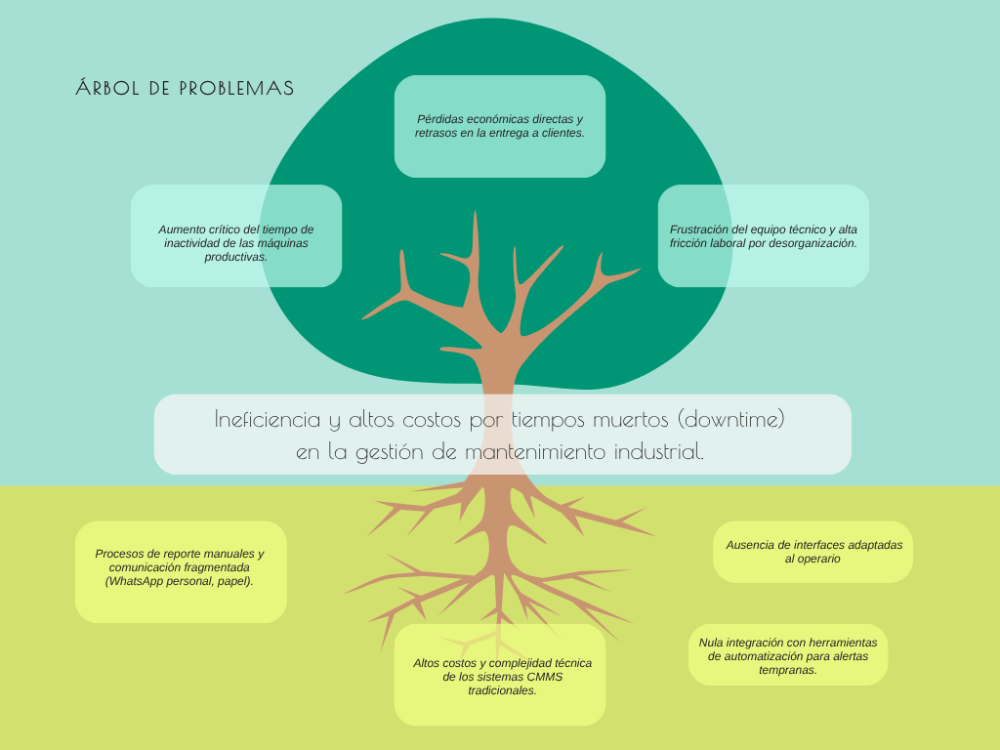<br>
  <em>Fuente: Elaboración propia.</em>
</div>

### Diagrama de Ishikawa

Para complementar el análisis de la problemática, se elaboró un Diagrama de Ishikawa con el propósito de organizar las posibles causas que contribuyen a las dificultades en la gestión del mantenimiento industrial.

Las causas identificadas se agruparon en seis categorías: Proceso, Personas, Tecnología, Información, Entorno y Gestión. Esta clasificación permitió analizar la problemática desde diferentes aspectos de las operaciones industriales y establecer relaciones entre las dificultades observadas durante las entrevistas.

Entre las principales causas consideradas se encuentran la dependencia de registros manuales, la información distribuida entre diferentes herramientas, las dificultades de comunicación, la falta de seguimiento de las actividades y las limitaciones para consultar información técnica durante las intervenciones.

El diagrama permite reconocer que los problemas de mantenimiento no dependen únicamente de las herramientas tecnológicas utilizadas, sino también de la organización de los procesos, la coordinación del personal y la disponibilidad de información actualizada.

Este análisis contribuye a identificar las necesidades que FixCore busca atender mediante la centralización de información, la gestión de Órdenes de Trabajo, la programación de mantenimientos, el control de repuestos y la comunicación entre los participantes.

<div align="center">
  <strong>Gráfico 3: Diagrama de Ishikawa</strong><br><br>
  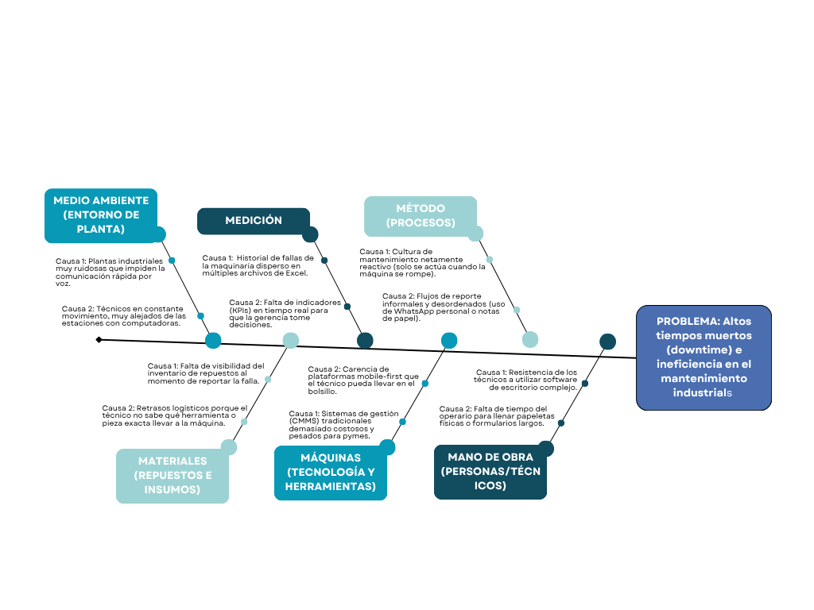<br>
  <em>Fuente: Elaboración propia.</em>
</div>

### 2.3.1. User Personas.

A partir del análisis de las entrevistas realizadas a los tres segmentos objetivo de FixCore, se desarrollaron tres User Personas representativos. Cada uno reúne los principales objetivos, motivaciones, frustraciones, habilidades, comportamientos y características tecnológicas identificadas entre los participantes de cada segmento.

Los dispositivos, tecnologías y canales de comunicación incluidos en los User Personas fueron definidos a partir de los patrones identificados durante las entrevistas. Debido a que un User Persona representa las características recurrentes de un segmento y no a una única persona entrevistada, estos atributos reúnen comportamientos observados entre diferentes participantes del mismo grupo.

<div align="center">
  <strong>Gráfico 4: User Persona - Carla García, Jefa de Planta</strong><br><br>
  <br>
  <em>Fuente: Elaboración propia.</em>
</div>

<br>

<div align="center">
  <strong>Gráfico 5: User Persona - Víctor Salazar, Coordinador de Operaciones</strong><br><br>
  <br>
  <em>Fuente: Elaboración propia.</em>
</div>

<br>

<div align="center">
  <strong>Gráfico 6: User Persona - José Ramírez, Técnico de Mantenimiento Industrial</strong><br><br>
  <br>
  <em>Fuente: Elaboración propia.</em>
</div>

### 2.3.2. User Task Matrix.

El User Task Matrix de FixCore presenta las principales tareas que realizan los User Personas de los tres segmentos objetivo durante sus actividades de mantenimiento industrial. Estas tareas se identificaron a partir de las entrevistas realizadas y corresponden a los procesos actuales de los usuarios, independientemente de la implementación de FixCore.

Para analizar cada tarea, se consideran dos criterios:

- **Frecuencia (Frc):** indica qué tan seguido el User Persona realiza la tarea durante sus actividades habituales.
- **Importancia (Imp):** indica qué tan relevante es la tarea para el cumplimiento de sus responsabilidades y objetivos.

Ambos criterios se evalúan utilizando los niveles **Alta, Media y Baja**. Las valoraciones permiten comparar las actividades de los tres perfiles e identificar aquellas que tienen mayor relevancia dentro de sus procesos de trabajo.

Los User Personas considerados son los siguientes:

1. **Técnicos y Operarios de Mantenimiento Industrial:** José Ramírez, Técnico de Mantenimiento Industrial.
2. **Pymes de Manufactura y Producción:** Carla García, Jefa de Planta.
3. **Firmas Consultoras y Contratistas de Ingeniería Industrial:** Víctor Salazar, Coordinador de Operaciones.

#### User Task Matrix - FixCore

| Tareas principales | Técnico (Frc) | Técnico (Imp) | Jefa de Planta (Frc) | Jefa de Planta (Imp) | Coordinador de Operaciones (Frc) | Coordinador de Operaciones (Imp) |
| :--- | :---: | :---: | :---: | :---: | :---: | :---: |
| **Reportar fallas o paradas de maquinaria** | Alta | Alta | Media | Alta | Baja | Media |
| **Ejecutar órdenes de trabajo de mantenimiento** | Alta | Alta | Baja | Baja | Baja | Baja |
| **Registrar las actividades realizadas después de un mantenimiento** | Alta | Alta | Baja | Media | Baja | Media |
| **Consultar manuales, historial e información técnica de una máquina** | Alta | Alta | Media | Alta | Baja | Media |
| **Verificar la disponibilidad de repuestos** | Alta | Alta | Alta | Alta | Media | Alta |
| **Comunicar fallas críticas o situaciones que requieren atención inmediata** | Alta | Alta | Alta | Alta | Media | Alta |
| **Asignar técnicos para atender mantenimientos o fallas** | Baja | Baja | Alta | Alta | Alta | Alta |
| **Planificar mantenimientos preventivos** | Baja | Media | Alta | Alta | Media | Alta |
| **Generar reportes de mantenimiento y KPIs** | Baja | Baja | Media | Alta | Alta | Alta |
| **Revisar tiempos muertos y disponibilidad de maquinaria** | Baja | Media | Alta | Alta | Media | Alta |
| **Dar seguimiento al estado y cumplimiento de las órdenes de trabajo** | Media | Alta | Alta | Alta | Alta | Alta |
| **Coordinar técnicos entre diferentes plantas o clientes** | Baja | Baja | Baja | Media | Alta | Alta |

#### Análisis del User Task Matrix

La matriz permite identificar diferencias en la frecuencia e importancia de las tareas realizadas por cada User Persona, de acuerdo con sus responsabilidades dentro de los procesos de mantenimiento industrial.

En el caso de **José Ramírez, Técnico de Mantenimiento Industrial**, las actividades más frecuentes e importantes se relacionan con la ejecución directa del mantenimiento. Entre ellas destacan el reporte de fallas, la ejecución de Órdenes de Trabajo, el registro de las actividades realizadas, la consulta de información técnica de las máquinas y la verificación de repuestos.

Estas tareas reflejan un perfil principalmente operativo, que necesita acceder a información actualizada para realizar sus actividades correctamente. Antes de comenzar una intervención, el técnico debe conocer las características de la máquina, las tareas asignadas y los recursos disponibles. Asimismo, necesita mantener una comunicación constante con los responsables del mantenimiento para informar sobre fallas o situaciones que requieren atención inmediata.

En el caso de **Carla García, Jefa de Planta**, las actividades de mayor importancia están relacionadas con la planificación, supervisión y control del mantenimiento. Sus principales responsabilidades incluyen asignar técnicos, programar mantenimientos preventivos, verificar la disponibilidad de repuestos, supervisar las Órdenes de Trabajo y revisar los tiempos muertos de las máquinas.

A diferencia del Técnico, la Jefa de Planta no participa habitualmente en la ejecución directa de los mantenimientos. Su trabajo se concentra en coordinar los recursos, supervisar las actividades y mantener la continuidad de las operaciones. Por ello, necesita disponer de información actualizada que le permita identificar problemas, establecer prioridades y tomar decisiones oportunas.

Por su parte, **Víctor Salazar, Coordinador de Operaciones**, desarrolla principalmente actividades relacionadas con la gestión de técnicos, servicios, clientes y plantas industriales. Las tareas de mayor frecuencia e importancia para este perfil incluyen la asignación y coordinación de técnicos, el seguimiento de Órdenes de Trabajo y la elaboración de reportes e indicadores de mantenimiento para diferentes clientes.

El Coordinador de Operaciones también necesita verificar la disponibilidad de repuestos y recursos antes de organizar una intervención, ya que la falta de materiales o personal puede ocasionar retrasos en la atención de los servicios. Sin embargo, su participación se concentra en la coordinación y supervisión, en lugar de la ejecución directa de las actividades técnicas.

Al comparar los tres perfiles, se observa que algunas tareas son importantes para todos, aunque se realizan con diferente frecuencia. Por ejemplo, verificar la disponibilidad de repuestos es relevante porque permite conocer si existen los materiales necesarios para realizar un mantenimiento. Del mismo modo, comunicar fallas críticas resulta importante para coordinar una atención oportuna, mientras que el seguimiento de las Órdenes de Trabajo permite conocer el avance de las actividades pendientes y realizadas.

No obstante, cada perfil utiliza esta información de acuerdo con sus responsabilidades. El Técnico la necesita para ejecutar correctamente sus tareas; la Jefa de Planta, para supervisar el mantenimiento y mantener la continuidad de la producción; y el Coordinador de Operaciones, para organizar los servicios realizados en diferentes plantas y clientes.

En conjunto, el User Task Matrix permite reconocer las actividades que requieren mayor frecuencia de interacción y aquellas que tienen mayor importancia para los usuarios. Estos resultados sirven como referencia para definir las funcionalidades, los flujos de interacción y las prioridades de diseño de FixCore, considerando las necesidades específicas de cada segmento objetivo.

### 2.3.3. User Journey Mapping.

A partir de los User Personas definidos, se elaboraron tres User Journey Maps con el propósito de representar el recorrido actual de cada perfil durante las actividades relacionadas con el mantenimiento industrial. En cada mapa se muestran sus objetivos, procesos, principales problemas, experiencia emocional y oportunidades de mejora identificadas durante las entrevistas.

<div align="center">
  <strong>Gráfico 7: User Journey Map - Carla García, Jefa de Planta</strong><br><br>
  <br>
  <em>Fuente: Elaboración propia.</em>
</div>

<br>

<div align="center">
  <strong>Gráfico 8: User Journey Map - Víctor Salazar, Coordinador de Operaciones</strong><br><br>
  <br>
  <em>Fuente: Elaboración propia.</em>
</div>

<br>

<div align="center">
  <strong>Gráfico 9: User Journey Map - José Ramírez, Técnico de Mantenimiento Industrial</strong><br><br>
  <br>
  <em>Fuente: Elaboración propia.</em>
</div>
### 2.3.4. Empathy Mapping.

A partir de los User Personas definidos y de los hallazgos obtenidos en las entrevistas, se elaboraron tres Empathy Maps para profundizar en las necesidades, comportamientos, pensamientos, frustraciones y expectativas de cada perfil representativo de los segmentos objetivo de FixCore.

<div align="center">
  <strong>Gráfico 10: Empathy Map - Carla García, Jefa de Planta</strong><br><br>
  <br>
  <em>Fuente: Elaboración propia.</em>
</div>

<br>

<div align="center">
  <strong>Gráfico 11: Empathy Map - Víctor Salazar, Coordinador de Operaciones</strong><br><br>
  <br>
  <em>Fuente: Elaboración propia.</em>
</div>

<br>

<div align="center">
  <strong>Gráfico 12: Empathy Map - José Ramírez, Técnico de Mantenimiento Industrial</strong><br><br>
  <br>
  <em>Fuente: Elaboración propia.</em>
</div>
### 2.3.5. As-Is Scenario Mapping.

A partir de las necesidades y dificultades identificadas durante las entrevistas, se elaboraron tres As-Is Scenario Maps para representar cómo los usuarios realizan actualmente sus actividades de mantenimiento industrial, antes de la implementación de FixCore.

Estos mapas permiten visualizar los principales pasos de cada proceso, las herramientas utilizadas, los problemas encontrados y las oportunidades de mejora correspondientes a los tres segmentos objetivo.

<div align="center">
  <strong>Gráfico 13: As-Is Scenario Mapping - Pymes de Manufactura y Producción</strong><br><br>
  <br>
  <em>Fuente: Elaboración propia.</em>
</div>

<br>

<div align="center">
  <strong>Gráfico 14: As-Is Scenario Mapping - Firmas Consultoras y Contratistas de Ingeniería Industrial</strong><br><br>
  <br>
  <em>Fuente: Elaboración propia.</em>
</div>

<br>

<div align="center">
  <strong>Gráfico 15: As-Is Scenario Mapping - Técnicos y Operarios de Mantenimiento Industrial</strong><br><br>
  <br>
  <em>Fuente: Elaboración propia.</em>
</div>
## 2.4. Big Picture EventStorming.

El Big Picture EventStorming permite representar de manera visual los principales procesos del dominio de mantenimiento industrial. Para su elaboración se siguieron las ocho etapas del proceso de EventStorming, comenzando con la identificación de eventos del dominio y finalizando con la incorporación de los sistemas externos involucrados.

### 1- Unstructured Exploration

En esta primera etapa se realizó una exploración inicial de los eventos relevantes que ocurren actualmente dentro del dominio. Los Domain Events fueron expresados en tiempo pasado y representan situaciones relacionadas con el mantenimiento correctivo, mantenimiento preventivo, inventario y atención de servicios.

<div align="center">
  <strong>Gráfico 16: Step 1 - Unstructured Exploration</strong><br><br>
  <br>
  <em>Fuente: Elaboración propia.</em>
</div>

<br>

### 2- Timelines

En esta etapa los Domain Events identificados fueron organizados cronológicamente para representar la secuencia en la que ocurren los diferentes procesos del negocio. Se consideraron los principales flujos correspondientes al mantenimiento correctivo, mantenimiento preventivo, gestión de inventario y atención de servicios.

<div align="center">
  <strong>Gráfico 17: Step 2 - Timelines</strong><br><br>
  <br>
  <em>Fuente: Elaboración propia.</em>
</div>

<br>

### 3- Pain Points

Luego de establecer las líneas de tiempo, se identificaron los principales Pain Points presentes en los procesos actuales. Entre ellos se encuentran la información distribuida entre diferentes medios, la dificultad para conocer la disponibilidad de los técnicos, la dispersión de los manuales e historiales y los problemas relacionados con el control de repuestos.

<div align="center">
  <strong>Gráfico 18: Step 3 - Pain Points</strong><br><br>
  <br>
  <em>Fuente: Elaboración propia.</em>
</div>

<br>

### 4- Pivotal Points

En esta etapa se identificaron los Pivotal Points, los cuales representan momentos relevantes en los que se produce un cambio importante dentro del flujo del negocio. Estos puntos permiten reconocer transiciones entre distintas fases del proceso de mantenimiento.

<div align="center">
  <strong>Gráfico 19: Step 4 - Pivotal Points</strong><br><br>
  <br>
  <em>Fuente: Elaboración propia.</em>
</div>

<br>

### 5- Commands

Posteriormente se incorporaron los Commands que representan las acciones realizadas por los actores del dominio y que generan determinados Domain Events. Entre los principales actores involucrados se encuentran el Plant Manager, Technician y Operations Coordinator.

<div align="center">
  <strong>Gráfico 20: Step 5 - Commands</strong><br><br>
  <br>
  <em>Fuente: Elaboración propia.</em>
</div>

<br>

### 6- Policies

En esta etapa se agregaron las Policies que representan reglas del negocio mediante las cuales la ocurrencia de determinados eventos puede provocar la ejecución de nuevas acciones dentro del proceso.

<div align="center">
  <strong>Gráfico 21: Step 6 - Policies</strong><br><br>
  <br>
  <em>Fuente: Elaboración propia.</em>
</div>

<br>

### 7- Read Models

A continuación, se identificaron los Read Models que contienen la información necesaria para que los actores puedan tomar decisiones durante la ejecución de los procesos. Entre ellos se encuentran la lista de fallas pendientes, disponibilidad de técnicos, historial de máquinas, inventario de repuestos, calendario de mantenimiento y reportes por cliente.

<div align="center">
  <strong>Gráfico 22: Step 7 - Read Models</strong><br><br>
  <br>
  <em>Fuente: Elaboración propia.</em>
</div>

<br>

### 8- External Systems

Finalmente, se incorporaron los External Systems que actualmente intervienen en los procesos del negocio. Estos sistemas representan herramientas externas utilizadas para comunicar información, registrar datos o intercambiar documentación durante las actividades de mantenimiento.

<div align="center">
  <strong>Gráfico 23: Step 8 - External Systems</strong><br><br>
  <br>
  <em>Fuente: Elaboración propia.</em>
</div>

<br>

### Procesos clave

Luego de elaborar el Big Picture EventStorming se identificaron los siguientes procesos principales dentro del dominio:

- Gestión de mantenimiento correctivo.
- Gestión de mantenimiento preventivo.
- Gestión de inventario y repuestos.
- Gestión de Órdenes de Trabajo.
- Coordinación de técnicos.
- Registro y consulta de información técnica.
- Seguimiento de servicios y elaboración de reportes para clientes.


## 2.5. Ubiquitous Language.

Con el objetivo de mantener un lenguaje común entre los integrantes del equipo y evitar diferentes interpretaciones de los conceptos utilizados en FixCore, se definió el siguiente Ubiquitous Language. Los términos representan conceptos propios de la gestión del mantenimiento industrial y serán utilizados de forma consistente en los diferentes artefactos del proyecto.

| Término | Definición |
| :--- | :--- |
| **Jefe de Planta** | Persona responsable de supervisar las operaciones de una planta y coordinar las actividades relacionadas con el mantenimiento de sus máquinas. Puede registrar máquinas, planificar mantenimientos, gestionar Órdenes de Trabajo y consultar el estado general de las operaciones. |
| **Técnico** | Persona encargada de realizar directamente actividades de mantenimiento preventivo o correctivo sobre las máquinas. Puede consultar información técnica, atender Órdenes de Trabajo, reportar fallas y registrar las actividades y repuestos utilizados durante una intervención. |
| **Coordinador de Operaciones** | Persona encargada de organizar y supervisar las actividades de mantenimiento realizadas para diferentes clientes o plantas. Necesita conocer la disponibilidad de los técnicos, consultar el estado de los servicios y obtener información consolidada de las operaciones. |
| **Planta** | Instalación industrial en la que se encuentran las máquinas y donde se realizan actividades de producción y mantenimiento. Una planta puede contener varias máquinas y tener diferentes técnicos asociados a sus operaciones. |
| **Máquina** | Equipo utilizado dentro de una planta y que requiere seguimiento y mantenimiento durante su vida útil. Cada máquina puede tener información técnica, manuales, fallas, mantenimientos y Órdenes de Trabajo asociadas. |
| **Ficha Técnica** | Conjunto de información que describe las principales características de una máquina, como fabricante, modelo, número de serie y otros datos necesarios para su identificación y mantenimiento. |
| **Manual Técnico** | Documento que contiene información proporcionada por el fabricante o responsable del equipo para apoyar su operación, inspección, diagnóstico o mantenimiento. |
| **Falla** | Problema o comportamiento anormal detectado en una máquina que puede afectar su funcionamiento y requerir una intervención de mantenimiento. |
| **Prioridad de Falla** | Nivel utilizado para indicar la urgencia con la que una falla debe ser atendida según su impacto en las operaciones. Permite diferenciar incidencias de menor importancia de aquellas que necesitan atención inmediata. |
| **Orden de Trabajo** | Registro que formaliza una actividad de mantenimiento que debe ser realizada sobre una máquina. Contiene información sobre la actividad, el Técnico responsable, su estado y los trabajos realizados durante la intervención. |
| **Estado de Orden de Trabajo** | Situación actual de una Orden de Trabajo dentro de su ciclo de atención. Permite conocer si una actividad se encuentra pendiente, en progreso o completada. |
| **Actividad de Mantenimiento** | Trabajo realizado por un Técnico como parte de una Orden de Trabajo, como una inspección, reparación, ajuste, limpieza o cambio de componentes. |
| **Plan de Mantenimiento** | Conjunto de condiciones utilizadas para organizar la realización periódica de mantenimientos sobre una máquina. Puede definir una frecuencia y servir como base para generar mantenimientos futuros. |
| **Mantenimiento Programado** | Actividad de mantenimiento que cuenta con una fecha prevista para su realización. Puede ser reprogramada mientras todavía se encuentre pendiente. |
| **Mantenimiento Preventivo** | Mantenimiento realizado de manera planificada antes de que ocurra una falla, con el objetivo de conservar el funcionamiento de una máquina y reducir la posibilidad de interrupciones inesperadas. |
| **Mantenimiento Correctivo** | Mantenimiento realizado después de identificar una falla, con el objetivo de reparar la máquina y recuperar su funcionamiento normal. |
| **Mantenimiento Vencido** | Mantenimiento cuya fecha programada ya pasó y que todavía no ha sido completado. |
| **Repuesto** | Pieza, componente o material que puede ser utilizado durante una actividad de mantenimiento para reemplazar o reparar una parte de una máquina. |
| **Inventario** | Registro de los repuestos disponibles para realizar actividades de mantenimiento dentro de una planta. Permite controlar ingresos, consumos y ajustes de existencias. |
| **Stock** | Cantidad disponible de unidades de un determinado repuesto dentro del inventario. |
| **Stock Mínimo** | Cantidad mínima de unidades que se espera mantener disponible para un repuesto. Cuando el stock alcanza o disminuye por debajo de este valor, puede ser necesario realizar una reposición. |
| **Movimiento de Inventario** | Cambio registrado en las existencias de un repuesto como consecuencia de un ingreso, consumo o ajuste de inventario. |
| **Alerta** | Aviso generado cuando ocurre una situación que requiere la atención de uno o más responsables, como una falla crítica, un mantenimiento próximo o un nivel bajo de stock. |
| **Notificación** | Comunicación enviada a un usuario para informarle sobre un evento relacionado con sus actividades, como la asignación de una nueva Orden de Trabajo o un cambio relevante en una operación. |
| **Tiempo Muerto** | Periodo durante el cual una máquina permanece fuera de operación debido a una falla, mantenimiento u otra situación que impide su funcionamiento normal. |
| **MTTR (Mean Time To Repair)** | Indicador que representa el tiempo promedio utilizado para reparar una máquina después de una falla. Se calcula utilizando los tiempos de reparación registrados en las intervenciones completadas. |
| **Cumplimiento Preventivo** | Indicador que permite conocer qué porcentaje de los mantenimientos preventivos programados fueron realizados según la planificación establecida durante un periodo determinado. |
| **KPI de Mantenimiento** | Indicador utilizado para evaluar el desempeño de las actividades de mantenimiento. En FixCore puede incluir métricas como MTTR, Tiempo Muerto y Cumplimiento Preventivo. |
| **Historial de Mantenimiento** | Registro cronológico de las fallas, mantenimientos y actividades realizadas anteriormente sobre una máquina. |


<div style="page-break-after: always;"></div>

# Capítulo III: Requirements Specification 

## 3.1. User Stories.

Las siguientes User Stories representan las principales funcionalidades de FixCore a partir de las necesidades identificadas en los segmentos objetivo. Los criterios de aceptación fueron definidos mediante escenarios Given-When-Then, considerando tanto los casos principales como situaciones alternativas relevantes para cada funcionalidad.

| Story ID | Título | Descripción | Criterios de aceptación | Relacionado con |
| :--- | :--- | :--- | :--- | :--- |
| **US01** | Registrar planta | Como Jefe de Planta, deseo registrar una planta para organizar las máquinas que forman parte de sus operaciones. | **Escenario 1: Registro correcto de una planta.** Dado que el Jefe de Planta cuenta con la información requerida, cuando registra una nueva planta, entonces la planta queda almacenada y disponible para asociar máquinas.<br><br>**Escenario 2: Datos obligatorios incompletos.** Dado que falta información obligatoria, cuando intenta registrar la planta, entonces el registro no se completa y se indican los datos que deben ser corregidos. | EP01 |
| **US02** | Editar información de una planta | Como Jefe de Planta, deseo actualizar la información de una planta para mantener sus datos correctos. | **Escenario 1: Actualización correcta.** Dado que la planta se encuentra registrada, cuando el Jefe de Planta modifica sus datos con información válida, entonces los cambios quedan guardados.<br><br>**Escenario 2: Información no válida.** Dado que alguno de los datos ingresados no cumple con las condiciones requeridas, cuando intenta guardar los cambios, entonces la información anterior se conserva y se indican los datos que deben corregirse. | EP01 |
| **US03** | Registrar máquina | Como Jefe de Planta, deseo registrar una máquina para llevar un control de los activos que requieren mantenimiento. | **Escenario 1: Registro correcto de una máquina.** Dado que existe una planta registrada, cuando el Jefe de Planta registra una máquina con sus datos obligatorios, entonces la máquina queda registrada y asociada a la planta seleccionada.<br><br>**Escenario 2: Datos obligatorios incompletos.** Dado que falta información requerida, cuando intenta registrar la máquina, entonces el registro no se completa.<br><br>**Escenario 3: Código de máquina duplicado.** Dado que ya existe una máquina con el mismo código, cuando intenta registrar otra con ese código, entonces el sistema evita crear un registro duplicado. | EP01 |
| **US04** | Editar información de una máquina | Como Jefe de Planta, deseo actualizar los datos de una máquina para mantener su información técnica al día. | **Escenario 1: Actualización correcta.** Dado que la máquina está registrada, cuando el Jefe de Planta modifica sus datos con información válida, entonces los cambios quedan guardados.<br><br>**Escenario 2: Información no válida.** Dado que los datos ingresados son incorrectos o incompletos, cuando intenta guardar los cambios, entonces la información anterior se conserva. | EP01 |
| **US05** | Consultar ficha técnica de una máquina | Como Técnico, deseo consultar la ficha técnica de una máquina para conocer sus características antes de realizar un mantenimiento. | **Escenario 1: Consulta de una máquina existente.** Dado que la máquina se encuentra registrada, cuando el Técnico consulta su ficha técnica, entonces visualiza la información disponible como fabricante, modelo, número de serie y demás características registradas.<br><br>**Escenario 2: Máquina inexistente.** Dado que la máquina solicitada no existe, cuando intenta consultar su ficha técnica, entonces se informa que el activo no fue encontrado. | EP01 |
| **US06** | Asociar manual técnico a una máquina | Como Jefe de Planta, deseo asociar manuales a una máquina para mantener su documentación técnica centralizada. | **Escenario 1: Asociación correcta de un manual.** Dado que la máquina está registrada y el documento cumple con las condiciones permitidas, cuando el Jefe de Planta agrega el manual, entonces este queda asociado a la máquina.<br><br>**Escenario 2: Documento no permitido.** Dado que el documento no cumple con las condiciones establecidas, cuando intenta asociarlo, entonces el manual no queda registrado y se informa el motivo. | EP01 |
| **US07** | Consultar manuales de una máquina | Como Técnico, deseo consultar los manuales de una máquina para tener información de apoyo durante el mantenimiento. | **Escenario 1: Máquina con manuales registrados.** Dado que la máquina tiene documentos asociados, cuando el Técnico consulta sus manuales, entonces puede visualizar los documentos disponibles.<br><br>**Escenario 2: Máquina sin manuales.** Dado que la máquina no tiene documentos asociados, cuando realiza la consulta, entonces se informa que todavía no existen manuales registrados. | EP01 |
| **US08** | Consultar estado de una máquina | Como Jefe de Planta, deseo conocer el estado de una máquina para saber si está operativa, en mantenimiento o presenta una falla. | **Escenario 1: Consulta del estado actual.** Dado que la máquina se encuentra registrada, cuando el Jefe de Planta consulta su información, entonces visualiza su estado actual.<br><br>**Escenario 2: Estado actualizado.** Dado que la máquina presenta un cambio relacionado con una falla o mantenimiento, cuando vuelve a consultar su información, entonces visualiza el nuevo estado registrado. | EP01 |
| **US09** | Consultar historial de una máquina | Como Jefe de Planta, deseo revisar el historial de una máquina para conocer sus fallas y mantenimientos anteriores. | **Escenario 1: Máquina con historial.** Dado que existen actividades anteriores registradas para la máquina, cuando el Jefe de Planta consulta su historial, entonces obtiene los eventos registrados en orden cronológico.<br><br>**Escenario 2: Máquina sin historial.** Dado que la máquina todavía no tiene actividades registradas, cuando consulta su historial, entonces se informa que aún no existen registros. | EP01 |
| **US10** | Programar mantenimiento preventivo | Como Jefe de Planta, deseo programar un mantenimiento preventivo para reducir el riesgo de fallas inesperadas en una máquina. | **Escenario 1: Programación correcta.** Dado que la máquina se encuentra registrada, cuando el Jefe de Planta programa un mantenimiento con la información requerida, entonces la actividad queda registrada para la fecha indicada.<br><br>**Escenario 2: Información incompleta.** Dado que faltan datos obligatorios, cuando intenta programar el mantenimiento, entonces la actividad no queda registrada. | EP02 |
| **US11** | Definir frecuencia de mantenimiento | Como Jefe de Planta, deseo establecer cada cuánto debe realizarse un mantenimiento para mantener una planificación preventiva constante. | **Escenario 1: Frecuencia válida.** Dado que existe un plan de mantenimiento preventivo, cuando el Jefe de Planta establece una frecuencia válida, entonces esta queda registrada para calcular las siguientes fechas de mantenimiento.<br><br>**Escenario 2: Frecuencia no válida.** Dado que la frecuencia ingresada no cumple con las condiciones permitidas, cuando intenta guardarla, entonces la programación anterior se mantiene sin cambios. | EP02 |
| **US12** | Editar mantenimiento programado | Como Jefe de Planta, deseo modificar los datos de un mantenimiento pendiente para corregir cambios en su planificación. | **Escenario 1: Modificación de mantenimiento pendiente.** Dado que el mantenimiento todavía se encuentra pendiente, cuando el Jefe de Planta modifica información válida, entonces los cambios quedan registrados.<br><br>**Escenario 2: Mantenimiento completado.** Dado que el mantenimiento ya fue completado, cuando intenta modificar su planificación, entonces el registro realizado se conserva sin cambios. | EP02 |
| **US13** | Reprogramar mantenimiento | Como Jefe de Planta, deseo cambiar la fecha de un mantenimiento para adaptarlo a cambios en las operaciones de la planta. | **Escenario 1: Reprogramación correcta.** Dado que el mantenimiento se encuentra pendiente, cuando el Jefe de Planta selecciona una nueva fecha válida, entonces el mantenimiento queda reprogramado.<br><br>**Escenario 2: Fecha no válida.** Dado que la nueva fecha no cumple con las condiciones de programación, cuando intenta realizar el cambio, entonces se conserva la fecha anterior. | EP02 |
| **US14** | Consultar calendario de mantenimientos | Como Jefe de Planta, deseo consultar los mantenimientos programados para organizar las actividades del equipo técnico. | **Escenario 1: Periodo con mantenimientos.** Dado que existen mantenimientos programados, cuando el Jefe de Planta consulta un periodo determinado, entonces visualiza las actividades correspondientes a dicho periodo.<br><br>**Escenario 2: Periodo sin mantenimientos.** Dado que no existen actividades programadas para el periodo consultado, cuando realiza la búsqueda, entonces se informa que no existen mantenimientos registrados. | EP02 |
| **US15** | Consultar mantenimientos por planta | Como Coordinador de Operaciones, deseo consultar los mantenimientos de cada planta atendida para organizar el trabajo de los técnicos entre diferentes clientes. | **Escenario 1: Consulta de una planta con mantenimientos.** Dado que el Coordinador de Operaciones tiene acceso a varias plantas, cuando selecciona una de ellas, entonces visualiza únicamente los mantenimientos correspondientes a esa planta.<br><br>**Escenario 2: Planta sin mantenimientos registrados.** Dado que la planta seleccionada no tiene actividades programadas, cuando realiza la consulta, entonces se informa que no existen mantenimientos registrados. | EP02 |
| **US16** | Consultar próximos mantenimientos | Como Técnico, deseo conocer los próximos mantenimientos que debo realizar para prepararme antes de iniciar mis actividades. | **Escenario 1: Técnico con mantenimientos próximos.** Dado que existen mantenimientos próximos asignados al Técnico, cuando consulta sus actividades, entonces visualiza las tareas pendientes ordenadas por fecha.<br><br>**Escenario 2: Técnico sin mantenimientos próximos.** Dado que no tiene actividades próximas asignadas, cuando realiza la consulta, entonces se informa que no existen mantenimientos pendientes. | EP02 |
| **US17** | Identificar mantenimientos vencidos | Como Jefe de Planta, deseo identificar los mantenimientos que no fueron realizados a tiempo para tomar acciones antes de que ocurra una falla. | **Escenario 1: Mantenimiento vencido.** Dado que la fecha programada ya pasó y el mantenimiento continúa pendiente, cuando el Jefe de Planta consulta las actividades, entonces el mantenimiento aparece identificado como vencido.<br><br>**Escenario 2: Mantenimiento realizado a tiempo.** Dado que el mantenimiento fue completado dentro de la fecha prevista, cuando consulta su estado, entonces no aparece como vencido. | EP02 |
| **US18** | Suspender o reactivar mantenimiento preventivo | Como Jefe de Planta, deseo suspender o reactivar un plan preventivo para adaptarlo al estado actual de una máquina. | **Escenario 1: Suspender un plan activo.** Dado que el plan preventivo se encuentra activo, cuando el Jefe de Planta decide suspenderlo, entonces el plan cambia a estado suspendido y deja de generar nuevas programaciones mientras permanezca en ese estado.<br><br>**Escenario 2: Reactivar un plan suspendido.** Dado que el plan preventivo se encuentra suspendido, cuando el Jefe de Planta lo reactiva, entonces vuelve a considerar su programación establecida. | EP02 |
| **US19** | Reportar falla de una máquina | Como Técnico, deseo reportar rápidamente una falla para que pueda ser atendida y no se pierda entre otros medios de comunicación. | **Escenario 1: Registro correcto de una falla.** Dado que la máquina se encuentra registrada, cuando el Técnico reporta una falla con la información requerida, entonces la incidencia queda registrada y disponible para su atención.<br><br>**Escenario 2: Información incompleta.** Dado que falta información obligatoria, cuando intenta registrar la falla, entonces la incidencia no se crea y se indican los datos faltantes. | EP03 |
| **US20** | Asignar prioridad a una falla | Como Jefe de Planta, deseo indicar la prioridad de una falla para atender primero las incidencias que generan mayor impacto en la producción. | **Escenario 1: Asignación de prioridad.** Dado que existe una falla registrada, cuando el Jefe de Planta selecciona una prioridad válida, entonces esta queda asociada a la incidencia.<br><br>**Escenario 2: Prioridad no válida.** Dado que el valor indicado no corresponde a una prioridad permitida, cuando intenta guardarlo, entonces la prioridad de la falla no se modifica. | EP03 |
| **US21** | Consultar fallas pendientes | Como Jefe de Planta, deseo consultar las fallas pendientes para conocer qué máquinas requieren atención. | **Escenario 1: Existen fallas pendientes.** Dado que existen incidencias que todavía requieren atención, cuando el Jefe de Planta consulta las fallas pendientes, entonces visualiza dichas incidencias.<br><br>**Escenario 2: No existen fallas pendientes.** Dado que todas las incidencias fueron atendidas, cuando realiza la consulta, entonces se informa que no existen fallas pendientes. | EP03 |
| **US22** | Consultar detalle de una falla | Como Jefe de Planta, deseo revisar la información de una falla para entender qué ocurrió antes de coordinar su atención. | **Escenario 1: Consulta de una falla existente.** Dado que la incidencia se encuentra registrada, cuando el Jefe de Planta consulta su detalle, entonces visualiza la máquina afectada, descripción, fecha, prioridad y estado.<br><br>**Escenario 2: Falla inexistente.** Dado que la incidencia solicitada no existe, cuando intenta consultarla, entonces se informa que no fue encontrada. | EP03 |
| **US23** | Generar orden correctiva desde una falla | Como Jefe de Planta, deseo crear una Orden de Trabajo a partir de una falla para iniciar formalmente su reparación. | **Escenario 1: Generación correcta de una orden.** Dado que existe una falla pendiente sin una Orden de Trabajo activa, cuando el Jefe de Planta genera una orden correctiva, entonces la orden queda registrada y asociada con la falla y la máquina correspondiente.<br><br>**Escenario 2: Falla con una orden activa.** Dado que la falla ya tiene una Orden de Trabajo activa, cuando intenta generar otra, entonces no se crea una orden duplicada. | EP03 |
| **US24** | Generar orden de mantenimiento preventivo | Como Jefe de Planta, deseo generar una Orden de Trabajo para un mantenimiento programado para organizar su ejecución. | **Escenario 1: Generación correcta de una orden preventiva.** Dado que existe un mantenimiento preventivo pendiente sin una orden asociada, cuando el Jefe de Planta genera la Orden de Trabajo, entonces ambos registros quedan relacionados.<br><br>**Escenario 2: Mantenimiento con orden existente.** Dado que el mantenimiento ya tiene una Orden de Trabajo activa, cuando intenta generar otra, entonces no se crea una orden duplicada. | EP03 |
| **US25** | Asignar técnico a una orden | Como Jefe de Planta, deseo asignar una Orden de Trabajo a un Técnico para definir quién será responsable del mantenimiento. | **Escenario 1: Técnico disponible.** Dado que la Orden de Trabajo se encuentra pendiente y existe un Técnico disponible, cuando el Jefe de Planta realiza la asignación, entonces el Técnico queda registrado como responsable de la orden.<br><br>**Escenario 2: Técnico no disponible.** Dado que el Técnico seleccionado no se encuentra disponible para la actividad, cuando intenta asignarlo, entonces la asignación no se completa. | EP03 |
| **US26** | Reasignar orden de trabajo | Como Jefe de Planta, deseo cambiar el Técnico responsable de una orden para responder a cambios de disponibilidad. | **Escenario 1: Reasignación de una orden activa.** Dado que la orden todavía no ha sido completada, cuando el Jefe de Planta selecciona otro Técnico disponible, entonces el responsable de la orden queda actualizado.<br><br>**Escenario 2: Orden completada.** Dado que la Orden de Trabajo ya fue completada, cuando intenta reasignarla, entonces el responsable registrado se conserva. | EP03 |
| **US27** | Consultar órdenes asignadas | Como Técnico, deseo consultar mis Órdenes de Trabajo para saber qué actividades debo atender durante mi turno. | **Escenario 1: Técnico con órdenes asignadas.** Dado que existen Órdenes de Trabajo asignadas al Técnico, cuando consulta sus actividades, entonces visualiza únicamente las órdenes que le corresponden.<br><br>**Escenario 2: Técnico sin órdenes pendientes.** Dado que no tiene Órdenes de Trabajo pendientes, cuando realiza la consulta, entonces se informa que no existen actividades asignadas. | EP03 |
| **US28** | Iniciar orden de trabajo | Como Técnico, deseo indicar que he comenzado una Orden de Trabajo para registrar desde cuándo se está atendiendo el mantenimiento. | **Escenario 1: Inicio correcto de una orden.** Dado que la Orden de Trabajo se encuentra pendiente y está asignada al Técnico, cuando este inicia la actividad, entonces la orden cambia a estado en progreso y queda registrada la hora de inicio.<br><br>**Escenario 2: Orden asignada a otro Técnico.** Dado que la orden no está asignada al Técnico que intenta iniciarla, cuando realiza la acción, entonces el estado de la orden no cambia. | EP03 |
| **US29** | Registrar trabajo realizado | Como Técnico, deseo registrar lo realizado durante el mantenimiento para mantener una evidencia clara del trabajo efectuado. | **Escenario 1: Registro correcto de actividades.** Dado que la Orden de Trabajo se encuentra en progreso, cuando el Técnico registra las actividades realizadas con la información requerida, entonces estas quedan asociadas a la orden.<br><br>**Escenario 2: Información incompleta.** Dado que falta información requerida sobre el trabajo realizado, cuando intenta guardar el registro, entonces la actividad no queda registrada. | EP03 |
| **US30** | Cerrar orden de trabajo | Como Técnico, deseo cerrar una Orden de Trabajo cuando termino el mantenimiento para dejar registrada su finalización. | **Escenario 1: Cierre correcto de una orden.** Dado que la Orden de Trabajo está en progreso y contiene la información requerida sobre el mantenimiento realizado, cuando el Técnico la finaliza, entonces cambia a estado completado y queda registrada la fecha de finalización.<br><br>**Escenario 2: Información pendiente.** Dado que faltan datos necesarios del mantenimiento, cuando intenta cerrar la orden, entonces esta permanece en progreso y se indican los datos pendientes. | EP03 |
| **US31** | Registrar repuesto | Como Jefe de Planta, deseo registrar un repuesto para controlar los materiales disponibles para los mantenimientos. | **Escenario 1: Registro correcto de un repuesto.** Dado que el Jefe de Planta cuenta con la información requerida, cuando registra un nuevo repuesto, entonces este queda almacenado en el inventario.<br><br>**Escenario 2: Información incompleta.** Dado que falta información obligatoria, cuando intenta registrar el repuesto, entonces el registro no se completa.<br><br>**Escenario 3: Código duplicado.** Dado que ya existe un repuesto con el mismo código, cuando intenta registrar otro con dicho código, entonces no se crea un registro duplicado. | EP04 |
| **US32** | Editar información de un repuesto | Como Jefe de Planta, deseo actualizar los datos de un repuesto para mantener correcta la información del inventario. | **Escenario 1: Actualización correcta.** Dado que el repuesto se encuentra registrado, cuando el Jefe de Planta modifica sus datos con información válida, entonces los cambios quedan guardados.<br><br>**Escenario 2: Información no válida.** Dado que los datos ingresados no cumplen con las condiciones requeridas, cuando intenta guardarlos, entonces se conserva la información anterior. | EP04 |
| **US33** | Consultar stock de repuestos | Como Técnico, deseo consultar la cantidad disponible de un repuesto para saber si puedo utilizarlo durante un mantenimiento. | **Escenario 1: Repuesto con existencias.** Dado que el repuesto está registrado y cuenta con unidades disponibles, cuando el Técnico consulta su stock, entonces visualiza la cantidad existente.<br><br>**Escenario 2: Repuesto agotado.** Dado que el repuesto no tiene unidades disponibles, cuando consulta su stock, entonces se indica que se encuentra agotado. | EP04 |
| **US34** | Buscar repuestos | Como Técnico, deseo buscar un repuesto para encontrar rápidamente el material que necesito durante una reparación. | **Escenario 1: Búsqueda con resultados.** Dado que existen repuestos que coinciden con los criterios ingresados, cuando el Técnico realiza la búsqueda, entonces obtiene los resultados correspondientes.<br><br>**Escenario 2: Búsqueda sin resultados.** Dado que ningún repuesto coincide con los criterios ingresados, cuando realiza la búsqueda, entonces se informa que no existen resultados. | EP04 |
| **US35** | Definir stock mínimo | Como Jefe de Planta, deseo establecer una cantidad mínima para cada repuesto para saber cuándo es necesario reponerlo. | **Escenario 1: Stock mínimo válido.** Dado que el repuesto está registrado, cuando el Jefe de Planta establece una cantidad mínima válida, entonces el límite queda almacenado.<br><br>**Escenario 2: Cantidad no válida.** Dado que la cantidad indicada no es válida, cuando intenta guardarla, entonces el stock mínimo anterior se mantiene sin cambios. | EP04 |
| **US36** | Registrar ingreso de repuestos | Como Jefe de Planta, deseo registrar el ingreso de nuevas unidades para mantener actualizado el inventario. | **Escenario 1: Registro de un ingreso válido.** Dado que el repuesto se encuentra registrado, cuando el Jefe de Planta registra una cantidad mayor a cero, entonces el stock aumenta en la cantidad indicada y se registra el movimiento.<br><br>**Escenario 2: Cantidad no válida.** Dado que la cantidad ingresada es igual o menor a cero, cuando intenta registrar el ingreso, entonces las existencias permanecen sin cambios. | EP04 |
| **US37** | Ajustar existencias de inventario | Como Jefe de Planta, deseo corregir las existencias registradas para solucionar diferencias encontradas en el inventario real. | **Escenario 1: Ajuste correcto de existencias.** Dado que se ha comprobado una diferencia entre el inventario registrado y el inventario real, cuando el Jefe de Planta registra una nueva cantidad e indica el motivo del ajuste, entonces las existencias quedan actualizadas.<br><br>**Escenario 2: Ajuste sin información requerida.** Dado que no se indica una cantidad válida o el motivo del ajuste, cuando intenta guardar el cambio, entonces las existencias permanecen sin modificaciones. | EP04 |
| **US38** | Registrar repuestos utilizados | Como Técnico, deseo registrar los repuestos utilizados en una Orden de Trabajo para dejar constancia de los materiales consumidos. | **Escenario 1: Registro con stock disponible.** Dado que la Orden de Trabajo se encuentra en progreso y existe stock suficiente, cuando el Técnico registra el repuesto y la cantidad utilizada, entonces el consumo queda asociado a la orden.<br><br>**Escenario 2: Stock insuficiente.** Dado que la cantidad indicada supera las existencias disponibles, cuando intenta registrar el consumo, entonces la operación no se completa y se informa que no existe stock suficiente. | EP04 |
| **US39** | Actualizar stock al completar una orden | Como Jefe de Planta, deseo que el inventario considere automáticamente los repuestos utilizados en las Órdenes de Trabajo para mantener actualizado el stock disponible. | **Escenario 1: Orden con repuestos utilizados.** Dado que una Orden de Trabajo contiene repuestos registrados como utilizados, cuando la orden se completa, entonces las cantidades correspondientes son descontadas del inventario.<br><br>**Escenario 2: Orden sin repuestos utilizados.** Dado que una Orden de Trabajo no tiene repuestos registrados, cuando se completa, entonces las existencias del inventario permanecen sin cambios. | EP04 |
| **US40** | Consultar historial de inventario | Como Jefe de Planta, deseo consultar los movimientos de los repuestos para conocer cómo han cambiado sus existencias. | **Escenario 1: Repuesto con movimientos registrados.** Dado que existen movimientos de inventario, cuando el Jefe de Planta consulta el historial de un repuesto, entonces visualiza los ingresos, consumos y ajustes registrados.<br><br>**Escenario 2: Repuesto sin movimientos.** Dado que no existen movimientos asociados al repuesto, cuando consulta su historial, entonces se informa que todavía no tiene actividad registrada. | EP04 |
| **US41** | Consultar resumen de operaciones | Como Jefe de Planta, deseo consultar un resumen general del mantenimiento para conocer rápidamente la situación de las máquinas de la planta. | **Escenario 1: Planta con información operativa.** Dado que existen registros de máquinas, fallas, mantenimientos y Órdenes de Trabajo, cuando el Jefe de Planta consulta el resumen de operaciones, entonces visualiza la información consolidada disponible.<br><br>**Escenario 2: Planta sin información suficiente.** Dado que todavía no existen registros suficientes, cuando consulta el resumen, entonces se muestran únicamente los datos disponibles sin generar información inexistente. | EP05 |
| **US42** | Consultar tiempo muerto de las máquinas | Como Jefe de Planta, deseo conocer el Tiempo Muerto de las máquinas para identificar qué equipos generan mayores interrupciones en la producción. | **Escenario 1: Máquina con periodos de inactividad.** Dado que existen periodos de inactividad registrados, cuando el Jefe de Planta consulta el Tiempo Muerto de la máquina, entonces visualiza el tiempo acumulado correspondiente al periodo seleccionado.<br><br>**Escenario 2: Máquina sin inactividad registrada.** Dado que la máquina no registra periodos de inactividad, cuando consulta el indicador, entonces el Tiempo Muerto mostrado es cero. | EP05 |
| **US43** | Consultar MTTR | Como Jefe de Planta, deseo consultar el tiempo medio de reparación para evaluar qué tan rápido son atendidas las fallas. | **Escenario 1: Existen reparaciones completadas.** Dado que existen fallas con tiempos de reparación registrados, cuando el Jefe de Planta consulta el MTTR de un periodo, entonces visualiza el promedio calculado a partir de dichas reparaciones.<br><br>**Escenario 2: No existen datos suficientes.** Dado que no existen reparaciones completadas durante el periodo consultado, cuando solicita el MTTR, entonces se informa que todavía no existen datos suficientes para calcularlo. | EP05 |
| **US44** | Consultar cumplimiento preventivo | Como Jefe de Planta, deseo conocer el nivel de cumplimiento de los mantenimientos preventivos para saber si las revisiones se realizan dentro de las fechas planificadas. | **Escenario 1: Periodo con mantenimientos.** Dado que existen mantenimientos preventivos programados y completados, cuando el Jefe de Planta consulta el cumplimiento de un periodo, entonces visualiza el porcentaje correspondiente.<br><br>**Escenario 2: Periodo sin mantenimientos.** Dado que no existen mantenimientos programados para el periodo seleccionado, cuando realiza la consulta, entonces se informa que no existen datos para calcular el indicador. | EP05 |
| **US45** | Consultar estado de las órdenes de trabajo | Como Jefe de Planta, deseo conocer cuántas Órdenes de Trabajo están pendientes, en progreso o completadas para supervisar las actividades de mantenimiento. | **Escenario 1: Existen Órdenes de Trabajo.** Dado que existen órdenes registradas, cuando el Jefe de Planta consulta su estado general, entonces visualiza las cantidades agrupadas por estado.<br><br>**Escenario 2: No existen Órdenes de Trabajo.** Dado que todavía no existen órdenes registradas, cuando realiza la consulta, entonces se informa que no existen datos disponibles. | EP05 |
| **US46** | Consultar actividad de técnicos | Como Coordinador de Operaciones, deseo consultar las Órdenes de Trabajo realizadas por los técnicos para conocer su actividad y organizar mejor los recursos de la empresa. | **Escenario 1: Técnico con actividad registrada.** Dado que el Técnico tiene Órdenes de Trabajo realizadas durante el periodo seleccionado, cuando el Coordinador de Operaciones consulta su actividad, entonces visualiza los trabajos correspondientes.<br><br>**Escenario 2: Técnico sin actividad registrada.** Dado que el Técnico no registra Órdenes de Trabajo durante el periodo seleccionado, cuando se realiza la consulta, entonces se informa que no existen registros. | EP05 |
| **US47** | Generar reporte por cliente | Como Coordinador de Operaciones, deseo generar un reporte de mantenimiento para cada cliente para entregar información clara sobre sus máquinas y servicios realizados. | **Escenario 1: Cliente con información registrada.** Dado que existen registros de mantenimiento del cliente durante el periodo seleccionado, cuando el Coordinador de Operaciones genera el reporte, entonces obtiene información relacionada con sus máquinas, fallas, mantenimientos y Órdenes de Trabajo.<br><br>**Escenario 2: Periodo sin información.** Dado que no existen registros del cliente durante el periodo seleccionado, cuando intenta generar el reporte, entonces se informa que no existen datos disponibles. | EP05 |
| **US48** | Recibir alerta de mantenimiento próximo | Como Jefe de Planta, deseo recibir una alerta antes de una fecha de mantenimiento para evitar que una revisión preventiva sea olvidada. | **Escenario 1: Mantenimiento próximo.** Dado que existe un mantenimiento programado próximo a su fecha de ejecución, cuando se alcanza el periodo configurado para el aviso, entonces se genera una alerta para los responsables definidos.<br><br>**Escenario 2: Mantenimiento ya completado.** Dado que el mantenimiento fue completado antes de la fecha del aviso, cuando se alcanza el periodo configurado, entonces no se genera una alerta pendiente. | EP06 |
| **US49** | Recibir alerta de falla crítica | Como Jefe de Planta, deseo recibir una alerta cuando se registra una falla crítica para coordinar su atención lo antes posible. | **Escenario 1: Registro de una falla crítica.** Dado que una falla es registrada con prioridad crítica, cuando el registro queda confirmado, entonces se genera una alerta para los responsables configurados.<br><br>**Escenario 2: Falla con otra prioridad.** Dado que una falla tiene una prioridad diferente a crítica, cuando queda registrada, entonces no se genera una alerta de falla crítica. | EP06 |
| **US50** | Recibir notificación de orden asignada | Como Técnico, deseo recibir una notificación cuando se me asigna una Orden de Trabajo para conocer que tengo una nueva actividad pendiente. | **Escenario 1: Nueva asignación.** Dado que una Orden de Trabajo es asignada al Técnico, cuando la asignación queda registrada, entonces se genera una notificación para dicho Técnico.<br><br>**Escenario 2: Reasignación de una orden.** Dado que una orden es reasignada a otro Técnico, cuando se confirma el cambio, entonces el nuevo responsable recibe la notificación correspondiente. | EP06 |
| **US51** | Recibir alerta de stock bajo | Como Jefe de Planta, deseo recibir una alerta cuando un repuesto alcanza su stock mínimo para poder reponerlo antes de que se agote. | **Escenario 1: Stock igual o inferior al mínimo.** Dado que el stock de un repuesto alcanza o baja del mínimo establecido, cuando se actualizan las existencias, entonces se genera una alerta de stock bajo.<br><br>**Escenario 2: Stock superior al mínimo.** Dado que las existencias permanecen por encima del nivel mínimo, cuando se actualiza el inventario, entonces no se genera una alerta de stock bajo. | EP06 |
| **US52** | Configurar destinatarios de alertas | Como Jefe de Planta, deseo definir qué responsables deben recibir cada tipo de alerta para que la información llegue a las personas adecuadas. | **Escenario 1: Agregar destinatario.** Dado que existe un usuario autorizado, cuando el Jefe de Planta lo configura como destinatario de un tipo de alerta, entonces queda asociado a dicha notificación.<br><br>**Escenario 2: Retirar destinatario.** Dado que un usuario se encuentra configurado como destinatario, cuando el Jefe de Planta lo retira de la configuración, entonces deja de recibir futuras alertas de ese tipo. | EP06 |
| **US53** | Recibir alertas mediante WhatsApp | Como Jefe de Planta, deseo recibir las alertas importantes mediante WhatsApp para enterarme de situaciones urgentes aunque no esté usando FixCore. | **Escenario 1: Envío correcto de una alerta.** Dado que ocurre un evento configurado para enviar una notificación externa y existe un destinatario definido, cuando FixCore genera la alerta, entonces el mensaje es enviado mediante el servicio de WhatsApp integrado.<br><br>**Escenario 2: Servicio de WhatsApp no disponible.** Dado que el servicio externo presenta un error, cuando FixCore intenta enviar la alerta, entonces el fallo queda registrado sin perder la información del evento que originó la notificación. | EP06 |
| **US54** | Iniciar sesión | Como usuario registrado, deseo iniciar sesión en FixCore para acceder a las funciones correspondientes a mi cuenta. | **Escenario 1: Credenciales correctas.** Dado que el usuario tiene una cuenta activa, cuando ingresa credenciales correctas, entonces puede acceder a FixCore y visualizar las funciones correspondientes a su perfil.<br><br>**Escenario 2: Credenciales incorrectas.** Dado que las credenciales ingresadas no son correctas, cuando intenta iniciar sesión, entonces el acceso es rechazado.<br><br>**Escenario 3: Cuenta inactiva.** Dado que la cuenta del usuario está inactiva, cuando intenta iniciar sesión, entonces no puede acceder al sistema. | EP07 |
| **US55** | Recuperar acceso a la cuenta | Como usuario registrado, deseo recuperar el acceso cuando olvido mi contraseña para volver a utilizar FixCore. | **Escenario 1: Cuenta registrada.** Dado que el usuario tiene una cuenta registrada, cuando solicita recuperar su acceso utilizando los datos asociados a la cuenta, entonces se inicia el proceso de recuperación correspondiente.<br><br>**Escenario 2: Datos sin una cuenta asociada.** Dado que los datos ingresados no corresponden a una cuenta registrada, cuando se solicita la recuperación, entonces ninguna cuenta es modificada ni se revela información privada sobre los usuarios registrados. | EP07 |
| **US56** | Registrar técnico | Como Jefe de Planta, deseo registrar Técnicos para poder asignarles las actividades de mantenimiento de la empresa. | **Escenario 1: Registro correcto.** Dado que el Jefe de Planta proporciona la información requerida del Técnico, cuando realiza el registro, entonces el Técnico queda disponible para ser asignado a actividades.<br><br>**Escenario 2: Técnico ya registrado.** Dado que ya existe un usuario con los mismos datos de identificación, cuando intenta registrarlo nuevamente, entonces no se crea un registro duplicado. | EP07 |
| **US57** | Editar información de un técnico | Como Jefe de Planta, deseo actualizar la información de un Técnico para mantener sus datos correctamente registrados. | **Escenario 1: Actualización correcta.** Dado que el Técnico se encuentra registrado, cuando el Jefe de Planta modifica sus datos con información válida, entonces los cambios quedan guardados.<br><br>**Escenario 2: Información no válida.** Dado que los datos ingresados no cumplen con las condiciones requeridas, cuando intenta actualizar la información, entonces se conservan los datos anteriores. | EP07 |
| **US58** | Asignar acceso según responsabilidad | Como Coordinador de Operaciones, deseo definir a qué plantas puede acceder cada usuario para organizar el trabajo de los técnicos que atienden diferentes clientes. | **Escenario 1: Asignación de acceso.** Dado que el usuario se encuentra registrado, cuando el Coordinador de Operaciones le asigna acceso a una planta, entonces puede consultar la información correspondiente a dicha planta.<br><br>**Escenario 2: Acceso no autorizado.** Dado que un usuario no tiene acceso asignado a una planta determinada, cuando intenta consultar su información, entonces la solicitud es rechazada. | EP07 |
| **US59** | Conocer FixCore | Como Visitante, deseo conocer qué es FixCore para entender qué problema de mantenimiento industrial busca resolver. | **Escenario 1: Consulta de la presentación principal.** Dado que el Visitante accede a la Landing Page, cuando visualiza la sección principal, entonces puede identificar el propósito general de FixCore y el problema que busca resolver.<br><br>**Escenario 2: Consulta de la propuesta de valor.** Dado que el Visitante continúa recorriendo la Landing Page, cuando revisa la información del producto, entonces puede conocer de manera general cómo FixCore apoya la gestión del mantenimiento industrial. | EP08 |
| **US60** | Conocer funcionalidades de FixCore | Como Visitante, deseo conocer las principales funcionalidades de FixCore para saber cómo puede ayudar a organizar el mantenimiento de una empresa. | **Escenario 1: Consulta de funcionalidades.** Dado que el Visitante se encuentra en la Landing Page, cuando accede a la sección de funcionalidades, entonces puede conocer las principales características ofrecidas por FixCore.<br><br>**Escenario 2: Consulta del beneficio de una funcionalidad.** Dado que una funcionalidad se encuentra presentada en la Landing Page, cuando el Visitante revisa su información, entonces puede comprender qué problema o necesidad busca atender. | EP08 |
| **US61** | Conocer beneficios según el segmento | Como Visitante, deseo conocer cómo FixCore puede ayudar a mi tipo de empresa o actividad para determinar si la solución responde a mis necesidades. | **Escenario 1: Pyme de manufactura o producción.** Dado que el Visitante pertenece a una pyme manufacturera, cuando consulta la información dirigida a su segmento, entonces encuentra beneficios relacionados con el control de máquinas, fallas y mantenimientos.<br><br>**Escenario 2: Firma consultora o contratista.** Dado que el Visitante pertenece a una firma contratista, cuando consulta la información dirigida a su segmento, entonces encuentra beneficios relacionados con la coordinación de técnicos, clientes y plantas.<br><br>**Escenario 3: Técnico u operario.** Dado que el Visitante realiza actividades técnicas de mantenimiento, cuando consulta la información dirigida a su segmento, entonces encuentra beneficios relacionados con el acceso a tareas, información de máquinas y repuestos desde el lugar de trabajo. | EP08 |
| **US62** | Consultar planes de FixCore | Como Visitante, deseo conocer los planes disponibles para evaluar qué alternativa se adapta mejor a mi empresa. | **Escenario 1: Consulta de planes disponibles.** Dado que existen diferentes planes de FixCore, cuando el Visitante accede a la sección de precios, entonces puede comparar sus características principales.<br><br>**Escenario 2: Consulta del Plan Freemium.** Dado que existe una opción gratuita, cuando el Visitante revisa sus condiciones, entonces puede conocer las funcionalidades y límites incluidos. | EP08 |
| **US63** | Consultar información adicional de FixCore | Como Visitante, deseo consultar información adicional sobre FixCore para resolver dudas y conocer las condiciones relacionadas con el servicio. | **Escenario 1: Consulta de preguntas frecuentes.** Dado que el Visitante se encuentra en la Landing Page, cuando accede a la sección de preguntas frecuentes y selecciona una pregunta, entonces visualiza la respuesta correspondiente.<br><br>**Escenario 2: Consulta de términos y condiciones.** Dado que el Visitante se encuentra en la Landing Page, cuando selecciona el enlace de términos y condiciones, entonces puede acceder a la información legal correspondiente. | EP08 |
| **US64** | Acceder a la Web Application | Como Visitante, deseo acceder a la Web Application desde la Landing Page para comenzar a utilizar FixCore después de conocer la propuesta y sus planes. | **Escenario 1: Acceso mediante el llamado a la acción.** Dado que el Visitante se encuentra en la Landing Page, cuando selecciona el botón principal para comenzar a utilizar FixCore, entonces es dirigido a la Web Application.<br><br>**Escenario 2: Acceso desde un plan.** Dado que el Visitante está revisando los planes disponibles, cuando selecciona la opción para comenzar con uno de ellos, entonces es dirigido al punto de acceso o registro correspondiente de la Web Application. | EP08 |

### Technical Stories

Las siguientes Technical Stories representan capacidades técnicas necesarias para soportar las funcionalidades de la Web Application mediante la RESTful API de FixCore.

| Story ID | Título | Descripción | Criterios de aceptación | Relacionado con |
| :--- | :--- | :--- | :--- | :--- |
| **TS01** | Servicio de autenticación | Como Developer, deseo disponer de servicios RESTful de autenticación para controlar el acceso a los recursos protegidos de FixCore. | **Escenario 1: Autenticación correcta.** Dado un request con credenciales válidas, cuando la API procesa la solicitud de autenticación, entonces responde correctamente con la información necesaria para identificar la sesión del usuario.<br><br>**Escenario 2: Credenciales incorrectas.** Dado un request con credenciales incorrectas, cuando la API procesa la solicitud, entonces responde indicando que el acceso no está autorizado.<br><br>**Escenario 3: Acceso a un recurso protegido sin autenticación.** Dado un request sin una sesión válida, cuando se intenta acceder a un recurso protegido, entonces la API rechaza la solicitud. | EP09 |
| **TS02** | Servicio de plantas y máquinas | Como Developer, deseo disponer de endpoints para administrar plantas y máquinas para que la Web Application pueda gestionar los activos de FixCore. | **Escenario 1: Creación de un recurso.** Dado un request válido para registrar una planta o máquina, cuando la API procesa la solicitud, entonces el recurso queda creado y se devuelve una respuesta exitosa.<br><br>**Escenario 2: Consulta de un recurso existente.** Dado el identificador de una planta o máquina registrada, cuando la API procesa la consulta, entonces devuelve la información correspondiente.<br><br>**Escenario 3: Recurso inexistente.** Dado un identificador que no corresponde a un recurso registrado, cuando se realiza la consulta, entonces la API responde indicando que el recurso no fue encontrado. | EP09 |
| **TS03** | Servicio de mantenimiento preventivo | Como Developer, deseo disponer de endpoints para gestionar mantenimientos preventivos para permitir su programación y seguimiento desde la Web Application. | **Escenario 1: Creación de un mantenimiento.** Dado un request válido con la información requerida, cuando la API procesa la solicitud, entonces el mantenimiento preventivo queda registrado.<br><br>**Escenario 2: Consulta de mantenimientos.** Dado un request con parámetros de consulta válidos, cuando la API procesa la solicitud, entonces devuelve los mantenimientos correspondientes.<br><br>**Escenario 3: Datos de programación no válidos.** Dado un request con información incompleta o no válida, cuando se intenta crear un mantenimiento, entonces la API rechaza la solicitud e informa el problema encontrado. | EP09 |
| **TS04** | Servicio de fallas y órdenes de trabajo | Como Developer, deseo disponer de endpoints para gestionar Fallas y Órdenes de Trabajo para soportar los procesos de mantenimiento correctivo y preventivo. | **Escenario 1: Registro de una falla.** Dado un request válido con la información de una falla, cuando la API procesa la solicitud, entonces la falla queda registrada.<br><br>**Escenario 2: Creación de una Orden de Trabajo.** Dado un request válido asociado a una falla o mantenimiento preventivo, cuando la API procesa la solicitud, entonces la Orden de Trabajo queda registrada.<br><br>**Escenario 3: Recurso inexistente.** Dado un identificador que no corresponde a una falla u orden registrada, cuando se solicita el recurso, entonces la API responde indicando que no fue encontrado. | EP09 |
| **TS05** | Servicio de inventario | Como Developer, deseo disponer de endpoints para gestionar repuestos y existencias para mantener actualizado el inventario de FixCore. | **Escenario 1: Consulta de un repuesto.** Dado un request válido para consultar un repuesto registrado, cuando la API procesa la solicitud, entonces devuelve su información y existencias disponibles.<br><br>**Escenario 2: Actualización de existencias.** Dado un request válido que representa un ingreso, consumo o ajuste de inventario, cuando la API procesa la solicitud, entonces actualiza las existencias y registra el movimiento correspondiente.<br><br>**Escenario 3: Cantidad no válida.** Dado un request que contiene una cantidad no permitida, cuando la API intenta procesar la operación, entonces la modificación del inventario es rechazada. | EP09 |
| **TS06** | Servicio de métricas y reportes | Como Developer, deseo disponer de endpoints para consultar indicadores de mantenimiento y reportes para que la Web Application pueda presentar información de seguimiento. | **Escenario 1: Consulta con información disponible.** Dado un request con un periodo válido y registros suficientes, cuando la API procesa la consulta, entonces devuelve los indicadores calculados para dicho periodo.<br><br>**Escenario 2: Periodo sin información suficiente.** Dado un periodo en el que no existen registros suficientes para calcular un indicador, cuando la API procesa la consulta, entonces responde indicando que no existen datos disponibles para realizar el cálculo.<br><br>**Escenario 3: Consulta de reporte por cliente.** Dado un cliente y un periodo válidos, cuando la API procesa la solicitud, entonces devuelve la información necesaria para elaborar el reporte correspondiente. | EP09 |
| **TS07** | Servicio de notificaciones externas | Como Developer, deseo integrar la API con un servicio externo de notificaciones para enviar alertas relacionadas con eventos importantes de mantenimiento. | **Escenario 1: Envío correcto de una notificación.** Dado que ocurre un evento configurado para generar una alerta externa, cuando la API solicita el envío al servicio de notificaciones, entonces el envío queda registrado correctamente.<br><br>**Escenario 2: Error del servicio externo.** Dado que el servicio externo devuelve un error o no se encuentra disponible, cuando la API intenta enviar la notificación, entonces el fallo queda registrado sin perder el evento que originó la alerta.<br><br>**Escenario 3: Evento sin notificación externa configurada.** Dado que ocurre un evento que no tiene un envío externo configurado, cuando es procesado por la API, entonces no se solicita el envío de una notificación externa. | EP09 |


### Epics

| Epic ID | Título | Descripción |
| :--- | :--- | :--- |
| **EP01** | Gestión de Plantas y Activos | Permite registrar, organizar y consultar plantas, máquinas, fichas técnicas, manuales, estados e historiales de mantenimiento de los activos. |
| **EP02** | Mantenimiento Preventivo | Permite programar, reprogramar, consultar y controlar los mantenimientos preventivos de las máquinas y sus frecuencias de ejecución. |
| **EP03** | Gestión de Fallas y Órdenes de Trabajo | Permite reportar y priorizar fallas, generar Órdenes de Trabajo, asignar técnicos y registrar la ejecución de actividades de mantenimiento. |
| **EP04** | Inventario y Repuestos | Permite registrar, consultar y controlar repuestos, existencias, movimientos de inventario y materiales utilizados durante los mantenimientos. |
| **EP05** | Monitoreo, Métricas y Reportes | Permite consultar el estado de las operaciones, tiempos muertos, MTTR, cumplimiento preventivo, desempeño de técnicos y generar reportes de mantenimiento. |
| **EP06** | Alertas y Notificaciones | Permite generar y enviar alertas relacionadas con mantenimientos próximos, fallas críticas, Órdenes de Trabajo asignadas y niveles bajos de stock. |
| **EP07** | Gestión de Usuarios y Accesos | Permite gestionar la autenticación, recuperación de acceso, registro de técnicos y permisos de los usuarios según sus responsabilidades y plantas asignadas. |
| **EP08** | Landing Page | Permite presentar FixCore a los visitantes, mostrando su propósito, funcionalidades, beneficios para los segmentos objetivo, planes disponibles y acceso a la Web Application. |
| **EP09** | RESTful API | Agrupa las Technical Stories necesarias para brindar mediante servicios RESTful las funcionalidades de autenticación, activos, mantenimiento, fallas, Órdenes de Trabajo, inventario, métricas y notificaciones de FixCore. |


## 3.2. Impact Mapping. 

<div align="center">
  <strong>Impact Mapping - FixCore</strong><br><br>
  <br>
  <em>Fuente: Elaboración propia.</em>
</div>


## 3.3. Product Backlog.

El Product Backlog de FixCore reúne los Product Backlog Items definidos para el desarrollo de la solución. Estos incluyen las User Stories relacionadas con las necesidades de los usuarios y las Technical Stories necesarias para implementar las capacidades técnicas de la plataforma.

Los elementos fueron ordenados considerando el valor que aportan a los segmentos objetivo, las funcionalidades principales del producto y las dependencias necesarias para su implementación. Para realizar las estimaciones se utilizaron Story Points siguiendo la escala de 1, 2, 3, 5 y 8.

Enlace del Product Backlog elaborado en Trello: [https://trello.com/b/yJyuiOSO](https://trello.com/b/yJyuiOSO)

<div align="center">
  <strong>Tablero del Product Backlog en Trello</strong><br><br>
  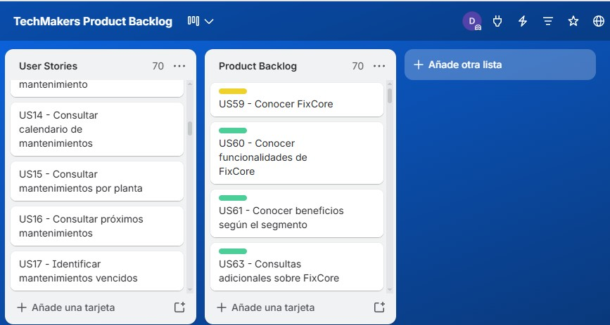<br>
  <em>Fuente: Elaboración propia.</em>
</div>

A continuación, se presenta el Product Backlog de FixCore con mayor detalle:

| # Orden | Item ID | Título | Descripción | Story Points |
| :---: | :---: | :--- | :--- | :---: |
| 01 | **US59** | Conocer FixCore | Como Visitante, deseo conocer qué es FixCore para entender qué problema de mantenimiento industrial busca resolver. | 2 |
| 02 | **US60** | Conocer funcionalidades de FixCore | Como Visitante, deseo conocer las principales funcionalidades de FixCore para saber cómo puede ayudar a organizar el mantenimiento de una empresa. | 1 |
| 03 | **US61** | Conocer beneficios según el segmento | Como Visitante, deseo conocer cómo FixCore puede ayudar a mi tipo de empresa o actividad para determinar si la solución responde a mis necesidades. | 1 |
| 04 | **US63** | Consultar información adicional de FixCore | Como Visitante, deseo consultar información adicional sobre FixCore para resolver dudas y conocer las condiciones relacionadas con el servicio. | 1 |
| 05 | **US62** | Consultar planes de FixCore | Como Visitante, deseo conocer los planes disponibles para evaluar qué alternativa se adapta mejor a mi empresa. | 2 |
| 06 | **US64** | Acceder a la Web Application | Como Visitante, deseo acceder a la Web Application desde la Landing Page para comenzar a utilizar FixCore después de conocer la propuesta y sus planes. | 2 |
| 07 | **US03** | Registrar máquina | Como Jefe de Planta, deseo registrar una máquina para llevar un control de los activos que requieren mantenimiento. | 5 |
| 08 | **US05** | Consultar ficha técnica de una máquina | Como Técnico, deseo consultar la ficha técnica de una máquina para conocer sus características antes de realizar un mantenimiento. | 3 |
| 09 | **US19** | Reportar falla de una máquina | Como Técnico, deseo reportar rápidamente una falla para que pueda ser atendida y no se pierda entre otros medios de comunicación. | 3 |
| 10 | **US21** | Consultar fallas pendientes | Como Jefe de Planta, deseo consultar las fallas pendientes para conocer qué máquinas requieren atención. | 3 |
| 11 | **US23** | Generar orden correctiva desde una falla | Como Jefe de Planta, deseo crear una Orden de Trabajo a partir de una falla para iniciar formalmente su reparación. | 5 |
| 12 | **US25** | Asignar técnico a una orden | Como Jefe de Planta, deseo asignar una Orden de Trabajo a un Técnico para definir quién será responsable del mantenimiento. | 3 |
| 13 | **US27** | Consultar órdenes asignadas | Como Técnico, deseo consultar mis Órdenes de Trabajo para saber qué actividades debo atender durante mi turno. | 3 |
| 14 | **US28** | Iniciar orden de trabajo | Como Técnico, deseo indicar que he comenzado una Orden de Trabajo para registrar desde cuándo se está atendiendo el mantenimiento. | 2 |
| 15 | **US29** | Registrar trabajo realizado | Como Técnico, deseo registrar lo realizado durante el mantenimiento para mantener una evidencia clara del trabajo efectuado. | 3 |
| 16 | **US30** | Cerrar orden de trabajo | Como Técnico, deseo cerrar una Orden de Trabajo cuando termino el mantenimiento para dejar registrada su finalización. | 5 |
| 17 | **US10** | Programar mantenimiento preventivo | Como Jefe de Planta, deseo programar un mantenimiento preventivo para reducir el riesgo de fallas inesperadas en una máquina. | 5 |
| 18 | **US14** | Consultar calendario de mantenimientos | Como Jefe de Planta, deseo consultar los mantenimientos programados para organizar las actividades del equipo técnico. | 5 |
| 19 | **US16** | Consultar próximos mantenimientos | Como Técnico, deseo conocer los próximos mantenimientos que debo realizar para prepararme antes de iniciar mis actividades. | 3 |
| 20 | **US17** | Identificar mantenimientos vencidos | Como Jefe de Planta, deseo identificar los mantenimientos que no fueron realizados a tiempo para tomar acciones antes de que ocurra una falla. | 3 |
| 21 | **US48** | Recibir alerta de mantenimiento próximo | Como Jefe de Planta, deseo recibir una alerta antes de una fecha de mantenimiento para evitar que una revisión preventiva sea olvidada. | 3 |
| 22 | **US33** | Consultar stock de repuestos | Como Técnico, deseo consultar la cantidad disponible de un repuesto para saber si puedo utilizarlo durante un mantenimiento. | 2 |
| 23 | **US38** | Registrar repuestos utilizados | Como Técnico, deseo registrar los repuestos utilizados en una Orden de Trabajo para dejar constancia de los materiales consumidos. | 5 |
| 24 | **US39** | Actualizar stock al completar una orden | Como Jefe de Planta, deseo que el inventario considere automáticamente los repuestos utilizados en las Órdenes de Trabajo para mantener actualizado el stock disponible. | 5 |
| 25 | **US35** | Definir stock mínimo | Como Jefe de Planta, deseo establecer una cantidad mínima para cada repuesto para saber cuándo es necesario reponerlo. | 2 |
| 26 | **US51** | Recibir alerta de stock bajo | Como Jefe de Planta, deseo recibir una alerta cuando un repuesto alcanza su stock mínimo para poder reponerlo antes de que se agote. | 3 |
| 27 | **US41** | Consultar resumen de operaciones | Como Jefe de Planta, deseo consultar un resumen general del mantenimiento para conocer rápidamente la situación de las máquinas de la planta. | 5 |
| 28 | **US42** | Consultar tiempo muerto de las máquinas | Como Jefe de Planta, deseo conocer el Tiempo Muerto de las máquinas para identificar qué equipos generan mayores interrupciones en la producción. | 5 |
| 29 | **US44** | Consultar cumplimiento preventivo | Como Jefe de Planta, deseo conocer el nivel de cumplimiento de los mantenimientos preventivos para saber si las revisiones se realizan dentro de las fechas planificadas. | 5 |
| 30 | **US45** | Consultar estado de las órdenes de trabajo | Como Jefe de Planta, deseo conocer cuántas Órdenes de Trabajo están pendientes, en progreso o completadas para supervisar las actividades de mantenimiento. | 3 |
| 31 | **US47** | Generar reporte por cliente | Como Coordinador de Operaciones, deseo generar un reporte de mantenimiento para cada cliente para entregar información clara sobre sus máquinas y servicios realizados. | 5 |
| 32 | **US53** | Recibir alertas mediante WhatsApp | Como Jefe de Planta, deseo recibir las alertas importantes mediante WhatsApp para enterarme de situaciones urgentes aunque no esté usando FixCore. | 5 |
| 33 | **US49** | Recibir alerta de falla crítica | Como Jefe de Planta, deseo recibir una alerta cuando se registra una falla crítica para coordinar su atención lo antes posible. | 3 |
| 34 | **US50** | Recibir notificación de orden asignada | Como Técnico, deseo recibir una notificación cuando se me asigna una Orden de Trabajo para conocer que tengo una nueva actividad pendiente. | 2 |
| 35 | **US09** | Consultar historial de una máquina | Como Jefe de Planta, deseo revisar el historial de una máquina para conocer sus fallas y mantenimientos anteriores. | 5 |
| 36 | **US08** | Consultar estado de una máquina | Como Jefe de Planta, deseo conocer el estado de una máquina para saber si está operativa, en mantenimiento o presenta una falla. | 3 |
| 37 | **US06** | Asociar manual técnico a una máquina | Como Jefe de Planta, deseo asociar manuales a una máquina para mantener su documentación técnica centralizada. | 3 |
| 38 | **US07** | Consultar manuales de una máquina | Como Técnico, deseo consultar los manuales de una máquina para tener información de apoyo durante el mantenimiento. | 2 |
| 39 | **US01** | Registrar planta | Como Jefe de Planta, deseo registrar una planta para organizar las máquinas que forman parte de sus operaciones. | 3 |
| 40 | **US02** | Editar información de una planta | Como Jefe de Planta, deseo actualizar la información de una planta para mantener sus datos correctos. | 2 |
| 41 | **US04** | Editar información de una máquina | Como Jefe de Planta, deseo actualizar los datos de una máquina para mantener su información técnica al día. | 3 |
| 42 | **US15** | Consultar mantenimientos por planta | Como Coordinador de Operaciones, deseo consultar los mantenimientos de cada planta atendida para organizar el trabajo de los técnicos entre diferentes clientes. | 3 |
| 43 | **US11** | Definir frecuencia de mantenimiento | Como Jefe de Planta, deseo establecer cada cuánto debe realizarse un mantenimiento para mantener una planificación preventiva constante. | 3 |
| 44 | **US13** | Reprogramar mantenimiento | Como Jefe de Planta, deseo cambiar la fecha de un mantenimiento para adaptarlo a cambios en las operaciones de la planta. | 2 |
| 45 | **US12** | Editar mantenimiento programado | Como Jefe de Planta, deseo modificar los datos de un mantenimiento pendiente para corregir cambios en su planificación. | 3 |
| 46 | **US18** | Suspender o reactivar mantenimiento preventivo | Como Jefe de Planta, deseo suspender o reactivar un plan preventivo para adaptarlo al estado actual de una máquina. | 2 |
| 47 | **US20** | Asignar prioridad a una falla | Como Jefe de Planta, deseo indicar la prioridad de una falla para atender primero las incidencias que generan mayor impacto en la producción. | 2 |
| 48 | **US22** | Consultar detalle de una falla | Como Jefe de Planta, deseo revisar la información de una falla para entender qué ocurrió antes de coordinar su atención. | 2 |
| 49 | **US24** | Generar orden de mantenimiento preventivo | Como Jefe de Planta, deseo generar una Orden de Trabajo para un mantenimiento programado para organizar su ejecución. | 5 |
| 50 | **US26** | Reasignar orden de trabajo | Como Jefe de Planta, deseo cambiar el Técnico responsable de una orden para responder a cambios de disponibilidad. | 2 |
| 51 | **US31** | Registrar repuesto | Como Jefe de Planta, deseo registrar un repuesto para controlar los materiales disponibles para los mantenimientos. | 3 |
| 52 | **US32** | Editar información de un repuesto | Como Jefe de Planta, deseo actualizar los datos de un repuesto para mantener correcta la información del inventario. | 2 |
| 53 | **US34** | Buscar repuestos | Como Técnico, deseo buscar un repuesto para encontrar rápidamente el material que necesito durante una reparación. | 2 |
| 54 | **US36** | Registrar ingreso de repuestos | Como Jefe de Planta, deseo registrar el ingreso de nuevas unidades para mantener actualizado el inventario. | 3 |
| 55 | **US37** | Ajustar existencias de inventario | Como Jefe de Planta, deseo corregir las existencias registradas para solucionar diferencias encontradas en el inventario real. | 3 |
| 56 | **US40** | Consultar historial de inventario | Como Jefe de Planta, deseo consultar los movimientos de los repuestos para conocer cómo han cambiado sus existencias. | 3 |
| 57 | **US43** | Consultar MTTR | Como Jefe de Planta, deseo consultar el tiempo medio de reparación para evaluar qué tan rápido son atendidas las fallas. | 5 |
| 58 | **US46** | Consultar actividad de técnicos | Como Coordinador de Operaciones, deseo consultar las Órdenes de Trabajo realizadas por los técnicos para conocer su actividad y organizar mejor los recursos de la empresa. | 5 |
| 59 | **US52** | Configurar destinatarios de alertas | Como Jefe de Planta, deseo definir qué responsables deben recibir cada tipo de alerta para que la información llegue a las personas adecuadas. | 3 |
| 60 | **US56** | Registrar técnico | Como Jefe de Planta, deseo registrar Técnicos para poder asignarles las actividades de mantenimiento de la empresa. | 3 |
| 61 | **US57** | Editar información de un técnico | Como Jefe de Planta, deseo actualizar la información de un Técnico para mantener sus datos correctamente registrados. | 2 |
| 62 | **US58** | Asignar acceso según responsabilidad | Como Coordinador de Operaciones, deseo definir a qué plantas puede acceder cada usuario para organizar el trabajo de los técnicos que atienden diferentes clientes. | 5 |
| 63 | **US54** | Iniciar sesión | Como usuario registrado, deseo iniciar sesión en FixCore para acceder a las funciones correspondientes a mi cuenta. | 3 |
| 64 | **US55** | Recuperar acceso a la cuenta | Como usuario registrado, deseo recuperar el acceso cuando olvido mi contraseña para volver a utilizar FixCore. | 5 |
| 65 | **TS01** | Servicio de autenticación | Como Developer, deseo disponer de servicios RESTful de autenticación para controlar el acceso a los recursos protegidos de FixCore. | 5 |
| 66 | **TS02** | Servicio de plantas y máquinas | Como Developer, deseo disponer de endpoints para administrar plantas y máquinas para que la Web Application pueda gestionar los activos de FixCore. | 8 |
| 67 | **TS03** | Servicio de mantenimiento preventivo | Como Developer, deseo disponer de endpoints para gestionar mantenimientos preventivos para permitir su programación y seguimiento desde la Web Application. | 8 |
| 68 | **TS04** | Servicio de fallas y órdenes de trabajo | Como Developer, deseo disponer de endpoints para gestionar Fallas y Órdenes de Trabajo para soportar los procesos de mantenimiento correctivo y preventivo. | 8 |
| 69 | **TS05** | Servicio de inventario | Como Developer, deseo disponer de endpoints para gestionar repuestos y existencias para mantener actualizado el Inventario de FixCore. | 8 |
| 70 | **TS06** | Servicio de métricas y reportes | Como Developer, deseo disponer de endpoints para consultar indicadores de mantenimiento y reportes para que la Web Application pueda presentar información de seguimiento. | 8 |
| 71 | **TS07** | Servicio de notificaciones externas | Como Developer, deseo integrar la API con un servicio externo de notificaciones para enviar alertas relacionadas con eventos importantes de mantenimiento. | 8 |

**Total estimado del Product Backlog: 258 Story Points.**

# Capítulo IV: Product Design 

## 4.1. Style Guidelines. 

### 4.1.1. General Style Guidelines. 

#### 4.1.1.1 Branding

El branding de FixCore se fundamenta en la misión de erradicar el caos operativo y reducir los altos costos por tiempos muertos (downtime) en el sector industrial. La marca busca transmitir solidez, agilidad tecnológica y pragmatismo, posicionándose como una herramienta robusta para la gerencia, pero sin fricción para el técnico de planta. A continuación se detallan los elementos fundamentales de la identidad de FixCore.

**Nombre de la Marca**
FixCore es una marca compuesta que transmite resolución y centralización. El prefijo "Fix" (reparar o solucionar en inglés) hace referencia directa a la acción principal del mantenimiento y la corrección de fallas. Por su parte, "Core" (núcleo o centro en inglés) representa el corazón de la operación industrial, centralizando los datos, reportes y métricas. La combinación transmite el mensaje de que el mantenimiento no es un gasto secundario, sino el núcleo vital para que la maquinaria y la rentabilidad de la empresa nunca se detengan.

**Logotipo**
El logotipo de FixCore consiste en un isotipo geométrico combinado con el nombre de la marca. El ícono principal es un hexágono delineado que forma un cubo isométrico, representando la estructura, la maquinaria y la industria manufacturera. En el centro de este cubo (el core), se encuentra un círculo sólido que simboliza el control centralizado y el motor del sistema. El diseño utiliza una paleta de azules eléctricos y degradados sobre un fondo oscuro, evocando tecnología moderna y precisión. La tipografía es limpia, sin serifas, dividiendo visualmente la palabra: "FIX" en color blanco para destacar la acción, y "CORE" en azul brillante, unificando el texto con el isotipo.

<div align="center">
  <strong>Gráfico: Logo de FixCore</strong><br><br>
  <br>
  <em>Fuente: Elaboración propia.</em>
</div>

**Eslogan**
El eslogan principal de FixCore es "El núcleo de tu mantenimiento industrial". Esta frase refleja el objetivo de la plataforma de convertirse en el eje central donde convergen operarios, gerentes y maquinaria. Transmite la promesa de dejar atrás la dispersión de los mensajes de WhatsApp y los Excel, consolidando toda la operación en un solo motor digital.

**Valores de Marca**
FixCore se basa en los siguientes valores fundamentales que guían todas las decisiones de diseño arquitectónico y de interfaz:

**1. Baja Fricción:** La plataforma entiende que el usuario tiene las manos ocupadas o sucias; por ello, la interfaz prioriza el minimalismo y permite reportar fallas en menos de 3 clics, asegurando la adopción por parte del técnico.

**2. Trazabilidad:** Cada orden de trabajo, repuesto y tiempo muerto queda registrado con precisión. El diseño transmite exactitud, permitiendo a la gerencia auditar y tomar decisiones basadas en datos reales.

**3. Agilidad:** FixCore valora el tiempo. La integración con automatizaciones (webhooks a WhatsApp) refleja una marca que reacciona en tiempo real ante las emergencias de la planta.

**4. Pragmatismo:** La plataforma se adapta a la realidad del sector industrial. Evita flujos de trabajo sobre-teorizados y se enfoca directamente en solucionar el problema de la máquina detenida.

**Personalidad de Marca**
La personalidad de FixCore se define en el espectro entre varios ejes comunicacionales:

Robusto pero Intuitivo: La arquitectura backend maneja lógicas complejas de mantenimiento, pero la cara visible para el operario es extremadamente sencilla. Es una herramienta seria de grado industrial, pero no requiere capacitaciones tediosas.

Estructurado sin ser Burocrático: A diferencia de los sistemas tradicionales (CMMS) que obligan a llenar formularios interminables, FixCore ordena la información de manera inteligente y automatizada, pidiendo solo los datos estrictamente necesarios al usuario.

Tecnológico pero Centrado en el Humano: Aunque es un sistema digital basado en la nube, la marca se comunica en el lenguaje del técnico. Entiende sus frustraciones y utiliza canales que ya domina, presentándose como un aliado en su turno, no como un auditor vigilante.

#### 4.1.1.2. Typography

El sistema tipográfico de FixCore establece una jerarquía técnica y estructurada que permite a operarios y gerentes escanear rápidamente datos críticos (como el estado de una máquina o los códigos de repuestos), manteniendo la claridad absoluta incluso en condiciones de poca iluminación o pantallas móviles sucias en la planta industrial.

**Familia Tipográfica Principal**

FixCore utiliza dos familias tipográficas complementarias que equilibran la estética de un software industrial (robusto y técnico) con la legibilidad necesaria para el trabajo operativo diario:

*   **Roboto (Sans-serif):** Utilizada para títulos, métricas en los dashboards (KPIs) y números de órdenes de trabajo. Es una fuente neo-grotesca, altamente legible y estructurada, desarrollada específicamente para pantallas móviles. Su versión Bold transmite la solidez y precisión mecánica que requiere el sector de mantenimiento industrial.
*   **Open Sans (Sans-serif):** Utilizada para el cuerpo de texto, descripciones de fallas e instrucciones técnicas. Su diseño abierto y neutral reduce la fatiga visual del operario al leer manuales o historiales largos de maquinaria, complementando perfectamente el peso estructurado de Roboto.

<div align="center">
  <strong>Gráfico: Tipografía utilizada en FixCore (Ejemplo Roboto)</strong><br><br>
  <br>
  <em>Fuente: Elaboración propia.</em>
</div>

**Jerarquía Tipográfica**

La jerarquía tipográfica de FixCore está optimizada para la lectura rápida (escaneo) y la visualización de datos numéricos en los tableros de control:

*   **Métricas y KPIs (Display):** Roboto Bold, 48-56px. Utilizado en los dashboards gerenciales para mostrar datos críticos de impacto inmediato (Ej. "Downtime Total", "MTTR").
*   **H1 (Títulos de página):** Roboto Bold, 32px. Utilizado para los títulos principales de los módulos, como "Inventario de Repuestos" o "Órdenes de Trabajo".
*   **H2 (Subtítulos y Tarjetas):** Roboto Medium, 24px. Utilizado para dividir la información técnica dentro de un activo o máquina específica.
*   **H3 (Títulos menores):** Roboto Medium, 18-20px. Ideal para agrupar detalles técnicos (ej. "Especificaciones del motor").
*   **Cuerpo (Texto general):** Open Sans Regular, 16px con interlineado de 1.5. Utilizado para la descripción de fallas reportadas y notas de los técnicos.
*   **Cuerpo pequeño (Metadatos):** Open Sans Regular, 14px. Utilizado para fechas, horas de reporte y nombres de operarios asignados.
*   **Botones y Acciones (CTAs):** Roboto Medium, 16px. Utilizado en botones críticos de la interfaz ("Reportar Falla", "Cerrar OT").
*   **Etiquetas y Badges (Labels):** Roboto Bold, 12px. Utilizado para mostrar estados codificados por colores en mayúsculas (ej. "OPERATIVO", "EN FALLA", "MANTENIMIENTO").

**Espaciado y Ritmo Tipográfico**

El sistema tipográfico de FixCore sigue un ritmo diseñado para evitar el desorden visual (clutter) común en los softwares industriales tradicionales:

*   El espaciado entre líneas (interlineado) en el cuerpo de texto es generoso (1.5x) para facilitar la lectura en movimiento dentro de la planta.
*   El espaciado debajo de los H1 y H2 es amplio (24px) para separar claramente los módulos de información técnica.
*   Los números utilizados en tablas e inventarios utilizan tabulación monoespaciada automática (tabular lining) para que los códigos de repuestos y los precios se alineen perfectamente en columnas.
*   Las etiquetas de estado (badges) utilizan un incremento de espaciado entre letras (tracking de +0.05em) y van siempre en mayúsculas para asegurar visibilidad a distancia.

#### 4.1.1.3. Color Palette

La paleta de colores de FixCore está diseñada para comunicar solidez técnica y agilidad operativa, manteniendo una legibilidad extrema para entornos industriales donde la iluminación puede ser deficiente o las pantallas pueden tener brillo reducido. Cada color tiene un propósito específico en el flujo de reporte y gestión de mantenimiento.

**Esquema de Color Primario**

El esquema de color primario de FixCore transmite tecnología, precisión y control centralizado:

*   **Core Blue (#38bdf8 - Sky 400):** El azul eléctrico de FixCore representa el núcleo del sistema, la conectividad y la eficiencia tecnológica. Es el color principal utilizado para botones de acción primarios (ej. "Crear Orden de Trabajo"), enlaces de navegación, estados activos y elementos centrales del dashboard. Su tono brillante garantiza un alto contraste sobre fondos oscuros, evocando un panel de control moderno.
*   **Core Dark (#0284c7 - Sky 600):** Una versión más profunda del azul primario, utilizada para estados *hover* (al pasar el cursor) y para dar énfasis estructural en las tarjetas de información de las máquinas, manteniendo la jerarquía sin saturar la vista.
*   **Core Light (#7dd3fc - Sky 300):** Una versión más clara utilizada para fondos sutiles, selección de pestañas o para resaltar filas específicas dentro del inventario de repuestos.

**Esquema de Color Secundario**

El esquema secundario se centra en el estado de salud de la maquinaria y la finalización de tareas:

*   **Operational Green (#10b981 - Emerald 500):** El verde en FixCore representa máquinas operativas, salud de los activos y éxito. Se utiliza exclusivamente para:
    *   Estado "Operativo" en el panel de maquinaria.
    *   Órdenes de Trabajo (OT) marcadas como "Completadas".
    *   Indicadores de mantenimiento preventivo al día.
*   **Operational Green Dark (#047857 - Emerald 700):** Versión más oscura para estados *hover* en botones de confirmación o cierre de tareas.

**Esquema de Color de Alerta**

En el mantenimiento industrial, las alertas equivalen a dinero y tiempo, por lo que estos colores comunican urgencia de forma inequívoca:

*   **Warning Amber (#f59e0b - Amber 500):** Naranja/Ámbar para advertencias de nivel medio y programación pendiente. Utilizado para:
    *   Mantenimientos preventivos próximos a vencer.
    *   Stock bajo de repuestos en el inventario.
    *   Máquinas operando con advertencias de rendimiento.
*   **Downtime Red (#ef4444 - Red 500):** Rojo para fallas críticas, inactividad y pérdidas de producción. Su uso es estricto y llama a la acción inmediata:
    *   Estado "Falla" o "Tiempo Muerto" (Downtime) de una máquina.
    *   Alertas críticas enviadas por webhook al WhatsApp del Jefe de Planta.
    *   Acciones destructivas (ej. "Eliminar activo").

**Paleta de Colores Neutral**

Los colores neutrales (basados en tonos fríos/pizarra) construyen la estructura visual, permitiendo un modo oscuro eficiente y un modo claro de alto contraste para las fábricas:

*   **White (#ffffff):** Color de fondo primario para tarjetas de información y formularios en el modo claro.
*   **Slate 50 (#f8fafc):** Fondo general de la aplicación para reducir el cansancio visual frente al blanco puro.
*   **Slate 100 (#f1f5f9):** Fondo para barras de navegación laterales y separadores de secciones de maquinaria.
*   **Slate 200 (#e2e8f0):** Bordes sutiles en tablas de historiales y divisiones de celdas.
*   **Slate 300 (#cbd5e1):** Bordes de campos de entrada (inputs) en los formularios de reporte.
*   **Slate 400 (#94a3b8):** Iconos secundarios y texto de apoyo (ej. "Última revisión hace 2 días").
*   **Slate 500 (#64748b):** Texto descriptivo en las tarjetas de inventario y manuales.
*   **Slate 700 (#334155):** Cuerpo de texto principal, descripciones de fallas y detalles técnicos.
*   **Slate 900 (#0f172a):** Texto de máxima jerarquía, títulos de máquinas y métricas clave en fondos claros; utilizado también como fondo principal para la interfaz en Modo Oscuro.

**Uso de Color en la Interfaz**

El sistema de color de FixCore obedece a estrictas normativas de seguridad industrial y accesibilidad:

*   El color **nunca** es el único indicador de una falla (las alertas rojas siempre van acompañadas del texto "FALLA" y un icono de advertencia).
*   Se prioriza el contraste ultra-alto (superando el estándar WCAG AA) debido a que los operarios utilizan las pantallas bajo luces fluorescentes industriales o luz solar directa.
*   Los estados interactivos responden de forma evidente (cambio de color + sombra + elevación) para confirmar las acciones táctiles rápidas del técnico en planta.

#### 4.1.1.4. Spacing System

El sistema de espaciado de FixCore establece una cuadrícula consistente que prioriza la usabilidad y precisión en entornos industriales. Está diseñado específicamente para evitar toques accidentales en pantallas táctiles (considerando operarios con guantes o en movimiento) y para estructurar visualmente la alta densidad de datos en los paneles de control gerenciales.

**Base de Espaciado**

El sistema de espaciado de FixCore utiliza una escala basada en múltiplos de 4 y 8 (estándar de 8pt grid) para mantener un ritmo vertical y horizontal matemático:

*   **4px (0.25rem):** Espaciado mínimo, utilizado para agrupaciones estrechas (ej. un icono junto a su texto).
*   **8px (0.5rem):** Espaciado pequeño para separar elementos relacionados dentro de una misma tarjeta o fila de datos.
*   **12px (0.75rem):** Espaciado intermedio para inputs y etiquetas.
*   **16px (1rem):** Espaciado base estándar. Margen interno mínimo de seguridad para evitar toques accidentales en dispositivos móviles.
*   **24px (1.5rem):** Espaciado principal entre componentes (ej. entre dos tarjetas de maquinaria).
*   **32px (2rem):** Espaciado para separar grupos lógicos de contenido en los dashboards.
*   **48px (3rem):** Área táctil mínima (Touch Target) recomendada para botones de acción crítica en la planta.
*   **64px (4rem):** Espaciado mayor para separar grandes módulos o secciones de la plataforma.

**Sistema de Grid**

FixCore utiliza un sistema de grillas flexible que se adapta desde las computadoras de la oficina hasta los teléfonos de los operarios:

*   **Grid de 12 columnas (Desktop):** Utilizado para los dashboards del Jefe de Planta, permitiendo dividir módulos analíticos y tablas de mantenimiento.
*   **Grid de 4 a 6 columnas (Tablet/Mobile):** Optimizado para la vista del técnico, priorizando tarjetas apiladas y botones de ancho completo.
*   **Gutter (Medianil) de 24px:** Separación estándar entre columnas para mantener el aire visual entre gráficas y tablas.
*   **Container máximo de 1440px:** Ancho máximo en escritorio para aprovechar monitores amplios sin perder la proporción de lectura.

**Espaciado en Componentes**

Cada componente de la interfaz tiene un espaciado interno (*padding*) definido para maximizar la legibilidad y la interacción:

*   **Botones (CTAs):** Padding vertical de 12-16px y horizontal de 24px. Garantiza un área interactiva robusta para operarios en la planta.
*   **Tarjetas (Activos/Máquinas):** Padding de 24px en desktop y 16px en móvil, conteniendo claramente los detalles técnicos y el estado del equipo.
*   **Campos de Formulario (Inputs):** Padding de 12px vertical y 16px horizontal, facilitando el ingreso de datos al reportar fallas.
*   **Tablas de Inventario/Historial:** Padding de 12px por celda para asegurar que los códigos de repuestos no se amontonen visualmente.

**Espaciado Responsivo**

La interfaz de FixCore muta drásticamente según el contexto de uso y el dispositivo:

*   **Desktop (>1024px - Vista Gerencial):** Se utiliza la escala de espaciado completa. Se aprovechan los márgenes de 32px a 48px para separar módulos analíticos y mantener un tablero limpio.
*   **Tablet (768-1024px - Vista de Supervisor):** Reducción de los márgenes externos a 24px para priorizar el contenido de las órdenes de trabajo.
*   **Mobile (<768px - Vista de Técnico de Planta):** Los márgenes externos se reducen a 16px, pero **se mantiene el tamaño de los botones (48px de alto)** y el espaciado interno de las áreas táctiles para asegurar una fricción cero al reportar fallas desde la fábrica.

### 4.1.2. Web Style Guidelines. 

#### 4.1.2.1. Responsive Design Principles

Los principios de diseño responsivo de FixCore garantizan que la plataforma sea una herramienta de alta precisión tanto para el gerente en su oficina como para el técnico que se desplaza por la planta industrial.

**Mobile-First Approach (Enfoque Técnico-Primero)**
FixCore adopta un diseño mobile-first riguroso, asumiendo que el reporte de fallas ocurrirá en condiciones adversas (de pie, con prisa o usando guantes). Este enfoque asegura que:
* El contenido esencial (botones de reporte y estado de la máquina) sea hiper-visible.
* Las áreas táctiles tengan un tamaño industrial (mínimo 48x48px).
* La versión móvil (app/PWA) esté centrada en la acción táctica, mientras que la versión de escritorio se expande hacia el análisis estratégico (dashboards y tablas complejas).

**Breakpoints Established**
FixCore define los siguientes puntos de quiebre para adaptar su interfaz:
* **Mobile (0-767px):** Optimizado para operarios en planta. Navegación simplificada, tarjetas apiladas verticalmente y CTAs de ancho completo.
* **Tablet (768-1023px):** Utilizado por supervisores de área en movimiento. Permite ver columnas duales y vistas previas de órdenes de trabajo.
* **Desktop (1024-1440px):** Vista analítica para la Gerencia. Tableros de control de 12 columnas, tablas de inventario extendidas y gráficos de mantenimiento predictivo.

**Fluid Typography**
La tipografía (Roboto y Open Sans) escala mediante *viewport units* y funciones `clamp()`, asegurando que las alertas de "MÁQUINA DETENIDA" sean legibles desde la distancia en un móvil, sin verse desproporcionadas en un monitor ultrawide.

#### 4.1.2.2. Web Component States

Los componentes de FixCore comunican sus estados de forma inconfundible para evitar errores críticos en la gestión de mantenimiento:

**Estados Interactivos**
* **Default:** Estado base. Tarjetas en *Slate 800* (modo oscuro) o *White* con bordes sutiles en *Slate 200*.
* **Hover (Escritorio):** El color de fondo se oscurece ligeramente (ej. de *Core Blue* a *Core Dark*), el cursor cambia a puntero y la tarjeta se eleva para indicar interactividad a los gerentes.
* **Active/Pressed (Móvil):** Estado crítico en planta. Al presionar, el botón reduce su escala al 95% instantáneamente y oscurece su fondo, brindando retroalimentación táctil visual de que la falla fue reportada.
* **Focus (Teclado):** Anillo de enfoque de 3px en *Core Blue*. Vital para el personal administrativo que ingresa inventarios rápidamente usando tabulación.
* **Disabled:** Botones opacos (50%) con cursor bloqueado. Utilizado para evitar reportes duplicados cuando una máquina ya está en estado de "Falla".

#### 4.1.2.3. Form Elements

Los formularios en FixCore están diseñados para requerir menos de 3 clics y minimizar la fricción cognitiva del operario.

**Input Fields (Campos de Entrada)**
* Altura mínima de 48px para facilitar el toque rápido.
* Bordes de alto contraste y tipografía grande (16px mínimo) para evitar zoom automático en móviles.
* Mensajes de error en *Downtime Red* ubicados explícitamente debajo del campo fallido.

**Buttons (Botones)**
* **Primary:** Fondo *Core Blue*, texto blanco. Para acciones de avance (ej. "Crear Orden", "Guardar").
* **Danger:** Fondo *Downtime Red*, texto blanco. Restringido a acciones críticas (ej. "Reportar Parada de Máquina", "Eliminar Activo").
* **Secondary:** Borde gris y texto *Slate 700*. Para acciones cancelatorias o filtros.
* Todos los botones móviles ocupan el 100% del ancho del contenedor.

**Selects y Dropdowns**
* Optimizados para búsquedas rápidas. Los selectores de maquinaria incluyen barras de búsqueda integradas para evitar el scroll infinito en listas de 100+ equipos.

#### 4.1.2.4. Navigation Patterns

**Global Navigation (Navegación Principal)**
* **Desktop:** Barra lateral izquierda (Sidebar) oscura, expandible/colapsable, mostrando todos los módulos (Dashboard, Activos, Órdenes, Inventario).
* **Mobile:** Barra de navegación inferior (Bottom Tab Bar) anclada a la pantalla para que el operario alcance los botones "Inicio", "Escanear QR" y "Alertas" con el dedo pulgar.

**Secondary Navigation (Breadcrumbs)**
* Vital para la estructura jerárquica industrial. Rastrea la ubicación exacta: `Planta Lima > Área de Empaque > Faja Transportadora B > Motor Eléctrico`.

#### 4.1.2.5. Accessibility Guidelines

FixCore cumple con el estándar WCAG AA, priorizando las realidades del trabajo físico.

**Visual Accessibility (Visibilidad en Planta)**
* Contraste ultra-alto (> 4.5:1). El sistema debe ser legible bajo la luz solar intensa o la luz fluorescente parpadeante de una fábrica.
* Las alertas de estado no dependen solo del color: una luz roja siempre va acompañada de la palabra en negrita "**FALLA CRÍTICA**" y un icono triangular de advertencia.

**Keyboard Navigation & Screen Readers**
* Soporte total de teclado (Tab, Enter, Space) y etiquetas ARIA para garantizar que el software sea utilizable por personal de oficina con limitaciones motrices o de visión.

#### 4.1.2.6. Animation Guidelines

En un entorno industrial, la velocidad supera a la estética. Las animaciones en FixCore son pragmáticas y utilitarias.

**Purpose of Animations (Propósito)**
* **Feedback inmediato:** Confirmar que un toque fue registrado para que el técnico no presione múltiples veces.
* **Carga de datos:** Usar *Skeleton Loaders* (esquemas grises parpadeantes) en lugar de spinners para que la interfaz se sienta más rápida, crucial cuando el Wi-Fi de la fábrica es inestable.

**Animation Principles**
* **Ultrarrápidas:** 150ms-200ms como máximo. El software debe sentirse instantáneo y mecánico, no flotante ni lento.
* Sin efectos de rebote (bounces) innecesarios; se utilizan curvas *ease-out* directas.
* Compatibilidad total con la preferencia del sistema operativo de reducción de movimiento (*prefers-reduced-motion*).

## 4.2. Information Architecture. 

### 4.2.1. Organization Systems. 

#### 4.2.1.1. Organización del Landing Page

El Landing Page de FixCore sirve como el punto de entrada principal para tomadores de decisión (Jefes de Planta, Gerentes de Operaciones) que buscan modernizar su gestión de mantenimiento. Su organización está diseñada para guiar al usuario a través de un recorrido de conversión altamente profesional y enfocado en el retorno de inversión (ROI) industrial.

**Estructura Jerárquica en el Landing Page**

La organización del Landing Page sigue una jerarquía visual clara que refleja el proceso lógico de evaluación B2B:
* **Nivel 1 - Header de Impacto:** El *hero section* presenta el valor principal de FixCore de manera inmediata ("El núcleo de tu mantenimiento industrial"). El visitante entiende en menos de 3 segundos que la plataforma reduce tiempos muertos. Incluye el título principal, subtítulo explicativo, una previsualización de la interfaz móvil/dashboard, y botones de llamada a la acción primarios ("Probar Gratis" / "Solicitar Demo").
* **Nivel 2 - Beneficios Clave:** Inmediatamente después, se presentan los diferenciadores principales en una cuadrícula de tarjetas (Baja Fricción, Trazabilidad, Alertas por WhatsApp). Responde a la pregunta: ¿Cómo FixCore elimina el caos de los reportes en papel?
* **Nivel 3 - Módulos y Flujo de Trabajo:** Las secciones siguientes explican la funcionalidad paso a paso (1. Escanea QR, 2. Reporta Falla, 3. Reparación Rápida) y profundizan en los módulos principales (Órdenes de Trabajo, Inventario, Dashboard).
* **Nivel 4 - Footer y Navegación Adicional:** El *footer* proporciona navegación secundaria, enlaces a políticas de privacidad, soporte técnico y opciones de contacto organizadas por función empresarial.

**Principios de Organización Aplicados**

La organización del Landing Page de FixCore aplica los siguientes principios:
* **Jerarquía visual estricta:** El usuario escanea naturalmente de arriba abajo, siendo guiado desde el problema (tiempos muertos) hacia la solución (software) y la acción (demo).
* **Progresión pragmática:** La narrativa avanza desde la promesa de valor gerencial hacia la facilidad de uso operativo, mitigando la objeción clásica de "mis técnicos no usarán un sistema complejo".
* **Agrupación por función:** Características similares (funcionalidades de campo vs. análisis gerencial) comparten secciones visualmente delimitadas.

#### 4.2.1.2. Organización de la Aplicación Web (Dashboard y Área Principal)

La aplicación web de FixCore posee una estructura dual, ya que debe satisfacer a dos perfiles de usuario con necesidades diametralmente opuestas: la urgencia táctica del técnico en planta y la necesidad analítica del gerente.

**Sistema de Organización Principal**

La aplicación utiliza un sistema matricial que combina los siguientes enfoques:

**1. Organización por audiencia (Roles de usuario):**
* **Técnico/Operario:** El usuario que está en la fábrica reportando y solucionando fallas. Su vista (mobile-first) se organiza en torno a la inmediatez: Escanear QR, Órdenes Asignadas Hoy, Reportar Falla.
* **Gerente/Supervisor:** El usuario que gestiona recursos y analiza datos. Su vista (desktop-first) se organiza en torno a métricas generales, aprobación de compras, control de inventario y tiempos medios de reparación (MTTR).

**2. Organización por función principal (Áreas del software):**
* **Mantenimiento:** Centro de operaciones para Órdenes de Trabajo (OTs), asignación de tareas y reportes de falla.
* **Activos:** El catálogo completo de maquinaria, especificaciones técnicas y manuales.
* **Inventario:** Control de repuestos, stock mínimo y valoración económica.
* **Analítica:** Dashboards, reportes exportables en PDF/Excel y auditoría de tiempos muertos.

**3. Organización cronológica y de urgencia:**
* **Órdenes de Trabajo:** Ordenadas por prioridad (Crítica, Alta, Media) y fecha de vencimiento.
* **Historial de Fallas:** Lista cronológica en orden inverso (más reciente primero) dentro del perfil de cada máquina.
* **Alertas:** Registro cronológico de notificaciones automatizadas enviadas.

**Esquemas de Categorización para Activos (Maquinaria)**

La maquinaria en FixCore se organiza para reflejar la realidad física de la planta:
* **Por Ubicación/Línea de Producción:** (Ej. Planta Lima > Área de Empaque > Línea 2).
* **Por Criticidad:** (Alta, Media, Baja) para determinar qué máquina recibe atención prioritaria en caso de fallas simultáneas.
* **Por Estado Operativo:** Operativo (Verde), En Falla (Rojo), Mantenimiento Preventivo (Ámbar).

**Esquemas de Categorización para el Inventario (Repuestos)**

El almacén de repuestos se organiza utilizando:
* **Por Familia/Categoría:** Eléctricos, Mecánicos, Neumáticos, Consumibles, Hidráulicos.
* **Por Compatibilidad:** Repuestos filtrados automáticamente según la máquina que se está reparando.
* **Por Nivel de Stock:** Stock Crítico (requiere compra inmediata), Stock Óptimo, Exceso.

#### 4.2.1.3. Estrategia de Organización para Búsqueda y Acceso Rápido

En el mantenimiento industrial, el tiempo de búsqueda es tiempo de inactividad (downtime). FixCore implementa una arquitectura orientada al acceso ultrarrápido:

**Accesos Directos Basados en Contexto**
* **Para el Técnico (Planta):** Escaneo de código QR pegado en la máquina física, que abre instantáneamente el formulario de reporte de esa máquina específica sin tener que buscarla en el sistema.
* **Para el Gerente (Oficina):** Tarjetas de KPI dinámicas en el dashboard que funcionan como filtros rápidos (ej. hacer clic en "3 Máquinas Detenidas" redirige automáticamente a la lista filtrada de esas 3 máquinas).

**Colecciones y Agrupaciones Predictivas**
* **Kits de Mantenimiento Previos (Bundles):** Agrupación de repuestos que siempre se consumen juntos (ej. "Kit de cambio de aceite: Filtro + Aceite 5W + Empaquetadura"). Al generar la Orden de Trabajo, el operario puede retirar todo el bloque con un solo clic.
* **Autocompletado de Búsqueda:** Buscadores globales que reconocen códigos de serie parciales (SKU) o nombres coloquiales con los que los operarios llaman a las herramientas.

### 4.2.2. Labeling Systems. 

Aquí el equipo explica de qué maneras se representarán los datos, priorizando la agilidad operativa y buscando evitar la confusión o fricción para los técnicos en planta y gerentes. En esta sección se especifican las etiquetas (con el mínimo número de palabras) a utilizar para representar los conjuntos de información y las asociaciones directas entre las mismas.

#### 4.2.2.1. Principios de Etiquetado

FixCore sigue principios específicos para todas las etiquetas utilizadas en la plataforma, enfocándose en la jerga industrial estandarizada:

*   **Mínimo número de palabras:** Las etiquetas son cortas, directas y accionables. Máximo 2 palabras para botones tácticos (ej. "Cerrar OT") y 3 para navegación.
*   **Lenguaje de planta (Común):** Se utilizan los términos que los técnicos e ingenieros ya emplean en su día a día. El sistema se adapta a la fábrica, no al revés.
*   **Consistencia estricta:** Un concepto tiene una única etiqueta en todo el software. "Maquinaria" siempre se etiqueta como "Activos" para evitar duplicidad conceptual con "Equipos" o "Sistemas".
*   **Diferenciación clara:** Las etiquetas de emergencia visualmente y textualmente se separan de las rutinarias ("Falla Crítica" vs. "Mantenimiento Preventivo").
*   **Orientación a la acción:** Los botones utilizan verbos imperativos claros para no generar dudas en situaciones de estrés ("Reportar", "Escanear", "Cerrar").

#### 4.2.2.2. Etiquetas de Navegación Principal

Las etiquetas del menú principal de navegación (Sidebar y Bottom Bar):

| Etiqueta | Descripción |
| :--- | :--- |
| **Dashboard** | Panel principal con KPIs, resumen operativo y alertas de planta |
| **Activos** | Inventario y jerarquía de toda la maquinaria y equipos físicos |
| **Órdenes (OTs)** | Centro de gestión de Órdenes de Trabajo (preventivas y correctivas) |
| **Inventario** | Control de almacén, repuestos y stock de consumibles |
| **Reportes** | Área de analítica, exportación de datos y auditoría de tiempos |
| **Configuración** | Ajustes de perfil, permisos de usuario y estructura de la planta |

#### 4.2.2.3. Etiquetas de Mantenimiento y Activos

Etiquetas utilizadas para estructurar la información técnica de las máquinas:

| Etiqueta | Descripción |
| :--- | :--- |
| **Falla / Parada** | Evento inesperado que detiene la producción (Downtime) |
| **OT Preventiva** | Tarea de mantenimiento programada por calendario o uso |
| **OT Correctiva** | Tarea de reparación en respuesta a una falla reportada |
| **Downtime** | Tiempo total acumulado de inactividad de una máquina |
| **Manuales** | Documentación técnica y diagramas adjuntos al activo |

#### 4.2.2.4. Etiquetas de Inventario

Etiquetas utilizadas para la gestión del almacén y repuestos:

| Etiqueta | Descripción |
| :--- | :--- |
| **SKU** | Código único de identificación del repuesto en almacén |
| **Stock Actual** | Cantidad física disponible del repuesto en tiempo real |
| **Stock Mínimo** | Nivel de alerta que indica la necesidad de reabastecer |
| **Consumibles** | Materiales de desgaste rápido (aceites, filtros, trapos) |
| **Solicitud de Compra** | Requerimiento formal para adquirir repuestos agotados |

#### 4.2.2.5. Etiquetas de Acciones de Usuario

Etiquetas para los botones y flujos de interacción:

| Etiqueta | Descripción |
| :--- | :--- |
| **Reportar Falla** | Acción de alta prioridad para alertar sobre una máquina detenida |
| **Escanear QR** | Acción móvil para identificar un activo físicamente en planta |
| **Iniciar OT** | Registrar el inicio del tiempo de reparación (marca el reloj) |
| **Cerrar OT** | Finalizar la tarea, documentar la solución y consumo de repuestos |
| **Asignar Técnico** | Acción gerencial para delegar una OT a un operario específico |
| **Exportar PDF** | Descargar el historial o reporte de la máquina para auditorías |

#### 4.2.2.6. Reglas de Asociación entre Etiquetas

Las etiquetas en FixCore se relacionan de manera predecible y jerárquica:

*   **Ruta Espacial (Breadcrumbs):** La navegación refleja la ubicación física real en la fábrica. *Planta > Área > Línea de Producción > Activo* (ej. Planta Lima > Empaque > Línea 2 > Faja Transportadora).
*   **Color a Estado:** Las etiquetas de estado siempre están vinculadas a la paleta de colores. "Operativo" (Verde), "Preventivo" (Ámbar), "En Falla" (Rojo).
*   **Botón a Acción Relacionada:** El título del formulario modal o la pantalla siguiente refleja exactamente el texto del botón presionado (Si presiona "Asignar Técnico", la ventana que se abre se titula "Asignar Técnico").

### 4.2.3. SEO Tags and Meta Tags 

En esta sección se incluyen los SEO Tags y Meta Tags, junto con los valores que se asignarán en las principales páginas de FixCore, abarcando tanto el sitio web estático (Landing Page) desplegado en Vercel como la estructura de la Web Application. Se definen Title, Meta Description, Keywords, Author y esquemas de datos clave.

#### 4.2.3.1. Configuración SEO General

FixCore implementa una configuración SEO robusta gestionada a través del enrutador y el archivo `app/layout.tsx` para maximizar su visibilidad en buscadores B2B.

**Nombre del Sitio**
FixCore - El núcleo de tu mantenimiento industrial

**Dominio Principal**
https://fixcore-eta.vercel.app/

#### 4.2.3.2. Landing Page SEO Tags

El Landing Page (`app/page.tsx`) es el punto de entrada más importante para la captación de leads y conversiones comerciales.

**Title Tag**
FixCore | El núcleo de tu mantenimiento industrial - Software CMMS

**Meta Description**
Erradica el caos operativo y reduce los tiempos muertos con la plataforma líder en gestión de activos y órdenes de trabajo. ¡Moderniza tu mantenimiento industrial hoy!

**Meta Keywords**
mantenimiento industrial, gestión de activos, órdenes de trabajo, reducir tiempos muertos, software CMMS, SaaS B2B, mantenimiento predictivo, control de inventario

**Meta Author**
FixCore Team

**Open Graph Tags (para redes sociales)**
*   `og:title` = FixCore | El núcleo de tu mantenimiento industrial
*   `og:description` = Erradica el caos operativo y reduce los tiempos muertos en tu planta. Diseñado para Gerentes, Supervisores y Técnicos.
*   `og:image` = https://fixcore-eta.vercel.app/favicon.ico
*   `og:url` = https://fixcore-eta.vercel.app/
*   `og:type` = website
*   `og:site_name` = FixCore

**Twitter Card Tags**
*   `twitter:card` = summary_large_image
*   `twitter:title` = FixCore | El núcleo de tu mantenimiento industrial
*   `twitter:description` = Erradica el caos operativo y reduce los tiempos muertos con la plataforma líder.
*   `twitter:image` = https://fixcore-eta.vercel.app/favicon.ico

#### 4.2.3.3. Web Application - Dashboard SEO Tags

El dashboard es la página principal (escritorio gerencial) a la que accede el usuario después de iniciar sesión en la aplicación.

**Title Tag**
Dashboard Ejecutivo - FixCore

**Meta Description**
Tu espacio de control industrial. Maximiza el ROI, audita tiempos muertos (MTTR) y supervisa el estado de tu planta en tiempo real.

**Meta Robots**
`noindex, nofollow`
*(El dashboard contiene información confidencial de la planta y no debe ser indexado por los motores de búsqueda).*

#### 4.2.3.4. Página de Detalles por Rol SEO Tags

Corresponde a la ruta dinámica `app/detalles/[rol]/page.tsx` diseñada para explicar el valor del software según el perfil del usuario.

**Title Tag**
Soluciones para [Gerencia / Supervisión / Técnicos] - FixCore

**Meta Description**
Descubre cómo FixCore optimiza la operación para tu rol. Accede a paneles analíticos, asignación de OTs sin fricción o reportes de fallas rápidos.

#### 4.2.3.5. Página de Gestión de Activos / Inventario SEO Tags

Sección transaccional de la aplicación enfocada en el control de almacén y la jerarquía de maquinaria.

**Title Tag**
Gestión de Activos e Inventario - FixCore

**Meta Description**
Controla el inventario de repuestos y la jerarquía física de tus activos. Mantén la trazabilidad total de tu fábrica y evita quiebres de stock.

#### 4.2.3.6. Página de Perfil de Activo Individual SEO Tags

**Title Tag**
[Nombre o Código del Activo / Máquina] - FixCore

**Meta Description**
[Descripción específica del estado operativo del activo, MTTR, ubicación en planta y fallas reportadas recientes de 150-160 caracteres]

#### 4.2.3.7. Página de Reporte de Fallas (OTs) SEO Tags

**Title Tag**
Reporte de Fallas y OTs - FixCore

**Meta Description**
Practica una respuesta ágil ante paradas de máquina. Reporta fallas en 3 clics, asigna técnicos y gestiona Órdenes de Trabajo desde cualquier dispositivo móvil.

### 4.2.3.8. Estructura de Datos Schema Markup

FixCore implementa `Schema.org` (en formato JSON-LD) para optimizar su presentación en motores de búsqueda como una solución de software empresarial B2B:

**Organization Schema**

```json
{
  "@context": "[https://schema.org](https://schema.org)",
  "@type": "Organization",
  "name": "FixCore",
  "url": "[https://fixcore-eta.vercel.app/](https://fixcore-eta.vercel.app/)",
  "logo": "[https://fixcore-eta.vercel.app/favicon.ico](https://fixcore-eta.vercel.app/favicon.ico)",
  "description": "Plataforma B2B para la gestión integral del mantenimiento industrial y reducción de tiempos muertos.",
  "sameAs": [
    "[https://www.linkedin.com/company/FixCore](https://www.linkedin.com/company/FixCore)"
  ]
}
```

**SoftwareApplication Schema (Para la Landing Page y SaaS)**

```json
{
  "@context": "[https://schema.org](https://schema.org)",
  "@type": "SoftwareApplication",
  "name": "FixCore",
  "applicationCategory": "BusinessApplication",
  "operatingSystem": "Web, iOS, Android",
  "description": "Software integral de gestión de mantenimiento (CMMS) con paneles gerenciales y aplicación de baja fricción para técnicos.",
  "offers": {
    "@type": "Offer",
    "priceCurrency": "USD",
    "price": "0",
    "description": "Demostración técnica gratuita para plantas industriales."
  }
}
```

### 4.2.3.9. Directrices SEO Generales

FixCore sigue las siguientes directrices estructurales para mantener un SEO técnico optimizado en toda la plataforma:

*   **URLs descriptivas:** Se utilizan rutas semánticas dinámicas generadas por el App Router de Next.js, como `/detalles/[rol]`.
*   **Un H1 por página:** Restricción estricta de un solo título principal por vista, típicamente alojado dentro del componente `HeroSection.tsx`.
*   **Jerarquía de encabezados correcta:** Uso escalonado y lógico de etiquetas H1 > H2 > H3, implementado modularmente en componentes como `AudienceSection.tsx` y `SolutionsSection.tsx`.
*   **Etiquetas alt significativas:** Todas las representaciones de interfaz y recursos visuales ubicados en `/components/mockups/` (como `DesktopMockup.tsx` o `MobileMockup.tsx`) cuentan con texto alternativo que describe exactamente la función que se está mostrando.
*   **Links con anchor text descriptivo:** Se evita el uso de frases genéricas como "clic aquí". Los enlaces generados en `Navbar.tsx` y `BottomCTA.tsx` utilizan textos de acción claros como "Solicitar Demostración" o "Ver Funcionamiento".

### 4.2.4. Searching Systems. 

En esta sección el equipo explica qué medios de ayuda se brindará al usuario para la búsqueda de datos dentro de la plataforma web y móvil de FixCore. Dichas decisiones sobre los sistemas de búsqueda tratan de evitar que los usuarios se sientan perdidos entre el volumen de información industrial y operativa. Aquí se especifican qué opciones de búsqueda ofrecerá la aplicación, con qué filtros contará el usuario en cada módulo y cómo lucirán los datos después de la búsqueda.

#### 4.2.4.1. Sistema de Búsqueda General

FixCore implementa un sistema de búsqueda integral que permite a los usuarios encontrar rápidamente activos, personal o tickets de mantenimiento en toda la plataforma.

**Componentes de Búsqueda**
*   **Barra de búsqueda global:** Accesible de forma persistente desde el *header* (cabecera) en todas las vistas principales de la aplicación web. Permite la búsqueda rápida mediante códigos alfanuméricos exactos (ej. código de máquina o número de Orden de Trabajo).
*   **Escáner QR integrado (Móvil):** Para el uso en planta, la búsqueda principal física se realiza activando la cámara del dispositivo para escanear el código QR adherido a la maquinaria, lo cual redirige automáticamente al perfil detallado del activo en el sistema.
*   **Búsqueda predictiva:** El sistema muestra sugerencias instantáneas en un menú desplegable mientras el usuario escribe (ej. al teclear "Inyec...", sugiere opciones como "Inyectora 01", "Inyectora 02").

**Características de la Búsqueda**
*   **Autocomplete:** Autocompleta términos populares y coincidencias parciales de nombres de técnicos, maquinarias o repuestos registrados en la base de datos.
*   **Tolerancia a errores:** Maneja errores tipográficos comunes para no arrojar resultados vacíos ante faltas ortográficas leves.
*   **Resultados por categoría:** La interfaz agrupa los resultados encontrados bajo etiquetas visuales (ej. "Activos", "Órdenes de Trabajo", "Usuarios/Técnicos").

---

#### 4.2.4.2. Sistema de Búsqueda de Órdenes de Trabajo (OTs) y Fallas

El módulo central de mantenimiento cuenta con un sistema de búsqueda optimizado para gestionar el flujo de tickets diarios.

**Opciones de Búsqueda**
*   **Buscar por ID:** Localizar un ticket exacto ingresando su correlativo (ej. OT-1045).
*   **Buscar por Activo:** Visualizar todas las fallas o tickets asociados a un equipo específico.
*   **Buscar por Asignación:** Filtrar los tickets asignados a un técnico o equipo de trabajo particular.

**Filtros Disponibles**

| Filtro | Descripción | Opciones |
| :--- | :--- | :--- |
| **Tipo de Mantenimiento** | Naturaleza de la intervención | Preventivo, Correctivo, Predictivo |
| **Prioridad** | Nivel de urgencia del ticket | Crítica (Parada de línea), Alta, Media, Baja |
| **Estado de la OT** | Fase del flujo de trabajo | Pendiente, En curso, En pausa (falta repuesto), Cerrada |
| **Rango de Fechas** | Periodo de reporte de la falla | Hoy, Última semana, Último mes, Personalizado |

**Presentación de Resultados**
*   Los resultados se renderizan en un *DataGrid* (Tabla interactiva) con opciones de paginación o en una vista *Kanban* (Tarjetas desplazables).
*   Uso de *badges* (etiquetas) de colores semánticos (rojo, amarillo, verde, gris) para identificar visualmente la "Prioridad" y el "Estado".
*   Inclusión de botones de acción rápida en cada fila/tarjeta para "Ver detalles", "Editar" o "Asignar".

---

#### 4.2.4.3. Sistema de Búsqueda en Inventario y Gestión de Activos

El módulo de infraestructura y almacén tiene un sistema de búsqueda especializado para controlar el stock de repuestos y el catálogo de maquinaria.

**Opciones de Búsqueda**
*   **Búsqueda por nombre/SKU:** Coincidencia con nombres descriptivos de piezas o códigos de inventario (SKU).
*   **Búsqueda por categoría:** Filtrar el catálogo según el tipo de componente.
*   **Búsqueda por ubicación (Arquitectura Multi-Tenant):** Permite a los usuarios administradores filtrar en qué planta física, cliente o almacén específico se encuentra el repuesto o la máquina.

**Filtros Disponibles en Inventario**

| Filtro | Descripción | Opciones |
| :--- | :--- | :--- |
| **Categoría** | Familia del componente | Mecánico, Eléctrico, Neumático, Herramientas, EPPs |
| **Disponibilidad (Stock)** | Nivel de inventario en tiempo real | En stock, Stock crítico (Mínimo), Agotado |
| **Ubicación / Planta** | Sede donde se aloja el activo | Planta Principal, Almacén Externo, [Sede Seleccionable] |

**Orden de Resultados**
*   **Estado de Stock:** Ordenamiento ascendente/descendente para priorizar decisiones de compra.
*   **Alfabético (A-Z):** Orden estándar por nombre de repuesto o equipo.
*   **Rotación:** Componentes con mayor frecuencia de uso histórico.

**Presentación de Resultados de Búsqueda**
*   Interfaz en formato de lista o cuadrícula que expone: Nombre del ítem, SKU, ubicación designada y cantidad exacta disponible.
*   Alertas visuales automatizadas (íconos de advertencia en rojo/naranja) adheridas a los ítems que han alcanzado su umbral de stock crítico.

---

#### 4.2.4.4. Sistema de Búsqueda en Historial y Auditoría

Este sistema está diseñado para la extracción de datos analíticos, generación de reportes y auditoría del rendimiento general de la planta.

**Tipos de Búsqueda en Historial**
*   **Historial de Intervenciones:** Búsqueda del registro completo de mantenimientos pasados de un equipo para análisis de ciclo de vida.
*   **Registro de Tiempos Muertos (Downtime):** Búsqueda de eventos específicos de parada de línea.
*   **Auditoría de Rendimiento:** Búsqueda del historial de tickets resueltos por usuario/técnico.

**Filtros por Tipo de Historial**
*   **Historial de Activos:**
    *   Filtrado por rango temporal (ej. *Date picker* para seleccionar un trimestre específico).
    *   Filtrado por componentes o repuestos reemplazados durante la reparación.
*   **Historial de Tiempos Muertos:**
    *   Filtrado por rangos de duración de la parada (ej. > 2 horas).
    *   Filtrado por turno operativo u horario de ocurrencia.
*   **Presentación:** Los resultados alimentan un Dashboard analítico con gráficos interactivos. Incluye controles directos para exportar la data mostrada y filtrada a formatos estándar (PDF con branding personalizable o tablas Excel/CSV), visualizando métricas clave como el MTTR (Tiempo Medio de Reparación).

### 4.2.5. Navigation Systems. 

En esta sección el equipo explica cuáles serán las acciones y técnicas que guiarán a los usuarios (Jefes de Planta, Contratistas y Técnicos) a través del Landing Page y las aplicaciones de FixCore, permitiéndoles cumplir sus metas e interactuar de forma satisfactoria con el producto. Aquí se detalla de qué maneras los usuarios irán recorriendo los distintos módulos operativos y gerenciales.

#### 4.2.5.1. Sistema de Navegación Global

FixCore implementa un sistema de navegación global consistente, adaptado tanto para la gestión en oficina como para el trabajo en planta.

**Elementos de Navegación Principal**
*   **Header fijo (Desktop):**
    *   Logo de FixCore (redirecciona siempre al Dashboard principal).
    *   Selector de Tenant/Planta (Crucial para el perfil Contratista como Víctor).
    *   Barra de búsqueda global (para OTs, activos o repuestos).
    *   Acciones de usuario (Centro de notificaciones, perfil, configuración).
*   **Header colapsable (Mobile):**
    *   Hamburger menu con panel deslizable lateral.
    *   Logo reducido.
    *   Campana de notificaciones de alertas críticas.
*   **Sidebar (Aplicación Web):**
    *   Navegación principal de módulos.
    *   Acceso rápido a OTs urgentes o pendientes.
    *   Estado de conexión y sincronización de datos.

**Comportamiento de Navegación**
*   Transiciones rápidas e instantáneas (arquitectura SPA con Next.js).
*   Indicador visual (highlight) de la página actual en el menú.
*   Persistencia de estado en tablas y filtros al cambiar de vista y regresar.

---

#### 4.2.5.2. Navegación del Landing Page

El Landing Page corporativo tiene una navegación optimizada para la conversión B2B de PYMEs y firmas consultoras.

**Navegación Principal**
*   **Sticky header:** Se mantiene visible en la parte superior al hacer scroll.
*   **Links de anclaje (Smooth scroll):** Dirigen a secciones clave (Soluciones, Beneficios, Precios).
*   **CTA principal:** Botones prominentes de "Prueba Gratis" (para el modelo freemium) o "Solicitar Demo".
*   **Login:** Acceso directo al entorno de la aplicación para usuarios registrados.

**Navegación Footer**
*   Enlaces a casos de éxito y recursos (guías de mantenimiento).
*   Redes sociales corporativas (LinkedIn, Twitter).
*   Información legal (Términos de servicio, Política de privacidad B2B).
*   Datos de contacto y soporte técnico.

---

#### 4.2.5.3. Navegación de la Aplicación Web

La aplicación web, orientada a Jefes de Planta y Consultores, cuenta con una navegación estructurada para manejar altos volúmenes de datos.

**Tipos de Navegación**
*   **Navegación principal (Sidebar):**
    *   Dashboard (Vista general y KPIs)
    *   Órdenes de Trabajo (OTs)
    *   Inventario (Repuestos)
    *   Activos (Catálogo de maquinaria)
    *   Reportes
    *   Equipo (Usuarios y Roles)
*   **Navegación contextual:**
    *   Breadcrumbs para rastrear la ubicación en jerarquías profundas (ej. Plantas > Zonas > Máquinas).
    *   Tabs (Pestañas) para alternar vistas dentro del perfil de una máquina (ej. Info General, Historial de OTs, Manuales).
*   **Navegación de Retroceso:**
    *   Botón "Atrás" integrado en la cabecera de las vistas de detalle.
    *   Breadcrumbs interactivos para saltar a niveles superiores.

---

#### 4.2.5.4. Sistema de Breadcrumbs

FixCore implementa breadcrumbs para facilitar la navegación profunda en la jerarquía de activos e inventario.

**Estructura de Breadcrumbs (Ejemplo)**
*   FixCore > Planta San Miguel > Activos > Inyectoras > Inyectora 01 > OT-1045

**Reglas de Breadcrumbs**
*   Máximo 4 a 5 niveles de profundidad mostrados.
*   El elemento actual (el último de la derecha) no es enlazable y aparece en texto neutral.
*   Los niveles superiores son siempre hipervínculos navegables.
*   Separador consistente (ej. un ícono de flecha `>` o un *slash* `/`).

---

#### 4.2.5.5. Navegación Mobile

La navegación móvil está diseñada con un enfoque de "baja fricción" exclusivo para los operarios y técnicos en piso de planta.

**Patrón de Navegación Mobile**
*   **Bottom navigation bar (Barra inferior):** Acceso a un toque a las 4 secciones vitales: Inicio, Mis OTs, Inventario, Perfil.
*   **Botón de Acción Flotante (FAB):** Un botón central prominente para la acción principal: "Escanear QR / Reportar Falla".
*   **Hamburger menu:** Para configuraciones secundarias o cierre de sesión.
*   **Zonas táctiles amplias:** Navegación adaptada para ser usada con guantes de seguridad o pantallas industriales.

---

#### 4.2.5.6. Navegación Operativa (Flujo de Trabajo)

El flujo de atención de mantenimiento tiene una navegación guiada para evitar errores en campo.

**Flujo de Creación / Cierre de OT**
*   **Asistente paso a paso (Wizard):** Navegación lineal para reporte de fallas (Paso 1: Escanear, Paso 2: Seleccionar problema, Paso 3: Confirmar).
*   **Indicador de progreso:** Barra visual al llenar el checklist de mantenimiento preventivo.
*   **Prevención de pérdida de datos:** Modal de advertencia ("¿Estás seguro de salir?") si un técnico intenta abandonar el formulario de cierre de OT sin guardar los cambios.

---

#### 4.2.5.7. Accesibilidad en Navegación

FixCore asegura una navegación inclusiva y adaptada a entornos industriales de alta demanda visual.

**Características de Accesibilidad**
*   **Alto contraste:** Uso de colores de estado (Rojo para máquina parada, Verde para operativa) con contraste suficiente para lectura en pantallas móviles bajo luz natural.
*   **Navegación por teclado:** Soporte completo para que los usuarios administrativos puedan navegar por las tablas (DataGrids) usando flechas y tabulador.
*   **Labels descriptivos:** Textos claros en botones e íconos (ej. el ícono de llave inglesa siempre acompañado del texto "Reparar" en *tooltips*).

---

#### 4.2.5.8. Feedback de Navegación

FixCore proporciona respuestas visuales inmediatas para confirmar que las acciones críticas del mantenimiento han sido registradas.

**Indicadores Visuales**
*   **Estados Activos:** Resaltado claro (*active state highlighted*) de la sección actual en el menú lateral.
*   **Cambio de estados:** Transiciones de color inmediatas cuando una máquina pasa de "Operativa" a "Falla" en el Dashboard.
*   **Toasts/Snackbars:** Mensajes emergentes breves confirmando acciones (ej. "OT-1045 creada exitosamente", "Alerta enviada a Jefatura").

**Estados de Carga**
*   **Skeleton screens:** Para simular el diseño mientras cargan los grandes volúmenes de datos del inventario o el historial de OTs, evitando saltos visuales.
*   **Spinners:** Para procesamientos de botones (ej. al hacer clic en "Guardar Reporte").

## 4.3. Landing Page UI Design. 

### 4.3.1. Landing Page Wireframe. 

#### 4.3.1.1. Introducción al Wireframe del Landing Page

El wireframe del Landing Page de FixCore establece la estructura fundamental y el flujo de persuasión B2B antes de la aplicación de la interfaz gráfica final (UI). Este esquema sirve como plano arquitectónico para definir la jerarquía de la información, guiando al visitante desde la propuesta de valor inicial en el *Hero Section* centrada en la reducción de tiempos muertos, pasando por la validación técnica (métricas de impacto y características del sistema), hasta los planes de suscripción y el llamado a la acción final (CTA).

Aunque el diseño adopta un enfoque responsivo indispensable para su eventual visualización en el entorno operativo, la estructura del wireframe prioriza una lectura analítica y detallada en resolución *desktop*. Esto responde directamente al perfil del comprador objetivo (Jefaturas de Planta y Gerencias de Operaciones), quienes evalúan, comparan y toman decisiones de adquisición de software SaaS principalmente desde equipos de oficina. La distribución en bloques modulares —como la grilla de beneficios y la segmentación por perfiles de usuario— garantiza que el recorrido de navegación sea intuitivo, escalable y esté optimizado para maximizar la conversión hacia el modelo *Freemium* o la solicitud de demostraciones.

#### 4.3.1.2. Wireframe Desktop
El wireframe desktop del Landing Page se estructura en las siguientes regiones principales:

Estructura General Desktop

<div align="center">
  <strong>Gráfico: Wireframe desktop del Landing de FixCore</strong><br><br>
  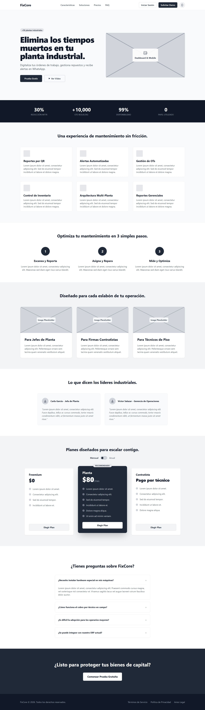<br>
  <em>Fuente: Elaboración propia.</em>
</div>

#### 4.3.1.3. Wireframe Mobile
El wireframe mobile adapta la estructura desktop a formatos verticales:

<div align="center">
  <strong>Wireframe mobile del Landing de FixCore</strong><br><br>
  <br>
  <em>Fuente: Elaboración propia.</em>
</div>

#### 4.3.1.1. Introducción al Wireframe del Landing Page

El wireframe del Landing Page de FixCore establece la estructura fundamental y el flujo de persuasión B2B antes de la aplicación de la interfaz gráfica final (UI). Este esquema sirve como plano arquitectónico para definir la jerarquía de la información, guiando al visitante desde la propuesta de valor inicial en el *Hero Section* centrada en la reducción de tiempos muertos, pasando por la validación técnica (métricas de impacto y características del sistema), hasta los planes de suscripción y el llamado a la acción final (CTA).

El diseño del wireframe sigue el principio de "mobile-first" adaptando el flujo en una sola columna para operarios en campo, pero prioriza la presentación analítica en desktop, dado que el Landing Page busca maximizar conversiones corporativas. Los compradores objetivos (Jefaturas de Planta y Gerencias de Operaciones) evalúan y toman decisiones de adquisición de software SaaS principalmente desde pantallas grandes. El wireframe está diseñado para ser escalable, modular y mantener su efectividad en ambos formatos.

---

#### 4.3.1.4. Regiones del wireframe y su Función

A continuación se detalla cada región de los wireframes (Desktop y Mobile) según su función en el recorrido de conversión del usuario B2B:

**A. Header (Navegación Global)**
El header contiene la identidad de FixCore y las vías rápidas de contacto. En desktop es una barra horizontal persistente; en mobile se colapsa en un menú hamburguesa para ahorrar espacio en pantalla.
*   **Elementos:**
    *   Logo de FixCore (enlace al inicio).
    *   Navegación principal: Características, Soluciones, Precios, FAQ.
    *   Botones de acción (CTAs): "Iniciar Sesión" (Ghost button) y "Solicitar Demo" / "Prueba Gratis" (Botón sólido).
*   **Principios aplicados:** Posicionamiento estándar SaaS (login a la derecha) y máxima prominencia visual para el botón de conversión principal.

**B. Hero Section**
Es la primera impresión. Diseñado para enganchar inmediatamente al tomador de decisión mediante la promesa de valor central y apoyo visual de la plataforma.
*   **Elementos:**
    *   Badge superior de validación (ej. "+50 plantas industriales").
    *   Título principal (H1) orientado a la reducción de tiempos muertos.
    *   Subtítulo descriptivo sobre la digitalización de OTs.
    *   Bloque central inferior para un mockup de alta fidelidad (Dashboard de métricas + celular escaneando QR).
*   **Principios aplicados:** Estructura en "Z" invertida o bloque central para dirigir la mirada desde el texto directamente hacia la previsualización del producto y los botones de acción.

**C. Stats Section (Barra de Impacto)**
Una franja horizontal oscura que contrasta fuertemente para mostrar métricas duras.
*   **Elementos:** 4 bloques cuantitativos (ej. 30% reducción MTTR, +10,000 OTs, 99% disponibilidad, 0 papel). En mobile se apilan en formato 2x2 o 1x4.
*   **Principios aplicados:** Scaneo rápido de información, uso de números grandes para generar confianza inmediata y justificar el ROI del producto.

**D. Features Section (Características Principales)**
Desglosa el "cómo" lo hace a través de una grilla de funcionalidades de la plataforma.
*   **Elementos:** Grilla de 6 tarjetas (3x2 en desktop, 1x6 scrollable en mobile). Cada una incluye un placeholder para ícono, título (ej. "Reportes por QR", "Control de Inventario") y un texto breve.
*   **Principios aplicados:** Uniformidad visual, lectura en patrón de "F" y uso de iconografía para romper la monotonía del texto técnico.

**E. How It Works Section (Paso a Paso)**
Explica el flujo operativo del mantenimiento de forma simplificada.
*   **Elementos:** 3 columnas numeradas secuencialmente (1. Escanea y Reporta, 2. Asigna y Repara, 3. Mide y Optimiza).
*   **Principios aplicados:** Reducción de la carga cognitiva. Transformar un proceso industrial complejo en 3 pasos digeribles.

**F. Use Cases / Solutions Section (Soluciones por Perfil)**
Segmenta la propuesta de valor para los diferentes actores (Jefes de Planta vs. Contratistas).
*   **Elementos:** 3 tarjetas de gran tamaño. En desktop se distribuyen 2 arriba y 1 centrada abajo; en mobile se apilan verticalmente. Contienen placeholders para ilustraciones complejas.
*   **Principios aplicados:** *Targeting* visual. Permite que cada *User Persona* (Carla o Víctor) encuentre rápidamente la solución a sus dolores específicos.

**G. Pricing Section (Planes de Suscripción)**
Presenta el modelo de negocio (*Freemium*, *Planta*, *Contratista*).
*   **Elementos:** Un *toggle switch* superior (Mensual/Anual) y 3 tarjetas de precios. La tarjeta central es ligeramente más grande y destacada.
*   **Principios aplicados:** Efecto "Señuelo" (Decoy effect) y anclaje de precios. Destacar el plan intermedio o más rentable como la opción por defecto.

**H. FAQ Section (Preguntas Frecuentes)**
Resolución de objeciones B2B comunes antes del cierre.
*   **Elementos:** Lista tipo acordeón (collapsible) con preguntas sobre implementación, hardware, adopción de operarios y cobro por licencias.
*   **Principios aplicados:** Diseño expansible para mantener la página limpia y retener a los usuarios que buscan respuestas técnicas específicas.

**I. Bottom CTA & Footer**
El último esfuerzo de conversión y navegación secundaria.
*   **Elementos:** 
    *   Franja oscura con un título persuasivo ("¿Listo para proteger tus activos?").
    *   Botón central ("Comienza tu Prueba Gratuita").
    *   Footer: Logo, enlaces legales (Privacidad, Términos B2B), redes y soporte.
*   **Principios aplicados:** Contraste de fondo para "despertar" al usuario al final del scroll y aislar la decisión de compra.

---

#### 4.3.1.5. Principios de Diseño Aplicados en los Wireframes

El esquema estructural de FixCore se sostiene en los siguientes fundamentos UX/UI:

*   **Jerarquía Visual y Contraste:** Uso de bloques con fondos oscuros (Stats y Bottom CTA) intercalados con fondos claros para crear "cortes" naturales en la lectura y evitar la fatiga visual.
*   **Modularidad (Grid System):** Aplicación de un sistema de grillas estricto (12 columnas en desktop) que permite que los bloques de 3 (Features, How it works) y 2 (Testimonios) se redistribuyan perfectamente al hacer reflow en pantallas móviles (1 columna).
*   **Diseño Orientado a la Conversión (CRO):** Los llamados a la acción (CTAs) mantienen una ubicación estratégica y constante a lo largo de todo el recorrido (Header, Hero, Pricing, Bottom), reduciendo la fricción para solicitar la demo.
*   **Escalabilidad Mobile-First:** Elementos como el acordeón de FAQs y la barra de navegación se transforman en patrones nativos móviles (hamburguesa, menús desplegables) asegurando áreas táctiles de mínimo 44x44px.

### 4.3.2. Landing Page Mock-up. 

Esta sección presenta y explica los Mock-ups (prototipos de alta fidelidad) del Landing Page de FixCore, tanto en su versión para Desktop Web Browser como Mobile Web Browser. En esta propuesta se evidencia la aplicación de los principios de diseño visual, accesibilidad y la arquitectura de información validada previamente en los wireframes, consolidando el Design System corporativo orientado al sector B2B (Mantenimiento Industrial).

#### 4.3.2.1. Introducción al Mock-up

El mock-up del Landing Page representa la implementación visual final del producto. Transforma el esquema estructural (Lo-Fi) aplicando los colores corporativos, tipografías, iconografía y espaciados definidos para crear una experiencia visual coherente que transmita confianza, modernidad y eficiencia operativa, valores centrales de FixCore.

#### 4.3.2.2. Mock-up Desktop

El mock-up desktop del Landing Page aplica los siguientes elementos del Design System para maximizar la conversión en pantallas grandes:

**Paleta de Colores Aplicada**
*   **Primary (Azul Brillante):** `#0ea5e9` (Aprox.)
    *   Utilizado en botones primarios principales (Hero Section, Iniciar Sesión), enlaces activos e iconografía clave.
*   **Corporate Dark (Azul Marino/Navy):** `#0f172a` (Aprox.)
    *   Utilizado para crear contrastes fuertes en secciones de alto impacto: Barra de Estadísticas (Stats), Tarjeta de Precio destacada ("Planta") y el Bottom CTA.
*   **Success Accent (Verde):** `#16a34a` (Aprox.)
    *   Utilizado estratégicamente en el botón final de conversión ("Comenzar Prueba Gratuita") y en los *checkmarks* de los planes de precios para indicar beneficios activos.
*   **Escala de Grises y Fondos:**
    *   Fondos principales: Blanco (White) y Gris muy claro (Gray-50) para separar secciones sutilmente.
    *   Texto: Gray-900 para títulos de alta jerarquía y Gray-600 para legibilidad en párrafos descriptivos.

**Tipografía Aplicada**
*   **Headings (Ej. Inter o Poppins)**
    *   H1: 48-64px ExtraBold - Título principal del Hero ("Elimina los tiempos muertos...").
    *   H2: 36-40px Bold - Títulos de sección centrados.
    *   H3: 20-24px SemiBold - Nombres de características y títulos de tarjetas.
*   **Body Text**
    *   Body: 16px Regular - Descripciones y párrafos.
    *   Small: 14px Regular - Elementos secundarios, navegación y *footers*.

**Componentes Visuales**
*   **Tarjetas (Cards):**
    *   Fondo: Blanco sólido para características y testimonios. Fondo oscuro degradado para los Casos de Uso.
    *   Bordes y Radio: Esquinas redondeadas (aprox. 12px a 16px) para suavizar la estética industrial.
    *   Sombra: Sombras sutiles (`shadow-sm` y `shadow-md`) para crear profundidad y separar los elementos del fondo gris claro.
*   **Botones:**
    *   Primario: Relleno azul, texto blanco, esquinas redondeadas.
    *   Secundario (Ghost): Texto gris oscuro, fondo transparente y borde sutil.
    *   Call to Action Final: Relleno verde vibrante para atraer la vista al final del recorrido.

#### 4.3.2.3. Mock-up Mobile

El mock-up mobile mantiene una estricta consistencia visual con la versión desktop, adaptando la experiencia de lectura y navegación a pantallas pequeñas (Mobile-first adaptativo):

**Adaptaciones Mobile**
*   **Diseño Responsive (Reflow):**
    *   El grid de contenido colapsa de 3 o 2 columnas a **1 sola columna vertical** (Features, Casos de Uso, Pricing).
    *   La barra de navegación horizontal desaparece y se condensa en un menú hamburguesa (Hamburger menu) ubicado en la esquina superior derecha.
    *   La barra de estadísticas (Stats) adapta sus 4 métricas a un grid de 2x2 para no hacer el scroll excesivamente largo y mantener los números legibles.
*   **Touch Targets (Zonas Táctiles):**
    *   Botones expandidos al 100% del ancho del contenedor (`w-full`) para facilitar el toque con una sola mano.
    *   Espaciado (padding) aumentado en el menú desplegable de las FAQs para evitar toques accidentales entre preguntas.
*   **Optimización Visual:**
    *   El mockup del Dashboard y el celular en el Hero Section se escala proporcionalmente y se centra debajo del texto principal.

#### 4.3.2.4. Vistas Detalladas por Sección

*   **Hero Section:** Fondo blanco limpio. Título alineado a la izquierda (en desktop) con fuerte contraste. Los botones de acción están agrupados ("Prueba Gratis" sólido y "Ver Video" con ícono). A la derecha, una composición gráfica en alta fidelidad de la plataforma.
*   **Stats Section:** Franja horizontal azul oscuro que rompe el fondo blanco. Números enormes en color blanco con subtítulos en azul brillante para rápida lectura de métricas clave (MTTR, OTs).
*   **Features Section:** Grilla limpia (3x2 en desktop). Cada tarjeta incluye un ícono azul minimalista en la parte superior izquierda, seguido de un título en negrita y un párrafo gris.
*   **Use Cases Section:** Tres tarjetas oscuras con ilustraciones integradas que rompen el patrón claro de la página, llamando la atención de los tres perfiles de comprador (Jefes, Contratistas, Técnicos).
*   **Pricing Section:** Destaca por el efecto anclaje. La tarjeta central (Plan Planta) es más alta y tiene fondo azul oscuro con texto blanco, forzando la atención visual hacia ella frente a las dos tarjetas blancas laterales.
*   **FAQ y Bottom CTA:** Preguntas frecuentes limpias con divisores grises delgados. El recorrido culmina en un bloque azul oscuro masivo que contiene un único botón verde brillante, creando el punto de mayor contraste de toda la página para forzar el clic final.

#### 4.3.2.5. Aplicación del Design System y Accesibilidad

El mock-up evidencia una aplicación madura de los principios de diseño para productos SaaS:
*   **Jerarquía y "Scannability":** Los usuarios pueden escanear la página leyendo solo los H2 (Títulos de sección centrados) y entender toda la propuesta de valor sin leer los párrafos pequeños.
*   **Diseño Inclusivo y Contraste:** El uso de texto blanco puro sobre los fondos azul oscuro (Navy) supera holgadamente los estándares de contraste WCAG AA, asegurando legibilidad incluso en monitores industriales con bajo brillo.
*   **Consistencia:** Los radios de los botones, las sombras de las tarjetas y los grosores de línea se repiten uniformemente a través de todas las secciones, generando confianza institucional.

#### 4.3.2.6. Referencias Visuales
Las siguiente referencias muestran el mock-up final:

**Desktop Homepage Mock-up**

<div align="center">
  <strong>Gráfico: Mock-up desktop del Landing de Fixcore</strong><br><br>
  <br>
  <em>Fuente: Elaboración propia.</em>
</div>

El mockup desktop muestra:

*   Hero section completo con mockup de la plataforma (Dashboard en monitor y escáner en móvil)
*   Barra de estadísticas oscura con 4 métricas clave
*   6 features cards en grid (distribución 3x2)
*   3 steps visuales numerados (Paso a paso)
*   3 tarjetas oscuras de casos de uso por perfil (distribución 2x1)
*   2 tarjetas de testimonios con avatares
*   3 tarjetas de planes de precios (con el plan central destacado)
*   Sección FAQ en formato acordeón
*   Bottom CTA section oscuro con botón de conversión final y footer

**Mobile Homepage Mock-up**

<div align="center">
  <strong>Gráfico: Mock-up mobile del Landing de Fixcore</strong><br><br>
  <br>
  <em>Fuente: Elaboración propia.</em>
</div>

El mockup mobile muestra:

*   Menú de navegación colapsado (Hamburger menu) para maximizar el espacio de visualización.
*   Hero section adaptado a formato vertical, priorizando la lectura (Texto > Botones CTA > Mockup de la plataforma).
*   Barra de estadísticas (Stats) reestructurada en un bloque apilado para lectura rápida sin scroll horizontal.
*   Grilla de 6 *Features cards* colapsada a una lista vertical de 1 columna.
*   Tarjetas de "Casos de Uso" y "Pasos" alineadas verticalmente ocupando el ancho completo (`w-full`) de la pantalla.
*   Tarjetas de "Planes de Precios" apiladas en scroll vertical, manteniendo el plan "Planta" con fondo oscuro visualmente destacado.
*   Sección FAQ optimizada para interacción táctil en formato acordeón de 1 columna.
*   Bottom CTA adaptado a la pantalla móvil con el botón verde de conversión principal centrado.

---

#### 4.3.2.7. Estados Interactivos en el Mock-up

Los mock-ups móviles también definen los estados interactivos de los componentes principales para asegurar un *feedback* táctil adecuado:

**Estados de Botón (CTAs)**
*   **Default:** Color de relleno sólido (Azul corporativo o Verde para el CTA final), con sombra sutil (`shadow-sm`).
*   **Touch/Hover:** Oscurecimiento leve del fondo y aumento de la sombra (`shadow-md`) para indicar interactividad.
*   **Active (Tap):** Escala ligeramente reducida (ej. `scale-95`) para proporcionar respuesta táctil inmediata al usuario al pulsar en la pantalla.
*   **Disabled:** Opacidad reducida al 50% e inhabilitación de eventos táctiles.

**Estados de Tarjeta (Features, Pricing y Casos de Uso)**
*   **Default:** Borde sutil o sombra media (`shadow-md`), esquinas redondeadas.
*   **Tap/Focus:** Sombra incrementada (`shadow-lg`) y leve elevación visual (`translateY(-4px)`).
*   **Transición:** Suave de `300ms ease-in-out` para evitar saltos bruscos en la interfaz móvil.

**Estados de Acordeón (FAQ)**
*   **Collapsed (Cerrado):** Pregunta visible, ícono de cruz (+) o flecha hacia abajo.
*   **Expanded (Abierto):** Ícono cambia a menos (-) o flecha hacia arriba, la respuesta se despliega con una animación suave, el título adopta un color azul activo para indicar su estado.

---

#### 4.3.2.8. Diseño Responsivo General

El mock-up aplica los principios de diseño responsivo *Mobile-First* a través de las siguientes configuraciones:

**Breakpoints Aplicados**
*   **Mobile:** 320px - 639px (Vista actual representada en el mock-up).
*   **Tablet:** 640px - 1023px.
*   **Desktop:** 1024px+.

**Comportamiento en Mobile (Reflow y Adaptación)**
*   **Stacking de Grids:** Todos los contenedores que en desktop eran de 2 o 3 columnas (Características, Casos de uso, Precios) se colapsan a 1 sola columna vertical.
*   **Ajuste Tipográfico:** Reducción proporcional de los tamaños de fuente (ej. el H1 del Hero baja de 56px a 36px o 40px) para evitar la fragmentación excesiva de palabras y mantener la legibilidad.
*   **Touch Targets (Zonas táctiles):** Expansión de los botones principales y enlaces del menú para que cumplan con la altura mínima recomendada de 44px a 48px, facilitando el uso con el pulgar.
*   **Alineación:** Transición de alineación izquierda (Desktop) a alineación centrada o de ancho completo (Mobile) para equilibrar el peso visual.

**Imágenes Responsivas y Rendimiento**
*   Uso de atributos `srcset` para cargar versiones reducidas de las ilustraciones y mockups en redes móviles.
*   Implementación de *Lazy Loading* (carga diferida) para las imágenes de las secciones inferiores (Casos de Uso, Testimonios) que se encuentran por debajo del *fold* (primera pantalla visual).

## 4.4. Web Applications UX/UI Design. 

En esta sección se detalla el diseño visual e interactivo de la plataforma web y móvil de FixCore, un sistema open-source diseñado para optimizar y centralizar el mantenimiento industrial. La propuesta se fundamenta en las necesidades de los usuarios, criterios de usabilidad y la estructura de información planificada previamente, asegurando armonía con la identidad visual del proyecto.

El desarrollo se divide en cuatro apartados principales: los Wireframes, que establecen la distribución y jerarquía visual de los elementos en cada pantalla; los Wireflow Diagrams, que muestran la secuencia de navegación según los propósitos de cada usuario; los Mock-ups, que reflejan el diseño gráfico final aplicando la paleta de estilos; y los User Flow Diagrams, que conectan las interfaces con el recorrido ideal y las posibles rutas ante errores o imprevistos.

Los perfiles clave contemplados son el Jefe de Planta, quien administra los recursos y la planificación; el Técnico, enfocado en la ejecución y reporte directo desde la zona de operaciones; y el Gerente de Operaciones, que supervisa el rendimiento general a nivel ejecutivo.

### 4.4.1. Web Applications Wireframes. 

Esta sección presenta los wireframes de baja fidelidad de FixCore, diseñados en Figma. La plataforma se estructuró bajo un enfoque responsivo, adaptándose a los tres roles principales del sistema (Jefe de Planta, Técnico y Gerente de Operaciones).

**Wireframes Mobile**

<div align="center">
  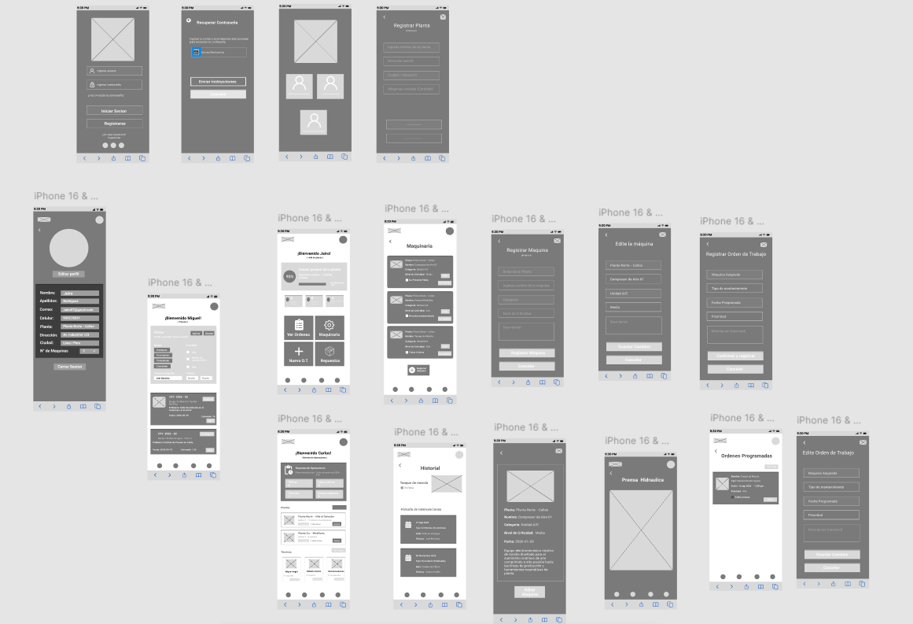<br>
</div>

**Wireframes Desktop**

<div align="center">
  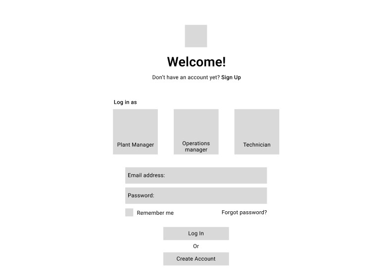<br>
</div>

<div align="center">
  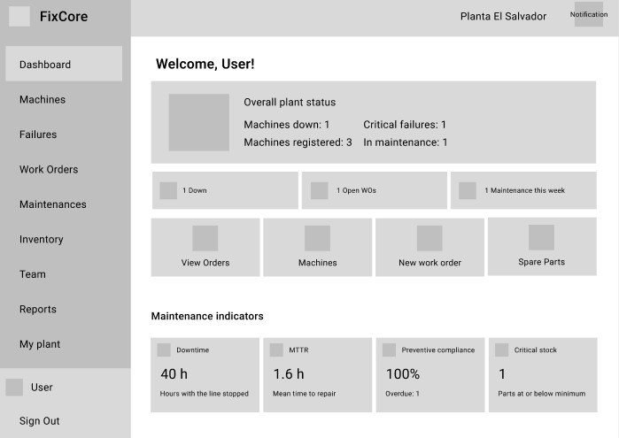<br>
</div>

<div align="center">
  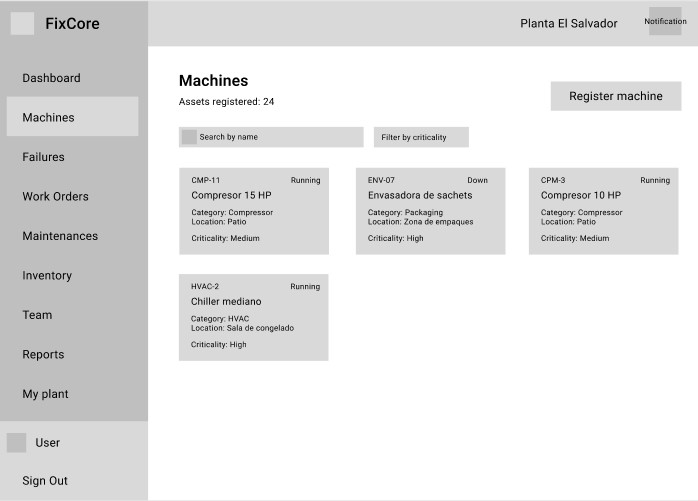<br>
</div>

<div align="center">
  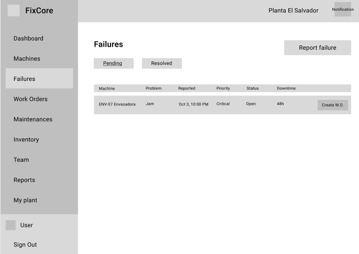<br>
</div>

<div align="center">
  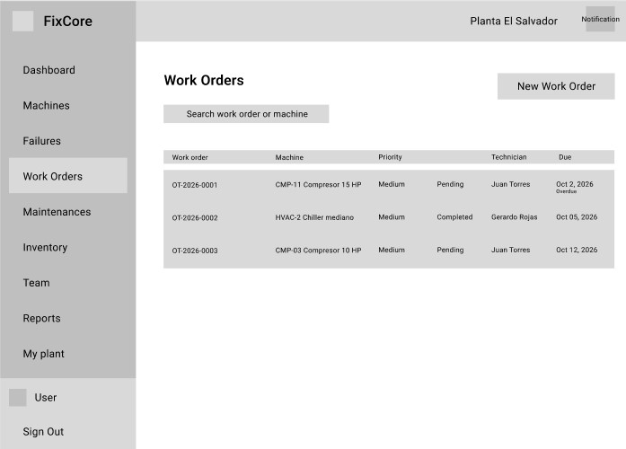<br>
</div>

<div align="center">
  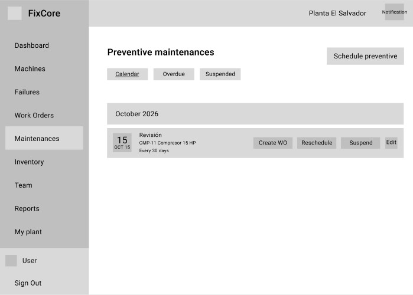<br>
</div>

<div align="center">
  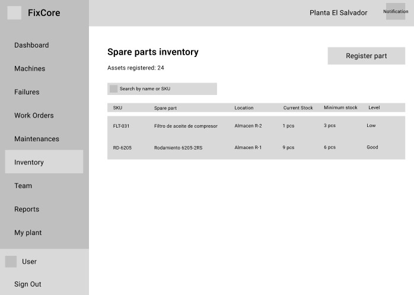<br>
</div>

<div align="center">
  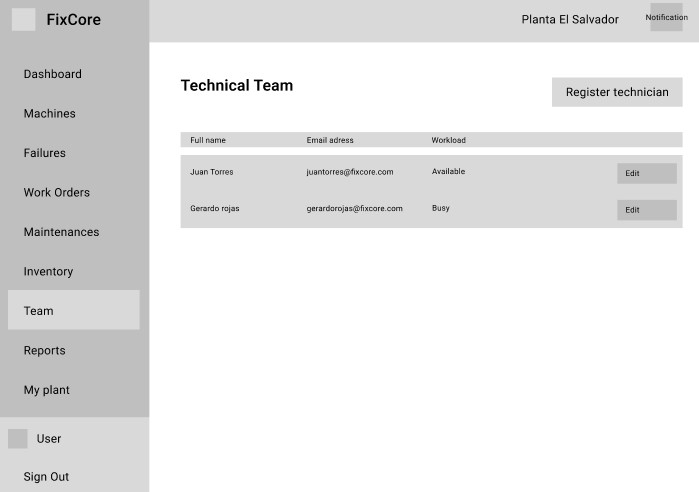<br>
</div>

<div align="center">
  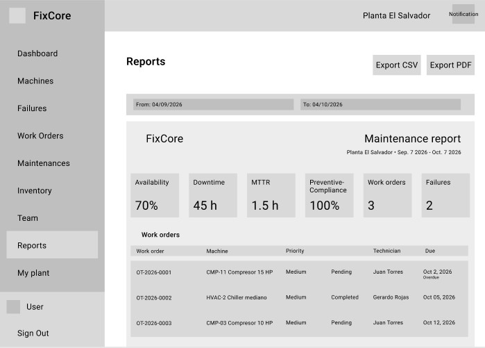<br>
</div>

<div align="center">
  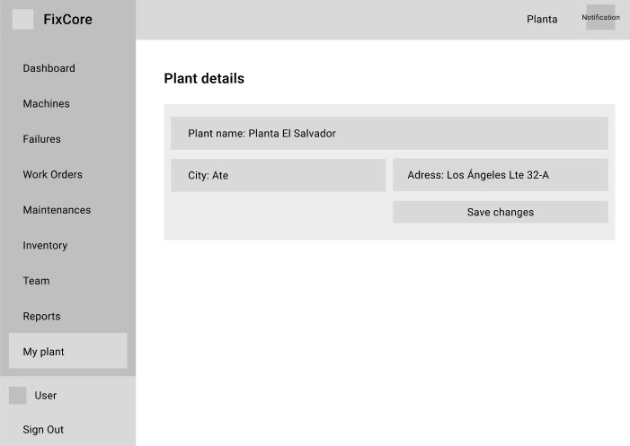<br>
</div>


Explicación de la propuesta:

* Estructura consistente: Se utilizaron tarjetas (cards), barras de navegación fijas y botones grandes para asegurar una lectura rápida y evitar errores operativos en la planta.

* Jerarquía visual: Al tratarse de wireframes estructurales, la jerarquía se estableció mediante tipografías escalonadas, líneas divisorias y bloques de contenido delimitados, utilizando variaciones de tono en lugar de color para diferenciar campos y contenedores.

* Diseño inclusivo: Se priorizaron áreas táctiles amplias y formularios sencillos para que los técnicos puedan reportar fallas y gestionar tareas rápidamente desde el campo.

### 4.4.2. Web Applications Wireflow Diagrams. 

En esta sección presentamos los Wireflows diseñados para FixCore, los cuales enlazan la estructura visual de nuestros wireframes de baja fidelidad con los recorridos interactivos que realiza cada rol para alcanzar sus objetivos principales. A diferencia de un flujo de tareas tradicional, este enfoque nos permite visualizar simultáneamente el diseño de cada pantalla y la secuencia de transiciones ante las acciones del usuario, mostrando los cambios de estado mediante la incorporación progresiva de los wireframes correspondientes.

Para construir estos diagramas, previamente analizamos las rutas típicas de interacción de nuestros usuarios. El desarrollo se centró en los perfiles principales que definimos para el sistema: el Jefe de Planta (enfocado en la administración de activos y la planificación), el Técnico (responsable de la ejecución y el reporte directo en campo) y el Gerente de Operaciones (orientado a la supervisión macro y la revisión de métricas).

#### 4.4.2.1. Wireflow 01 — Jefe de Planta registra su cuenta y maquinas. 

Usuario: Jefe de planta
Obetivo de usuario: Como Jefe de Planta, deseo registrarme con una cuenta y a la vez las máquina en el sistema indicando sus datos técnicos y ubicación para llevar un control centralizado de los activos que requieren mantenimiento preventivo y correctivo.

<div align="center">
  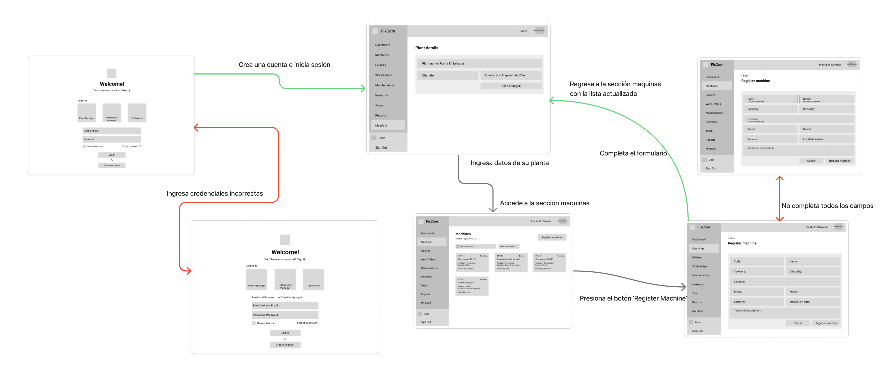<br>
</div>

Explicación del flujo: Nuestro flujo arranca en la pantalla principal de acceso, donde ingresamos el usuario y la contraseña. Al presionar el botón de inicio de sesión, el sistema valida las credenciales y nos lleva  hacia el panel de bienvenida adaptado específicamente al perfil del usuario (ya sea el tablero del Jefe de Planta, la vista operativa del Técnico o el resumen ejecutivo del Gerente de Operaciones). Una vez en el panel principal del Jefe de Planta, desde donde accedemos al módulo de maquinaria para agregar un nuevo equipo, lo que nos dirige hacia el formulario de registro en su estado inicial. Ingresamos los datos obligatorios, como nombre, planta, categoría y nivel de criticidad. Al confirmar la acción, el sistema valida los datos y nos redirige al listado general de activos actualizado. Con esto logramos automatizar el registro y dejamos atrás los controles en papel o Excel.

#### 4.4.2.2. Wireflow 02 — Técnico accede a la informacion de maquinas. 

Usuario: Técnico
Obetivo de usuario: Como Técnico de campo, deseo observar los fallos de las maquinas y dirigirme a la planta asignada, reportarme para que la incidencia quede registrada formalmente y pueda ser atendida sin retrasos.

<div align="center">
  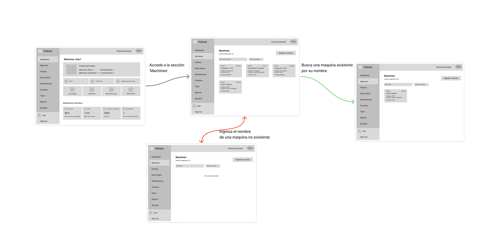<br>
</div>

Explicación del flujo: En este recorrido, luego de haber iniciado sesión y estar en una planta industrial, se accede a la sección de maquinas donde se verá un listado de todas las maquinas pertenecientes a la planta actual. El técnico luego puede buscar la información de una maquina en especifico por su nombre. En caso se introduzca un nombre que no pertenezca a alguna maquina, no se mostrarán resultados.

#### 4.4.2.3. Wireflow 03 — Gerente de Operaciones crea una orden de trabajo

Usuario: Gerente de Operaciones
Obetivo de usuario: Como Gerente de Operaciones, deseo ser capaz de generar ordenes de trabajo dentro de la plataforma FixCore para así facilitar la asignación de tareas a los tecnicos de una planta industrial.

<div align="center">
  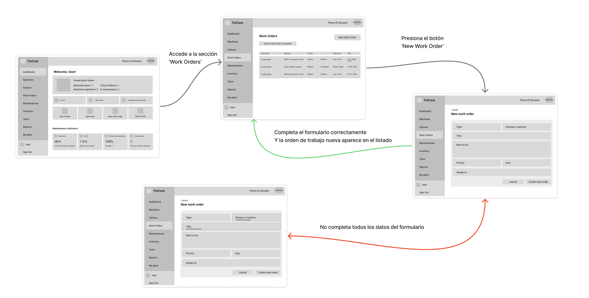<br>
</div>

Explicación del flujo: El flujo comienza en el panel de inicio, donde luego se ingresa a la sección de ordenes de trabajo. Dentro de alli se presiona el botón de crear una nueva orden de trabajo para abrir un formulario donde se deberá colocar información como la maquina que se va a atender, el tipo de trabajo que se va a realizar o el técnico encargado. En caso algunos datos no sean colocados, tales como la maquina o el titulo de la orden de trabajo, no se continuará con la creación. Una vez los datos estén validados, e usuario regresará al listado de ordenes de trabajo.

#### 4.4.2.4. Wireflow 04 — Integrante de una planta reporta una falla

Usuario: Integrante en general de una planta industrial
Obetivo de usuario: Como miembro de una planta industrial, deseo ser capaz de reportar fallos presentes en las maquinas de la planta industrial a la que pertenezco para así facilitar su identificación y atención oportuna por parte de los otros técnicos dentro de la planta.

<div align="center">
  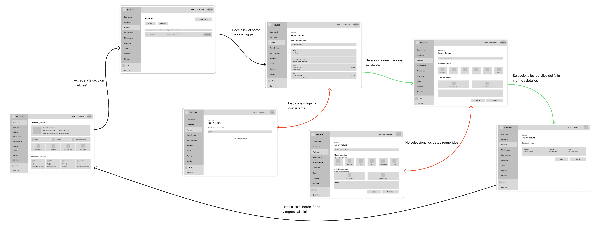<br>
</div>

Explicación del flujo: El flujo comienza en el panel de inicio, donde luego se ingresa a la sección de fallas. Una vez alli, se presiona el botón de reportar una falla. Durante el reporte primero se pedirá elegir la maquina que está fallando, intentar buscar el nombre de una maquina que no existe dentro de la planta no dará resultados. Siguiente, se pedirán datos sobre la falla, tales como su tipo, si ha detenido la linea de producción, así como otros detalles opcionales. Una vez completado el proceso se mostrará una tarjeta de confirmación antes del envío del reporte.

### 4.4.3. Web Applications Mock-ups. 

En esta sección presentamos los Mock-ups de alta fidelidad, los cuales materializan visualmente los wireframes que definimos previamente para FixCore. Para su desarrollo en Figma, aplicamos de manera rigurosa los lineamientos de nuestro Design System, integrando la paleta de colores corporativa, la jerarquía tipográfica, el sistema de espaciados y los componentes de interfaz estandarizados, garantizando así total coherencia gráfica de nuestro proyecto.

**Mockups Mobile**

<div align="center">
  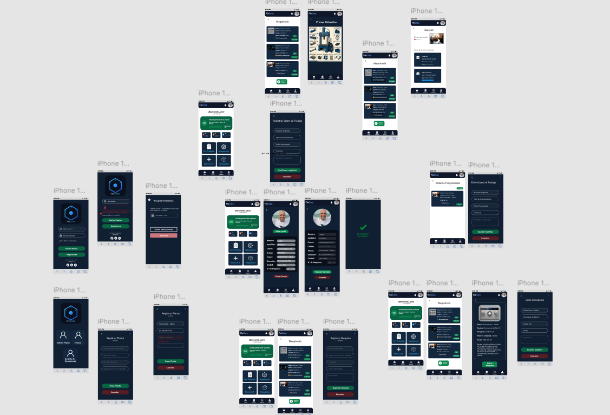<br>
</div>

**Mockups Desktop**

<div align="center">
  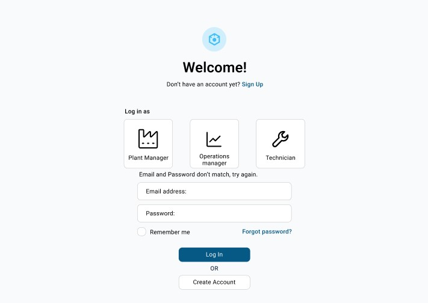<br>
</div>

<div align="center">
  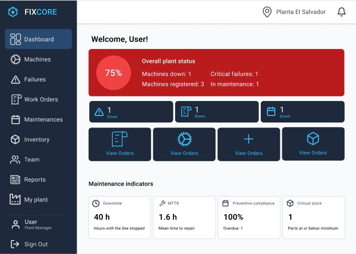<br>
</div>

<div align="center">
  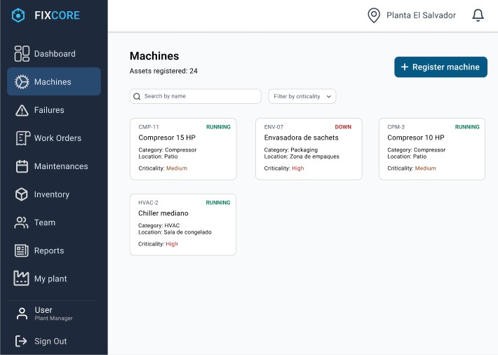<br>
</div>

<div align="center">
  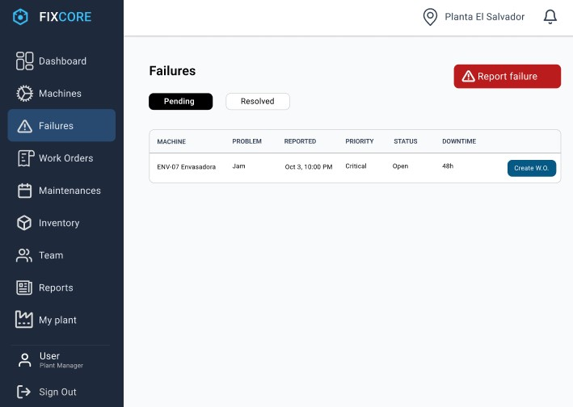<br>
</div>

<div align="center">
  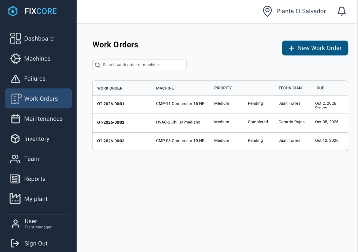<br>
</div>

<div align="center">
  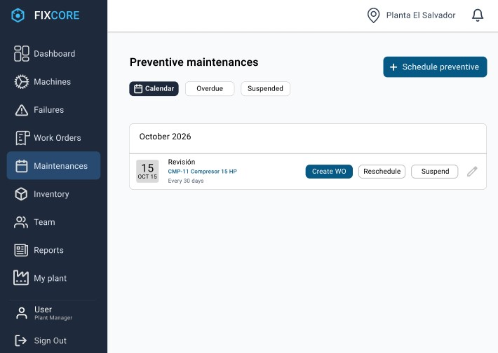<br>
</div>

<div align="center">
  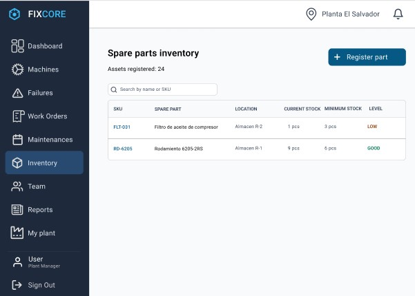<br>
</div>

<div align="center">
  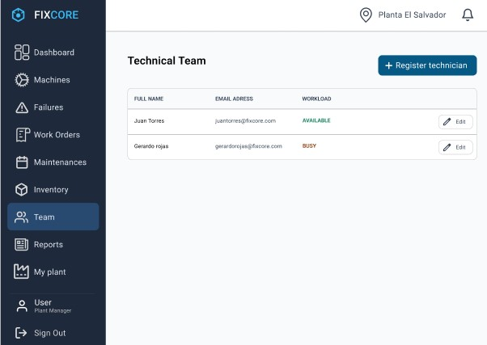<br>
</div>

<div align="center">
  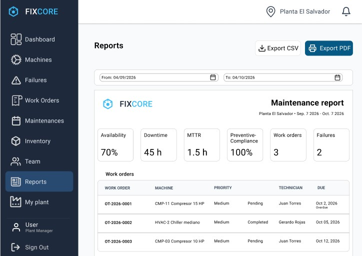<br>
</div>

<div align="center">
  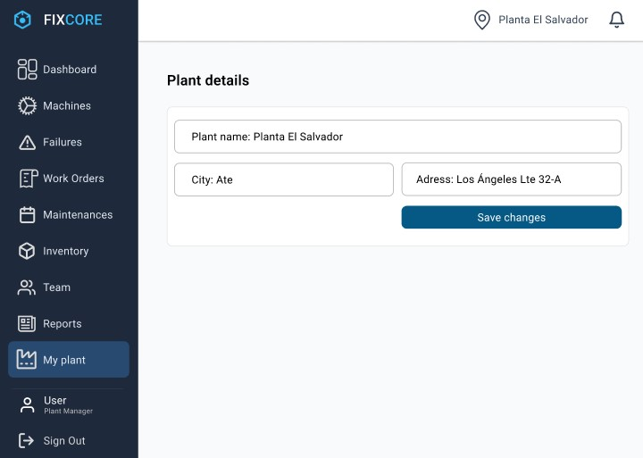<br>
</div>

Explicación de la propuesta:
Los mock-ups reflejan fielmente el diseño visual definitivo de la plataforma. Implementamos una interfaz limpia y estructurada mediante tarjetas (cards), barras de navegación intuitivas y contenedores claramente delimitados que reducen la fatiga visual y facilitan la lectura rápida de los datos. La selección cromática prioriza contrastes óptimos para asegurar una legibilidad excelente tanto en monitores de oficina como en las pantallas móviles utilizadas por los técnicos en la fábrica.

Asimismo, cuidamos la accesibilidad y el diseño inclusivo en cada componente. Los elementos interactivos —como botones de acción primaria y campos de formulario— cuentan con áreas táctiles amplias y estados visuales definidos (hover, active, disabled), permitiendo que los operarios interactúen con la aplicación sin errores accidentales. De este modo, logramos una interfaz moderna, profesional y altamente funcional para la gestión del mantenimiento industrial.

### 4.4.4. Web Applications User Flow Diagrams. 

Los diagramas de flujo de usuario que documentamos en esta sección representan la evolución de alta fidelidad de los Wireflows que presentamos previamente. Mientras que los wireflows operan con representaciones esquemáticas de baja fidelidad, los User Flows integran los mock-ups finales de FixCore junto con el detalle completo de las trayectorias que nuestros usuarios pueden recorrer dentro del sistema: tanto el camino ideal u esperado (happy path) como los caminos alternativos (unhappy paths) que se activan ante errores, validaciones fallidas o decisiones operativas que se apartan del flujo principal.

Estos flujos de usuario mantienen una total consistencia con los wireflows que definimos en esta sección, lo que garantiza una trazabilidad de extremo a extremo en todo nuestro proceso de diseño de software. Cada uno de los diagramas detalla con precisión los puntos de decisión, las condiciones lógicas de validación y las transiciones de pantallas, todo ello complementado con anotaciones que explican con claridad el comportamiento exacto del sistema ante cada bifurcación. Diseñamos estas rutas alternativas considerando rigurosamente los escenarios reales de mantenimiento industrial que identificamos durante las entrevistas con los representantes de nuestros segmentos objetivo (Jefes de Planta, Técnicos y Gerentes de Operaciones).


#### 4.4.4.1. Userflow 01 — Jefe de Planta registra su cuenta y maquinas. 

Usuario: Jefe de planta
Obetivo de usuario: Como Jefe de Planta, deseo registrarme con una cuenta y a la vez las máquina en el sistema indicando sus datos técnicos y ubicación para llevar un control centralizado de los activos que requieren mantenimiento preventivo y correctivo.

<div align="center">
  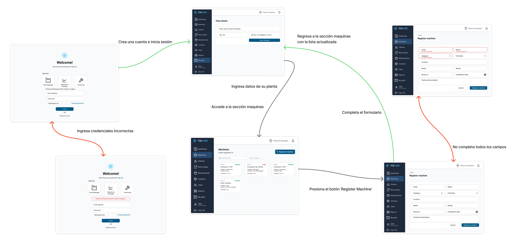<br>
</div>

Explicación del flujo: Nuestro flujo arranca en la pantalla principal de acceso, donde ingresamos el usuario y la contraseña. Al presionar el botón de inicio de sesión, el sistema valida las credenciales y nos lleva  hacia el panel de bienvenida adaptado específicamente al perfil del usuario (ya sea el tablero del Jefe de Planta, la vista operativa del Técnico o el resumen ejecutivo del Gerente de Operaciones). Una vez en el panel principal del Jefe de Planta, desde donde accedemos al módulo de maquinaria para agregar un nuevo equipo, lo que nos dirige hacia el formulario de registro en su estado inicial. Ingresamos los datos obligatorios, como nombre, planta, categoría y nivel de criticidad. Al confirmar la acción, el sistema valida los datos y nos redirige al listado general de activos actualizado. Con esto logramos automatizar el registro y dejamos atrás los controles en papel o Excel.

#### 4.4.4.2. Userflow 02 — Técnico accede a la informacion de maquinas. 

Usuario: Técnico
Obetivo de usuario: Como Técnico de campo, deseo observar los fallos de las maquinas y dirigirme a la planta asignada, reportarme para que la incidencia quede registrada formalmente y pueda ser atendida sin retrasos.

<div align="center">
  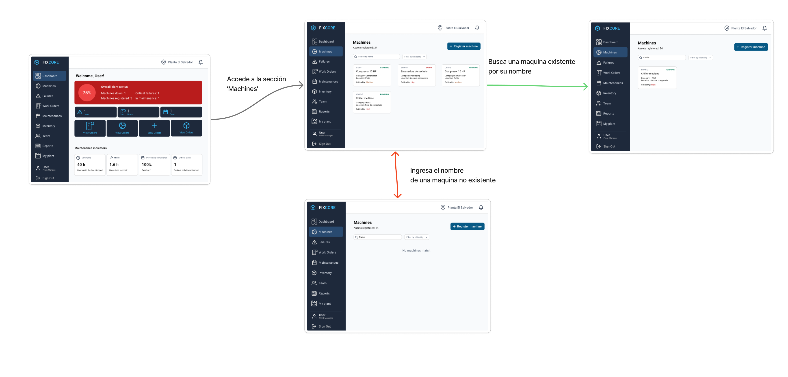<br>
</div>

Explicación del flujo: En este recorrido, luego de haber iniciado sesión y estar en una planta industrial, se accede a la sección de maquinas donde se verá un listado de todas las maquinas pertenecientes a la planta actual. El técnico luego puede buscar la información de una maquina en especifico por su nombre. En caso se introduzca un nombre que no pertenezca a alguna maquina, no se mostrarán resultados.

#### 4.4.4.3. Userflow 03 — Gerente de Operaciones crea una orden de trabajo

Usuario: Gerente de Operaciones
Obetivo de usuario: Como Gerente de Operaciones, deseo ser capaz de generar ordenes de trabajo dentro de la plataforma FixCore para así facilitar la asignación de tareas a los tecnicos de una planta industrial.

<div align="center">
  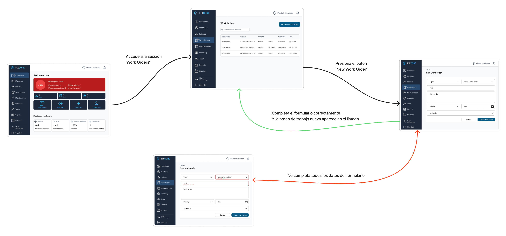<br>
</div>

Explicación del flujo: El flujo comienza en el panel de inicio, donde luego se ingresa a la sección de ordenes de trabajo. Dentro de alli se presiona el botón de crear una nueva orden de trabajo para abrir un formulario donde se deberá colocar información como la maquina que se va a atender, el tipo de trabajo que se va a realizar o el técnico encargado. En caso algunos datos no sean colocados, tales como la maquina o el titulo de la orden de trabajo, no se continuará con la creación. Una vez los datos estén validados, e usuario regresará al listado de ordenes de trabajo.

#### 4.4.4.4. Userflow 04 — Integrante de una planta reporta una falla

Usuario: Integrante en general de una planta industrial
Obetivo de usuario: Como miembro de una planta industrial, deseo ser capaz de reportar fallos presentes en las maquinas de la planta industrial a la que pertenezco para así facilitar su identificación y atención oportuna por parte de los otros técnicos dentro de la planta.

<div align="center">
  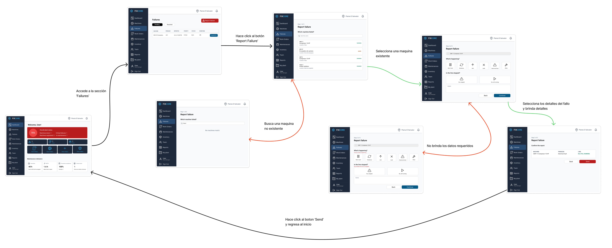<br>
</div>

## 4.5. Web Applications Prototyping. 

Con los Mockups realizados hemos elaborado un prototipo en Figma que muestre una versión preliminar de nuestra aplicación web. En este prototipo se consideraron procesos presentes en los Userflows, además de otras vistas generales de las secciones que puede ofrecer la plataforma.

Enlace al prototipo realizado en Figma: [https://www.figma.com/proto/VbkpyP5gwR4Orgl1eNsB7a/Figma-basics?node-id=2449-1168&t=Va1SHaV7XPbK0ZlF-1&scaling=scale-down&content-scaling=fixed&page-id=2439%3A2&starting-point-node-id=2449%3A1168](https://www.figma.com/proto/VbkpyP5gwR4Orgl1eNsB7a/Figma-basics?node-id=2449-1168&t=Va1SHaV7XPbK0ZlF-1&scaling=scale-down&content-scaling=fixed&page-id=2439%3A2&starting-point-node-id=2449%3A1168)

Enlace al video de presentación del prototipo: [https://upcedupe-my.sharepoint.com/:v:/g/personal/u202423973_upc_edu_pe/IQDYMFuJ7lLVR70eP-ZT_VL8AQQDJFn8kAVoKRjQeePpziU?e=0tnbiI&nav=eyJyZWZlcnJhbEluZm8iOnsicmVmZXJyYWxBcHAiOiJTdHJlYW1XZWJBcHAiLCJyZWZlcnJhbFZpZXciOiJTaGFyZURpYWxvZy1MaW5rIiwicmVmZXJyYWxBcHBQbGF0Zm9ybSI6IldlYiIsInJlZmVycmFsTW9kZSI6InZpZXcifX0%3D](https://upcedupe-my.sharepoint.com/:v:/g/personal/u202423973_upc_edu_pe/IQDYMFuJ7lLVR70eP-ZT_VL8AQQDJFn8kAVoKRjQeePpziU?e=0tnbiI&nav=eyJyZWZlcnJhbEluZm8iOnsicmVmZXJyYWxBcHAiOiJTdHJlYW1XZWJBcHAiLCJyZWZlcnJhbFZpZXciOiJTaGFyZURpYWxvZy1MaW5rIiwicmVmZXJyYWxBcHBQbGF0Zm9ybSI6IldlYiIsInJlZmVycmFsTW9kZSI6InZpZXcifX0%3D)

<div align="center">
  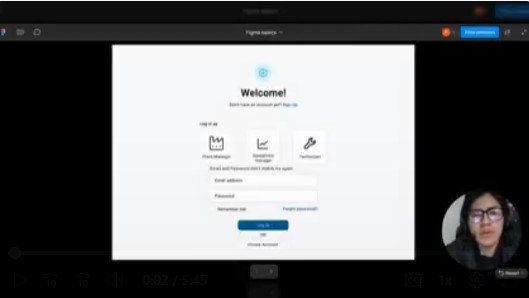<br>
</div>

## 4.6. Domain-Driven Software Architecture. 

### 4.6.1. Design-Level EventStorming. 

Realizamos una sesión de Design-Level EventStorming tomando como punto de partida los resultados obtenidos en el Big Picture EventStorming. En esta etapa profundizamos en los principales procesos identificados del dominio de FixCore, detallamos los eventos, actores, comandos, politicas y otros aspectos involucrados en cada flujo. Esto nos ayudo a mejorar el modelo inicial, delimitar las responsabilidades del sistema y establecer una primera definición de los Bounded Contexts, buscando que cada uno mantenga una responsabilidad clara dentro de la arquitectura de la plataforma. Para la elaboración del tablero, se siguieron siete pasos.


<div align="center">
  <strong>1. Agregar eventos del dominio</strong><br><br>
  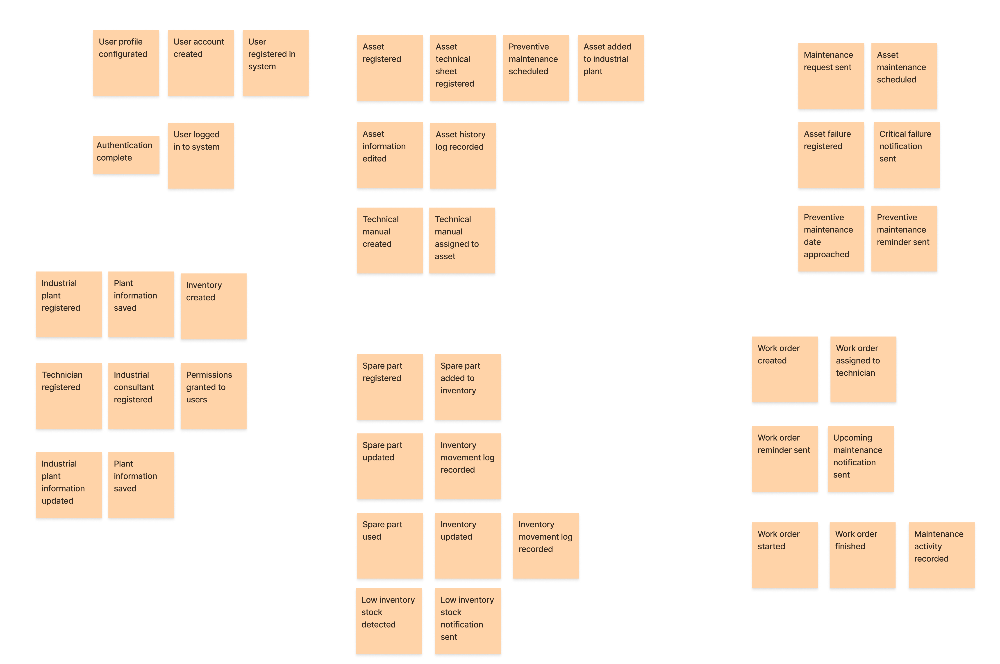<br>
</div>


<div align="center">
  <strong>2. Agregar comandos</strong><br><br>
  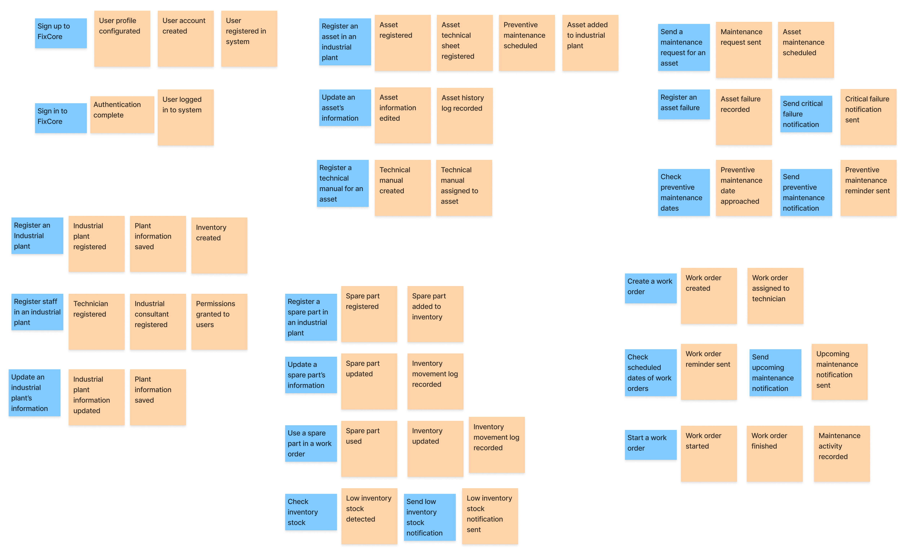<br>
</div>


<div align="center">
  <strong>3. Agregar actores y politicas</strong><br><br>
  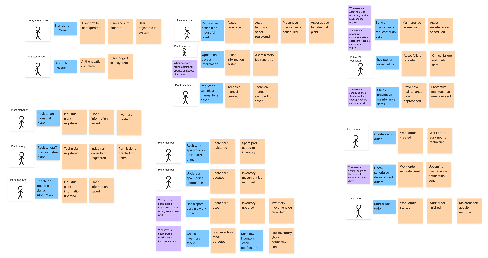<br>
</div>


<div align="center">
  <strong>4. Agregar Read Models</strong><br><br>
  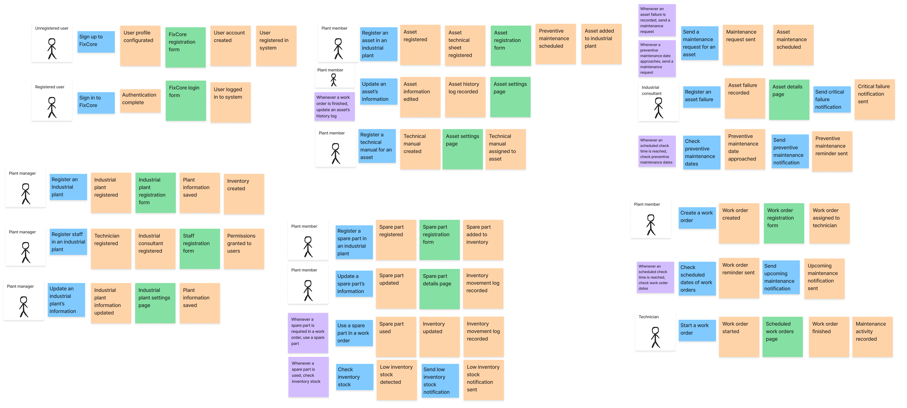<br>
</div>


<div align="center">
  <strong>5. Agregar sistemas externos</strong><br><br>
  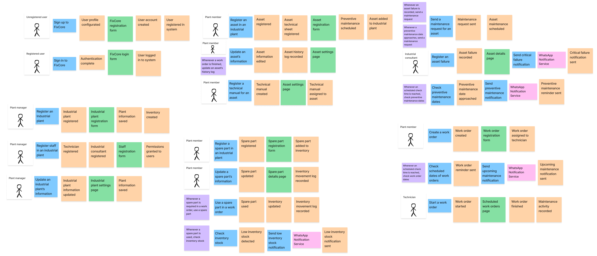<br>
</div>


<div align="center">
  <strong>6. Agregar reglas de negocio</strong><br><br>
  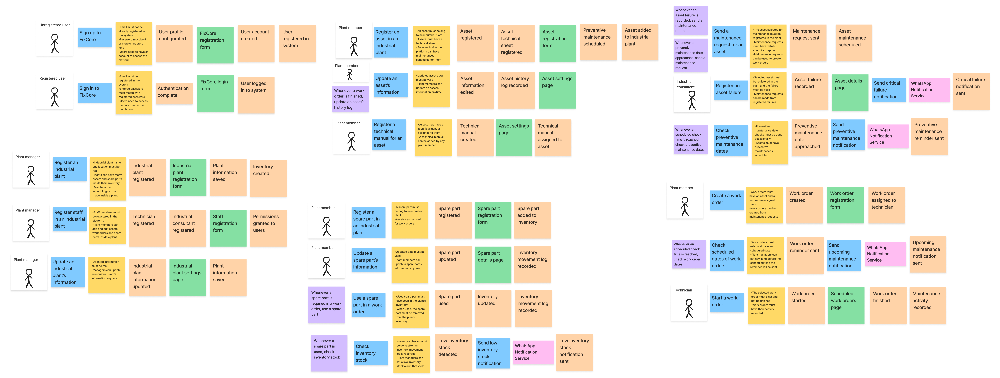<br>
</div>


<div align="center">
<strong>7. Agrupar reglas de negocio</strong><br><br>
  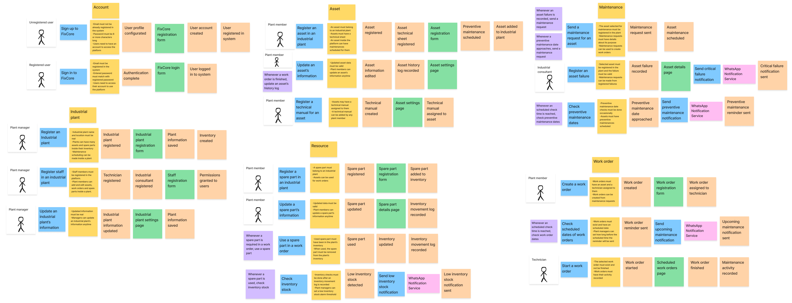<br>
  <em>Fuente: Elaboración propia.</em>
</div>

### 4.6.2. Software Architecture Context Diagram. 

En esta sección se presenta el Diagrama de Contexto de FixCore, con el fin de mostrar el sistema desde una perspectiva general y su relación con los principales usuarios y sistemas externos. El diagrama permite identificar quiénes interactúan con FixCore y cuál es el propósito general de estas interacciones.Este diagrama muestra a FixCore como el sistema central para la gestión del mantenimiento industrial. El administrador de planta utiliza la plataforma para gestionar plantas, activos, actividades de mantenimiento y órdenes de trabajo.El tecnico la usa para reportar fallas, ejecutar ordenes y registrar actividades de mantenimiento,por ultimo qel Consultor Industrial coordina los servicios de mantenimiento y técnicos en las plantas. Además, FixCore se comunica con el Servicio de Notificaciones WhatsApp, un sistema externo encargado de enviar alertas y notificaciones importantes relacionadas con el mantenimiento.


<div align="center">
  <strong></strong><br><br>
  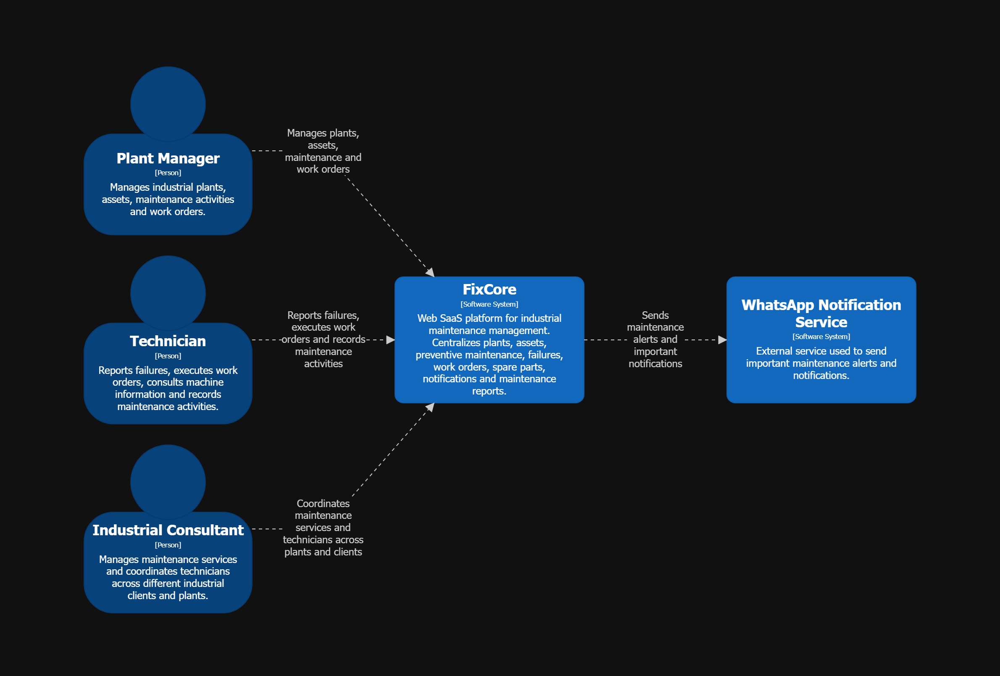<br>
  <em>Fuente: Elaboración propia.</em>
</div>

### 4.6.3. Software Architecture Container Diagrams. 

En esta sección se presenta el Container Diagram de FixCore, elaborado bajo el C4 Model donde intentamos mostrar los elementos principales de la arquitectura y como se distribuyen las responsabilidades entre ellos. El diagrama incluye la Aplicación Web, API REST, servicios especializados y sus respectivas bases de datos,tambien incluimos el servicio externo de notificaciones.Por ultimo,en el diagrama indicamos las principales decisiones tecnológicas y las formas de comunicación entre los containers mediante HTTPS, REST y JSON. Cada container representa una unidad de despliegue independiente, permitiendo organizar las funcionalidades de FixCore de acuerdo con sus responsabilidades.

<div align="center">
  <strong></strong><br><br>
  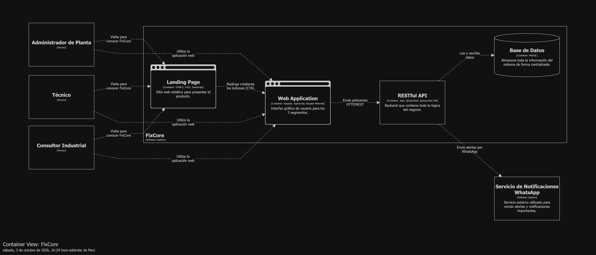<br>
  <em>Fuente: Elaboración propia.</em>
</div>

### 4.6.4. Software Architecture Components Diagrams. 

Ahora presentamos los Diagramas de Componentes de FixCore, desarrollados a partir de los containers definidos apartado anterior. Estos diagramas permiten profundizar en la estructura interna de cada container, identificando sus principales componentes, responsabilidades, relaciones e implementación tecnológica,estos nos ayuda a obtener una vision más detallada de como se organiza cada parte de la plataforma y como es que sus componentes colaboran para cumplir con las funcionalidades definidas para FixCore.

* **1.Diagrama de Componentes – Aplicación Web**

Este diagrama muestra la estructura visual de la plataforma. Contiene los componentes responsables de la autenticación, gestión de plantas, activos, mantenimiento, inventario, reportes y notificaciones, los cuales envían las peticiones al backend.

<div align="center">
  <strong></strong><br><br>
  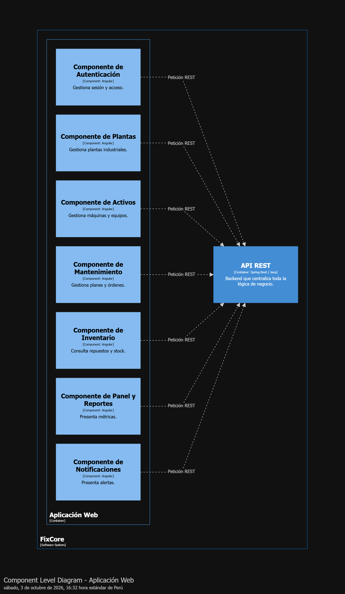<br>
  <em>Fuente: Elaboración propia.</em>
</div>


* **2.Diagrama de Componentes – API REST**

Este diagrama representa la capa principal de entrada del backend. Se muestran los controladores encargados de recibir las peticiones de la web, apoyados por el componente de seguridad y el manejador de errores.
<div align="center">
  <strong></strong><br><br>
  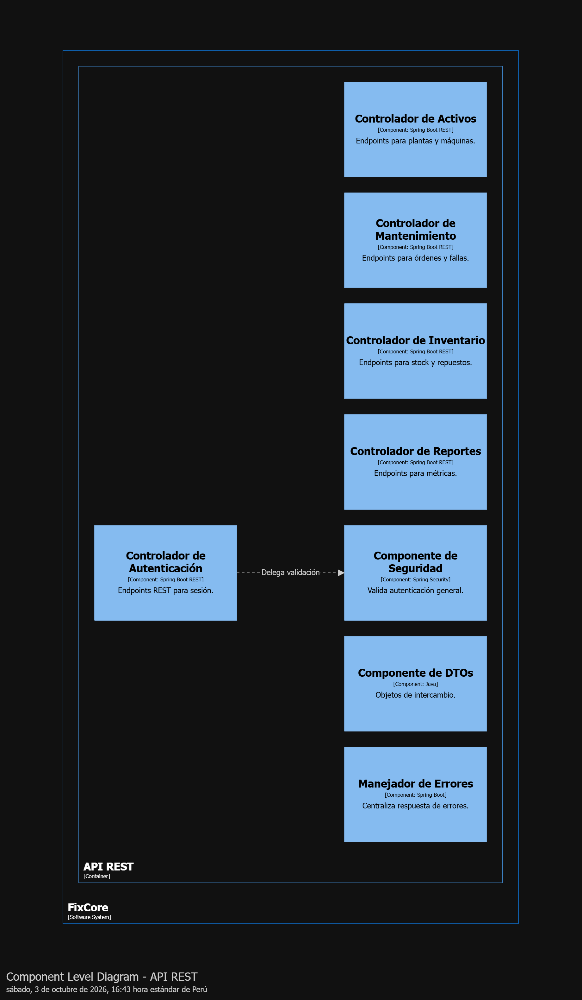<br>
  <em>Fuente: Elaboración propia.</em>
</div>

* **3.Diagrama de Componentes – Identidad y Acceso**

Este diagrama detalla los componentes internos encargados de la seguridad. Muestra cómo se gestionan las cuentas de usuarios, roles, sesiones activas y la validación de credenciales directamente con la base de datos.

<div align="center">
  <strong></strong><br><br>
  <br>
  <em>Fuente: Elaboración propia.</em>
</div>


* **4.Diagrama de Componentes – Recursos y Activos**

Este diagrama presenta la lógica interna para la administración de las instalaciones. Incluye los componentes que gestionan las plantas industriales, las máquinas, las fichas técnicas y el historial de mantenimiento.

<div align="center">
  <strong></strong><br><br>
  <br>
  <em>Fuente: Elaboración propia.</em>
</div>

* **5.Diagrama de Componentes – Ejecución y Monitoreo**

Este diagrama describe el flujo de trabajo operativo diario. Presenta los componentes para el registro de fallas, creación de órdenes de trabajo, asignación de técnicos, registro de tareas y el envío de alertas por WhatsApp.

<div align="center">
  <strong></strong><br><br>
  <br>
  <em>Fuente: Elaboración propia.</em>
</div>

* **6.Diagrama de Componentes – Inventario y Repuestos**

Este diagrama muestra los componentes enfocados en el control del almacén. Incluye la administración del inventario, catálogo de repuestos, control de cantidades disponibles (stock), registro de movimientos y las alertas de escasez.

<div align="center">
  <strong></strong><br><br>
  <br>
  <em>Fuente: Elaboración propia.</em>
</div>


## 4.7. Software Object-Oriented Design. 

En esta sección se presenta el diseño orientado a objetos de FixCore, detallando la estructura de sus principales elementos de software y su organización dentro de los bounded contexts que se definieron.

### 4.7.1. Class Diagrams. 

Se presentan los diagramas de clases UML de cada bounded context, mostrando sus clases, interfaces, enumeraciones, atributos, métodos, visibilidad y relaciones, con el fin de representar con mayor detalle la estructura del sistema.

#### 4.7.1.1. Class Diagram – Identity & Access Management


#### 4.7.1.2. Class Diagram – Resource & Asset Management


#### 4.7.1.3. Class Diagram – Service Design & Planning


#### 4.7.1.4. Class Diagram – Service Execution & Monitoring


#### 4.7.1.5. Class Diagram – Inventory & Spare Parts Management


## 4.8. Database Design. 

En esta sección presentamos el diseño de las bases de datos de FixCore para cada Bounded Context, considerando la estructura necesaria para la persistencia de la información. Los diagramas muestran las principales tablas, columnas, claves primarias, claves foráneas, restricciones y relaciones entre las entidades de cada contexto.

### 4.8.1. Database Diagrams. 

En este apartado mostramos los Database Diagrams correspondientes a cada Bounded Context, detallando las tablas y sus relaciones para representar como se almacenara y organizara la informacion de FixCore en una base de datos relacional.

#### 4.8.1.1. Database Diagram – Identity & Access Management

<div align="center">
  <strong></strong><br><br>
  
  <em>Fuente: Elaboración propia.</em>
</div>

#### 4.8.1.2. Database Diagram – Resource & Asset Management

<div align="center">
  <strong></strong><br><br>
  <br>
  <em>Fuente: Elaboración propia.</em>
</div>

#### 4.8.1.3. Database Diagram – Service Design & Planning

<div align="center">
  <strong></strong><br><br>
  <br>
  <em>Fuente: Elaboración propia.</em>
</div>

#### 4.8.1.4. Database Diagram – Service Execution & Monitoring

<div align="center">
  <strong></strong><br><br>
  <br>
  <em>Fuente: Elaboración propia.</em>
</div>

#### 4.8.1.5. Database Diagram – Inventory & Spare Parts Management

<div align="center">
  <strong></strong><br><br>
  <br>
  <em>Fuente: Elaboración propia.</em>
</div>


<div style="page-break-after: always;"></div>

# Capítulo V: Product Implementation, Validation & Deployment  

## 5.1. Software Configuration Management. 

### 5.1.1. Software Development Environment Configuration. 

En esta sección se presentan las herramientas usadas por los integrantes del equipo durante el desarrollo del proyecto, considerando cada tipo de actividades realizadas.

**Project Management**

Esta sección corresponde a los productos usados para la administración de proyecto, así como la comunicación entre integrantes.

|Producto|Proposito de uso|Ruta de referencia|
|:-------|:---------------|:-----------------|
|Trello| Organización de las actividades del proyecto, seguimiento de tareas y gestión del Product Backlog|https://trello.com/b/yJyuiOSO|
|GitHub|Alojamiento de repos, control de versiones y revision de código mediante Pull Requests|https://github.com/TechMakers-upc/Report|
|Google Drive|Almacenamiento de entrevistas realizadas|https://drive.google.com|
|Whatsapp|Comunicacion rapida para resolver dudas y compartir informacion|https://wa.me/|
|Discord|Coordinacion entre los integrantes del equipo mediante canales de voz|https://discord.com/|
||||

**Requirements Management** 

En esta sección se presentan los productos usados para la gestión de los requisitos del proyecto.

|Producto|Proposito de uso|Ruta de referencia|
|:-------|:---------------|:-----------------|
|Uxpressia|Elaboración de User Personas, User Journey Maps, Empathy Maps y otras herramientas utilizadas para identificar y analizar las necesidades, problemas y características de los usuarios del proyecto| https://uxpressia.com/w/v8FzI/t/zbzV3|
|Figjam|Elaboración colaborativa del Big Picture y Design-Level EventStorming para el modelado de dominio|https://www.figma.com/es-la/figjam/|
|Trello|Gestión y organización del Product Backlog, historias de usuario|https://trello.com/b/yJyuiOSO|
||||

**Product UX/UI Design** 

A continuación se presentan los productos utilizados para el diseño de interfaces y de experiencia del usuario.

|Producto|Proposito de uso|Ruta de referencia|
|:-------|:---------------|:-----------------|
|Figma|Diseño de wireframes,mockups,prototipos|https://www.figma.com|
||||

**Software Development** 

En esta sección se encuentran las herramientas usadas por los integrantes del equipo para el desarrollo del software relacionado al proyecto.

|Producto|Proposito de uso|Ruta de referencia|
|:-------|:---------------|:-----------------|
|Visual Studio Code |Usado para el desarrollo de la Landing Page|https://code.visualstudio.com/
|Git|Control de versiones|https://git-scm.com/
|JetBrains Webstorm|Usado para el desarrollo del frontend web application|https://www.jetbrains.com/es-es/|
||||

**Software Deployment** 

Se presentan los productos usados para el despliegue de nuestros productos de software.

|Producto|Proposito de uso|Ruta de referencia|
|:-------|:---------------|:-----------------|
|GitHub Pages|Plataforma de despliegue para el landing page|https://docs.github.com/es/pages
|Vercel|Despliegue de paginas frontend|https://vercel.com/|
|Render|Despliegue de servicios web|https://render.com/|
||||

**Software Documentation**

A continuación se presentan los productos utilizados para documentar el software del proyecto.

|Producto|Proposito de uso|Ruta de referencia|
|:-------|:---------------|:-----------------|
|MarkDown|Formato usado para estructurar y representar la documentacion|https://www.markdownguide.org/|
||||

### 5.1.2. Source Code Management. 

Para administrar los cambios realizados en los distintos ambitos de nuestro proyecto, usamos la plataforma GitHub, en la cual creamos una organización con repositorios correspondientes a cada entregable.

Enlace de la organización: [https://github.com/TechMakers-upc](https://github.com/TechMakers-upc)  

Enlace del repositorio del informe: [https://github.com/TechMakers-upc/Report](https://github.com/TechMakers-upc/Report)  

Enlace del repositorio de la Landing Page: [https://github.com/TechMakers-upc/Landing-Page](https://github.com/TechMakers-upc/Landing-Page)

Además, usamos el flujo de trabajo conocido como "GitFlow".


### 5.1.3. Source Code Style Guide & Conventions. 

Para el desarrollo de la solución, el equipo ha adoptado de forma estricta el uso del idioma inglés para toda la nomenclatura del código fuente. Esta aplica a la definición de variables, interfaces, clases, métodos, nombres de archivos y comentarios técnicos dentro de los lenguajes utilizados: HTML, CSS, JavaScript, TypeScript y Java.
A fin de asegurar la calidad, mantenibilidad y legibilidad del código a lo largo del ciclo de vida del proyecto, se han establecido las siguientes convenciones y guías de estilo para cada tecnología:

* HTML y CSS: Se siguen las directrices de la "HTML Style Guide and Coding Conventions" y la "Google HTML/CSS Style Guide". Esto asegura una estructura semántica clara, el uso de selectores óptimos y un código visualmente limpio.

* JavaScript: La lógica y manipulación general del DOM en el Landing Page se rige por las mejores prácticas establecidas en la "Google JavaScript Style Guide" y las convenciones estándar de MDN/W3C, garantizando consistencia y rendimiento.

* Frontend Framework: Para el desarrollo de las Frontend Web Applications, se adopta la "Angular Coding Style Guide" y la "Google TypeScript Style Guide". Estas guías establecen las convenciones fundamentales para la estructuración de componentes, el tipado estricto y la inyección de dependencias.

* Web Services: La construcción de la API RESTful orientada a servicios se rige bajo la "Google Java Style Guide" y las características de "Spring Boot Features". Esto estandariza el uso de PascalCase para clases e interfaces, camelCase para métodos y atributos, y define las convenciones de arquitectura para los repositorios de Spring Data JPA.

* Especificaciones de Requisitos: La redacción de los escenarios y criterios de aceptación en las historias de usuario se estandariza utilizando las "Gherkin Conventions for Readable Specifications", aplicando sistemáticamente la estructura de comportamiento de negocio Given-When-Then.

### 5.1.4. Software Deployment Configuration. 

El proceso de despliegue de la solución busca garantizar que, desde el repositorio de código fuente, se pueda realizar correctamente la publicación del producto digital correspondiente.

#### Landing Page

* Entorno de destino: GitHub Pages

* Proceso de despliegue: Los cambios realizados y previamente validados en el Landing Page, como archivos HTML, CSS e imágenes, se integran en la rama principal del repositorio. A partir de la actualización del repositorio mediante un push o merge, GitHub realiza automáticamente el proceso de publicación de los archivos estáticos utilizando GitHub Pages. Finalmente, se verifica el despliegue ingresando al enlace público generado para comprobar que el Landing Page se encuentre disponible y funcione correctamente.


## 5.2. Landing Page, Services & Applications Implementation. 

### 5.2.1. Sprint 1

Durante el Sprint 1, el equipo TechMakers trabajó en el desarrollo y despliegue de la Landing Page de FixCore, con el objetivo de presentar la propuesta de valor del producto y dar a conocer sus principales funcionalidades a los segmentos definidos. En esta etapa nos enfocamos en implementar un sitio web informativo, responsivo y accesible desde distintos dispositivos.

A continuación, se presentan la planificación del sprint, las responsabilidades de cada integrante, el Sprint Backlog, las evidencias de desarrollo y despliegue, y los resultados del trabajo colaborativo.

#### 5.2.1.1. Sprint Planning 1.

La planificación del Sprint 1 se realizó mediante una reunión virtual en Discord. Durante esta sesión, definimos el objetivo del sprint, seleccionamos las User Stories relacionadas con la Landing Page y distribuimos las responsabilidades de implementación entre los integrantes del equipo.

| Campo | Información |
|---|---|
| Sprint # | Sprint 1 |
| **Sprint Planning Background** | |
| Date | 2026-09-11 |
| Time | 7:00 PM - 8:00 PM |
| Location | Discord |
| Prepared By | Alvar Lucas Córdova |
| Attendees | Sunio Danilo Landa Sánchez, Giuseppe Adrián Villanueva Rodríguez, Diego Rances Rojas Huaranga y Pierre Alessandro Mendoza Boluarte |
| **Sprint Goal & User Stories** | |
| Sprint 1 Goal | **Our focus is on** developing and deploying a responsive Landing Page that clearly presents FixCore and its value proposition. **We believe it delivers** accessible information about the product, its main features, benefits, subscription plans and frequently asked questions for the defined target segments. **This will be confirmed when** the Landing Page is published on GitHub Pages and visitors can navigate its main sections from desktop and mobile devices. |
| Sprint 1 Velocity | 6 Story Points completados |
| Sum of Story Points | 7 Story Points planificados |

Para este sprint se seleccionaron cinco User Stories relacionadas con la presentación de FixCore: US59, US60, US61, US62 y US63. Estas historias suman 7 Story Points en el Product Backlog.

Se completaron las funcionalidades informativas principales, correspondientes a 6 Story Points. La US63 requiere terminar de habilitar el acceso a los términos y condiciones desde el Footer para considerarse completamente finalizada.

#### 5.2.1.2. Aspect Leaders and Collaborators.

Para organizar el trabajo del Sprint 1, elaboramos una Leadership and Collaboration Matrix en la que se asignó un responsable principal para cada sección de la Landing Page. Los demás integrantes participaron como colaboradores, apoyando en la revisión de las interfaces, integración de cambios y correcciones necesarias.

En la siguiente matriz, **L** representa al líder de la actividad y **C** a los colaboradores.

| Team Member (Last Name, First Name) | GitHub Username | Landing Page Hero & Navbar | Features & Usage Guide Section | Segmented Benefits & Testimonials | Monthly & Annual Pricing Views | FAQ Component & Support |
|---|---|---|---|---|---|---|
| Rojas Huaranga, Diego Rances | diego27-16 | L | C | C | C | C |
| Mendoza Boluarte, Pierre Alessandro | pierreale2302 | C | L | C | C | C |
| Córdova, Alvar Lucas | AlvarLC | C | C | L | C | C |
| Landa Sánchez, Sunio Danilo | DanLandio | C | C | C | L | C |
| Villanueva Rodríguez, Giuseppe Adrián | Giuseppe152004 | C | C | C | C | L |

Esta distribución permitió que cada integrante se concentrara en una sección específica del sitio, mientras el resto del equipo brindaba apoyo cuando era necesario. De esta manera, pudimos desarrollar las diferentes partes de la Landing Page en paralelo y posteriormente integrarlas en una misma versión.

#### 5.2.1.3. Sprint Backlog 1.

El Sprint Backlog 1 reúne las tareas que definimos para implementar las secciones principales de la Landing Page de FixCore. Estas actividades están relacionadas con cinco User Stories del Product Backlog y fueron distribuidas entre los integrantes del equipo según las responsabilidades establecidas durante la planificación.

Para hacer seguimiento a las actividades utilizamos Trello, donde registramos las tareas asignadas, sus responsables y sus estados durante el desarrollo del sprint.

**Enlace al Sprint Backlog 1:**

[Tablero Trello Sprint Backlog 1](https://trello.com/b/8ilypk4J/sprint-backlog-1-techmakers)

| Story ID | Story Title | Task ID | Task Title | Task Description | Estimation (hours) | Assigned To | Status |
|---|---|---|---|---|---|---|---|
| US59 | Conocer FixCore | T001 | Develop Landing Page Hero | Implementar la sección principal del Hero con la propuesta de valor y el llamado a la acción de FixCore. | 2 | Rojas Huaranga, Diego Rances | Done |
| US59 | Conocer FixCore | T002 | Add Landing Page Navbar | Implementar la barra de navegación con el logo, enlaces a las secciones de FixCore y diseño responsivo. | 2 | Rojas Huaranga, Diego Rances | Done |
| US60 | Conocer funcionalidades de FixCore | T003 | Develop Features Section | Desarrollar la sección que presenta las funcionalidades principales de FixCore y la vista referencial del dashboard. | 3 | Mendoza Boluarte, Pierre Alessandro | Done |
| US60 | Conocer funcionalidades de FixCore | T004 | Design User Guide Section | Diseñar e implementar los pasos explicativos sobre el funcionamiento general de FixCore. | 2 | Mendoza Boluarte, Pierre Alessandro | Done |
| US61 | Conocer beneficios según el segmento | T005 | Write Benefits for Each Segment | Redactar e implementar la sección de beneficios de FixCore adaptada a los diferentes segmentos objetivo. | 2 | Córdova, Alvar Lucas | Done |
| US61 | Conocer beneficios según el segmento | T006 | Add User Testimonials | Diseñar e incorporar una sección de testimonios ilustrativos para presentar situaciones de uso y beneficios esperados de FixCore. | 2 | Córdova, Alvar Lucas | Done |
| US62 | Consultar planes de FixCore | T007 | Develop Monthly Pricing Plans | Implementar las tarjetas de planes de suscripción, mostrando sus características y tarifas mensuales. | 2 | Landa Sánchez, Sunio Danilo | Done |
| US62 | Consultar planes de FixCore | T008 | Develop Annual Pricing Plans | Implementar la funcionalidad para alternar entre los precios mensuales y anuales. | 2 | Landa Sánchez, Sunio Danilo | Done |
| US63 | Consultar información adicional de FixCore | T009 | Add Frequently Asked Questions | Implementar la sección de preguntas frecuentes y el Footer para resolver dudas adicionales de los visitantes. | 3 | Villanueva Rodríguez, Giuseppe Adrián | Done |
| US63 | Consultar información adicional de FixCore | T010 | Write Terms and Conditions | Redactar los términos y condiciones de FixCore y habilitar su consulta desde el enlace correspondiente del Footer. | 2 | Villanueva Rodríguez, Giuseppe Adrián | In Progress |

Durante el desarrollo del Sprint 1 se implementaron las secciones principales del sitio, incluyendo el Hero, Navbar, funcionalidades, guía de uso, beneficios por segmento, testimonios ilustrativos, planes de suscripción, preguntas frecuentes y Footer.

La sección de preguntas frecuentes y el Footer se encuentran implementados. Sin embargo, todavía se debe completar el acceso a los términos y condiciones, debido a que el enlace correspondiente no dirige a una página con esa información.

#### 5.2.1.4. Development Evidence for Sprint Review.

Durante el Sprint 1 utilizamos Git y GitHub para gestionar los cambios realizados en el código fuente de la Landing Page. Cada integrante trabajó en las funcionalidades asignadas y registró sus avances mediante commits.

La siguiente tabla presenta algunos de los commits realizados durante el desarrollo del sitio. Estos registros permiten identificar los cambios incorporados, las ramas utilizadas y las fechas en las que se realizaron.

| Repository | Branch | Commit ID | Commit Message | Commit Message Body | Committed on |
|---|---|---|---|---|---|
| Landing-Page | feature/landing-page-presentation | 0128950 | feat: Enhance index.html with meta tags and header structure | | Sep 19, 2026 |
| Landing-Page | feature/landing-page-presentation | 18ee3c6 | styles: Add base styles and CSS variables | | Sep 19, 2026 |
| Landing-Page | feature/landing-page-presentation | 51ba71f | Merge pull request #1 from TechMakers-upc/Feature/landing-page | | Sep 19, 2026 |
| Landing-Page | feature/functions-landing | c7507e1 | feat(landing): implement features section and add UI assets | | Sep 19, 2026 |
| Landing-Page | feature/functions-landing | c0f0ae4 | Merge pull request #3 from TechMakers-upc/feature/functions-landing | | Sep 19, 2026 |
| Landing-Page | feature/benefints-landing-page | ef53f10 | Update index.html | | Sep 19, 2026 |
| Landing-Page | feature/benefints-landing-page | 2b78517 | Merge pull request #4 from TechMakers-upc/feature/Benefits-Landing-Page | | Sep 19, 2026 |
| Landing-Page | main | eb0f365 | feat: add subscription plans information cards | | Sep 19, 2026 |

Los commits muestran parte del proceso de implementación de las distintas secciones de la Landing Page. La integración de estos cambios permitió reunir las funcionalidades desarrolladas por el equipo en una versión compartida del sitio web.

#### 5.2.1.5. Execution Evidence for Sprint Review.

En esta sección presentamos las evidencias visuales de las funcionalidades implementadas durante el Sprint 1. Las capturas corresponden a la primera versión de la Landing Page y muestran las principales secciones desarrolladas.

**1. Navbar y Hero Section**

Implementamos el encabezado principal de la Landing Page, compuesto por el logo de FixCore, el menú de navegación y la sección Hero. Esta última presenta la propuesta de valor del producto y permite que los visitantes conozcan su propósito desde el inicio.


**2. Funcionalidades y guía de uso**

Desarrollamos una sección informativa que presenta las principales funcionalidades propuestas para FixCore. También incorporamos una guía visual que explica cómo se utilizaría la plataforma para organizar actividades de mantenimiento industrial.

La finalidad de estas secciones es que los visitantes comprendan las capacidades de la solución antes de acceder a la aplicación.


**3. Beneficios por segmento y testimonios**

Implementamos una sección de beneficios orientada a los segmentos objetivo de FixCore. En ella se presentan las ventajas esperadas de la plataforma para pymes manufactureras, firmas contratistas y personal técnico de mantenimiento.

También incorporamos testimonios ilustrativos que muestran situaciones relacionadas con los problemas que FixCore busca resolver. Estos ejemplos forman parte de la presentación de la propuesta y no constituyen resultados comprobados de clientes que ya utilizan el producto.


**4. Planes y precios**

Desarrollamos la sección de suscripciones, donde los visitantes pueden revisar los planes propuestos para FixCore y comparar sus características principales.

Además, implementamos un selector que permite alternar entre la visualización de precios mensuales y anuales sin necesidad de cambiar de página.


**5. Preguntas frecuentes y Footer**

Implementamos la sección de preguntas frecuentes para ofrecer respuestas a dudas habituales relacionadas con FixCore, sus funcionalidades y sus planes.

Asimismo, desarrollamos el Footer con enlaces de navegación e información adicional del producto. El acceso al contenido de términos y condiciones permanece pendiente de completarse.


#### 5.2.1.6. Services Documentation Evidence for Sprint Review.

Durante el Sprint 1 nos concentramos en desarrollar la Landing Page de FixCore como un sitio web informativo. Las actividades realizadas abarcaron la implementación de sus secciones visuales, la navegación entre contenidos, la presentación de planes y la interacción con las preguntas frecuentes.

La Landing Page fue desarrollada utilizando tecnologías web como HTML, CSS y JavaScript. Su funcionamiento no requiere una base de datos ni una API REST para presentar la información al visitante.

Por este motivo, durante este sprint no se implementaron Web Services, endpoints o servicios de backend relacionados con la gestión del mantenimiento industrial. Estas funcionalidades corresponden a etapas posteriores del desarrollo de FixCore.

En consecuencia, no se presentan endpoints ni documentación de servicios REST en esta entrega, debido a que no formaron parte del alcance del Sprint 1.

#### 5.2.1.7. Software Deployment Evidence for Sprint Review.

Al finalizar el desarrollo de la Landing Page, realizamos su publicación mediante GitHub Pages. De esta manera, el sitio quedó disponible a través de un enlace público y puede consultarse desde un navegador sin necesidad de descargar o ejecutar el proyecto localmente.

El repositorio de la Landing Page contiene el código fuente, los estilos y los recursos utilizados para presentar FixCore. También incluye versiones del sitio en español e inglés.

La versión publicada presenta las secciones desarrolladas durante el sprint: Navbar, Hero, funcionalidades, guía de uso, beneficios, testimonios ilustrativos, planes de precios, preguntas frecuentes y Footer.

**Repositorio de código fuente:**

https://github.com/TechMakers-upc/Landing-Page

**Landing Page desplegada:**

https://techmakers-upc.github.io/Landing-Page/

A continuación, se presentan las capturas utilizadas para registrar el despliegue de la Landing Page en GitHub Pages.


#### 5.2.1.8. Team Collaboration Insights during Sprint.

Durante el Sprint 1 organizamos las actividades de desarrollo mediante la distribución de responsabilidades entre los cinco integrantes de TechMakers. Cada miembro asumió el liderazgo de una sección de la Landing Page y colaboró con el resto del equipo durante las revisiones e integración de los cambios.

Para coordinar el trabajo utilizamos reuniones virtuales, Trello y GitHub. El tablero del Sprint Backlog nos permitió mantener un seguimiento de las tareas, mientras que el repositorio registró los commits y las contribuciones realizadas por los integrantes.

Trabajar con ramas independientes facilitó el desarrollo paralelo de las secciones. Sin embargo, durante la integración encontramos algunos problemas relacionados con traducciones, espaciados, colores y diferencias entre componentes. Estos detalles requirieron ajustes adicionales para mantener una presentación uniforme.

A partir de esta experiencia identificamos la importancia de mantener convenciones comunes de diseño y desarrollo, revisar los cambios antes de integrarlos y comunicar oportunamente las dificultades encontradas.

El trabajo realizado permitió completar la estructura principal de la Landing Page y publicarla mediante GitHub Pages. Asimismo, las actividades del sprint nos ayudaron a mejorar la organización del equipo y establecer una base para las siguientes etapas del proyecto.

**Métricas de colaboración:**


<div align="center">
  <br>
</div>


<div style="page-break-after: always;"></div>


### 5.2.2. Sprint 2.

Durante el Sprint 2, el equipo TechMakers se enfocará en desarrollar las interfaces principales de la Web Application de FixCore, tomando como referencia las User Stories definidas en el Product Backlog.

A diferencia del Sprint 1, que estuvo dedicado a la Landing Page, esta iteración estará orientada al frontend de la plataforma de mantenimiento industrial. Se propone trabajar las interfaces relacionadas con la gestión de plantas y máquinas, mantenimiento preventivo, fallas, órdenes de trabajo, inventario de repuestos, dashboard y acceso desde la Landing Page.

Se han identificado 27 User Stories relacionadas con estas funcionalidades, que suman 88 Story Points según las estimaciones originales del Product Backlog. Estas historias representan la cobertura funcional que el equipo desea abordar a nivel de frontend y no implican que todas puedan considerarse completadas durante esta iteración.

Para las demostraciones se utilizarán datos simulados y validaciones del lado del cliente. El backend, los servicios RESTful, la base de datos y las funcionalidades de Identity and Access Management (IAM) quedan fuera del alcance del Sprint 2.

#### 5.2.2.1. Sprint Planning 2.

La planificación del Sprint 2 considera los resultados obtenidos durante el Sprint 1 y las funcionalidades principales de FixCore. Para esta iteración se plantea distribuir el desarrollo del frontend por módulos, de modo que los cinco integrantes puedan trabajar en diferentes interfaces y posteriormente integrar sus avances en una misma aplicación web.

| Campo | Información |
|---|---|
| Sprint # | Sprint 2 |
| **Sprint Planning Background** | |
| Date | 2026-10-08 |
| Time | 2:00 AM - 2:45 AM |
| Location | Meeting |
| Prepared By | Alvar Lucas Córdova |
| Attendees | Alvar Lucas Córdova, Sunio Danilo Landa Sánchez, Giuseppe Adrián Villanueva Rodríguez, Diego Rances Rojas Huaranga y Pierre Alessandro Mendoza Boluarte (participación prevista) |
| Sprint 1 Review Summary | Durante el Sprint 1 se implementó la estructura principal de la Landing Page de FixCore, incluyendo sus secciones informativas, navegación, beneficios, planes y preguntas frecuentes. Posteriormente se realizaron correcciones relacionadas con las traducciones, enlaces y páginas informativas. |
| Sprint 1 Retrospective Summary | Se identificó la importancia de mantener convenciones comunes de desarrollo, mejorar la coordinación entre integrantes y realizar revisiones antes de integrar los cambios. Para el Sprint 2 se propone organizar las responsabilidades por módulos y realizar pruebas de integración durante el desarrollo. |
| **Sprint Goal & User Stories** | |
| Sprint 2 Goal | **Our focus is on** developing the main frontend interfaces of the FixCore Web Application, covering asset management, preventive maintenance, failure reporting, work orders, spare parts inventory, operational dashboards, and navigation from the Landing Page. **We believe it delivers** an integrated and navigable frontend prototype that allows users to explore the main modules and interact with representative maintenance workflows using simulated data. **This will be confirmed when** the planned interfaces are integrated, their navigation and validations are tested, and the frontend is accessible through a deployed application. |
| Sprint 1 Velocity Reference | 6 Story Points completados |
| Sprint 2 Velocity | Por determinar al finalizar el sprint |
| User Stories Considered for Frontend Coverage | 27 |
| Associated Product Backlog Story Points | 88 Story Points |
| Sum of Story Points | Por definir según las User Stories comprometidas para el Sprint 2 |

**User Stories consideradas para la cobertura del frontend**

| Módulo | User Stories | Cantidad | Story Points |
|---|---|---:|---:|
| Gestión de plantas y máquinas | US01, US02, US03, US04, US05, US08, US09 | 7 | 24 |
| Mantenimiento preventivo | US10, US14, US16, US17 | 4 | 16 |
| Gestión de fallas | US19, US20, US21, US22 | 4 | 10 |
| Órdenes de trabajo | US23, US25, US27, US28, US29, US30 | 6 | 21 |
| Inventario de repuestos | US31, US33, US35 | 3 | 7 |
| Dashboard y seguimiento | US41, US45 | 2 | 8 |
| Acceso desde Landing Page | US64 | 1 | 2 |
| **Total** | | **27** | **88** |

Las User Stories seleccionadas se encuentran relacionadas con las principales interfaces que se busca desarrollar durante el Sprint 2. Estas se han organizado por módulos para facilitar la distribución de responsabilidades y permitir que los integrantes avancen en diferentes partes de la aplicación.

Las 27 historias consideradas suman 88 Story Points según las estimaciones originales del Product Backlog. Sin embargo, estos puntos corresponden al desarrollo completo de las funcionalidades, mientras que el alcance previsto para este sprint se concentra en la implementación del frontend con datos simulados y validaciones del lado del cliente.

Por este motivo, las interfaces desarrolladas no implicarán necesariamente que todas las User Stories se encuentren completadas. El equipo deberá revisar sus criterios de aceptación y determinar cuáles podrán finalizarse dentro del tiempo disponible, considerando también las dependencias con los servicios de backend que se implementarán en iteraciones posteriores.


#### 5.2.2.2. Aspect Leaders and Collaborators.

Para organizar el desarrollo del Sprint 2, se propone una Leadership and Collaboration Matrix en la que cada integrante asumirá el liderazgo de un módulo principal y colaborará en la integración de las demás interfaces.

En la siguiente matriz, **L** representa al líder del área de trabajo y **C** a los colaboradores.

| Team Member  | GitHub Username | Plants & Machines | Preventive Maintenance | Failures & Dashboard | Work Orders & Access | Inventory & Testing |
|---|---|:---:|:---:|:---:|:---:|:---:|
| Córdova, Alvar Lucas | AlvarLC | L | C | C | C | C |
| Landa Sánchez, Sunio Danilo | DanLandio | C | L | C | C | C |
| Villanueva Rodríguez, Giuseppe Adrián | Giuseppe152004 | C | C | L | C | C |
| Rojas Huaranga, Diego Rances | diego27-16 | C | C | C | L | C |
| Mendoza Boluarte, Pierre Alessandro | pierreale2302 | C | C | C | C | L |

La distribución propuesta establece las siguientes responsabilidades:

- **Alvar Lucas Córdova:** configuración inicial del frontend y desarrollo de las interfaces para registrar, editar y consultar información de plantas y máquinas.
- **Sunio Danilo Landa Sánchez:** desarrollo de las interfaces de mantenimiento preventivo, incluyendo programación, calendario y consultas de actividades pendientes o vencidas.
- **Giuseppe Adrián Villanueva Rodríguez:** implementación de las interfaces para reportar y consultar fallas, así como del dashboard con indicadores demostrativos.
- **Diego Rances Rojas Huaranga:** desarrollo del módulo de órdenes de trabajo y conexión entre la Landing Page y la Web Application.
- **Pierre Alessandro Mendoza Boluarte:** desarrollo de las interfaces de inventario de repuestos y apoyo en las pruebas de integración y adaptación responsive.

Estas responsabilidades son una propuesta inicial y podrán modificarse de acuerdo con las decisiones y la disponibilidad de los integrantes.

#### 5.2.2.3. Sprint Backlog 2.

El Sprint Backlog 2 organiza las actividades propuestas para implementar las interfaces principales de FixCore. Las tareas se relacionan con las User Stories consideradas para la cobertura del frontend y mantienen la numeración consecutiva del Sprint Backlog 1.

La implementación se realizará utilizando componentes reutilizables, validaciones del lado del cliente y datos simulados. Se utilizará el tablero de Trello del Sprint 2 para gestionar las actividades y registrar sus estados.

**Tablero de Sprint Backlog 2:**

https://trello.com/b/8djFNRhg/sprint-backlog-2-techmakers

**Sprint Backlog 2 — Tareas propuestas**

| Story ID | Task ID | Task Title | Task Description | Estimation (hours) | Assigned To | Status |
|---|---|---|---|---:|---|---|
| Transversal | T011 | Configuración de la estructura del frontend | Configurar la estructura inicial de la aplicación, las carpetas, los componentes base y las rutas principales. | 3 | Córdova, Alvar Lucas | To Do |
| US01, US02 | T012 | Elaborar formulario de registro de máquina | Implementar los formularios demostrativos para registrar y editar información de plantas. | 4 | Córdova, Alvar Lucas | To Do |
| US03, US04 | T013 | Implementar registro de máquina | Implementar los formularios para registrar y actualizar la información de las máquinas. | 5 | Córdova, Alvar Lucas | To Do |
| US05, US08 | T014 | Desarrollar la vista detallada de la máquina | Implementar la vista de información técnica y estado de una máquina. | 4 | Córdova, Alvar Lucas | To Do |
| US09 | T015 | Desarrollar la vista del historial de la máquina | Implementar una vista del historial de fallas y mantenimientos con datos simulados. | 3 | Córdova, Alvar Lucas | To Do |
| US10 | T016 | Elaborar un formulario de programación del mantenimiento | Implementar el formulario para programar mantenimientos preventivos. | 4 | Landa Sánchez, Sunio Danilo | To Do |
| US14 | T017 | Elaborar un calendario de mantenimiento | Implementar el calendario para consultar los mantenimientos programados. | 4 | Landa Sánchez, Sunio Danilo | To Do |
| US16 | T018 | Desarrollar la vista de próximos mantenimientos | Implementar una lista de mantenimientos próximos con fechas y estados. | 3 | Landa Sánchez, Sunio Danilo | To Do |
| US17 | T019 | Identificar el mantenimiento atrasado| Incorporar indicadores visuales para identificar mantenimientos vencidos. | 3 | Landa Sánchez, Sunio Danilo | To Do |
| Transversal | T020 | Integrar la navegación de mantenimiento | Integrar las pantallas del módulo de mantenimiento preventivo y comprobar su navegación. | 3 | Landa Sánchez, Sunio Danilo | To Do |
| US19 | T021 | Elaborar un formulario de notificacion de averias | Implementar el formulario para reportar fallas de máquinas. | 4 | Villanueva Rodríguez, Giuseppe Adrián | To Do |
| US20, US22 | T022 |Desarrollar la prioridad y los detalles del fallo | Implementar la visualización del detalle de una falla y el control de prioridad. | 4 | Villanueva Rodríguez, Giuseppe Adrián | To Do |
| US21 | T023 | Desarrollar la vista fallos pendientes | Implementar una lista de fallas pendientes con filtros y estados. | 3 | Villanueva Rodríguez, Giuseppe Adrián | To Do |
| US41 | T024 | Desarrollar el panel de control de operaciones | Implementar el dashboard con información demostrativa sobre las operaciones de mantenimiento. | 4 | Villanueva Rodríguez, Giuseppe Adrián | To Do |
| US45 | T025 | Desarrollar indicadores de estado de las órdenes de trabajo | Incorporar indicadores visuales de órdenes pendientes, en progreso y completadas. | 3 | Villanueva Rodríguez, Giuseppe Adrián | To Do |
| US23 | T026 | Elaborar un formulario de orden de trabajo correctivo | Implementar la interfaz para generar una orden correctiva desde una falla. | 5 | Rojas Huaranga, Diego Rances | To Do |
| US25 | T027 | Desarrollar la interfaz de asignación de técnicos | Implementar el selector demostrativo para asignar técnicos a órdenes de trabajo. | 3 | Rojas Huaranga, Diego Rances | To Do |
| US27 | T028 | Desarrollar la vista de ordenes de trabajo asignadas | Implementar la consulta de órdenes de trabajo asignadas. | 3 | Rojas Huaranga, Diego Rances | To Do |
| US28, US29 | T029 | Desarrollar una interfaz para la ejecucion de ordenes de trabajo | Implementar las acciones para iniciar una orden y registrar el trabajo realizado. | 5 | Rojas Huaranga, Diego Rances | To Do |
| US30 | T030 | Desarrollar la interfaz de cierre de órdenes de trabajo| Implementar el formulario y las acciones demostrativas para cerrar una orden de trabajo. | 4 | Rojas Huaranga, Diego Rances | To Do |
| US64 | T031 | Conectar la Landing Page con la aplicación web | Incorporar un enlace funcional desde la Landing Page hacia el frontend de FixCore. | 3 | Rojas Huaranga, Diego Rances | To Do |
| US31 | T032 | Elaborar un formulario de registro de piezas de recambio | Implementar el formulario para registrar repuestos. | 4 | Mendoza Boluarte, Pierre Alessandro | To Do |
| US33 | T033 | Desarrollar la vista de existencias de piezas de recambio| Implementar una lista para consultar las existencias de repuestos. | 3 | Mendoza Boluarte, Pierre Alessandro | To Do |
| US35 | T034 | Desarrollar la configuración de stock mínimo | Implementar los controles para establecer y visualizar el stock mínimo de un repuesto. | 3 | Mendoza Boluarte, Pierre Alessandro | To Do |
| Transversal | T035 | Desarrollar componentes reutilizables para el inventario | Preparar componentes y validaciones compartidas para el módulo de inventario. | 3 | Mendoza Boluarte, Pierre Alessandro | To Do |
| Transversal | T036 | Comprobar la integración y la capacidad de respuesta de la interfaz de usuario | Comprobar navegación, formularios, visualización responsive e integración de las interfaces. | 5 | Mendoza Boluarte, Pierre Alessandro | To Do |

**Resumen de actividades por integrante**

| Team Member | Tasks Assigned | Total Estimated Hours |
|---|---|---:|
| Córdova, Alvar Lucas | T011 - T015 | 19 |
| Landa Sánchez, Sunio Danilo | T016 - T020 | 17 |
| Villanueva Rodríguez, Giuseppe Adrián | T021 - T025 | 18 |
| Rojas Huaranga, Diego Rances | T026 - T031 | 23 |
| Mendoza Boluarte, Pierre Alessandro | T032 - T036 | 18 |
| **Total** | **26 tareas** | **95 horas** |

Las 95 horas representan estimaciones preliminares de esfuerzo y no horas trabajadas. Debido a la amplitud de la cobertura propuesta, el equipo deberá revisar si todas las actividades pueden abordarse dentro del tiempo disponible y reducir o trasladar tareas cuando corresponda.

Para el seguimiento se utilizarán los estados **To Do**, **In Progress** y **Done**. El estado de cada tarea deberá actualizarse según el avance real registrado en Trello y GitHub.

**Criterios para la revisión del frontend**

La revisión del Sprint 2 considerará los siguientes aspectos:

- Que las interfaces implementadas puedan abrirse y navegarse desde la aplicación.
- Que los formularios dispongan de campos adecuados y validaciones básicas.
- Que las tablas y vistas permitan presentar información de demostración.
- Que las acciones simuladas muestren resultados consistentes dentro de la interfaz.
- Que los componentes mantengan una presentación visual uniforme.
- Que las pantallas se adapten a diferentes tamaños de dispositivos.
- Que las funcionalidades desarrolladas cuenten con evidencia de pruebas y commits.

El cumplimiento de estos criterios permitirá evaluar el avance del frontend. Las User Stories completas se considerarán terminadas únicamente cuando se satisfagan sus criterios de aceptación establecidos en el Product Backlog.

#### 5.2.2.4. Development Evidence for Sprint Review.

Durante el Sprint 2 utilizamos Git y GitHub, con la extensión GitFlowHelper de Jetbrains Webstorm para gestionar los cambios realizados en el código fuente de la frontend web application. La siguiente tabla presenta los cambios de la aplicación web registrados en GitHub durante el desarrollo, identificando las ramas utilizadas, los responsables, los mensajes de commit y las fechas correspondientes.

| Repository | Branch | Commit ID | Commit Message | Commit Message Body | Committed on |
|---|---|---|---|---|---|
| Frontend | feature/frontend-setup-assets | b94f329 | chore(shared): integrate frontend services and reusable components | | Oct 8, 2026 |
| Frontend | feature/frontend-setup-assets | ad2c0d9 | feat(assets): add plant and machine management forms | | Oct 8, 2026 | 
| Frontend | feature/frontend-setup-assets | 376e60f | feat(assets): add machine details and maintenance history | | Oct 8, 2026 | 
| Frontend | feature/failures-dashboard | 3854c5a | feat(failures): implement failure reporting interface | | Oct 8, 2026 | 
| Frontend | feature/failures-dashboard | 7f04637 | feat(failures): add failure details and pending reports | | Oct 8, 2026 | 
| Frontend | feature/failures-dashboard | 93c4ca2 | feat(analytics): add operations dashboard and status indicators | | Oct 8, 2026 | 
| Frontend | feature/preventive-maintenance | 4995d52 | feat(maintenance): implement preventive scheduling forms | | Oct 8, 2026 | 
| Frontend | feature/preventive-maintenance | 2fe7221 | feat(maintenance): add calendar and maintenance status views| | Oct 8, 2026 | 
| Frontend | feature/preventive-maintenance | 9796005 | feat(maintenance): integrate module navigation and routes| | Oct 8, 2026 | 
| Frontend | feature/work-orders | fc52f8c | feat(work-orders): add work order creation and assignment | | Oct 8, 2026 | 
| Frontend | feature/work-orders | 0867eb7 | feat(work-orders): implement execution and closing workflows | | Oct 8, 2026 | 
| Frontend | feature/inventory-integration | 52d6549 | feat(inventory): add spare parts forms and shared validations| | Oct 8, 2026 | 
| Frontend | feature/inventory-integration | d0224b4 | feat(inventory): implement stock views and minimum levels| | Oct 8, 2026 | 
| Frontend | fix/frontend-integration-deployment | 5bab08c | feat: integrate FixCore Sprint 2 frontend and responsive Figma design | | Oct 8, 2026 | 
| Frontend | fix/frontend-integration-deployment | 05375b4 | fix: apply Sprint 2 frontend audit corrections | | Oct 8, 2026 | 


#### 5.2.2.5. Execution Evidence for Sprint Review.

Pendiente de completar conforme se implementen las interfaces.

Se incorporarán capturas de las funcionalidades desarrolladas para los módulos de plantas y máquinas, mantenimiento preventivo, fallas, órdenes de trabajo, inventario y dashboard.

Las capturas deberán mostrar el funcionamiento real de los componentes y no únicamente diseños estáticos que todavía no hayan sido implementados.

#### 5.2.2.6. Services Documentation Evidence for Sprint Review.

Durante esta entrega se implementó una versión preliminar de un web service mediante un mock API usando JSON server. Esta versión permite que los usuarios puedan consultar, crear y actualizar datos de la plataforma.

A continuación se presentan los endpoints implementados.

|Acción|Endpoint|Verbos HTTP|URL|
|:-----|:-------|:---------|:---------|
|Consultar y validar información de usuarios|/users|GET|https://fixcore-json-api.onrender.com/users|
|Consultar y actualizar información de plantas|/plants|GET, PUT|https://fixcore-json-api.onrender.com/plants|
|Consultar, actualizar y añadir maquinas|/assets/|GET, POST, PUT|https://fixcore-json-api.onrender.com/assets|
|Consultar, editar y agregar mantenimientos|/maintenance-plans|GET, POST ,PUT|https://fixcore-json-api.onrender.com/maintenance-plans|
|Consultar, editar y reportar fallos en maquinas|/failures|GET, POST, PUT|https://fixcore-json-api.onrender.com/failures|
|Consultar, actualizar y añadir ordenes de trabajo|/work-orders|GET, POST, PUT| https://fixcore-json-api.onrender.com/work-orders|
|Consultar, actualizar y agregar inventario de repuestos|/spare-parts|GET, POST, PUT|https://fixcore-json-api.onrender.com/spare-parts|
|Consultar y agregar movimientos de inventario |/stock-movements|GET, POST|https://fixcore-json-api.onrender.com/stock-movements|

#### 5.2.2.7. Software Deployment Evidence for Sprint Review.

Durante el Sprint 2, el alcance de desarrollo se limitará al frontend de FixCore y la publicación de una mock API que permita la obtención y publicación de recursos dentro de la plataforma.

**Publicación del Mock API**

Para publicar la mock API se ha utilizado Render, una plataforma que permite el despliegue de aplicaciones web, APIs, bases de datos, entre otros.

<div align="center">
  Se accede al sitio de Render con una cuenta creada, se hace click al botón New y se selecciona la opción Web Service<br><br>
  <br>
</div>

<div align="center">
  Dentro de la pestaña de New Web Service se vincula la cuenta de render con la de GitHub y se instala Render en el repositorio del Frontend de la organización<br><br>
  <br>
</div>


<div align="center">
  <br>
</div>

<div align="center">
  Al seleccionar Only select repositories se puede seleccionar solo el repositorio con la mock API<br><br>
  <br>
</div>

<div align="center">
  Una vez instalado, se selecciona el repositorio con la mock API, en nuestro caso se encuentra en TechMakers / Frontend<br><br>
  <br>
</div>

<div align="center">
  Se configura el nombre del servicio, la rama de la cual se desplegará, el lenguaje del servicio y otras configuraciones como la región <br><br>
  <br>
</div>

<div align="center">
  Para nuestro caso se llamará fixcore-json-api y se ejecutará el comando de build: npm install --no-save json-servera1.0.0-beta.15 , junto con el comando start: npx json-server public/mock/db.json --host 0.0.0.0 --port $PORT<br><br>
  <br>
</div>

<div align="center">
  Es posible asignarle más recursos al servidor o solo usar el plan gratis <br><br>
  <br>
</div>

<div align="center">
  Para nuestro caso se usará el plan gratis <br><br>
  <br>
</div>

<div align="center">
  Una vez configurado, se presiona el botón Deploy Web Service <br><br>
  <br>
</div>

<div align="center">
  Al desplegarse, primero se ejecuta el build command definido previamente <br><br>
  <br>
</div>

<div align="center">
  Al desplegarse, primero se ejecuta el build command definido previamente <br><br>
  <br>
</div>


Dirección del Mock API: [https://fixcore-json-api.onrender.com/](https://fixcore-json-api.onrender.com/)


**Publicación del Frontend web application**

Para el despliegue de la aplicación web de FixCore se usó Vercel, el cual es una plataforma de despliegue y alojamiento en la nube para sitios y aplicaciones web.

<div align="center">
  Se accede al sitio de Vercel con una cuenta y se selecciona la opción de GitHub como Git Provider<br><br>
  <br>
</div>

<div align="center">
  Se instala Vercel en el repositorio Frontend de FixCore.<br><br>
  <br>
</div>

<div align="center">
  Una vez instalado y vinculado, se puede importar el repositorio Frontend<br><br>
  <br>
</div>

<div align="center">
  Al importarlo se redirige a la pestaña de creación de proyecto<br><br>
  <br>
</div>

<div align="center">
  Se desglosan los menús Build and Output Settings y Environment Variables<br><br>
  <br>
</div>

<div align="center">
  Se realiza la configuración necesaria en Build and Output Settings, con los comandos de compilacion e instalación, asi como el directorio de salida<br><br>
  <br>
</div>

<div align="center">
  Al seleccionar la opción Deploy se despliega el proyecto y se continua presionando el botón Continue to Project<br><br>
  <br>
</div>

<div align="center">
  Dentro de la pagina del proyecto se accede a la sección Environments y se selecciona el entorno de producción<br><br>
  <br>
</div>

<div align="center">
  Una vez en el entorno de configuración se configura el Branch tracking<br><br>
  <br>
</div>

<div align="center">
  Allí se puede configurar la rama que se va a usar para el despliegue, se usa una rama fix para pruebas<br><br>
  <br>
</div>

<div align="center">
  En la sección de Deployments del proyecto se observa el estado de compilación del frontend<br><br>
  <br>
</div>


Enlace al frontend web application desplegado: (https://fixcore-frontend-eight.vercel.app/demo)[https://fixcore-frontend-eight.vercel.app/demo]
Durante el Sprint 2 se implementó la primera versión de la Web Application de FixCore, desarrollada con Angular 22, TypeScript, Angular Material, RxJS y Angular Router. La aplicación está organizada por módulos orientados a la gestión del mantenimiento industrial, incluyendo Asset Management, Service Execution, Maintenance Planning, Inventory y Analytics, además de componentes y servicios compartidos para funcionalidades transversales.

La aplicación consume información desde una Fake API desplegada en Render, utilizando HttpClient para realizar las operaciones de consulta, registro, actualización y eliminación de datos. También se implementó un layout compartido mediante el componente Workspace Shell, encargado de la navegación principal, selección de planta, notificaciones y acceso a las diferentes funcionalidades según el rol del usuario.

* Selección de perfil: Pantalla inicial de FixCore donde el usuario puede seleccionar entre los perfiles Jefe de Planta, Gerente de Operaciones y Técnico de Mantenimiento, cada uno con funcionalidades específicas.


* Panel del Jefe de Planta: Dashboard con el estado general de la planta, máquinas detenidas, fallas críticas, órdenes de trabajo, mantenimientos e indicadores como tiempo muerto, MTTR y cumplimiento preventivo.


* Módulo de Máquinas - Jefe de Planta: Gestión de las máquinas y activos registrados en la planta, permitiendo consultar su estado e información relacionada con el mantenimiento y registrando maquinas.


* Módulo de Fallas - Jefe de Planta: Gestión y seguimiento de las fallas reportadas en las máquinas de la planta.


*FILTRO DE FALLAS RESUELTAS*

*REPORTAR FALLAS*

*REPORTAR FALLAS 2DO PASO*

*REPORTAR FALLAS 3ER PASO*


* Módulo de Órdenes de Trabajo - Jefe de Planta: Consulta,gestión y creacion de las órdenes de trabajo asociadas a las actividades de mantenimiento.


* Módulo Preventido - Jefe de Planta: Gestión de calendariocon diferentes filtros como vencidos o suspendidos para visitar tecnicas preventivas con diferentes acciones como reprogramar,suspender,o crear una nueva fecha de mantenimiento preventivo.


*PREVENTIVOS VENCIDOS*

*PREVENTIVOS SUSPENDIDOS*


* Módulo de Inventario - Jefe de Planta: Gestión de repuestos disponibles y seguimiento del stock utilizado en las actividades de mantenimiento.


* Módulo de Reportes - Jefe de Planta:Un resumen sobre los modulos anteriores con opcion de descarga


* Módulo de Mi Planta - Jefe de Planta:Para almacenas los datos de la Planta


* Resumen de Operaciones - Gerente de Operaciones: Vista general de todas las plantas con indicadores de disponibilidad, órdenes de trabajo abiertas, paradas, cumplimiento preventivo y MTTR.

![alt text]report/assets/Evidence-Sprint2/(image-17.png)

* Módulo de Plantas - Gerente de Operaciones: Consulta y seguimiento del estado de las diferentes plantas gestionadas por la organización.


* Módulo de Técnicos - Gerente de Operaciones: Visualización de los técnicos disponibles, su planta asignada y las órdenes de trabajo pendientes.


* Inicio del Técnico de Mantenimiento: Dashboard personalizado para el técnico con sus órdenes de trabajo pendientes, máquinas detenidas y próximos mantenimientos.


* Mis Órdenes de Trabajo - Técnico: Listado de las órdenes asignadas al técnico, mostrando su estado, prioridad, tipo de mantenimiento y fechas.


* Módulo de Repuestos - Técnico: Consulta de los repuestos disponibles necesarios para la ejecución de las actividades de mantenimiento.


* Módulo de Repuestos - Técnico: Consulta de los repuestos disponibles necesarios para la ejecución de las actividades de mantenimiento.


* Reporte de Fallas - Técnico: Funcionalidad para que el técnico pueda reportar una nueva falla desde su panel de trabajo.


#### 5.2.2.7. Software Deployment Evidence for Sprint Review.


Pendiente de completar después del despliegue del frontend.


#### 5.2.2.8. Team Collaboration Insights during Sprint.

Durante el Sprint 2 desarrollamos la primera versión de la Web Application de FixCore, distribuyendo las responsabilidades entre los cinco integrantes de TechMakers según los módulos y funcionalidades del sistema. Cada miembro asumió tareas específicas de implementación y colaboró con el equipo durante las revisiones, pruebas e integración de los cambios.

Para coordinar el trabajo utilizamos reuniones virtuales, Trello y GitHub. El tablero del Sprint Backlog permitió organizar las tareas, realizar un seguimiento de su progreso y asignar responsabilidades, mientras que el repositorio facilitó el control de versiones y el registro de los commits realizados por los integrantes.
El desarrollo se realizó utilizando Angular, TypeScript y Angular Material, organizando la aplicación en módulos relacionados con la gestión de activos, mantenimiento, órdenes de trabajo, inventario y analítica. Asimismo, se implementaron interfaces diferenciadas para los perfiles de Jefe de Planta, Gerente de Operaciones y Técnico de Mantenimiento, con funcionalidades adaptadas a las responsabilidades de cada usuario. Durante la integración fue necesario revisar la navegación, la presentación de los componentes y el funcionamiento de las distintas vistas para mantener una experiencia de usuario coherente.

El trabajo realizado permitió establecer la estructura principal de la Web Application de FixCore e implementar las funcionalidades iniciales de sus principales módulos. Además, se incorporaron elementos compartidos de navegación, acceso según el perfil del usuario y una interfaz adaptable a diferentes dispositivos. De esta manera, las actividades del Sprint 2 contribuyeron a fortalecer la coordinación del equipo y sentar las bases para continuar con la integración, validación y mejora de las funcionalidades del sistema en los siguientes sprints.

Métricas de colaboración:


<div style="page-break-after: always;"></div>

# Conclusiones 

El desarrollo del primer avance de **FixCore** permitió definir con mayor claridad la problemática, los usuarios objetivo, los principales requisitos y la propuesta de diseño de la solución. A partir del trabajo realizado, se establecen las siguientes conclusiones:

* **Definición de la arquitectura del sistema:** Se planteó una arquitectura basada en principios de **Domain-Driven Design (DDD)**, identificando los principales Bounded Contexts relacionados con la gestión de usuarios, activos, mantenimiento, órdenes de trabajo, inventario y notificaciones. Esta separación permitirá organizar las responsabilidades del sistema durante las siguientes etapas de desarrollo.

* **Identificación de necesidades de los usuarios:** Las entrevistas realizadas permitieron reconocer problemas recurrentes como la información dispersa entre WhatsApp, Excel y documentos físicos, la dificultad para consultar historiales de mantenimiento y la falta de información actualizada sobre repuestos. Estos hallazgos sirvieron como base para definir las principales funcionalidades de FixCore.

* **Diseño orientado a diferentes tipos de usuario:** La propuesta UX/UI considera las necesidades de jefes de planta, técnicos y empresas contratistas de mantenimiento. Para los técnicos se prioriza una interfaz sencilla y adaptable a dispositivos móviles, mientras que para los responsables de planta se consideran herramientas de supervisión, planificación y consulta de información.

* **Centralización de la gestión del mantenimiento:** FixCore busca reunir en una misma plataforma la información relacionada con máquinas, mantenimientos preventivos, fallas, Órdenes de Trabajo y repuestos. Esta propuesta pretende reducir la dependencia de herramientas separadas y facilitar el seguimiento de las actividades de mantenimiento.

* **Validación inicial de la propuesta de valor:** Los resultados obtenidos durante las entrevistas muestran interés en funcionalidades como el reporte rápido de fallas, las alertas automáticas, la consulta de información desde dispositivos móviles y el control centralizado de las actividades de mantenimiento. Estos resultados respaldan la continuidad del desarrollo de la propuesta.

* **Desarrollo del Landing Page:** Durante el Sprint 1 se avanzó en el diseño e implementación del Landing Page de FixCore, cuyo objetivo es presentar de manera clara el problema identificado, la propuesta de valor, las principales funcionalidades y los segmentos a los que está dirigida la solución.

* **Base para las siguientes etapas del proyecto:** Los artefactos desarrollados, como User Personas, User Stories, Product Backlog, EventStorming, diagramas de arquitectura y diseños de interfaz, establecen una base para continuar con la implementación y validación progresiva de FixCore en los próximos avances.


<div style="page-break-after: always;"></div>


# Bibliografía

Adzic, G. (2012). *Impact mapping: Making a big impact with software products and projects*. Provoking Thoughts. https://www.impactmapping.org/book.html

Angular. (s. f.). *Angular coding style guide*. https://angular.dev/style-guide

Atlassian. (s. f.). *Flujo de trabajo de Gitflow*. https://www.atlassian.com/es/git/tutorials/comparing-workflows/gitflow-workflow

Bokrantz, J., Skoogh, A., Berlin, C., Wuest, T., & Stahre, J. (2020). Smart Maintenance: An empirically grounded conceptualization. *International Journal of Production Economics, 223*, 107534. https://doi.org/10.1016/j.ijpe.2019.107534

Bradbury, S., Carpizo, B., Gentzel, M., Horah, D., & Thibert, J. (2018, 4 de octubre). *Digitally enabled reliability: Beyond predictive maintenance*. McKinsey & Company. https://www.mckinsey.com/capabilities/operations/our-insights/digitally-enabled-reliability-beyond-predictive-maintenance

Brandolini, A. (2021). *Introducing EventStorming: An act of deliberate collective learning*. Leanpub. https://leanpub.com/introducing_eventstorming

Brown, S. (s. f.). *The C4 model for visualising software architecture*. C4 Model. https://c4model.com/

Cucumber. (s. f.). *Gherkin reference*. https://cucumber.io/docs/gherkin/reference/

Fracttal. (s. f.). *Gestión de órdenes de trabajo - Fracttal One*. https://www.fracttal.com/es-es/gestion-de-ots

GitHub. (s. f.). *What is GitHub Pages?* GitHub Docs. https://docs.github.com/en/pages/getting-started-with-github-pages/what-is-github-pages

Google. (s. f.). *Google HTML/CSS style guide*. https://google.github.io/styleguide/htmlcssguide

Google. (s. f.). *Google Java style guide*. https://google.github.io/styleguide/javaguide.html

Google. (s. f.). *Google JavaScript style guide*. https://google.github.io/styleguide/jsguide.html

Google. (s. f.). *Google TypeScript style guide*. https://google.github.io/styleguide/tsguide.html

Gothelf, J., & Seiden, J. (2021). *Lean UX: Designing great products with agile teams* (3rd ed.). O'Reilly Media.

IBM. (s. f.). *Maximo Application Suite*. https://www.ibm.com/products/maximo

Material Design. (s. f.). *Accessibility*. Google. https://m1.material.io/usability/accessibility.html

Ministerio de la Producción. (2024). *Anuario estadístico 2023: Industrial, Mipyme y comercio interno*. Observatorio PRODUCEmpresarial. https://www.producempresarial.pe/anuario-estadistico-industrial-mipyme-y-comercio-interno-2023/

Senseye Predictive Maintenance. (2023). *The true cost of downtime 2022*. Siemens. https://assets.new.siemens.com/siemens/assets/api/uuid:3d606495-dbe0-43e4-80b1-d04e27ada920/dics-b10153-00-7600truecostofdowntime2022-144.pdf

Spring. (s. f.). *Spring Boot reference documentation*. https://docs.spring.io/spring-boot/reference/

Tamvada, J. P., Narula, S., Audretsch, D., Puppala, H., & Kumar, A. (2022). Adopting new technology is a distant dream? The risks of implementing Industry 4.0 in emerging economy SMEs. *Technological Forecasting and Social Change, 185*, 122088. https://doi.org/10.1016/j.techfore.2022.122088

UpKeep. (s. f.). *CMMS software*. https://upkeep.com/product/cmms-software/

World Wide Web Consortium. (2023). *Web Content Accessibility Guidelines (WCAG) 2.2*. https://www.w3.org/TR/WCAG22/

W3Schools. (s. f.). *HTML style guide and coding conventions*. https://www.w3schools.com/HTML/html5_syntax.asp

<div style="page-break-after: always;"></div>

# Anexos

<div style="page-break-after: always;"></div>

## Anexo A. Repositorios del Proyecto

- Organización de GitHub de TechMakers:
  https://github.com/TechMakers-upc

- Repositorio del informe:
  https://github.com/TechMakers-upc/Report

- Repositorio del Landing Page:
  https://github.com/TechMakers-upc/Landing-Page

<div style="page-break-after: always;"></div>

## Anexo B. Gestión y Planificación del Proyecto

- Product Backlog:
  https://trello.com/b/yJyuiOSO

- Sprint Backlog 1:
  https://trello.com/b/8ilypk4J/sprint-backlog-1-techmakers

- Sprint Backlog 2:
  https://trello.com/b/8djFNRhg/sprint-backlog-2-techmakers

- Artefactos de Needfinding en UXPressia:
  https://uxpressia.com/w/v8FzI/t/zbzV3

## Anexo D. Entrevistas

- [Video de las entrevistas realizadas](https://upcedupe-my.sharepoint.com/:v:/g/personal/u202423973_upc_edu_pe/IQBCKuUvc8VeT4YtxyBRxNnnAerbBFUqAE8C5H7KH6vx3GU?e=f8X1Pp)

<div style="page-break-after: always;"></div>

## Anexo E. Landing Page

- Código fuente:
  https://github.com/TechMakers-upc/Landing-Page

- Landing Page desplegado:
  https://techmakers-upc.github.io/Landing-Page/

<div style="page-break-after: always;"></div>

## Anexo F. Video de Exposición AV1

- [Video de exposición AV1](https://upcedupe-my.sharepoint.com/:v:/g/personal/u202324461_upc_edu_pe/IQDmty3FNqrWTLFvZG58kxPfAfv-bKwb9TGY5O8XUFahqSs?e=p3LPOL)

 
